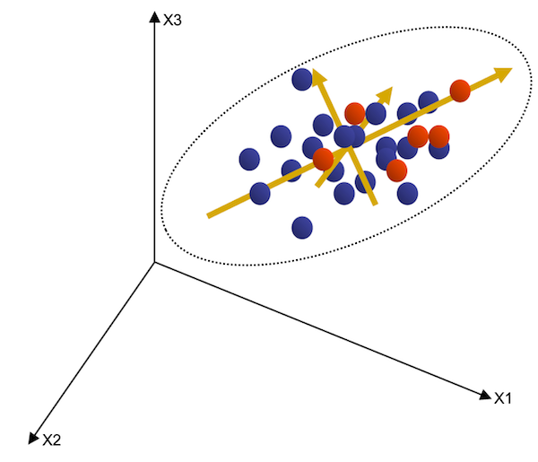

***

This report uses the [R programming language](https://cran.r-project.org/doc/FAQ/R-FAQ.html) [@R] and the following [R libraries](https://r-pkgs.org/intro.html) [@tidyverse;@knitr;@IrizarryGill2021;@ggthemes;@ggrepel;@ggpubr;@plot3D;@plotly;@devtools;@ggbiplot;@performanceanalytics;@mlbench].

```{r, message=FALSE, warning=FALSE}
library(tidyverse)
library(knitr)
library(ggpubr)
library(plot3D)
library(plotly)
library(devtools)
install_github("vqv/ggbiplot") # to install an R library from source
library(ggbiplot)
library(PerformanceAnalytics)
library(mlbench)
library(datasets)
```

# Bivariate data -- a story that's all too simple?

Recall the materials on [Linear models I](https://github.com/bambooforest/IntroDataScience/tree/main/8_Linear_Models_I) and [Linear models II](https://github.com/bambooforest/IntroDataScience/tree/main/9_Linear_Models_II). As you remember, for applying linear models we mostly use **bivariate relationships**. This means that we are looking for relationships between only two variables, such as the relationship between brain- and body size in the animal kingdom. This is totally fine for answering a lot of scientific questions. 


**But: what if we have to deal with many more independent variables, potentially hundreds of them?**

Not all scientific questions may be answered by simply looking at the relationship between two variables. Possibly, we will have to look at the influence of many different independent variables on a specific question. In these cases we can use [multivariate analysis and statistics](https://en.wikipedia.org/wiki/Multivariate_statistics). 

In this chapter we will mainly focus on "**how to visualize multivariate data**" for recognizing patterns in multivariate data sets and not so much on the mathematical and statistical details behind them. The most widely used technique for doing that is [**Principal Components Analysis**](https://en.wikipedia.org/wiki/Principal_component_analysis) (PCA). 

The main aim of multivariate analysis, and also of PCA, is **pattern extraction**. This means, we aim to find a scientifically relevant pattern in potentially hundreds (or sometimes thousands) of numerical variables. We may summarize the aims of multivariate analysis as follows: 

* Find trends (covariation) in large data sets and big data
* Reduce number of variables to a few significant ones (that is where PCA comes into play)
* Discriminate between groups (like different populations, sexes, etc.)

The basic idea of this chapter is that you can implement a PCA, a very fine instrument to do patterns extraction, and interpret the results. Finally you will apply this to other data sets and hopefully to your own data. 

Now let's go through a **PCA** in detail -- from bottom up! 

## Data

Let's use a large data set with many independent measurements. We will utilize the [Howells Data](https://web.utk.edu/~auerbach/HOWL.htm). This data consists of hundreds of standard [craniometric measurements](https://en.wikipedia.org/wiki/Craniometry) of the [human skull](figures/craniometry.pdf) of different populations all around the globe [@Howells1973;@Howells1989;@Howells1995]. 

Here is an overview of the different populations that were analyzed for this data set:


If you want to know more details on how the Howells Data was collected and how it is structured, e.g., especially the abbreviations of the different measurements, please consult [this PDF](data/howells_info.pdf).

Now let's dive into this fantastic data set! 

What does a data scientist do? First we have a look at the data!

```{r, message=FALSE}
howells <- read_csv("data/howells_data.csv")
head(howells) %>% kable()
nrow(howells)
ncol(howells)
```

OK, this is quite some data. 2524 rows (subjects) and 54 measurement variables (columns). How can we visualize the entirety of these variables in a simple x/y coordinate system? **Seems impossible, right?** Let'see...

## Plotting multivariate data 

First, let's produce a simple bivariate plot 

```{r}
ggplot(howells, aes(x = GOL, y = BNL)) +
  geom_point() +
  coord_equal() +
  theme_pubr(border = TRUE, margin = TRUE)
```

What did we do here? We simply plotted two variables (BNL ~ GOL), which gives us a bivariate plot. You can already see that these two measurements appear to be **[correlated](https://en.wikipedia.org/wiki/Correlation)**. This is probably due to the fact that both these measurements (*basion-nasion length* and *glabella-occipital length*) are related to overall body size, i.e., the larger a person is, the larger their GOL and BNL will be. (Don't know what BNL and GOL are -- search the Web! :)

You might wonder why we used the commands `cord_equal()` and `theme_pubr(border = TRUE, margin = TRUE)` in our `ggplot()` statement. Here's why:

* `cord_equal()` produces isometrically scaled axes. This is very important when plotting data that have similar scale on both axes (e.g,. mm here). A distance in X should always be equal to a distance in Y! (Always do this for a PCA!)
* `theme_pubr(border = TRUE, margin = TRUE)` produces a nice "publication ready" theme from the [ggpubr](https://cran.r-project.org/web/packages/ggpubr/index.html) package. Maybe you like it, maybe not. It's totally up to you if you want to use this theme or not! Recall themes from our lecture on [data visualizations](https://github.com/bambooforest/IntroDataScience/tree/main/6_data_visualization#theme).

### Ok, but how do we plot more than two variables in a single plot?

If the third variable you want to visualize is a categorical variable (such as `SEX`), it's easy! You simply add a grouping variable. But you probably already know how this works from previous lectures!

```{r}
ggplot(howells, aes(x = GOL, y = BNL, color = SEX)) +
  geom_point() +
  coord_equal() +
  theme_pubr(border = TRUE, margin = TRUE)
```

And even if it is a numerical variable, it's possible to visualize the "third" variable. 

```{r}
ggplot(howells, aes(x = GOL, y = BNL, color = NOL)) +
  geom_point() +
  coord_equal() +
  theme_pubr(border = TRUE, margin = TRUE)
```

### The last resort: 3D plots...

Your last resort of visualizing more than two variables should be 3D plots. The package [plot3D](http://www.sthda.com/english/wiki/impressive-package-for-3d-and-4d-graph-r-software-and-data-visualization) allows you to plot 3D data with the function `scatter3D()`

```{r}
scatter3D(howells$GOL, howells$BBH, howells$BNL, col = c("#1B9E77"), bty = "g", pch = 18)
```

Static 3D plots are often not a good choice, due to these reasons: 

* Hard to define the exact X,Y & Z position of a specific data point.
* Data points often obscure each other.
* The plot cannot be rotated.

Interactive 3D plots can be created with the package [plotly](https://plotly.com/r/) and may address some of these issues.

**Note that this is an HTML widget and it will not render in the markdown output!** If you want to take a look, run your code in the `.Rmd` file.

```{r, eval=FALSE}
plot_ly(y = howells$GOL, z = howells$BBH, x = howells$XCB, type = "scatter3d", mode = "markers", text = howells$POPULATION, color = howells$SEX)
```

Also note that this plot may be rotated and the variation is much more visible! Cool, huh?

In general, we suggest to use 3D graphs only for **exploratory** purposes and not to communicate your results. There are several reasons why to avoid plotting your data in 3D. Consult this web page if you want to know more about [why not to go 3D](https://clauswilke.com/dataviz/no-3d.html). 

## What is a PCA?

Enough with the 3D graphs (as said -- we do not really fancy 3D scatter plots). **We actually might not need them if we can apply a nice PCA!** 
But how does a PCA work and what are the statistical procedures behind it? We won't go into all the technical details and mathematics behind a PCA, but to get an overview of how it works, watch [this video](figures/PCA_main_ideas.mp4) (**attention**: if you click this link you will be forwarded to a GitHub webpage that will say: *(Sorry about that, but we can't show files that are this big right now.)*; instead just click *View Raw* and you will be able to watch the video directly on GitHub -- cool trick, eh?). If you want the YouTube URL, [here](https://www.youtube.com/watch?v=HMOI_lkzW08) you go!

For a detailed tutorial of a PCA in R, see [here](https://www.datacamp.com/community/tutorials/pca-analysis-r). But we will go through the most important steps ourselves in this script. 

**Note**: for running a PCA we will use the package `ggbiplot`. To install it, make sure that you run this command:  `install_github("vqv/ggbiplot")` to install it directly from GitHub. For that, you will need to load the package `devtools` --> see first code chunk of this script for an example.

### Why PCA?

Here are some **important** reasons why PCA is often a good choice to analyze multivariate data sets [@Zelditch2012]:

* Principal components analysis is a commonly used **dimensionality reduction technique**. 
* The purpose of PCA is to **simplify patterns** where we have multivariate data sets, and to make them easily visible by **replacing** the original variables with a few **new ones** (so called principal components, or simply 'PCs'). 
* These resulting PCs are linear combinations of the original variables and are **statistically independent** of each other.
* Only with a **few variables** (e.g., the PCs), **most of the variation** in a given sample can be explained. This means, that only by plotting PC1 & PC2 (a bivariate plot!) we may have over 50 % of variation in a sample visualized in a simple graph. 
* PCA simplifies the description of **differences between individuals**. In PC plots, we will often see patterns of **clustering of different groups**. Finding these groups can be very valuable, even if they do not represent statistically different entities. 

### How does PCA work? 

As mentioned before, we will not go into the technical details of how a PCA works. You have already seen most of the important steps in the video above. Nevertheless, let's quickly summarize how PCA works from a geometric (visual) point of view. 

That take a look at the following **graphic**:



What you see here is a simple **3D plot** of three observed traits (let's call them X1, X2 and X3). These traits may be simple distance measurements, as we find them in the Howells data set. Each point in the **scatter plot** represents the three measurement values observed for each individual in the sample. The distribution of values in this graph may be summarized by an **ellipse** (black dashed ellipse) that is tilted along the X1 / X3 plane. 

**PCA** solves for the axes of this ellipse and uses these new axes to describe the positions of individuals within that ellipse, i.e., the newly acquired "space". The ultimate **goal of PCA** is to find the **directions** within that scatter that describe the **largest proportions of variance** (aka PC1), the second largest proportion of variance (PC2), PC3, and so on. These directions are indicated by the orange arrows in the graphic. In this example we get three PCs in the end, since we only have 3 original variables. 

In sum, the resulting PCs describe the major directions of largest proportions of variance in each direction within this data scatter ellipse. Each new direction will be orthogonal to the latter directions. This explains why all PCs are totally independent of each other, i.e., they describe each a different pattern of variation in the sample.

### PCA in essence

* PCA is a statistical procedure that converts a set of observations of possibly correlated variables into a set of values of linearly uncorrelated variables called principal components ([Wikipedia](https://en.wikipedia.org/wiki/Principal_component_analysis))
* PCA will help us to find a reduced number of features that will represent our original data set in a compressed way, capturing up to a certain portion of its variance depending on the number of new features we end up selecting ([Towardsdatascience](https://towardsdatascience.com/the-most-gentle-introduction-to-principal-component-analysis-9ffae371e93b))

***

**BUT** (there is always a but): Keep in mind that PCA (and other dimensionality reduction techniques) are statistical procedures and the resulting PCs do not necessarily correspond to (biologically) relevant patterns of variation. Therefore, **always be careful how you interpret your PCA** and be cautious of faulty conclusions. PCA merely extracts patterns of variation in a sample and helps you to visualize these patterns! This is also why it is a often used technique for data exploration.


## Computing a PCA in R

**Now let's get our hands dirty and do that PCA in R!**

For computing the PCA in R, we will use the function `prcomp`, which is in the core package `stats`. Note that PCA will only work with **numerical input**. So make sure not to include [categorical variables](https://github.com/bambooforest/IntroDataScience/tree/main/3_data#data-types-in-statistics)! The argument `scale = FALSE` means that the PCA is performed on the variance-covariance matrix. This is advisable when all variables have the same measurement dimensions (in the Howells data: millimeters). The argument `scale=TRUE` means that the PCA is performed on the correlation matrix, i.e., all variances are scaled to 1. This is advisable when variables have different dimensions (such as length, temperature, mass, etc.).

```{r}
data.pca <- prcomp(data.frame(howells[, 8:54]), scale = FALSE)
```

The output of `prcomp()` gives us a list of data -- mostly `x` will be important -- which are the resulting PC scores. You can access the PC scores, or any other of the data entries by using the `$` operator. For example, if you want to access the PC scores, you can use `data.pca$x`, or if you want the standard deviations of the PCs you prompt `pca.data$sdev` and so on...


### PCA statistics

Let's print some basic statistics of this PCA: 

```{r}
summary(data.pca)
```

In this output you can see the **"Importance of components"**, e.g., how much of the **total variance** in the sample that the PCs explain. You can see that PC1 and PC2 together already explain 54.15% of the full variance in this sample! 

You may visualize the explained variances by each PCs easily with a [screeplot](https://en.wikipedia.org/wiki/Scree_plot). 

```{r}
ggscreeplot(data.pca)
```

Furthermore, we can visualize to what extent each characteristic (i.e., your original variables) **influence** a specific PC. For that we may use a `biplot`, which can be produced with `ggbiplot()`. 

```{r}
ggbiplot(data.pca, choices = 1:2, alpha = 0.1)
ggbiplot(data.pca, choices = 2:3, alpha = 0.1)
```

On a **biplot**, you can see the data scatter of the PCs, depending on which PCs you want to visualize (e.g., PC scores 1-2: `choices:1:2`). In addition to the observations, the biplot shows the **original variables** (input variables) as vectors (red arrows). These vectors may be interpreted as follows [@Rossiter2014]: 

* The **orientation** (direction) of the vector, with respect to the principal component space, in particular, its angle with the principal component axes: *the more parallel to a principal component axis a vector is, the more it contributes only to that PC.*
* The **length** in the space: *the longer the vector, the more variability of this variable is represented by the two displayed principal components; short vectors are thus better represented in other dimensions.*
* The **angles** between vectors of different variables show their correlation in this space: *small angles represent high positive correlation, right angles represent lack of correlation, opposite angles represent high negative correlation.*

#### Which PCs are relevant for further investigation?

A good rule of thumb is to use PCs that explain **more than 5% of total variance** for visualization. The rest of the PCs may be ignored, since they explain only "small amounts" of variation. In our case, we would focus on PCs 1-4. 

Another option is to take a look at the **screeplot** and deem all the PCs as relevant that occur before the so-called "edge" in the screeplot curve (in this example around PC4 or PC5). Note that these suggestions are merely **rules of thumb** and not absolute truths! They simply have become "statistical practice", just like setting the significance threshold of the p-value to 0.05... but that is another story, see e.g., if you're interested:

* https://www.ncbi.nlm.nih.gov/pmc/articles/PMC5017929/
* https://sites.uw.edu/stlab/2016/03/09/the-arbitrary-magic-of-p-0-05/
* https://towardsdatascience.com/p-values-explained-by-data-scientist-f40a746cfc8


### Plotting a PCA

Now **let's plot** the actual PCs to look for patterns in the data. For that we must first store the relevant PC scores (PCs 1-4) in an accessible data format, such as a data frame. We can simply add PCs 1-4 to the original data using `cbind()`. 

```{r}
howells_PCA <- cbind(howells, data.pca$x[, 1:4])
```

Now we can plot the PCs using `ggplot`. 

```{r}
ggplot(howells_PCA, aes(x = PC1, y = PC2)) +
  geom_point() +
  coord_equal() +
  theme_pubr(border = TRUE, margin = TRUE)
```

The actual **values** of the PC scores are **arbitrary** and cannot be interpreted in any sense. They are resulting from the statistical procedures we described above. 

Let's use grouping variables. 

```{r}
ggplot(howells_PCA, aes(x = PC1, y = PC2, color = SEX)) +
  geom_point() +
  coord_equal() +
  theme_pubr(border = TRUE, margin = TRUE)
```

```{r}
ggplot(howells_PCA, aes(x = PC1, y = PC2, color = POPULATION)) +
  geom_point(alpha = 0.5) +
  coord_equal() +
  theme_pubr(border = TRUE, margin = TRUE)

ggplot(howells_PCA, aes(x = PC2, y = PC3, color = POPULATION)) +
  geom_point(alpha = 0.5) +
  coord_equal() +
  theme_pubr(border = TRUE, margin = TRUE)
```

You can also use statistical ellipses to find patterns, e.g., to look for group differences. 

```{r}
ggplot(howells_PCA, aes(x = PC1, y = PC2, color = SEX)) +
  geom_point(alpha = 0.5) +
  coord_equal() +
  stat_ellipse() +
  theme_pubr(border = TRUE, margin = TRUE)

ggplot(howells_PCA, aes(x = PC2, y = PC3, color = SEX)) +
  geom_point(alpha = 0.5) +
  coord_equal() +
  stat_ellipse() +
  theme_pubr(border = TRUE, margin = TRUE)

ggplot(howells_PCA, aes(x = PC2, y = PC3, color = POPULATION)) +
  geom_point(alpha = 0.5) +
  coord_equal() +
  stat_ellipse() +
  theme_pubr(border = TRUE, margin = TRUE)
```

## Correlation between PCs and other variables 

For looking at **correlations**, it is easier to get fewer data points for each population. So first, we `summarize()` the data. You already know how to do that from chapter 4: [data wrangling](../4_data_wrangling/). Note that we also calculate the **cosine of latitude**, which is an approximation of mean annual temperature. So here we go: 

```{r}
cos.latitude <- cos(howells_PCA$latitude * pi / 180.0)
howells_PCA[, "cosine.latitude"] <- cos.latitude
howells_PCA_mean <- howells_PCA[, -1] %>%
  group_by(POPULATION, SEX) %>%
  summarise_if(is.numeric, mean, na.rm = TRUE)
```

Sometimes it might be interesting to test if PCs (patterns of variation) are related to certain other variables, such as temperature, longitude, latitude, etc., in our example.

We can look for these correlations with a [correlation matrix](http://www.sthda.com/english/wiki/correlation-matrix-a-quick-start-guide-to-analyze-format-and-visualize-a-correlation-matrix-using-r-software).

```{r, warning=FALSE}
chart.Correlation(howells_PCA_mean[c("PC1", "PC2", "PC3", "PC4", "cosine.latitude", "longitude", "latitude")])
```

PC2 shows a significant correlation with latitude. 

```{r}
ggplot(howells_PCA_mean, aes(x = latitude, y = PC2)) +
  geom_point() +
  geom_smooth(method = "lm", se = FALSE) +
  theme_pubr(border = TRUE, margin = TRUE)
```

# Data practical

* As always, write a nicely structured **scientific report** in R Markdown, which you will eventually upload on GitHub (you hopefully know how to do this until now :grin:)
* Look at the data sets that are available from the `datasets` package or from the `mlbench` package. For example the iris data from the `datasets` package or the BreastCancer data from the `mlbench` package. For an overview of the different data sets that are available, you can consult this [webpage](https://machinelearningmastery.com/machine-learning-datasets-in-r/). 
* Here are two examples, that are nicely fit to compute a PCA:

```{r}
## iris data set
data(iris)

## BreastCancer data set
data(BreastCancer)
```

* When you run the command `data("datasetname")`, the data will load in your global environment in R-Studio
* Load some data (sets) from the packages above and run a PCA (you can of course also use your own data!)
* Formulate two questions or hypotheses on the data, that you want to answer by using a PCA
* Visualize the PCA and utilize grouping procedures (coloring, density ellipses etc.) to find **patterns** in your data 
* Clearly communicate the explained variances with a screeplot 
* Investigate potential correlations of your PCs (you can also use a biplot for that)
* Produce some final plots and comment what you can see on them and how you interpret the results

# References
