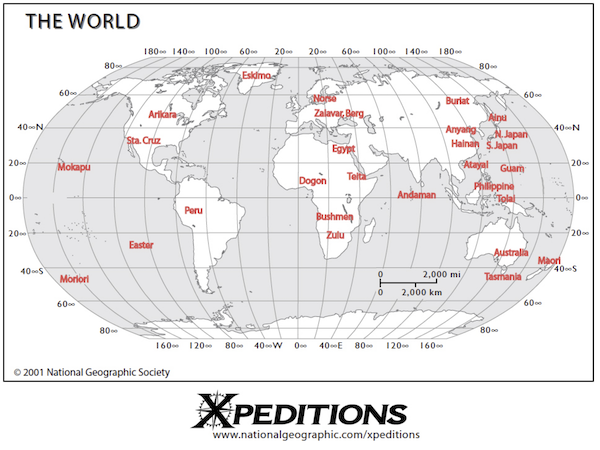

Dimensionality reduction and clustering I
================
Tiena Danner
12 April, 2022

-   [Multivariate data](#multivariate-data)
    -   [Bivariate data – a story too
        simple?](#bivariate-data--a-story-too-simple)
    -   [Data](#data)
    -   [Plotting multivariate data](#plotting-multivariate-data)
    -   [How PCA works](#how-pca-works)
-   [Data practical](#data-practical)
-   [References](#references)

------------------------------------------------------------------------

This report uses the [R programming
language](https://cran.r-project.org/doc/FAQ/R-FAQ.html) (R Core Team
2021) and the following [R libraries](https://r-pkgs.org/intro.html)
(Wickham et al. 2019; Xie 2021; Irizarry and Gill 2021; Arnold 2021;
Slowikowski 2021).

``` r
library(tidyverse)
library(knitr)
library(dslabs)
library(ggthemes)
library(ggrepel)
library(ggpubr)
library(plot3D)
library(plotly)
```

# Multivariate data

## Bivariate data – a story too simple?

Recall the materials on [Linear models
I](https://github.com/bambooforest/IntroDataScience/tree/main/8_Linear_Models_I)
and [Linear models
II](https://github.com/bambooforest/IntroDataScience/tree/main/8_Linear_Models_II).
As you probably remember, for applying linear models we mostly use
bivariate relationships. This means that we are looking for
relationships between only two variables such as the  in the animal
kingdom. This is totally fine for answering a lot of scientific
questions.

**But: what if we have to deal with many independent variables,
potentially hundreds of them?**

Not all scientific questions may be answered by simply looking at two
variables. Here we can use [multivariate analysis and
statistics](https://en.wikipedia.org/wiki/Multivariate_statistics). In
this course we will mainly focus on **how to visualize multivariate
data** for recognizing patterns in multivariate data sets and not so
much on the mathematical and statistical details behind them. The most
widely used technique for doing that is [**principal components
analysis**](https://en.wikipedia.org/wiki/Principal_component_analysis)
(PCA).

The main aim of multivariate analysis is **pattern extraction**. This
means, we aim to find a scientifically relevant pattern in potentially
hundreds (or sometimes thousands) of numerical variables. We may
summarize the aims of multivariate analysis followingly:

-   Find trends (covariation)
-   Reduce number of variables to a few significant ones
-   discriminate between groups

The basic idea of this chapter is that you can implement a PCA, a very
fine instrument to do patterns extraction, and interpret the results.
Finally you will apply this to other data sets and hopefully your own
data.

Now let’s go through a PCA in detail – from bottom up.

## Data

Let’s use a large data set with many independent measurements. For that
we may use the [Howells Data](https://web.utk.edu/~auerbach/HOWL.htm).
The data consists of hundreds of standard [craniometric
measurements](https://en.wikipedia.org/wiki/Craniometry) of the [human
skull](figures/craniometry.pdf) of different populations all around the
globe. Here is an overview of the different populations
 that were analyzed for this
data set. If you want to know more about the details of the analyses
e.g. especially the abbreviations of the different measurements, please
consult [this sheet](data/howells_info.pdf).

Now let’s dive into this fantastic data set!

What does a data scientist do? First have a look at the data!

``` r
howells <- read_csv("data/howells_data.csv")
head(howells) %>% kable()
```

|  ID | SEX | POPULATION | POP | longitude | longitude2 | latitude | GOL | NOL | BNL | BBH | XCB | XFB | ZYB | AUB | WCB | ASB | BPL | NPH | NLH | JUB | NLB | MAB | MDH | MDB | OBH | OBB | DKB | NDS | WNB | SIS | ZMB | SSS | FMB | NAS | EKB | DKS | IML | XML | MLS | WMH | SOS | BLS | STB | FRC | FRS | FRF | PAC | PAS | PAF | OCC | OCS | OCF | FOL |
|----:|:----|:-----------|----:|----------:|-----------:|---------:|----:|----:|----:|----:|----:|----:|----:|----:|----:|----:|----:|----:|----:|----:|----:|----:|----:|----:|----:|----:|----:|----:|----:|----:|----:|----:|----:|----:|----:|----:|----:|----:|----:|----:|----:|----:|----:|----:|----:|----:|----:|----:|----:|----:|----:|----:|----:|
|   1 | M   | NORSE      |   1 |        15 |         15 |       60 | 189 | 185 | 100 | 135 | 143 | 120 | 133 | 119 |  70 | 112 |  96 |  66 |  50 | 118 |  26 |  63 |  31 |  13 |  31 |  42 |  22 |  12 |  10 |   5 |  83 |  20 | 100 |  19 | 100 |   8 |  42 |  57 |  13 |  24 |   7 |   4 | 115 | 118 |  25 |  53 | 119 |  26 |  62 |  98 |  30 |  51 |  34 |
|   2 | M   | NORSE      |   1 |        15 |         15 |       60 | 182 | 178 | 102 | 139 | 145 | 120 | 137 | 125 |  66 | 113 | 108 |  64 |  48 | 118 |  25 |  72 |  19 |  13 |  28 |  39 |  21 |   9 |  11 |   4 | 101 |  27 |  95 |  17 |  96 |   9 |  32 |  53 |  10 |  23 |   6 |   4 | 117 | 116 |  28 |  55 | 113 |  24 |  59 |  93 |  27 |  39 |  34 |
|   3 | M   | NORSE      |   1 |        15 |         15 |       60 | 191 | 187 | 102 | 123 | 140 | 114 | 134 | 125 |  74 | 112 | 102 |  67 |  53 | 112 |  23 |  65 |  28 |  14 |  33 |  41 |  20 |  13 |   8 |   4 |  90 |  24 |  98 |  19 |  97 |  10 |  35 |  56 |  10 |  24 |   6 |   4 | 112 | 107 |  25 |  47 | 118 |  23 |  59 |  88 |  30 |  45 |  41 |
|   4 | M   | NORSE      |   1 |        15 |         15 |       60 | 191 | 188 | 100 | 127 | 141 | 123 | 135 | 127 |  71 | 113 |  95 |  76 |  53 | 114 |  26 |  62 |  25 |  12 |  35 |  40 |  23 |  10 |   9 |   4 |  94 |  23 |  98 |  16 |  99 |   8 |  34 |  52 |  11 |  22 |   8 |   3 | 116 | 109 |  26 |  47 | 116 |  24 |  57 |  94 |  34 |  50 |  38 |
|   5 | M   | NORSE      |   1 |        15 |         15 |       60 | 178 | 177 |  97 | 128 | 138 | 117 | 129 | 121 |  69 | 111 |  90 |  67 |  51 | 115 |  24 |  64 |  26 |  14 |  32 |  39 |  21 |  11 |   9 |   5 |  91 |  21 |  96 |  18 |  97 |  10 |  35 |  52 |  12 |  27 |   5 |   2 | 116 | 102 |  22 |  45 | 113 |  26 |  62 |  94 |  32 |  40 |  34 |
|   6 | M   | NORSE      |   1 |        15 |         15 |       60 | 194 | 191 | 106 | 132 | 139 | 118 | 136 | 128 |  76 | 112 | 102 |  69 |  50 | 117 |  25 |  65 |  29 |  13 |  33 |  40 |  22 |  13 |   8 |   3 |  91 |  22 | 101 |  20 |  98 |  11 |  38 |  57 |  10 |  23 |   6 |   3 | 115 | 107 |  23 |  49 | 115 |  26 |  58 | 103 |  34 |  47 |  35 |

``` r
nrow(howells)
```

    ## [1] 2524

``` r
ncol(howells)
```

    ## [1] 54

OK, this is quite some data. 2524 rows (subjects) and 54 measurement
variables (columns). How can we visualize the entirety of these
variables in a simple x/y coordinate system? Seems impossible, right?
We’ll see…..

## Plotting multivariate data

First, let’s produce a simple bivariate plot

``` r
ggplot(howells, aes(x = GOL, y = BNL)) +
  geom_point() + 
  coord_equal() + 
  theme_pubr(border = TRUE, margin = TRUE)
```

<!-- -->

What did I do here? I simply plotted two variables (BNL \~ GOL) which
gives us a bivariate plot. You can already see, that these two
measurements appear to be correlated. This is probably due to the fact,
that both of these measurements (basion-nasion length and
glabella-occipital length) are related to overall body size e.g. the
larger a person is, the larger also GOL and BNL will be.

You might wonder why I used the statements `cord_equal()` and
`theme_pubr(border = TRUE, margin = TRUE)`.

-   `cord_equal()` produces isometrically scaled axes. This is very
    important when plotting data that have similar scale on both axes
    (e.g. mm here). A distance in X should always be equal to a distance
    in Y.
-   `theme_pubr(border = TRUE, margin = TRUE)` produces a nice
    “publication ready” theme from the
    [ggpubr](https://cran.r-project.org/web/packages/ggpubr/index.html)
    package. Maybe you like it, maybe not. It’s toally up to you if you
    want to use this or not.

**Ok, but how to plot more than two variables in one plot?**

If the third variable you aim to visualize is a categorical variable
(such as `SEX`) it is easy. You may simply add a grouping variable.

``` r
ggplot(howells, aes(x = GOL, y = BNL, color = SEX)) +
  geom_point() + 
  coord_equal() + 
  theme_pubr(border = TRUE, margin = TRUE)
```

<!-- -->

Even if it is a numerical variable, it is possible to visualize this to
some extent.

``` r
ggplot(howells, aes(x = GOL, y = BNL, color = NOL)) +
  geom_point() + 
  coord_equal() + 
  theme_pubr(border = TRUE, margin = TRUE)
```

<!-- -->

Our last resort of visualizing more than two variables are 3D plots. The
package
[plot3D](http://www.sthda.com/english/wiki/impressive-package-for-3d-and-4d-graph-r-software-and-data-visualization)
allows you to plot 3D data with the function `scatter3d()`

``` r
scatter3D(howells$GOL, howells$BBH, howells$BNL, col = c("#1B9E77"), bty = "g", pch = 18)
```

<!-- -->

Static 3D plots are often not a good choice, due to the following
reasons:

-   Hard to define the exact X,Y & Z position of a specific data point
-   Data points often obscure each other
-   The plot cannot be rotated

Interactive 3D plots may be created with the package
[plotly](https://plotly.com/r/).

**Note that this is an hmtl widget and it will not render in the
markdown output.** If you want to take a look, run your code in the .Rmd
file.

``` r
plot_ly(y = howells$GOL, z = howells$BBH, x = howells$XCB, type = "scatter3d", mode = "markers", text = howells$POPULATION, color = howells$SEX)
```

    ## PhantomJS not found. You can install it with webshot::install_phantomjs(). If it is installed, please make sure the phantomjs executable can be found via the PATH variable.

    ## Warning in RColorBrewer::brewer.pal(N, "Set2"): minimal value for n is 3, returning requested palette with 3 different levels

    ## Warning in RColorBrewer::brewer.pal(N, "Set2"): minimal value for n is 3, returning requested palette with 3 different levels

<div id="htmlwidget-096d386f83682eefe3eb" style="width:672px;height:480px;" class="plotly html-widget"></div>
<script type="application/json" data-for="htmlwidget-096d386f83682eefe3eb">{"x":{"visdat":{"18af5799a670":["function () ","plotlyVisDat"]},"cur_data":"18af5799a670","attrs":{"18af5799a670":{"y":[189,182,191,191,178,194,186,186,186,189,186,182,193,195,187,189,179,175,191,192,194,195,184,186,195,189,188,182,188,186,186,201,189,192,190,189,181,194,187,187,192,179,188,179,190,190,195,200,190,187,190,188,193,192,189,182,170,180,177,180,180,176,172,180,171,181,182,181,179,175,184,179,176,180,174,177,182,177,186,176,181,176,183,174,184,188,178,189,180,187,178,178,180,177,189,184,182,181,176,179,187,180,180,180,193,178,188,179,176,177,186,186,186,181,178,180,183,178,184,192,190,194,181,180,175,176,192,181,187,181,179,192,188,196,185,195,189,189,188,188,193,191,187,188,183,182,178,187,185,181,171,189,191,185,179,193,179,180,188,194,188,178,182,185,171,179,172,178,174,174,187,178,179,178,183,176,172,177,174,179,174,174,176,180,172,167,168,179,178,176,168,167,173,181,191,176,178,166,182,165,186,172,185,178,179,172,174,187,176,173,176,185,170,180,186,182,196,174,174,193,178,184,195,181,185,198,179,178,171,178,174,181,179,174,180,174,179,194,177,181,188,176,180,180,171,184,193,187,191,167,180,172,183,172,179,182,174,175,183,168,188,189,174,177,171,178,165,169,176,174,175,179,173,166,177,166,161,155,170,167,180,166,176,177,176,164,174,165,180,175,163,175,168,181,173,157,165,179,158,172,162,166,169,179,176,164,170,178,162,167,168,171,172,175,170,178,165,185,201,182,182,189,173,182,178,188,181,201,186,196,184,182,179,191,184,187,197,188,189,190,176,193,185,179,184,174,180,186,188,190,188,183,181,191,180,188,192,173,185,185,191,180,196,187,182,192,181,182,187,188,188,188,187,180,181,170,181,182,177,180,173,172,177,172,177,176,175,179,183,178,171,178,172,171,165,172,171,185,175,178,179,177,176,173,176,174,180,178,180,172,176,177,179,176,170,172,186,168,171,177,176,170,172,172,169,176,181,183,189,178,187,192,191,186,187,190,198,179,180,180,184,182,180,186,182,182,178,183,188,173,186,187,184,178,181,180,184,190,184,178,185,180,173,182,174,185,175,174,163,175,184,181,176,182,171,171,177,177,176,185,175,172,169,177,172,166,172,179,176,177,178,176,172,178,163,168,166,172,179,177,171,169,171,175,176,177,176,180,174,169,173,175,182,169,177,194,172,177,180,180,172,175,174,175,172,176,184,177,175,182,177,179,178,178,189,188,178,175,177,182,181,180,180,187,177,180,176,168,179,179,171,182,177,172,173,173,178,165,161,164,169,164,177,163,167,178,167,174,179,163,178,177,174,168,172,160,178,173,177,163,170,184,160,168,170,183,165,172,176,169,165,166,162,165,174,177,179,168,157,170,174,172,170,168,165,168,164,169,169,171,189,176,182,192,189,191,176,182,190,194,182,186,195,185,180,186,184,172,190,187,194,196,179,191,188,189,180,185,191,183,187,176,180,184,182,186,180,194,188,179,190,180,174,178,182,190,180,182,182,192,183,181,196,182,190,179,177,190,186,185,181,182,175,178,182,185,175,176,179,176,181,189,173,178,173,181,186,186,174,176,174,177,176,185,174,184,171,181,174,183,174,172,179,175,179,177,186,173,182,181,172,182,179,186,182,180,180,173,178,168,176,188,191,171,184,191,181,174,181,176,174,179,177,178,181,186,168,180,183,178,178,172,170,164,172,177,172,185,174,178,179,180,170,167,167,175,173,167,170,180,171,179,175,162,169,163,171,168,164,166,161,169,168,179,178,172,165,167,173,184,172,174,177,166,173,180,164,169,172,181,182,171,172,194,191,188,184,179,192,187,196,185,185,186,186,184,186,181,183,180,183,193,188,197,200,189,195,192,189,192,195,195,188,194,201,196,192,198,189,196,190,195,184,189,190,195,189,198,201,188,196,189,186,188,189,191,189,178,180,188,174,178,180,186,190,172,180,169,172,175,182,181,182,187,188,188,172,177,187,178,196,185,181,178,179,186,175,185,184,178,182,183,187,178,172,192,173,181,169,183,176,190,180,177,185,193,194,186,184,180,185,195,186,174,179,183,189,188,190,182,203,185,181,192,184,194,191,178,181,185,182,186,190,170,176,185,179,186,182,182,183,180,172,177,185,165,181,183,175,175,178,172,180,182,183,180,170,188,172,176,188,180,174,176,179,179,164,180,178,189,186,182,190,188,189,194,187,183,180,175,184,186,176,186,183,189,190,183,188,177,175,173,185,179,180,180,179,181,179,187,179,188,186,184,183,181,177,178,182,179,186,184,196,186,185,183,187,190,182,173,191,180,193,172,188,176,177,179,172,171,178,176,171,174,176,177,178,180,173,177,180,172,167,164,170,182,182,178,172,177,173,179,178,183,174,168,178,173,167,181,173,184,174,169,172,166,169,168,181,168,176,175,169,168,183,175,169,179,181,174,185,181,181,178,187,196,181,182,186,181,183,184,174,194,192,190,188,190,193,180,197,180,190,182,184,184,188,197,185,197,185,195,190,185,196,183,186,192,184,174,190,188,197,186,194,184,178,186,184,169,173,173,171,163,181,172,173,169,178,189,181,178,180,179,177,168,176,178,179,187,179,176,165,175,171,178,186,183,174,172,184,180,176,176,172,171,178,177,173,169,184,174,169,171,175,180,172,160,178,185,191,184,185,183,187,188,177,172,191,183,189,180,194,179,182,190,187,185,180,186,184,176,184,178,177,184,181,170,180,180,183,174,185,187,183,175,182,168,182,171,178,174,191,176,187,178,191,172,180,190,189,173,166,171,175,176,180,179,173,170,171,169,175,163,181,166,176,158,170,167,170,162,179,174,167,173,171,171,183,170,169,171,175,174,174,168,160,173,171,176,176,173,175,164,166,176,168,171,175,172,177,162,175,176,177,170,180,193,194,179,188,195,182,188,183,197,206,191,184,185,185,185,191,187,194,184,184,194,190,181,187,190,188,183,186,191,180,184,187,198,193,181,185,182,194,182,196,192,199,179,184,196,182,191,186,187,187,187,193,186,192,177,185,197,182,180,183,181,177,177,181,185,183,178,180,176,188,187,183,192,182,182,184,179,178,178,177,178,185,174,176,182,189,173,178,179,180,173,189,176,180,183,176,178,175,179,185,183,174,185,177,182,181,178,184,183,180,177,175,178,182,186,192,178,180,182,176,192,172,182,184,183,178,170,179,182,169,181,173,174,172,172,178,175,183,174,181,172,173,176,177,170,184,178,180,175,176,178,169,177,168,169,175,167,168,167,171,170,160,173,165,169,172,176,169,178,164,177,170,172,176,171,169,176,169,164,176,164,170,157,167,161,171,175,176,171,175,160,173,160,168,161,165,163,169,169,171,168,165,167,178,166,162,160,151,159,161,159,164,159,159,158,156,158,155,154,167,162,156,156,159,174,161,164,171,164,170,177,182,175,188,173,178,178,182,173,168,176,176,158,164,166,166,172,169,168,166,168,174,161,168,168,187,178,172,188,180,182,186,176,173,185,175,175,176,177,189,181,167,182,175,177,184,178,176,174,189,177,182,186,173,175,190,175,188,175,185,178,175,173,190,187,175,178,181,173,163,162,171,172,166,169,174,173,170,172,171,178,168,181,175,176,162,186,179,178,167,170,163,165,166,170,186,171,180,181,171,168,169,169,182,187,193,182,188,181,179,182,180,181,180,190,186,175,182,184,173,166,186,179,176,171,175,170,170,166,164,166,178,172,162,167,159,182,165,158,159,160,158,184,199,191,182,199,190,183,187,193,191,188,193,190,184,188,194,190,192,188,185,182,193,180,191,200,201,190,190,186,189,183,187,188,184,194,188,195,195,197,188,186,187,197,186,198,188,189,191,189,183,174,179,174,181,172,188,168,170,182,180,178,177,172,183,174,181,173,175,187,172,182,176,179,189,180,174,182,179,182,182,189,185,178,183,181,172,176,184,183,193,182,178,168,182,176,190,180,178,178,178,174,180,184,185,185,180,185,188,185,190,175,179,180,192,178,189,177,191,179,190,178,191,186,187,184,195,188,187,193,180,180,190,189,186,184,172,171,180,176,187,180,190,172,165,177,185,176,163,181,180,169,172,166,170,174,170,178,178,172,178,164,157,160,174,170,177,175,164,166,171,163,171,172,165,175,182,178,165,180,190,178,178,188,189,177,187,192,179,177,175,185,179,184,187,190,182,182,182,174,174,179,186,179,174,177,179,172,187,188,179,182,187,181,189,183,188,178,179,180,175,186,188,184,176,167,176,172,174,171,178,178,170,162,179,178,171,179,169,162,165,174,173,162,178,183,172,171,177,184,165,172,176,170,176,176,172,168,179,170,168,174,170,175,173,163,179,178,182,186,168,176,180,167,173,180,184,176,175,176,176,178,172,175,174,189,174,181,174,170,175,175,170,167,164,189,166,184,180,165,176,180,187,181,180,170,179,171,180,178,177,168,172,176,176,170,176,170,173,166,186,164,168,160,172,170,164,166,164,167,163,170,181,181,166,173,174,178,165,170,169,172,166,164,172,168,173,178,173,180,188,178,175,184,179,180,183,184,174,187,184,190,181,183,185,182,182,178,181,177,181,176,182,178,181,177,179,179,179,172,181,188,184,179,171,182,186,183,177,187,185,170,184,168,178,180,162,174,173,183,174,179,172,181,176,176,179,170,180,175,175,181,190,187,177,180,172,177,181,180,165,161,165,172,168,162,168,166,163,168,170,167,170,173,166,170,172,180,183,170,189,184,182,170,173,174,187,168,182,176,169,180,183,166,172,175,174,177,185,170,181,172,184,192,191,181,171,170,179,173,184,170,170,172,186,177,168,175,182,179,171,172,182,178,172,162,181,182,188,180,178,180,192,192,187,168,191,183,190,180,193,194,183,187,184,192,188,185,185,189,187,196,176,181,182,180,193,184,174,182,178,174,176,181,170,167,174,177,174,188,173,176,178,171,174,179,180,175,170,174,173,172,177,177,168,197,194,201,188,190,194,181,189,187,191,199,191,180,201,183,196,191,202,203,195,188,172,190,203,189,187,190,184,191,192,192,190,187,189,194,192,187,196,191,183,190,189,199,198,201,189,193,195,193,186,180,183,180,175,185,185,188,176,180,183,172,187,177,184,183,169,186,180,180,184,192,181,172,183,183,180,180,176,179,180,187,174,183,176,188,188,198,186,183,184,183,194,190,182,181,187,185,181,187,182,187,190,190,191,183,196,193,184,183,188,187,194,195,197,197,197,190,183,181,198,190,186,183,186,188,191,192,182,185,199,187,191,184,182,199,192,182,186,185,193,174,185,175,184,177,184,185,179,184,178,169,179,173,176,184,171,173,178,172,177,178,182,178,181,178,176,177,177,171,176,186,178,180,186,193,175,171,177,184,168,171,173,188,177,183,180,179,182,187,175,178,176,196,188,191,190,178,189,190,186,181,189,179,192,189,187,181,187,185,190,200,182,187,179,176,171,182,176,174,183,181,182,183,177,181,177,183,186,189,181,180,183,181,182,176,176,182,180,184,175,179,182,177,175,183,180,174,192,176,178,179,181,182,178,176,191,170,181,176,185,175,185,179,177,170,176,160,169,167,178,177,171,170,163,168,174,180,184,180,168,181,172,175,175,172,166,174,171,176,173,173,167,172,166,178,178,168,173,173,174,169,165,177,173,171,178,172,171,171,176,164,168,179,165,170,174,180,167,167,170,173,168,170,163,159,163,159,156,160,172,153],"z":[135,139,123,127,128,132,122,130,134,131,138,124,134,127,131,129,132,132,128,127,139,128,137,133,141,134,133,123,133,134,134,133,140,126,139,139,136,123,126,128,131,131,122,131,126,131,136,140,133,128,131,130,139,137,137,119,123,128,120,126,126,128,131,123,127,134,127,128,130,127,129,123,130,126,125,125,122,121,129,128,127,127,123,123,127,126,130,125,124,123,125,133,123,135,119,132,124,129,129,127,127,134,121,123,126,117,126,119,130,119,133,138,132,127,133,129,138,127,141,127,142,138,137,139,132,125,140,135,138,138,133,142,139,139,133,132,135,128,129,140,144,142,133,138,133,135,133,141,138,132,132,133,139,139,133,141,137,139,133,124,138,123,128,135,129,140,128,123,124,127,135,127,137,121,135,121,125,141,134,129,126,126,124,135,132,129,125,129,134,125,127,125,124,123,133,131,121,126,130,128,124,128,134,133,131,120,131,129,129,125,130,132,129,127,128,119,130,134,129,131,135,129,124,127,133,133,130,135,138,120,125,129,132,137,127,138,133,132,137,127,132,123,132,130,126,136,129,131,131,125,129,127,127,133,131,130,126,132,132,132,130,130,135,141,129,126,121,125,126,121,129,120,130,121,133,124,123,122,120,128,120,126,134,124,115,119,122,132,117,129,118,115,119,119,132,122,127,120,122,123,121,127,133,123,127,127,125,128,124,122,127,123,127,129,123,135,123,134,144,136,143,136,128,128,137,139,139,141,139,142,137,136,129,133,131,136,145,132,131,134,130,135,134,129,144,125,130,134,129,138,131,132,129,135,127,129,132,127,129,133,138,132,133,137,133,133,134,132,142,140,133,131,131,121,125,119,125,130,128,132,129,128,122,127,129,132,132,125,134,128,124,134,129,127,126,128,128,131,121,119,125,126,128,127,131,123,125,128,126,118,128,131,131,126,125,130,130,124,131,123,127,127,134,131,130,129,119,133,134,118,134,138,129,129,137,129,129,130,129,127,130,136,125,131,123,129,124,128,133,129,132,131,124,127,132,125,131,131,131,115,129,128,127,119,124,134,129,129,128,131,129,129,130,126,126,122,128,128,128,129,127,117,122,125,123,122,124,124,123,111,123,130,124,127,118,123,123,124,127,127,121,123,129,124,129,123,124,129,119,123,124,134,129,128,134,135,130,131,136,152,126,133,132,133,130,131,137,135,139,138,135,132,127,128,129,132,127,133,124,135,130,130,138,134,136,133,129,130,125,129,134,132,133,135,130,131,134,121,129,126,130,132,127,129,124,137,126,130,128,123,130,128,126,122,129,126,133,125,129,129,122,134,124,125,130,133,124,123,135,123,120,127,134,129,127,135,129,131,123,134,130,129,137,123,128,127,132,127,118,131,135,140,132,131,128,140,129,126,138,144,130,127,135,129,132,137,133,131,133,139,145,138,135,131,144,130,123,146,133,137,129,127,122,127,130,133,133,143,134,132,134,127,124,136,137,140,135,135,125,130,142,130,145,131,140,125,126,133,119,135,125,132,125,133,132,136,121,120,128,136,129,135,124,131,124,131,136,127,128,126,123,131,125,134,119,132,123,125,127,135,133,129,122,141,130,134,131,124,130,134,123,122,119,124,117,120,124,124,121,122,129,127,124,114,123,134,126,119,125,125,122,123,122,130,115,125,114,124,122,121,129,126,120,127,117,114,119,129,117,119,121,121,119,112,117,123,111,115,119,125,113,123,122,117,120,120,123,119,117,117,107,113,114,128,124,119,123,119,127,131,119,121,115,116,116,120,115,124,115,130,123,121,132,123,131,127,128,122,130,129,123,129,125,130,129,129,126,122,127,133,130,132,130,139,122,127,123,120,129,125,137,133,131,138,134,136,139,124,131,133,137,135,133,122,130,124,132,125,126,136,143,127,124,137,133,127,121,121,130,126,120,118,121,132,130,121,122,122,121,117,123,121,125,126,127,122,122,126,123,132,132,118,124,115,126,127,120,125,125,127,124,119,136,121,119,123,118,124,118,125,114,130,127,120,126,129,131,134,128,128,135,134,137,127,126,124,132,137,137,132,134,122,135,132,146,131,135,129,131,134,132,137,142,132,125,134,123,125,123,123,132,129,125,127,136,121,128,126,131,115,114,125,134,131,138,130,127,123,130,127,126,121,131,119,125,123,126,129,134,136,135,132,137,135,142,140,139,135,135,133,134,135,137,135,132,139,139,131,138,133,127,123,130,129,129,138,138,139,132,134,136,133,133,131,131,138,131,132,132,139,145,133,141,139,137,135,140,130,138,134,140,134,135,125,129,127,124,129,124,121,130,132,128,127,125,132,124,125,125,130,129,127,125,125,126,127,129,130,127,127,132,127,127,131,135,132,128,130,120,133,130,126,125,129,122,125,119,125,128,127,120,123,126,128,137,127,125,134,147,130,147,138,148,132,148,142,147,138,145,139,143,149,141,152,150,146,137,147,154,143,143,143,147,140,151,151,141,140,142,144,143,139,143,143,144,147,144,148,141,135,146,141,155,150,152,147,138,141,144,132,136,139,136,131,143,137,135,138,140,139,139,141,141,142,139,127,138,133,137,144,135,137,125,137,139,139,147,140,129,134,140,139,137,136,133,135,132,137,138,141,138,137,140,125,131,135,135,134,141,134,138,126,131,140,141,135,137,128,130,133,139,132,134,134,131,130,132,127,133,124,131,123,131,121,126,123,134,133,135,138,133,136,138,136,138,135,135,132,138,122,126,125,135,127,134,138,136,129,139,135,136,130,125,126,123,121,128,128,133,130,132,129,115,127,120,131,129,119,124,117,130,123,130,121,130,129,129,130,130,127,119,126,125,133,122,130,123,131,131,135,130,131,127,138,126,129,122,128,132,121,126,124,123,133,133,127,138,138,138,129,142,140,136,136,142,141,148,136,136,132,137,139,135,140,141,136,146,147,137,135,136,149,139,134,138,135,138,145,138,150,146,139,139,135,147,140,145,140,139,129,138,143,133,133,138,134,141,133,137,143,148,133,127,138,134,133,133,131,124,134,132,133,133,134,126,132,132,137,133,142,134,131,129,133,124,134,137,134,141,127,137,137,135,126,130,126,135,136,138,138,133,137,125,129,130,134,137,140,127,134,130,135,134,138,122,130,130,129,129,126,136,131,146,133,143,135,123,128,133,129,144,128,135,125,132,134,128,130,122,128,127,137,129,125,131,129,129,132,124,124,124,131,135,130,130,129,132,132,128,130,126,124,132,125,125,117,126,121,124,125,127,122,123,127,121,131,129,126,127,122,128,127,131,126,128,120,117,122,119,127,128,118,134,129,133,128,128,120,126,121,132,128,124,124,131,126,137,131,125,124,133,129,127,127,118,131,122,122,123,127,118,125,123,125,119,119,130,126,122,117,123,135,126,119,136,131,132,135,134,127,136,129,124,137,135,132,129,121,123,120,129,120,125,127,124,125,121,123,125,120,122,121,145,131,131,130,133,134,131,127,134,141,136,138,132,132,135,136,132,134,133,132,134,136,141,135,139,137,129,138,127,131,141,131,134,132,137,127,122,129,137,138,133,133,128,118,123,133,131,128,121,129,130,125,126,133,131,127,137,123,125,128,124,125,123,125,120,133,135,124,124,123,116,118,125,127,118,119,118,119,130,133,134,131,125,127,122,133,131,132,134,135,140,126,135,123,132,125,129,131,119,124,138,137,131,123,126,127,131,127,125,125,127,119,121,125,123,120,124,128,137,141,140,147,138,132,140,139,138,139,134,135,136,139,136,137,136,140,137,133,141,137,141,142,148,135,138,138,146,132,139,144,138,137,133,143,137,140,140,140,140,135,135,139,139,139,141,138,137,131,133,127,130,133,140,129,127,140,133,135,124,134,137,128,133,132,132,139,129,137,129,123,140,140,131,127,132,126,125,144,135,128,134,136,131,135,139,133,137,139,146,143,133,137,131,128,134,141,137,136,126,145,144,140,138,133,138,138,141,127,131,134,144,129,139,135,135,124,140,126,142,144,134,138,144,146,148,131,137,141,127,133,144,145,132,134,129,136,145,132,143,123,121,141,132,139,130,130,136,133,123,126,129,128,127,134,135,131,123,134,128,125,137,123,129,124,122,126,134,128,135,136,123,135,137,141,142,142,141,132,137,141,146,138,140,143,133,132,133,135,133,142,135,140,137,140,140,143,137,135,141,135,145,137,136,139,144,143,138,138,145,130,143,140,140,133,135,129,137,137,141,137,144,128,131,129,133,129,137,136,123,123,126,134,136,130,135,130,126,133,130,127,128,135,129,130,135,137,138,126,140,128,131,134,134,127,128,128,131,130,135,123,133,129,142,135,140,138,138,131,141,127,136,139,139,144,138,140,136,139,137,137,137,146,133,138,133,131,136,141,128,136,131,145,126,135,138,133,138,134,141,136,141,134,141,141,133,132,137,136,139,135,130,129,143,131,135,130,137,127,135,132,133,132,137,127,127,130,128,132,137,135,130,131,136,129,129,129,135,132,129,128,131,132,133,129,131,137,143,140,141,141,139,139,138,141,142,142,133,136,135,149,140,135,147,141,140,144,137,140,144,147,139,131,136,127,132,134,145,145,139,142,138,144,153,148,134,146,147,135,131,134,137,139,122,133,133,137,129,135,127,133,136,135,135,133,134,134,135,129,142,133,135,133,125,140,138,130,130,129,126,135,131,126,124,128,121,128,127,125,141,135,128,126,129,139,130,135,146,140,133,134,131,128,141,135,137,138,136,134,143,125,136,144,133,133,145,134,135,130,139,129,129,143,133,132,135,137,130,134,137,137,136,130,131,136,134,138,128,145,138,126,128,129,132,138,148,146,134,145,142,144,146,147,150,144,152,149,138,146,138,140,140,144,142,141,144,144,146,147,140,139,140,148,145,143,138,142,140,136,140,136,140,137,130,134,131,149,137,132,135,133,130,137,141,135,138,138,141,135,141,137,133,155,141,150,142,139,145,140,142,142,141,141,141,142,150,141,146,144,144,145,150,143,133,154,146,140,143,150,144,141,147,150,136,148,145,141,147,145,144,143,138,148,144,144,145,153,145,145,147,154,145,139,137,140,131,140,140,135,137,140,137,132,138,137,142,137,123,138,137,135,137,138,134,131,142,134,145,136,141,136,140,137,132,137,134,125,132,135,127,139,132,130,139,135,133,133,129,134,134,137,130,139,141,141,137,135,135,142,133,138,139,138,133,139,132,145,142,128,134,136,132,138,133,136,137,131,146,137,132,140,139,134,143,138,135,140,138,138,142,140,138,127,142,131,135,130,132,139,129,136,129,130,129,125,135,135,130,139,132,131,131,133,133,131,128,137,124,134,128,123,133,132,125,132,137,134,135,122,130,139,129,128,131,140,129,133,134,134,129,133,131,130,129,150,146,145,148,133,137,140,133,129,146,139,137,135,141,135,133,129,139,145,133,140,124,122,128,137,127,122,129,129,129,131,130,127,133,127,129,129,122,125,117,129,123,131,127,125,131,141,123,130,134,134,123,133,128,130,127,139,138,125,135,135,129,133,130,127,125,127,133,128,133,131,126,120,134,122,123,125,129,124,122,121,116,117,121,120,126,128,121,129,123,125,124,123,123,126,125,125,123,118,124,125,127,125,122,124,130,124,124,125,126,122,126,123,124,129,122,124,122,121,127,125,119,128,134,132,137,127,138,135,125,133,126,123,123,125,123,121,118,116],"x":[143,145,140,141,138,139,143,141,141,144,143,136,142,137,141,144,147,135,135,142,145,137,142,137,147,139,134,131,141,138,145,147,152,144,147,143,138,145,139,146,143,136,134,139,150,143,151,145,138,142,137,146,145,150,150,138,132,134,137,138,134,142,127,128,136,137,135,142,137,136,141,135,139,139,147,137,135,133,133,129,137,138,128,131,135,141,137,143,137,131,135,135,133,136,140,134,135,136,129,140,142,139,138,135,136,135,148,137,133,141,146,137,147,142,142,135,139,134,142,143,139,144,145,141,138,138,133,142,143,138,141,146,137,144,141,149,144,140,142,142,149,136,146,140,135,143,137,136,138,143,140,147,139,139,145,146,145,148,142,135,142,146,143,146,136,143,135,144,141,135,141,131,136,142,136,135,134,138,137,137,133,133,138,136,140,128,138,135,142,139,133,133,135,148,140,136,138,127,134,131,142,131,137,140,140,135,139,132,141,154,148,148,143,153,143,149,152,145,154,161,156,158,158,141,145,140,145,147,145,153,146,156,148,150,145,152,151,144,150,151,154,140,149,137,146,152,143,147,147,140,147,146,149,154,133,142,143,145,145,146,150,144,144,151,143,152,138,148,136,139,142,139,146,140,136,137,142,136,143,143,131,142,138,132,147,137,142,141,148,141,143,135,137,141,138,141,140,144,140,151,141,142,146,139,139,137,133,139,143,137,140,137,138,132,149,143,135,136,152,139,141,151,137,134,132,139,142,145,134,146,138,138,140,129,137,140,140,142,138,142,139,135,139,135,134,131,137,135,144,141,138,139,132,147,138,139,140,134,135,143,143,142,148,143,140,149,141,138,145,137,144,137,129,135,137,140,140,135,135,140,133,137,132,136,137,141,133,137,133,135,134,132,130,134,129,135,136,141,129,130,138,135,131,131,137,140,128,142,136,134,141,139,144,141,127,136,133,134,129,129,137,132,143,137,140,141,143,133,131,133,124,129,138,129,129,132,137,128,119,128,130,129,129,127,135,126,132,131,129,129,130,138,129,120,129,128,129,137,128,128,134,131,129,133,124,139,132,127,131,123,127,129,129,129,126,127,133,126,131,130,129,122,123,130,126,123,116,133,125,129,122,124,125,123,121,129,125,123,125,127,120,119,129,126,120,122,132,125,125,125,124,140,136,130,144,134,131,130,138,139,142,135,139,130,132,144,138,145,137,142,143,135,137,138,136,142,132,142,128,143,138,138,148,140,135,138,137,136,135,139,141,137,132,140,132,136,139,126,128,128,137,132,136,135,135,136,132,140,135,130,126,139,136,125,138,129,137,135,132,134,138,129,131,135,132,140,130,130,140,134,126,133,132,128,134,130,126,124,125,121,139,135,134,132,132,131,134,131,132,128,137,137,140,135,135,134,129,125,134,139,132,129,139,129,132,137,128,127,145,141,133,149,141,138,143,135,130,134,134,138,132,129,133,136,127,135,134,139,135,127,126,127,131,133,137,135,125,137,128,136,138,136,131,133,137,137,133,137,127,131,132,131,128,133,137,129,127,126,132,133,133,130,130,131,126,127,138,136,133,125,127,134,133,137,128,146,120,126,128,134,146,132,137,127,138,132,134,129,128,133,128,128,128,129,129,128,127,134,132,127,128,136,133,133,137,142,139,141,142,132,136,136,146,135,137,137,132,139,134,125,127,127,134,135,133,130,126,137,124,132,132,135,127,128,126,134,132,123,124,128,125,128,126,128,124,128,131,123,129,133,127,127,127,130,123,135,130,122,124,131,129,131,133,126,121,132,128,134,127,132,130,131,134,134,129,133,127,129,128,133,130,127,130,124,129,129,126,124,128,130,130,134,126,136,126,130,126,127,131,131,143,133,125,134,131,127,134,132,135,131,138,133,134,128,136,135,140,141,141,144,143,140,134,133,129,131,126,126,133,133,127,128,117,131,127,120,122,127,126,127,128,126,127,135,128,127,120,121,124,127,138,128,127,127,129,138,127,127,127,129,133,133,136,129,117,129,124,129,121,130,123,131,129,123,136,142,141,141,146,136,145,141,142,138,130,135,138,139,137,143,142,139,137,143,139,148,141,141,133,138,139,126,135,131,133,137,139,131,127,135,144,134,135,133,140,122,128,135,127,136,131,132,133,137,137,135,118,139,137,133,146,129,134,132,139,133,123,127,135,129,125,130,136,132,128,129,135,125,127,132,132,132,131,129,127,129,130,123,130,130,121,126,130,130,124,128,132,130,135,136,137,130,135,127,133,131,136,134,130,128,139,133,135,135,134,127,131,131,129,122,125,130,130,129,139,125,126,129,127,125,126,123,130,127,129,132,126,123,127,128,130,126,128,126,129,122,133,128,126,129,133,132,124,137,135,125,133,127,124,131,131,129,126,122,134,121,130,124,131,120,124,125,128,134,132,127,126,133,146,134,150,136,146,134,140,138,141,148,140,142,149,149,139,146,149,147,135,148,148,140,151,140,145,145,142,147,145,142,138,152,141,151,148,141,134,148,139,147,148,139,144,142,139,142,155,141,145,147,147,134,145,139,141,128,140,135,139,135,139,144,146,141,140,146,141,138,153,139,132,139,132,138,128,139,138,137,139,140,137,143,135,141,137,130,134,134,144,145,133,135,143,140,139,138,140,145,141,136,150,145,159,166,158,164,149,167,150,150,160,157,157,159,163,160,157,166,159,155,154,149,151,149,160,149,150,142,157,150,138,151,149,157,153,154,157,153,149,155,152,160,153,164,167,150,162,154,152,145,145,159,164,163,150,146,150,151,155,157,156,151,152,144,142,148,149,150,140,142,144,149,154,150,155,142,144,153,142,161,155,147,138,141,148,147,153,152,147,149,141,149,146,154,147,148,143,148,153,147,146,155,155,146,156,145,147,138,145,136,134,141,135,130,137,133,142,137,138,139,131,141,137,123,132,134,131,136,135,134,134,127,137,135,129,130,123,137,133,133,128,142,137,141,137,134,136,130,134,141,134,132,130,125,136,125,126,135,142,132,128,139,135,136,124,136,128,125,140,135,130,133,126,135,127,133,128,120,139,130,132,133,128,138,140,134,129,135,131,135,129,128,136,130,131,127,131,135,130,131,132,129,129,132,125,132,125,134,128,133,129,131,127,129,128,134,130,141,138,139,146,140,139,149,139,139,142,139,144,137,140,133,141,135,140,134,141,138,140,136,142,142,135,139,142,137,138,135,143,135,130,138,132,135,140,141,133,139,141,136,136,133,137,139,139,133,137,135,129,134,141,127,135,134,138,142,133,137,137,140,133,142,129,141,139,139,136,131,136,128,134,129,138,136,145,131,139,137,138,134,133,128,134,135,133,135,133,135,140,132,137,139,141,134,136,135,125,133,131,125,133,134,136,130,131,134,130,118,132,127,130,129,132,146,129,137,128,132,137,137,140,142,138,129,133,138,133,130,136,133,135,130,133,126,135,139,137,134,131,130,136,137,138,123,132,140,136,137,144,135,143,141,141,147,152,153,139,142,148,146,139,133,139,147,143,141,141,131,134,144,142,147,138,137,150,142,140,148,141,138,140,128,142,145,140,144,147,135,135,134,137,142,135,136,139,135,137,140,134,139,138,142,141,142,133,136,131,147,128,132,126,128,140,143,140,131,138,137,132,130,123,131,137,139,149,144,140,141,133,130,128,132,124,141,142,126,143,132,128,131,138,133,129,134,145,130,139,128,135,136,132,136,133,132,137,138,131,131,141,130,133,137,143,148,141,150,140,140,144,151,145,143,147,145,141,149,146,140,138,140,143,136,143,136,144,152,156,142,140,144,148,140,143,139,146,147,141,136,141,146,138,144,139,142,142,140,142,140,140,141,134,136,135,131,137,136,141,135,130,139,136,135,144,135,143,139,137,139,132,140,140,132,135,139,141,140,134,138,136,141,134,143,138,137,142,133,141,132,139,139,140,134,141,148,141,143,139,133,144,152,143,150,139,144,147,147,142,139,133,145,151,142,141,144,143,140,144,140,136,145,140,139,147,147,141,139,139,146,140,143,140,143,144,142,145,142,130,140,140,142,133,136,143,136,129,141,133,134,124,133,135,132,132,133,140,137,134,136,139,135,133,131,133,132,135,135,146,130,132,130,130,132,125,129,135,137,131,146,147,142,137,134,137,139,135,138,135,140,136,136,135,136,131,140,142,133,138,143,133,134,145,137,141,141,141,139,138,134,146,134,135,131,137,132,144,134,140,141,144,137,135,141,152,140,141,132,134,132,136,139,129,130,139,137,132,131,133,140,131,130,125,139,135,126,131,132,129,131,136,133,137,133,130,132,132,139,130,132,135,130,134,137,142,137,142,138,140,135,136,130,139,133,135,146,141,140,143,138,137,143,138,145,138,130,130,141,137,139,143,137,138,142,142,129,137,149,135,137,138,140,140,133,138,140,140,145,141,139,138,139,136,148,137,135,143,136,138,133,137,140,138,133,129,136,130,128,131,130,140,131,132,134,132,142,145,137,133,129,139,137,135,133,138,125,133,134,132,134,132,151,135,145,131,138,149,141,132,142,133,141,143,131,137,144,139,143,144,139,144,147,136,145,136,133,131,138,142,139,128,134,138,142,141,140,141,139,134,141,127,138,137,136,137,137,137,132,130,139,132,134,137,135,130,132,132,140,138,136,131,132,141,140,141,131,138,137,133,141,141,137,134,131,133,127,127,127,126,131,136,128,126,127,136,129,133,142,140,141,137,141,148,141,137,130,146,142,145,138,143,139,143,131,139,136,137,148,139,140,142,140,146,136,145,148,128,145,146,133,144,142,141,143,142,135,132,143,137,142,134,134,140,144,152,143,131,134,126,142,143,140,138,141,134,139,147,143,137,138,144,138,135,139,139,138,137,145,142,143,145,141,143,139,144,138,142,151,139,142,143,146,137,129,136,131,139,129,135,137,135,138,138,134,137,134,136,141,138,135,135,140,142,135,132,134,136,135,129,141,130,131,145,136,130,136,143,141,135,140,139,138,137,132,140,130,138,136,126,139,138,134,127,142,132,129,139,137,129,133,136,135,142,133,137,134,139,129,136,129,131,135,126,130,139,128,122,131,133,129,129,135,126,127,129,130,130,129,130,128,129,127,131,133,132,132,128,135,123,122,128,132,126,127,126,129,122,130,126,124,127,136,147,149,139,150,142,137,148,148,133,139,141,148,140,137,143,140,140,139,146,142,140,150,136,137,139,138,145,150,148,141,141,138,140,145,150,145,139,144,146,140,146,142,146,144,141,141,145,139,143,145,151,143,148,141,147,133,143,135,150,135,138,146,132,143,137,133,139,132,135,137,136,143,146,138,133,133,146,138,139,135,137,138,139,131,136,136,129,139,135,140,133,127,133,150,138,134,139,150,139,139,137,136,136,140,130,144,141,143,145,146,147,135,142,144,143,141,139,134,139,136,134,142,131,138,137,136,140,139,138,140,130,142,134,136,131,141,146,143,135,136,150,133,140,142,137,142,136,144,132,140,132,139,144,145,133,144,151,138,137,140,142,133,139,143,145,150,138,151,138,140,138,134,139,140,143,143,144,143,141,137,139,132,132,132,142,135,141,130,130,124,135,139,132,144,132,136,133,132,134,136,129,138,140,137,139,141,139,130,132,135,138,133,131,138,146,133,133,135,131,131,139,135,131,133,136,135,135,134,135,137,136,135,143,134,134,136,135,135,131,129,135,128,124,129,137,130],"mode":"markers","text":["NORSE","NORSE","NORSE","NORSE","NORSE","NORSE","NORSE","NORSE","NORSE","NORSE","NORSE","NORSE","NORSE","NORSE","NORSE","NORSE","NORSE","NORSE","NORSE","NORSE","NORSE","NORSE","NORSE","NORSE","NORSE","NORSE","NORSE","NORSE","NORSE","NORSE","NORSE","NORSE","NORSE","NORSE","NORSE","NORSE","NORSE","NORSE","NORSE","NORSE","NORSE","NORSE","NORSE","NORSE","NORSE","NORSE","NORSE","NORSE","NORSE","NORSE","NORSE","NORSE","NORSE","NORSE","NORSE","NORSE","NORSE","NORSE","NORSE","NORSE","NORSE","NORSE","NORSE","NORSE","NORSE","NORSE","NORSE","NORSE","NORSE","NORSE","NORSE","NORSE","NORSE","NORSE","NORSE","NORSE","NORSE","NORSE","NORSE","NORSE","NORSE","NORSE","NORSE","NORSE","NORSE","NORSE","NORSE","NORSE","NORSE","NORSE","NORSE","NORSE","NORSE","NORSE","NORSE","NORSE","NORSE","NORSE","NORSE","NORSE","NORSE","NORSE","NORSE","NORSE","NORSE","NORSE","NORSE","NORSE","NORSE","NORSE","ZALAVAR","ZALAVAR","ZALAVAR","ZALAVAR","ZALAVAR","ZALAVAR","ZALAVAR","ZALAVAR","ZALAVAR","ZALAVAR","ZALAVAR","ZALAVAR","ZALAVAR","ZALAVAR","ZALAVAR","ZALAVAR","ZALAVAR","ZALAVAR","ZALAVAR","ZALAVAR","ZALAVAR","ZALAVAR","ZALAVAR","ZALAVAR","ZALAVAR","ZALAVAR","ZALAVAR","ZALAVAR","ZALAVAR","ZALAVAR","ZALAVAR","ZALAVAR","ZALAVAR","ZALAVAR","ZALAVAR","ZALAVAR","ZALAVAR","ZALAVAR","ZALAVAR","ZALAVAR","ZALAVAR","ZALAVAR","ZALAVAR","ZALAVAR","ZALAVAR","ZALAVAR","ZALAVAR","ZALAVAR","ZALAVAR","ZALAVAR","ZALAVAR","ZALAVAR","ZALAVAR","ZALAVAR","ZALAVAR","ZALAVAR","ZALAVAR","ZALAVAR","ZALAVAR","ZALAVAR","ZALAVAR","ZALAVAR","ZALAVAR","ZALAVAR","ZALAVAR","ZALAVAR","ZALAVAR","ZALAVAR","ZALAVAR","ZALAVAR","ZALAVAR","ZALAVAR","ZALAVAR","ZALAVAR","ZALAVAR","ZALAVAR","ZALAVAR","ZALAVAR","ZALAVAR","ZALAVAR","ZALAVAR","ZALAVAR","ZALAVAR","ZALAVAR","ZALAVAR","ZALAVAR","ZALAVAR","ZALAVAR","ZALAVAR","ZALAVAR","ZALAVAR","ZALAVAR","ZALAVAR","ZALAVAR","ZALAVAR","ZALAVAR","ZALAVAR","ZALAVAR","BERG","BERG","BERG","BERG","BERG","BERG","BERG","BERG","BERG","BERG","BERG","BERG","BERG","BERG","BERG","BERG","BERG","BERG","BERG","BERG","BERG","BERG","BERG","BERG","BERG","BERG","BERG","BERG","BERG","BERG","BERG","BERG","BERG","BERG","BERG","BERG","BERG","BERG","BERG","BERG","BERG","BERG","BERG","BERG","BERG","BERG","BERG","BERG","BERG","BERG","BERG","BERG","BERG","BERG","BERG","BERG","BERG","BERG","BERG","BERG","BERG","BERG","BERG","BERG","BERG","BERG","BERG","BERG","BERG","BERG","BERG","BERG","BERG","BERG","BERG","BERG","BERG","BERG","BERG","BERG","BERG","BERG","BERG","BERG","BERG","BERG","BERG","BERG","BERG","BERG","BERG","BERG","BERG","BERG","BERG","BERG","BERG","BERG","BERG","BERG","BERG","BERG","BERG","BERG","BERG","BERG","BERG","BERG","BERG","EGYPT","EGYPT","EGYPT","EGYPT","EGYPT","EGYPT","EGYPT","EGYPT","EGYPT","EGYPT","EGYPT","EGYPT","EGYPT","EGYPT","EGYPT","EGYPT","EGYPT","EGYPT","EGYPT","EGYPT","EGYPT","EGYPT","EGYPT","EGYPT","EGYPT","EGYPT","EGYPT","EGYPT","EGYPT","EGYPT","EGYPT","EGYPT","EGYPT","EGYPT","EGYPT","EGYPT","EGYPT","EGYPT","EGYPT","EGYPT","EGYPT","EGYPT","EGYPT","EGYPT","EGYPT","EGYPT","EGYPT","EGYPT","EGYPT","EGYPT","EGYPT","EGYPT","EGYPT","EGYPT","EGYPT","EGYPT","EGYPT","EGYPT","EGYPT","EGYPT","EGYPT","EGYPT","EGYPT","EGYPT","EGYPT","EGYPT","EGYPT","EGYPT","EGYPT","EGYPT","EGYPT","EGYPT","EGYPT","EGYPT","EGYPT","EGYPT","EGYPT","EGYPT","EGYPT","EGYPT","EGYPT","EGYPT","EGYPT","EGYPT","EGYPT","EGYPT","EGYPT","EGYPT","EGYPT","EGYPT","EGYPT","EGYPT","EGYPT","EGYPT","EGYPT","EGYPT","EGYPT","EGYPT","EGYPT","EGYPT","EGYPT","EGYPT","EGYPT","EGYPT","EGYPT","EGYPT","EGYPT","EGYPT","EGYPT","EGYPT","EGYPT","TEITA","TEITA","TEITA","TEITA","TEITA","TEITA","TEITA","TEITA","TEITA","TEITA","TEITA","TEITA","TEITA","TEITA","TEITA","TEITA","TEITA","TEITA","TEITA","TEITA","TEITA","TEITA","TEITA","TEITA","TEITA","TEITA","TEITA","TEITA","TEITA","TEITA","TEITA","TEITA","TEITA","TEITA","TEITA","TEITA","TEITA","TEITA","TEITA","TEITA","TEITA","TEITA","TEITA","TEITA","TEITA","TEITA","TEITA","TEITA","TEITA","TEITA","TEITA","TEITA","TEITA","TEITA","TEITA","TEITA","TEITA","TEITA","TEITA","TEITA","TEITA","TEITA","TEITA","TEITA","TEITA","TEITA","TEITA","TEITA","TEITA","TEITA","TEITA","TEITA","TEITA","TEITA","TEITA","TEITA","TEITA","TEITA","TEITA","TEITA","TEITA","TEITA","TEITA","DOGON","DOGON","DOGON","DOGON","DOGON","DOGON","DOGON","DOGON","DOGON","DOGON","DOGON","DOGON","DOGON","DOGON","DOGON","DOGON","DOGON","DOGON","DOGON","DOGON","DOGON","DOGON","DOGON","DOGON","DOGON","DOGON","DOGON","DOGON","DOGON","DOGON","DOGON","DOGON","DOGON","DOGON","DOGON","DOGON","DOGON","DOGON","DOGON","DOGON","DOGON","DOGON","DOGON","DOGON","DOGON","DOGON","DOGON","DOGON","DOGON","DOGON","DOGON","DOGON","DOGON","DOGON","DOGON","DOGON","DOGON","DOGON","DOGON","DOGON","DOGON","DOGON","DOGON","DOGON","DOGON","DOGON","DOGON","DOGON","DOGON","DOGON","DOGON","DOGON","DOGON","DOGON","DOGON","DOGON","DOGON","DOGON","DOGON","DOGON","DOGON","DOGON","DOGON","DOGON","DOGON","DOGON","DOGON","DOGON","DOGON","DOGON","DOGON","DOGON","DOGON","DOGON","DOGON","DOGON","DOGON","DOGON","DOGON","ZULU","ZULU","ZULU","ZULU","ZULU","ZULU","ZULU","ZULU","ZULU","ZULU","ZULU","ZULU","ZULU","ZULU","ZULU","ZULU","ZULU","ZULU","ZULU","ZULU","ZULU","ZULU","ZULU","ZULU","ZULU","ZULU","ZULU","ZULU","ZULU","ZULU","ZULU","ZULU","ZULU","ZULU","ZULU","ZULU","ZULU","ZULU","ZULU","ZULU","ZULU","ZULU","ZULU","ZULU","ZULU","ZULU","ZULU","ZULU","ZULU","ZULU","ZULU","ZULU","ZULU","ZULU","ZULU","ZULU","ZULU","ZULU","ZULU","ZULU","ZULU","ZULU","ZULU","ZULU","ZULU","ZULU","ZULU","ZULU","ZULU","ZULU","ZULU","ZULU","ZULU","ZULU","ZULU","ZULU","ZULU","ZULU","ZULU","ZULU","ZULU","ZULU","ZULU","ZULU","ZULU","ZULU","ZULU","ZULU","ZULU","ZULU","ZULU","ZULU","ZULU","ZULU","ZULU","ZULU","ZULU","ZULU","ZULU","ZULU","ZULU","BUSHMAN","BUSHMAN","BUSHMAN","BUSHMAN","BUSHMAN","BUSHMAN","BUSHMAN","BUSHMAN","BUSHMAN","BUSHMAN","BUSHMAN","BUSHMAN","BUSHMAN","BUSHMAN","BUSHMAN","BUSHMAN","BUSHMAN","BUSHMAN","BUSHMAN","BUSHMAN","BUSHMAN","BUSHMAN","BUSHMAN","BUSHMAN","BUSHMAN","BUSHMAN","BUSHMAN","BUSHMAN","BUSHMAN","BUSHMAN","BUSHMAN","BUSHMAN","BUSHMAN","BUSHMAN","BUSHMAN","BUSHMAN","BUSHMAN","BUSHMAN","BUSHMAN","BUSHMAN","BUSHMAN","BUSHMAN","BUSHMAN","BUSHMAN","BUSHMAN","BUSHMAN","BUSHMAN","BUSHMAN","BUSHMAN","BUSHMAN","BUSHMAN","BUSHMAN","BUSHMAN","BUSHMAN","BUSHMAN","BUSHMAN","BUSHMAN","BUSHMAN","BUSHMAN","BUSHMAN","BUSHMAN","BUSHMAN","BUSHMAN","BUSHMAN","BUSHMAN","BUSHMAN","BUSHMAN","BUSHMAN","BUSHMAN","BUSHMAN","BUSHMAN","BUSHMAN","BUSHMAN","BUSHMAN","BUSHMAN","BUSHMAN","BUSHMAN","BUSHMAN","BUSHMAN","BUSHMAN","BUSHMAN","BUSHMAN","AUSTRALI","AUSTRALI","AUSTRALI","AUSTRALI","AUSTRALI","AUSTRALI","AUSTRALI","AUSTRALI","AUSTRALI","AUSTRALI","AUSTRALI","AUSTRALI","AUSTRALI","AUSTRALI","AUSTRALI","AUSTRALI","AUSTRALI","AUSTRALI","AUSTRALI","AUSTRALI","AUSTRALI","AUSTRALI","AUSTRALI","AUSTRALI","AUSTRALI","AUSTRALI","AUSTRALI","AUSTRALI","AUSTRALI","AUSTRALI","AUSTRALI","AUSTRALI","AUSTRALI","AUSTRALI","AUSTRALI","AUSTRALI","AUSTRALI","AUSTRALI","AUSTRALI","AUSTRALI","AUSTRALI","AUSTRALI","AUSTRALI","AUSTRALI","AUSTRALI","AUSTRALI","AUSTRALI","AUSTRALI","AUSTRALI","AUSTRALI","AUSTRALI","AUSTRALI","AUSTRALI","AUSTRALI","AUSTRALI","AUSTRALI","AUSTRALI","AUSTRALI","AUSTRALI","AUSTRALI","AUSTRALI","AUSTRALI","AUSTRALI","AUSTRALI","AUSTRALI","AUSTRALI","AUSTRALI","AUSTRALI","AUSTRALI","AUSTRALI","AUSTRALI","AUSTRALI","AUSTRALI","AUSTRALI","AUSTRALI","AUSTRALI","AUSTRALI","AUSTRALI","AUSTRALI","AUSTRALI","AUSTRALI","AUSTRALI","AUSTRALI","AUSTRALI","AUSTRALI","AUSTRALI","AUSTRALI","AUSTRALI","AUSTRALI","AUSTRALI","AUSTRALI","AUSTRALI","AUSTRALI","AUSTRALI","AUSTRALI","AUSTRALI","AUSTRALI","AUSTRALI","AUSTRALI","AUSTRALI","AUSTRALI","TASMANIA","TASMANIA","TASMANIA","TASMANIA","TASMANIA","TASMANIA","TASMANIA","TASMANIA","TASMANIA","TASMANIA","TASMANIA","TASMANIA","TASMANIA","TASMANIA","TASMANIA","TASMANIA","TASMANIA","TASMANIA","TASMANIA","TASMANIA","TASMANIA","TASMANIA","TASMANIA","TASMANIA","TASMANIA","TASMANIA","TASMANIA","TASMANIA","TASMANIA","TASMANIA","TASMANIA","TASMANIA","TASMANIA","TASMANIA","TASMANIA","TASMANIA","TASMANIA","TASMANIA","TASMANIA","TASMANIA","TASMANIA","TASMANIA","TASMANIA","TASMANIA","TASMANIA","TASMANIA","TASMANIA","TASMANIA","TASMANIA","TASMANIA","TASMANIA","TASMANIA","TASMANIA","TASMANIA","TASMANIA","TASMANIA","TASMANIA","TASMANIA","TASMANIA","TASMANIA","TASMANIA","TASMANIA","TASMANIA","TASMANIA","TOLAI","TOLAI","TOLAI","TOLAI","TOLAI","TOLAI","TOLAI","TOLAI","TOLAI","TOLAI","TOLAI","TOLAI","TOLAI","TOLAI","TOLAI","TOLAI","TOLAI","TOLAI","TOLAI","TOLAI","TOLAI","TOLAI","TOLAI","TOLAI","TOLAI","TOLAI","TOLAI","TOLAI","TOLAI","TOLAI","TOLAI","TOLAI","TOLAI","TOLAI","TOLAI","TOLAI","TOLAI","TOLAI","TOLAI","TOLAI","TOLAI","TOLAI","TOLAI","TOLAI","TOLAI","TOLAI","TOLAI","TOLAI","TOLAI","TOLAI","TOLAI","TOLAI","TOLAI","TOLAI","TOLAI","TOLAI","TOLAI","TOLAI","TOLAI","TOLAI","TOLAI","TOLAI","TOLAI","TOLAI","TOLAI","TOLAI","TOLAI","TOLAI","TOLAI","TOLAI","TOLAI","TOLAI","TOLAI","TOLAI","TOLAI","TOLAI","TOLAI","TOLAI","TOLAI","TOLAI","TOLAI","TOLAI","TOLAI","TOLAI","TOLAI","TOLAI","TOLAI","TOLAI","TOLAI","TOLAI","TOLAI","TOLAI","TOLAI","TOLAI","TOLAI","TOLAI","TOLAI","TOLAI","TOLAI","TOLAI","TOLAI","TOLAI","TOLAI","TOLAI","TOLAI","TOLAI","TOLAI","TOLAI","TOLAI","TOLAI","MOKAPU","MOKAPU","MOKAPU","MOKAPU","MOKAPU","MOKAPU","MOKAPU","MOKAPU","MOKAPU","MOKAPU","MOKAPU","MOKAPU","MOKAPU","MOKAPU","MOKAPU","MOKAPU","MOKAPU","MOKAPU","MOKAPU","MOKAPU","MOKAPU","MOKAPU","MOKAPU","MOKAPU","MOKAPU","MOKAPU","MOKAPU","MOKAPU","MOKAPU","MOKAPU","MOKAPU","MOKAPU","MOKAPU","MOKAPU","MOKAPU","MOKAPU","MOKAPU","MOKAPU","MOKAPU","MOKAPU","MOKAPU","MOKAPU","MOKAPU","MOKAPU","MOKAPU","MOKAPU","MOKAPU","MOKAPU","MOKAPU","MOKAPU","MOKAPU","MOKAPU","MOKAPU","MOKAPU","MOKAPU","MOKAPU","MOKAPU","MOKAPU","MOKAPU","MOKAPU","MOKAPU","MOKAPU","MOKAPU","MOKAPU","MOKAPU","MOKAPU","MOKAPU","MOKAPU","MOKAPU","MOKAPU","MOKAPU","MOKAPU","MOKAPU","MOKAPU","MOKAPU","MOKAPU","MOKAPU","MOKAPU","MOKAPU","MOKAPU","MOKAPU","MOKAPU","MOKAPU","MOKAPU","MOKAPU","MOKAPU","MOKAPU","MOKAPU","MOKAPU","MOKAPU","MOKAPU","MOKAPU","MOKAPU","MOKAPU","MOKAPU","MOKAPU","MOKAPU","MOKAPU","MOKAPU","MOKAPU","BURIAT","BURIAT","BURIAT","BURIAT","BURIAT","BURIAT","BURIAT","BURIAT","BURIAT","BURIAT","BURIAT","BURIAT","BURIAT","BURIAT","BURIAT","BURIAT","BURIAT","BURIAT","BURIAT","BURIAT","BURIAT","BURIAT","BURIAT","BURIAT","BURIAT","BURIAT","BURIAT","BURIAT","BURIAT","BURIAT","BURIAT","BURIAT","BURIAT","BURIAT","BURIAT","BURIAT","BURIAT","BURIAT","BURIAT","BURIAT","BURIAT","BURIAT","BURIAT","BURIAT","BURIAT","BURIAT","BURIAT","BURIAT","BURIAT","BURIAT","BURIAT","BURIAT","BURIAT","BURIAT","BURIAT","BURIAT","BURIAT","BURIAT","BURIAT","BURIAT","BURIAT","BURIAT","BURIAT","BURIAT","BURIAT","BURIAT","BURIAT","BURIAT","BURIAT","BURIAT","BURIAT","BURIAT","BURIAT","BURIAT","BURIAT","BURIAT","BURIAT","BURIAT","BURIAT","BURIAT","BURIAT","BURIAT","BURIAT","BURIAT","BURIAT","BURIAT","BURIAT","BURIAT","BURIAT","BURIAT","BURIAT","BURIAT","BURIAT","BURIAT","BURIAT","BURIAT","BURIAT","BURIAT","BURIAT","BURIAT","BURIAT","BURIAT","BURIAT","BURIAT","BURIAT","BURIAT","BURIAT","BURIAT","BURIAT","ESKIMO","ESKIMO","ESKIMO","ESKIMO","ESKIMO","ESKIMO","ESKIMO","ESKIMO","ESKIMO","ESKIMO","ESKIMO","ESKIMO","ESKIMO","ESKIMO","ESKIMO","ESKIMO","ESKIMO","ESKIMO","ESKIMO","ESKIMO","ESKIMO","ESKIMO","ESKIMO","ESKIMO","ESKIMO","ESKIMO","ESKIMO","ESKIMO","ESKIMO","ESKIMO","ESKIMO","ESKIMO","ESKIMO","ESKIMO","ESKIMO","ESKIMO","ESKIMO","ESKIMO","ESKIMO","ESKIMO","ESKIMO","ESKIMO","ESKIMO","ESKIMO","ESKIMO","ESKIMO","ESKIMO","ESKIMO","ESKIMO","ESKIMO","ESKIMO","ESKIMO","ESKIMO","ESKIMO","ESKIMO","ESKIMO","ESKIMO","ESKIMO","ESKIMO","ESKIMO","ESKIMO","ESKIMO","ESKIMO","ESKIMO","ESKIMO","ESKIMO","ESKIMO","ESKIMO","ESKIMO","ESKIMO","ESKIMO","ESKIMO","ESKIMO","ESKIMO","ESKIMO","ESKIMO","ESKIMO","ESKIMO","ESKIMO","ESKIMO","ESKIMO","ESKIMO","ESKIMO","ESKIMO","ESKIMO","ESKIMO","ESKIMO","ESKIMO","ESKIMO","ESKIMO","ESKIMO","ESKIMO","ESKIMO","ESKIMO","ESKIMO","ESKIMO","ESKIMO","ESKIMO","ESKIMO","ESKIMO","ESKIMO","ESKIMO","ESKIMO","ESKIMO","ESKIMO","ESKIMO","ESKIMO","ESKIMO","PERU","PERU","PERU","PERU","PERU","PERU","PERU","PERU","PERU","PERU","PERU","PERU","PERU","PERU","PERU","PERU","PERU","PERU","PERU","PERU","PERU","PERU","PERU","PERU","PERU","PERU","PERU","PERU","PERU","PERU","PERU","PERU","PERU","PERU","PERU","PERU","PERU","PERU","PERU","PERU","PERU","PERU","PERU","PERU","PERU","PERU","PERU","PERU","PERU","PERU","PERU","PERU","PERU","PERU","PERU","PERU","PERU","PERU","PERU","PERU","PERU","PERU","PERU","PERU","PERU","PERU","PERU","PERU","PERU","PERU","PERU","PERU","PERU","PERU","PERU","PERU","PERU","PERU","PERU","PERU","PERU","PERU","PERU","PERU","PERU","ANDAMAN","ANDAMAN","ANDAMAN","ANDAMAN","ANDAMAN","ANDAMAN","ANDAMAN","ANDAMAN","ANDAMAN","ANDAMAN","ANDAMAN","ANDAMAN","ANDAMAN","ANDAMAN","ANDAMAN","ANDAMAN","ANDAMAN","ANDAMAN","ANDAMAN","ANDAMAN","ANDAMAN","ANDAMAN","ANDAMAN","ANDAMAN","ANDAMAN","ANDAMAN","ANDAMAN","ANDAMAN","ANDAMAN","ANDAMAN","ANDAMAN","ANDAMAN","ANDAMAN","ANDAMAN","ANDAMAN","ANDAMAN","ANDAMAN","PERU","PERU","PERU","PERU","PERU","PERU","PERU","PERU","PERU","PERU","PERU","PERU","PERU","PERU","PERU","PERU","PERU","PERU","PERU","PERU","PERU","PERU","PERU","PERU","PERU","EASTER I","ARIKARA","ARIKARA","ARIKARA","ARIKARA","ARIKARA","ARIKARA","ARIKARA","ARIKARA","ARIKARA","ARIKARA","ARIKARA","ARIKARA","ARIKARA","ARIKARA","ARIKARA","ARIKARA","ARIKARA","ARIKARA","ARIKARA","ARIKARA","ARIKARA","ARIKARA","ARIKARA","ARIKARA","ARIKARA","ARIKARA","ARIKARA","ARIKARA","ARIKARA","ARIKARA","ARIKARA","ARIKARA","ARIKARA","ARIKARA","ARIKARA","ARIKARA","ARIKARA","ARIKARA","ARIKARA","ARIKARA","ARIKARA","ARIKARA","ARIKARA","ARIKARA","ARIKARA","ARIKARA","ARIKARA","ARIKARA","ARIKARA","ARIKARA","ARIKARA","ARIKARA","ARIKARA","ARIKARA","ARIKARA","ARIKARA","ARIKARA","ARIKARA","ARIKARA","ARIKARA","ARIKARA","ARIKARA","ARIKARA","ARIKARA","ARIKARA","ARIKARA","ARIKARA","ARIKARA","ARIKARA","BUSHMAN","BUSHMAN","BUSHMAN","BUSHMAN","BUSHMAN","BUSHMAN","BUSHMAN","BUSHMAN","TASMANIA","TASMANIA","TASMANIA","TASMANIA","TASMANIA","TASMANIA","TASMANIA","TASMANIA","TASMANIA","TASMANIA","TASMANIA","TASMANIA","TASMANIA","TASMANIA","TASMANIA","TASMANIA","TASMANIA","TASMANIA","TASMANIA","TASMANIA","TASMANIA","TASMANIA","ANDAMAN","ANDAMAN","ANDAMAN","ANDAMAN","ANDAMAN","ANDAMAN","ANDAMAN","ANDAMAN","ANDAMAN","ANDAMAN","ANDAMAN","ANDAMAN","ANDAMAN","ANDAMAN","ANDAMAN","ANDAMAN","ANDAMAN","TASMANIA","AINU","AINU","AINU","AINU","AINU","AINU","AINU","AINU","AINU","AINU","AINU","AINU","AINU","AINU","AINU","AINU","AINU","AINU","AINU","AINU","AINU","AINU","AINU","AINU","AINU","AINU","AINU","AINU","AINU","AINU","AINU","AINU","AINU","AINU","AINU","AINU","AINU","AINU","AINU","AINU","AINU","AINU","AINU","AINU","AINU","AINU","AINU","AINU","AINU","AINU","AINU","AINU","AINU","AINU","AINU","AINU","AINU","AINU","AINU","AINU","AINU","AINU","AINU","AINU","AINU","AINU","AINU","AINU","AINU","AINU","AINU","AINU","AINU","AINU","AINU","AINU","AINU","AINU","AINU","AINU","AINU","AINU","AINU","AINU","AINU","AINU","N JAPAN","N JAPAN","N JAPAN","N JAPAN","N JAPAN","N JAPAN","N JAPAN","N JAPAN","N JAPAN","N JAPAN","N JAPAN","N JAPAN","N JAPAN","N JAPAN","N JAPAN","N JAPAN","N JAPAN","N JAPAN","N JAPAN","N JAPAN","N JAPAN","N JAPAN","N JAPAN","N JAPAN","N JAPAN","N JAPAN","N JAPAN","N JAPAN","N JAPAN","N JAPAN","N JAPAN","N JAPAN","N JAPAN","N JAPAN","N JAPAN","N JAPAN","N JAPAN","N JAPAN","N JAPAN","N JAPAN","N JAPAN","N JAPAN","N JAPAN","N JAPAN","N JAPAN","N JAPAN","N JAPAN","N JAPAN","N JAPAN","N JAPAN","N JAPAN","N JAPAN","N JAPAN","N JAPAN","N JAPAN","N JAPAN","N JAPAN","N JAPAN","N JAPAN","N JAPAN","N JAPAN","N JAPAN","N JAPAN","N JAPAN","N JAPAN","N JAPAN","N JAPAN","N JAPAN","N JAPAN","N JAPAN","N JAPAN","N JAPAN","N JAPAN","N JAPAN","N JAPAN","N JAPAN","N JAPAN","N JAPAN","N JAPAN","N JAPAN","N JAPAN","N JAPAN","N JAPAN","N JAPAN","N JAPAN","N JAPAN","N JAPAN","S JAPAN","S JAPAN","S JAPAN","S JAPAN","S JAPAN","S JAPAN","S JAPAN","S JAPAN","S JAPAN","S JAPAN","S JAPAN","S JAPAN","S JAPAN","S JAPAN","S JAPAN","S JAPAN","S JAPAN","S JAPAN","S JAPAN","S JAPAN","S JAPAN","S JAPAN","S JAPAN","S JAPAN","S JAPAN","S JAPAN","S JAPAN","S JAPAN","S JAPAN","S JAPAN","S JAPAN","S JAPAN","S JAPAN","S JAPAN","S JAPAN","S JAPAN","S JAPAN","S JAPAN","S JAPAN","S JAPAN","S JAPAN","S JAPAN","S JAPAN","S JAPAN","S JAPAN","S JAPAN","S JAPAN","S JAPAN","S JAPAN","S JAPAN","S JAPAN","S JAPAN","S JAPAN","S JAPAN","S JAPAN","S JAPAN","S JAPAN","S JAPAN","S JAPAN","S JAPAN","S JAPAN","S JAPAN","S JAPAN","S JAPAN","S JAPAN","S JAPAN","S JAPAN","S JAPAN","S JAPAN","S JAPAN","S JAPAN","S JAPAN","S JAPAN","S JAPAN","S JAPAN","S JAPAN","S JAPAN","S JAPAN","S JAPAN","S JAPAN","S JAPAN","S JAPAN","S JAPAN","S JAPAN","S JAPAN","S JAPAN","S JAPAN","S JAPAN","S JAPAN","S JAPAN","S JAPAN","HAINAN","HAINAN","HAINAN","HAINAN","HAINAN","HAINAN","HAINAN","HAINAN","HAINAN","HAINAN","HAINAN","HAINAN","HAINAN","HAINAN","HAINAN","HAINAN","HAINAN","HAINAN","HAINAN","HAINAN","HAINAN","HAINAN","HAINAN","HAINAN","HAINAN","HAINAN","HAINAN","HAINAN","HAINAN","HAINAN","HAINAN","HAINAN","HAINAN","HAINAN","HAINAN","HAINAN","HAINAN","HAINAN","HAINAN","HAINAN","HAINAN","HAINAN","HAINAN","HAINAN","HAINAN","HAINAN","HAINAN","HAINAN","HAINAN","HAINAN","HAINAN","HAINAN","HAINAN","HAINAN","HAINAN","HAINAN","HAINAN","HAINAN","HAINAN","HAINAN","HAINAN","HAINAN","HAINAN","HAINAN","HAINAN","HAINAN","HAINAN","HAINAN","HAINAN","HAINAN","HAINAN","HAINAN","HAINAN","HAINAN","HAINAN","HAINAN","HAINAN","HAINAN","HAINAN","HAINAN","HAINAN","HAINAN","HAINAN","ANYANG","ANYANG","ANYANG","ANYANG","ANYANG","ANYANG","ANYANG","ANYANG","ANYANG","ANYANG","ANYANG","ANYANG","ANYANG","ANYANG","ANYANG","ANYANG","ANYANG","ANYANG","ANYANG","ANYANG","ANYANG","ANYANG","ANYANG","ANYANG","ANYANG","ANYANG","ANYANG","ANYANG","ANYANG","ANYANG","ANYANG","ANYANG","ANYANG","ANYANG","ANYANG","ANYANG","ANYANG","ANYANG","ANYANG","ANYANG","ANYANG","ANYANG","ATAYAL","ATAYAL","ATAYAL","ATAYAL","ATAYAL","ATAYAL","ATAYAL","ATAYAL","ATAYAL","ATAYAL","ATAYAL","ATAYAL","ATAYAL","ATAYAL","ATAYAL","ATAYAL","ATAYAL","ATAYAL","ATAYAL","ATAYAL","ATAYAL","ATAYAL","ATAYAL","ATAYAL","ATAYAL","ATAYAL","ATAYAL","ATAYAL","ATAYAL","ATAYAL","ATAYAL","ATAYAL","ATAYAL","ATAYAL","ATAYAL","ATAYAL","ATAYAL","ATAYAL","ATAYAL","ATAYAL","ATAYAL","ATAYAL","ATAYAL","ATAYAL","ATAYAL","ATAYAL","ATAYAL","PHILLIPI","PHILLIPI","PHILLIPI","PHILLIPI","PHILLIPI","PHILLIPI","PHILLIPI","PHILLIPI","PHILLIPI","PHILLIPI","PHILLIPI","PHILLIPI","PHILLIPI","PHILLIPI","PHILLIPI","PHILLIPI","PHILLIPI","PHILLIPI","PHILLIPI","PHILLIPI","PHILLIPI","PHILLIPI","PHILLIPI","PHILLIPI","PHILLIPI","PHILLIPI","PHILLIPI","PHILLIPI","PHILLIPI","PHILLIPI","PHILLIPI","PHILLIPI","PHILLIPI","PHILLIPI","PHILLIPI","PHILLIPI","PHILLIPI","PHILLIPI","PHILLIPI","PHILLIPI","PHILLIPI","PHILLIPI","PHILLIPI","PHILLIPI","PHILLIPI","PHILLIPI","PHILLIPI","PHILLIPI","PHILLIPI","PHILLIPI","GUAM","GUAM","GUAM","GUAM","GUAM","GUAM","GUAM","GUAM","GUAM","GUAM","GUAM","GUAM","GUAM","GUAM","GUAM","GUAM","GUAM","GUAM","GUAM","GUAM","GUAM","GUAM","GUAM","GUAM","GUAM","GUAM","GUAM","GUAM","GUAM","GUAM","GUAM","GUAM","GUAM","GUAM","GUAM","GUAM","GUAM","GUAM","GUAM","GUAM","GUAM","GUAM","GUAM","GUAM","GUAM","GUAM","GUAM","GUAM","GUAM","GUAM","GUAM","GUAM","GUAM","GUAM","GUAM","GUAM","GUAM","EASTER I","EASTER I","EASTER I","EASTER I","EASTER I","EASTER I","EASTER I","EASTER I","EASTER I","EASTER I","EASTER I","EASTER I","EASTER I","EASTER I","EASTER I","EASTER I","EASTER I","EASTER I","EASTER I","EASTER I","EASTER I","EASTER I","EASTER I","EASTER I","EASTER I","EASTER I","EASTER I","EASTER I","EASTER I","EASTER I","EASTER I","EASTER I","EASTER I","EASTER I","EASTER I","EASTER I","EASTER I","EASTER I","EASTER I","EASTER I","EASTER I","EASTER I","EASTER I","EASTER I","EASTER I","EASTER I","EASTER I","EASTER I","EASTER I","EASTER I","EASTER I","EASTER I","EASTER I","EASTER I","EASTER I","EASTER I","EASTER I","EASTER I","EASTER I","EASTER I","EASTER I","EASTER I","EASTER I","EASTER I","EASTER I","EASTER I","EASTER I","EASTER I","EASTER I","EASTER I","EASTER I","EASTER I","EASTER I","EASTER I","EASTER I","EASTER I","EASTER I","EASTER I","EASTER I","EASTER I","EASTER I","EASTER I","EASTER I","EASTER I","MORIORI","MORIORI","MORIORI","MORIORI","MORIORI","MORIORI","MORIORI","MORIORI","MORIORI","MORIORI","MORIORI","MORIORI","MORIORI","MORIORI","MORIORI","MORIORI","MORIORI","MORIORI","MORIORI","MORIORI","MORIORI","MORIORI","MORIORI","MORIORI","MORIORI","MORIORI","MORIORI","MORIORI","MORIORI","MORIORI","MORIORI","MORIORI","MORIORI","MORIORI","MORIORI","MORIORI","MORIORI","MORIORI","MORIORI","MORIORI","MORIORI","MORIORI","MORIORI","MORIORI","MORIORI","MORIORI","MORIORI","MORIORI","MORIORI","MORIORI","MORIORI","MORIORI","MORIORI","MORIORI","MORIORI","MORIORI","MORIORI","MORIORI","MORIORI","MORIORI","MORIORI","MORIORI","MORIORI","MORIORI","MORIORI","MORIORI","MORIORI","MORIORI","MORIORI","MORIORI","MORIORI","MORIORI","MORIORI","MORIORI","MORIORI","MORIORI","MORIORI","MORIORI","MORIORI","MORIORI","MORIORI","MORIORI","MORIORI","MORIORI","MORIORI","MORIORI","MORIORI","MORIORI","MORIORI","MORIORI","MORIORI","MORIORI","MORIORI","MORIORI","MORIORI","MORIORI","MORIORI","MORIORI","MORIORI","MORIORI","MORIORI","MORIORI","MORIORI","MORIORI","MORIORI","MORIORI","MORIORI","MORIORI","S MAORI","S MAORI","S MAORI","S MAORI","S MAORI","S MAORI","S MAORI","S MAORI","S MAORI","N MAORI","N MAORI","N MAORI","N MAORI","N MAORI","N MAORI","N MAORI","N MAORI","N MAORI","EASTER I","S MAORI","N MAORI","SANTA CR","SANTA CR","SANTA CR","SANTA CR","SANTA CR","SANTA CR","SANTA CR","SANTA CR","SANTA CR","SANTA CR","SANTA CR","SANTA CR","SANTA CR","SANTA CR","SANTA CR","SANTA CR","SANTA CR","SANTA CR","SANTA CR","SANTA CR","SANTA CR","SANTA CR","SANTA CR","SANTA CR","SANTA CR","SANTA CR","SANTA CR","SANTA CR","SANTA CR","SANTA CR","SANTA CR","SANTA CR","SANTA CR","SANTA CR","SANTA CR","SANTA CR","SANTA CR","SANTA CR","SANTA CR","SANTA CR","SANTA CR","SANTA CR","SANTA CR","SANTA CR","SANTA CR","SANTA CR","SANTA CR","SANTA CR","SANTA CR","SANTA CR","SANTA CR","SANTA CR","SANTA CR","SANTA CR","SANTA CR","SANTA CR","SANTA CR","SANTA CR","SANTA CR","SANTA CR","SANTA CR","SANTA CR","SANTA CR","SANTA CR","SANTA CR","SANTA CR","SANTA CR","SANTA CR","SANTA CR","SANTA CR","SANTA CR","SANTA CR","SANTA CR","SANTA CR","SANTA CR","SANTA CR","SANTA CR","SANTA CR","SANTA CR","SANTA CR","SANTA CR","SANTA CR","SANTA CR","SANTA CR","SANTA CR","SANTA CR","SANTA CR","SANTA CR","SANTA CR","SANTA CR","SANTA CR","SANTA CR","SANTA CR","SANTA CR","SANTA CR","SANTA CR","SANTA CR","SANTA CR","SANTA CR","SANTA CR","SANTA CR","SANTA CR","ANDAMAN","ANDAMAN","ANDAMAN","ANDAMAN","ANDAMAN","ANDAMAN","ANDAMAN","ANDAMAN","ANDAMAN","ANDAMAN","ANDAMAN","ANDAMAN","ANDAMAN","ANDAMAN","ANDAMAN","ANDAMAN"],"color":["M","M","M","M","M","M","M","M","M","M","M","M","M","M","M","M","M","M","M","M","M","M","M","M","M","M","M","M","M","M","M","M","M","M","M","M","M","M","M","M","M","M","M","M","M","M","M","M","M","M","M","M","M","M","M","F","F","F","F","F","F","F","F","F","F","F","F","F","F","F","F","F","F","F","F","F","F","F","F","F","F","F","F","F","F","F","F","F","F","F","F","F","F","F","F","F","F","F","F","F","F","F","F","F","F","F","F","F","F","F","M","M","M","M","M","M","M","M","M","M","M","M","M","M","M","M","M","M","M","M","M","M","M","M","M","M","M","M","M","M","M","M","M","M","M","M","M","M","M","M","M","M","M","M","M","M","M","M","M","M","M","M","M","F","F","F","F","F","F","F","F","F","F","F","F","F","F","F","F","F","F","F","F","F","F","F","F","F","F","F","F","F","F","F","F","F","F","F","F","F","F","F","F","F","F","F","F","F","M","M","M","M","M","M","M","M","M","M","M","M","M","M","M","M","M","M","M","M","M","M","M","M","M","M","M","M","M","M","M","M","M","M","M","M","M","M","M","M","M","M","M","M","M","M","M","M","M","M","M","M","M","M","M","M","F","F","F","F","F","F","F","F","F","F","F","F","F","F","F","F","F","F","F","F","F","F","F","F","F","F","F","F","F","F","F","F","F","F","F","F","F","F","F","F","F","F","F","F","F","F","F","F","F","F","F","F","F","M","M","M","M","M","M","M","M","M","M","M","M","M","M","M","M","M","M","M","M","M","M","M","M","M","M","M","M","M","M","M","M","M","M","M","M","M","M","M","M","M","M","M","M","M","M","M","M","M","M","M","M","M","M","M","M","M","M","F","F","F","F","F","F","F","F","F","F","F","F","F","F","F","F","F","F","F","F","F","F","F","F","F","F","F","F","F","F","F","F","F","F","F","F","F","F","F","F","F","F","F","F","F","F","F","F","F","F","F","F","F","M","M","M","M","M","M","M","M","M","M","M","M","M","M","M","M","M","M","M","M","M","M","M","M","M","M","M","M","M","M","M","M","M","F","F","F","F","F","F","F","F","F","F","F","F","F","F","F","F","F","F","F","F","F","F","F","F","F","F","F","F","F","F","F","F","F","F","F","F","F","F","F","F","F","F","F","F","F","F","F","F","F","F","M","M","M","M","M","M","M","M","M","M","M","M","M","M","M","M","M","M","M","M","M","M","M","M","M","M","M","M","M","M","M","M","M","M","M","M","M","M","M","M","M","M","M","M","M","M","F","F","F","F","F","F","F","F","F","F","F","F","F","F","F","F","F","F","F","F","F","F","F","M","F","F","F","F","F","F","F","F","F","F","F","F","F","F","F","F","F","F","F","F","F","F","F","F","F","F","F","F","F","M","M","M","M","M","M","M","M","M","M","M","M","M","M","M","M","M","M","M","M","M","M","M","M","M","M","M","M","M","M","M","M","M","M","M","M","M","M","M","M","M","M","M","M","M","M","M","M","M","M","M","M","M","M","M","F","F","F","F","F","F","F","F","F","F","F","F","F","F","F","F","F","F","F","F","F","F","F","F","F","F","F","F","F","F","F","F","F","F","F","F","F","F","F","F","F","F","F","F","F","F","M","M","M","M","M","M","M","M","M","M","M","M","M","M","M","M","M","M","M","M","M","M","M","M","M","M","M","M","M","M","M","M","M","M","M","M","M","F","F","F","F","F","F","F","F","F","F","F","F","F","F","F","F","F","F","F","F","F","F","F","F","F","F","F","F","F","F","F","F","F","F","F","F","F","F","F","F","F","F","F","F","F","M","M","M","M","M","M","M","M","M","M","M","M","M","M","M","M","M","M","M","M","M","M","M","M","M","M","M","M","M","M","M","M","M","M","M","M","M","M","M","M","M","M","M","M","M","M","M","M","M","M","M","M","F","F","F","F","F","F","F","F","F","F","F","F","F","F","F","F","F","F","F","F","F","F","F","F","F","F","F","F","F","F","F","F","F","F","F","F","F","F","F","F","F","F","F","F","F","F","F","F","F","M","M","M","M","M","M","M","M","M","M","M","M","M","M","M","M","M","M","M","M","M","M","M","M","M","M","M","M","M","F","F","F","F","F","F","F","M","F","F","F","F","F","F","F","F","F","F","F","F","F","F","F","F","F","F","F","F","F","F","F","F","F","F","F","M","M","M","M","M","M","M","M","M","M","M","M","M","M","M","M","M","M","M","M","M","M","M","M","M","M","M","M","M","M","M","M","M","M","M","M","M","M","M","M","M","M","M","M","M","M","M","M","M","M","M","M","M","M","M","F","F","F","F","F","F","F","F","F","F","F","F","F","F","F","F","F","F","F","F","F","F","F","F","F","F","F","F","F","F","M","F","F","F","F","F","F","F","F","F","F","F","F","F","F","F","F","F","F","F","F","F","F","F","F","M","M","M","M","M","M","M","M","M","M","M","M","M","M","M","M","M","M","M","M","M","M","M","M","M","M","M","M","M","M","M","M","M","M","M","M","M","M","M","M","M","M","M","M","M","M","M","M","M","M","M","F","F","F","F","F","F","F","F","F","F","F","F","F","F","F","F","F","F","F","F","F","F","F","F","F","F","F","F","F","F","F","F","F","F","F","F","F","F","F","F","F","F","F","F","F","F","F","F","F","M","M","M","M","M","M","M","M","M","M","M","M","M","M","M","M","M","M","M","M","M","M","M","M","M","M","M","M","M","M","M","M","M","M","M","M","M","M","M","M","M","M","M","M","M","M","M","M","M","M","M","M","M","M","F","F","F","F","F","F","F","F","M","F","F","F","F","F","F","F","F","F","F","F","F","F","F","F","F","F","F","F","F","F","F","F","F","F","F","F","F","F","F","F","F","F","F","F","F","F","F","F","F","F","F","F","F","F","F","M","M","M","M","M","M","M","M","M","M","M","M","M","M","M","M","M","M","M","M","M","M","M","M","M","F","M","M","M","M","M","M","M","M","M","M","M","M","M","M","M","M","M","M","M","M","M","M","M","M","M","M","M","M","F","F","F","F","F","F","F","F","F","F","F","F","F","F","F","F","F","F","F","F","F","F","F","F","F","F","F","F","F","F","F","F","F","F","F","F","F","F","F","F","F","F","F","F","F","F","F","F","F","F","F","F","F","F","M","M","M","M","M","M","M","M","M","M","M","M","M","M","M","M","M","M","M","M","M","M","M","M","M","M","M","M","M","M","M","M","M","M","M","M","M","M","M","M","M","M","M","F","F","F","F","F","F","F","F","F","F","F","F","F","F","F","F","F","F","F","F","F","F","F","F","F","F","F","F","F","F","F","F","F","F","F","F","F","F","F","F","F","F","M","M","M","M","M","M","M","M","M","M","M","M","M","M","F","F","F","F","F","F","F","F","F","F","F","F","F","F","F","F","F","M","F","F","F","F","F","M","M","M","M","M","M","M","M","M","M","M","M","F","F","F","F","F","F","F","F","F","F","F","F","F","F","M","M","M","M","M","M","M","M","M","M","M","M","M","M","M","M","M","M","M","M","M","M","M","M","M","M","M","M","M","M","M","M","M","M","M","M","M","M","M","M","M","M","F","F","F","F","F","F","F","F","F","F","F","F","F","F","F","F","F","F","F","F","F","F","F","F","F","F","F","M","M","M","M","F","F","F","F","M","M","M","M","M","M","F","M","M","M","M","M","M","M","M","F","F","F","F","F","F","F","M","M","M","M","M","M","M","M","M","M","F","M","F","F","F","F","F","M","M","M","M","M","M","M","M","M","M","M","M","M","M","M","M","M","M","M","M","M","M","M","M","M","M","M","M","M","M","M","M","M","M","M","M","M","M","M","M","M","M","M","M","M","M","M","M","F","F","F","F","F","F","F","F","F","F","F","F","F","F","F","F","F","F","F","F","F","F","F","F","F","M","F","F","F","F","F","F","F","F","F","F","F","F","F","M","M","M","M","M","M","M","M","M","M","M","M","M","M","M","M","M","M","M","M","M","M","M","M","M","M","M","M","M","M","M","M","M","M","M","M","M","M","M","M","M","M","M","M","M","M","M","M","M","M","M","M","M","M","M","F","F","F","F","F","F","F","F","F","F","F","F","F","F","F","F","F","F","F","F","F","F","F","F","F","F","F","F","F","F","F","F","M","M","M","M","M","M","M","M","M","M","M","M","M","M","M","M","M","M","M","M","M","M","M","M","M","M","M","M","M","M","M","M","M","M","M","M","M","M","M","M","M","M","M","M","M","M","M","M","M","M","F","F","F","F","F","F","F","F","F","F","F","F","F","F","F","F","F","F","F","F","F","F","F","F","F","F","F","F","F","F","F","F","F","F","F","F","F","F","F","F","F","M","M","M","M","M","M","M","M","M","M","M","M","M","M","M","M","M","M","M","M","M","M","M","M","M","M","M","M","M","M","M","M","M","M","M","M","M","M","M","M","M","M","M","M","M","F","F","F","F","F","F","F","F","F","F","F","F","F","F","F","F","F","F","F","F","F","F","F","F","F","F","F","F","F","F","F","F","F","F","F","F","F","F","M","M","M","M","M","M","M","M","M","M","M","M","M","M","M","M","M","M","M","M","M","M","M","M","M","M","M","M","M","M","M","M","M","M","M","M","M","M","M","M","M","M","M","M","M","M","M","M","M","M","M","M","M","M","M","M","M","M","M","M","M","M","M","M","M","M","M","M","M","M","M","F","F","F","F","F","F","F","F","F","F","F","F","F","F","F","F","F","F","M","M","M","M","M","M","M","M","M","M","M","M","M","M","M","M","M","M","M","M","M","M","M","M","M","M","M","M","M","M","M","M","M","M","M","M","M","M","M","M","M","M","M","M","M","M","M","M","M","M","M","M","M","M","M","M","M","M","M","M","M","M","M","M","M","M","M","M","M","M","M","M","M","M","M","M","M","M","M","M","F","F","F","F","F","F","F","F","F","F","F","F","F","F","F","F","F","F","F","F","F","F","F","F","F","F","F","M","M","M","M","M","M","M","M","M","M","M","M","M","M","M","M","M","M","M","M","M","F","M","M","M","M","M","M","M","M","M","M","M","M","M","M","M","M","M","M","M","M","M","M","M","M","M","M","M","F","F","F","F","F","F","F","F","F","F","F","F","F","F","F","F","F","F","F","F","F","F","F","F","F","F","F","F","F","F","F","F","F","F","F","M","M","M","M","M","M","M","M","M","M","M","M","M","M","M","M","M","M","M","M","M","M","M","M","M","M","M","M","M","M","M","M","M","M","M","M","M","M","M","M","M","M","M","M","M","M","M","M","M","M","M","M","M","M","M","M","F","F","F","F","F","F","F","F","F","F","F","F","F","F","F","F","F","F","F","F","F","F","F","F","F","F","F","F","F","F","F","F","F","F","M","F","F","F","F","F","F","F","F","F","F","F","F","F","F","F","F","F","M","M","M","M","M","M","M","M","M","M","M","M","M","M","M","M","M","M","M","M","M","M","M","M","M","M","M","M","M","M","M","M","M","M","M","M","M","M","M","M","M","M","M","M","M","M","M","M","M","M","M","M","M","M","M","M","M","M","M","M","M","M","M","M","M","M","M","M","M","M","M","M","F","F","F","F","F","F","F","F","F","F","F","F","F","F","F","F","F","F","F","F","F","F","F","F","F","F","F","F","F","F","F","F","F","F","F","F","F","F","F","F","F","F","F","F","F","F","F","F","F","F","F","M","M","M","M","M","M","M","M","M","F","F","F","F","F","F","F"],"alpha_stroke":1,"sizes":[10,100],"spans":[1,20],"type":"scatter3d"}},"layout":{"margin":{"b":40,"l":60,"t":25,"r":10},"scene":{"xaxis":{"title":[]},"yaxis":{"title":[]},"zaxis":{"title":[]}},"hovermode":"closest","showlegend":true},"source":"A","config":{"showSendToCloud":false},"data":[{"y":[182,170,180,177,180,180,176,172,180,171,181,182,181,179,175,184,179,176,180,174,177,182,177,186,176,181,176,183,174,184,188,178,189,180,187,178,178,180,177,189,184,182,181,176,179,187,180,180,180,193,178,188,179,176,177,185,171,179,172,178,174,174,187,178,179,178,183,176,172,177,174,179,174,174,176,180,172,167,168,179,178,176,168,167,173,181,191,176,178,166,182,165,186,172,185,178,179,172,174,187,171,178,165,169,176,174,175,179,173,166,177,166,161,155,170,167,180,166,176,177,176,164,174,165,180,175,163,175,168,181,173,157,165,179,158,172,162,166,169,179,176,164,170,178,162,167,168,171,172,175,170,178,165,170,181,182,177,180,173,172,177,172,177,176,175,179,183,178,171,178,172,171,165,172,171,185,175,178,179,177,176,173,176,174,180,178,180,172,176,177,179,176,170,172,186,168,171,177,176,170,172,172,169,176,181,183,180,173,182,174,185,175,174,163,175,184,181,176,182,171,171,177,177,176,185,175,172,169,177,172,166,172,179,176,177,178,176,172,178,163,168,166,172,179,177,171,169,171,175,176,177,176,180,174,169,173,165,161,164,169,164,177,163,167,178,167,174,179,163,178,177,174,168,172,160,178,173,177,163,184,160,168,170,183,165,172,176,169,165,166,162,165,174,177,179,168,157,170,174,172,170,168,165,168,164,169,169,171,179,177,190,186,185,181,182,175,178,182,185,175,176,179,176,181,189,173,178,173,181,186,186,174,176,174,177,176,185,174,184,171,181,174,183,174,172,179,175,179,177,186,173,182,181,172,174,178,179,180,170,167,167,175,173,167,170,180,171,179,175,162,169,163,171,168,164,166,161,169,168,179,178,172,165,167,173,184,172,174,177,166,173,180,164,169,172,181,182,171,172,191,189,178,180,188,174,178,180,186,190,172,180,169,172,175,182,181,182,187,188,188,172,177,187,178,196,185,181,178,179,186,175,185,184,178,182,183,187,178,172,192,173,181,169,183,176,190,180,177,170,176,185,179,186,182,182,180,172,177,185,165,181,183,175,175,178,172,180,182,183,180,170,188,172,176,188,180,174,176,179,179,164,180,172,188,176,177,179,172,171,178,176,171,174,176,177,178,180,173,177,180,172,167,164,170,182,182,178,172,177,173,179,178,174,168,178,173,167,181,173,184,174,169,172,166,169,168,181,168,176,175,169,168,183,175,169,179,169,173,173,171,163,181,172,173,169,178,189,181,178,180,179,177,168,176,178,179,187,179,176,165,175,171,178,186,183,174,172,184,180,176,176,172,171,178,177,173,169,184,174,169,171,175,180,172,160,166,171,175,176,180,179,173,170,169,175,163,181,166,176,158,170,167,170,162,179,174,167,173,171,171,183,170,169,171,175,174,174,168,160,173,171,176,176,173,175,164,166,176,168,171,175,172,177,162,175,176,177,170,180,188,177,185,197,182,180,183,181,177,177,181,185,183,178,180,176,188,187,183,192,182,182,184,179,178,178,177,178,185,174,176,182,189,173,178,179,180,173,189,176,180,183,176,178,175,179,185,183,174,185,177,182,181,178,184,169,177,168,169,175,167,168,167,171,170,160,173,165,169,172,176,169,178,164,177,170,172,176,171,169,176,169,164,176,164,170,157,167,161,171,175,176,171,175,160,173,160,151,159,161,159,164,159,159,158,156,158,155,154,167,162,156,156,159,161,164,171,164,170,158,164,166,166,172,169,168,166,168,174,161,168,168,187,173,163,162,171,172,166,169,174,173,170,172,171,178,168,181,175,176,162,186,179,178,167,170,163,165,166,170,171,168,169,169,179,184,173,166,186,179,176,171,159,165,158,159,160,158,189,183,174,179,174,181,172,188,168,170,182,180,178,177,172,183,174,181,173,175,187,172,182,176,179,180,174,182,179,182,182,189,185,178,183,181,172,176,172,165,177,185,176,163,181,180,169,172,166,170,174,170,178,178,172,178,164,157,160,174,170,177,175,164,166,171,163,171,172,165,167,176,172,174,171,178,178,170,162,179,178,171,179,169,162,165,174,173,162,178,183,172,171,177,184,165,172,176,170,176,176,172,168,179,170,168,174,170,175,173,163,168,172,176,176,170,176,170,173,166,186,164,168,160,172,170,164,166,164,167,163,170,181,181,166,173,174,178,165,170,169,172,166,164,172,168,173,178,173,165,161,165,172,168,162,168,166,163,168,170,167,170,173,166,170,172,180,174,182,178,174,176,181,170,167,174,177,174,188,173,176,178,171,174,179,180,175,170,174,173,172,177,177,168,172,186,180,183,180,175,185,185,188,176,180,183,172,187,177,184,183,169,186,180,180,184,192,181,172,183,183,180,180,176,179,180,187,174,183,176,174,185,175,184,177,184,185,179,184,178,169,179,173,176,184,171,173,178,172,177,178,182,178,181,178,176,177,177,171,176,186,178,180,186,175,171,177,184,168,171,173,188,177,183,180,179,182,187,175,178,176,170,176,160,169,167,178,177,171,170,163,168,174,180,184,180,168,181,172,175,175,172,166,174,171,176,173,173,167,172,166,178,178,168,173,173,174,169,165,177,173,171,178,172,171,171,176,164,168,179,165,170,159,163,159,156,160,172,153],"z":[119,123,128,120,126,126,128,131,123,127,134,127,128,130,127,129,123,130,126,125,125,122,121,129,128,127,127,123,123,127,126,130,125,124,123,125,133,123,135,119,132,124,129,129,127,127,134,121,123,126,117,126,119,130,119,135,129,140,128,123,124,127,135,127,137,121,135,121,125,141,134,129,126,126,124,135,132,129,125,129,134,125,127,125,124,123,133,131,121,126,130,128,124,128,134,133,131,120,131,129,129,126,121,125,126,121,129,120,130,121,133,124,123,122,120,128,120,126,134,124,115,119,122,132,117,129,118,115,119,119,132,122,127,120,122,123,121,127,133,123,127,127,125,128,124,122,127,123,127,129,123,135,123,119,125,130,128,132,129,128,122,127,129,132,132,125,134,128,124,134,129,127,126,128,128,131,121,119,125,126,128,127,131,123,125,128,126,118,128,131,131,126,125,130,130,124,131,123,127,127,134,131,130,129,119,133,128,127,119,124,134,129,129,128,131,129,129,130,126,126,122,128,128,128,129,127,117,122,125,123,122,124,124,123,111,123,130,124,127,118,123,123,124,127,127,121,123,129,124,129,123,124,129,119,123,124,121,129,126,130,132,127,129,124,137,126,130,128,123,130,128,126,122,129,126,133,125,129,129,134,124,125,130,133,124,123,135,123,120,127,134,129,127,135,129,131,123,134,130,129,137,123,128,127,132,127,118,131,125,126,133,119,135,125,132,125,133,132,136,121,120,128,136,129,135,124,131,124,131,136,127,128,126,123,131,125,134,119,132,123,125,127,135,133,129,122,141,130,134,131,124,130,134,123,117,119,121,121,119,112,117,123,111,115,119,125,113,123,122,117,120,120,123,119,117,117,107,113,114,128,124,119,123,119,127,131,119,121,115,116,116,120,115,124,115,130,123,121,132,127,121,121,130,126,120,118,121,132,130,121,122,122,121,117,123,121,125,126,127,122,122,126,123,132,132,118,124,115,126,127,120,125,125,127,124,119,136,121,119,123,118,124,118,125,114,130,127,120,132,125,134,123,125,123,123,129,125,127,136,121,128,126,131,115,114,125,134,131,138,130,127,123,130,127,126,121,131,119,125,123,126,129,125,129,127,124,129,124,121,130,132,128,127,125,132,124,125,125,130,129,127,125,125,126,127,129,130,127,127,132,127,127,135,132,128,130,120,133,130,126,125,129,122,125,119,125,128,127,120,123,126,128,137,127,125,134,132,136,139,136,131,143,137,135,138,140,139,139,141,141,142,139,127,138,133,137,144,135,137,125,137,139,139,147,140,129,134,140,139,137,136,133,135,132,137,138,141,138,137,140,125,131,135,135,134,125,126,123,121,128,128,133,130,129,115,127,120,131,129,119,124,117,130,123,130,121,130,129,129,130,130,127,119,126,125,133,122,130,123,131,131,135,130,131,127,138,126,129,122,128,132,121,126,124,123,133,133,127,138,139,133,127,138,134,133,133,131,124,134,132,133,133,134,126,132,132,137,133,142,134,131,129,133,124,134,137,134,141,127,137,137,135,126,130,126,135,136,138,138,133,137,125,129,130,134,137,140,127,134,130,135,134,138,122,128,130,126,124,132,125,125,117,126,121,124,125,127,122,123,127,121,131,129,126,127,122,128,127,131,126,128,120,117,122,119,127,128,118,134,129,133,128,128,120,126,121,118,131,122,122,123,127,118,125,123,125,119,119,130,126,122,117,123,126,119,136,131,132,120,129,120,125,127,124,125,121,123,125,120,122,121,145,118,123,133,131,128,121,129,130,125,126,133,131,127,137,123,125,128,124,125,123,125,120,133,135,124,124,123,118,119,118,119,122,123,132,125,129,131,119,124,127,121,125,123,120,124,138,137,131,133,127,130,133,140,129,127,140,133,135,124,134,137,128,133,132,132,139,129,137,129,123,140,131,127,132,126,125,144,135,128,134,136,131,135,123,121,141,132,139,130,130,136,133,123,126,129,128,127,134,135,131,123,134,128,125,137,123,129,124,122,126,134,128,135,136,123,128,131,129,133,129,137,136,123,123,126,134,136,130,135,130,126,133,130,127,128,135,129,130,135,137,138,126,140,128,131,134,134,127,128,128,131,130,135,123,133,129,136,139,135,130,129,143,131,135,130,137,127,135,132,133,132,137,127,127,130,128,132,137,135,130,131,136,129,129,129,135,132,129,128,131,132,133,129,131,130,129,126,135,131,126,124,128,121,128,127,125,141,135,128,126,129,139,138,142,140,136,140,136,140,137,130,134,131,149,137,132,135,133,130,137,141,135,138,138,141,135,141,137,133,133,145,139,137,140,131,140,140,135,137,140,137,132,138,137,142,137,123,138,137,135,137,138,134,131,142,134,145,136,141,136,140,137,132,137,134,127,142,131,135,130,132,139,129,136,129,130,129,125,135,135,130,139,132,131,131,133,133,131,128,137,124,134,128,123,133,132,125,132,137,135,122,130,139,129,128,131,140,129,133,134,134,129,133,131,130,129,120,134,122,123,125,129,124,122,121,116,117,121,120,126,128,121,129,123,125,124,123,123,126,125,125,123,118,124,125,127,125,122,124,130,124,124,125,126,122,126,123,124,129,122,124,122,121,127,125,119,128,123,123,125,123,121,118,116],"x":[138,132,134,137,138,134,142,127,128,136,137,135,142,137,136,141,135,139,139,147,137,135,133,133,129,137,138,128,131,135,141,137,143,137,131,135,135,133,136,140,134,135,136,129,140,142,139,138,135,136,135,148,137,133,141,146,136,143,135,144,141,135,141,131,136,142,136,135,134,138,137,137,133,133,138,136,140,128,138,135,142,139,133,133,135,148,140,136,138,127,134,131,142,131,137,140,140,135,139,132,143,152,138,148,136,139,142,139,146,140,136,137,142,136,143,143,131,142,138,132,147,137,142,141,148,141,143,135,137,141,138,141,140,144,140,151,141,142,146,139,139,137,133,139,143,137,140,137,138,132,149,143,135,140,140,135,135,140,133,137,132,136,137,141,133,137,133,135,134,132,130,134,129,135,136,141,129,130,138,135,131,131,137,140,128,142,136,134,141,139,144,141,127,136,133,134,129,129,137,132,143,137,140,141,143,133,131,129,133,124,139,132,127,131,123,127,129,129,129,126,127,133,126,131,130,129,122,123,130,126,123,116,133,125,129,122,124,125,123,121,129,125,123,125,127,120,119,129,126,120,122,132,125,125,125,124,126,128,128,137,132,136,135,135,136,132,140,135,130,126,139,136,125,138,129,137,135,132,134,129,131,135,132,140,130,130,140,134,126,133,132,128,134,130,126,124,125,121,139,135,134,132,132,131,134,131,132,128,137,133,137,127,131,132,131,128,133,137,129,127,126,132,133,133,130,130,131,126,127,138,136,133,125,127,134,133,137,128,146,120,126,128,134,146,132,137,127,138,132,134,129,128,133,128,124,132,132,135,127,128,126,134,132,123,124,128,125,128,126,128,124,128,131,123,129,133,127,127,127,130,123,135,130,122,124,131,129,131,133,126,121,132,128,134,127,132,130,131,134,131,126,126,133,133,127,128,117,131,127,120,122,127,126,127,128,126,127,135,128,127,120,121,124,127,138,128,127,127,129,138,127,127,127,129,133,133,136,129,117,129,124,129,121,130,123,131,129,123,131,133,137,139,131,127,135,134,135,133,140,122,128,135,127,136,131,132,133,137,137,135,118,139,137,133,146,129,134,132,139,133,123,127,129,139,125,126,129,127,125,126,123,130,127,129,132,126,123,127,128,130,126,128,126,129,122,133,128,126,129,133,132,124,135,125,133,127,124,131,131,129,126,122,134,121,130,124,131,120,124,125,128,134,132,127,126,133,134,145,139,141,128,140,135,139,135,139,144,146,141,140,146,141,138,153,139,132,139,132,138,128,139,138,137,139,140,137,143,135,141,137,130,134,134,144,145,133,135,143,140,139,138,140,145,141,136,150,146,150,151,155,157,156,151,144,142,148,149,150,140,142,144,149,154,150,155,142,144,153,142,161,155,147,138,141,148,147,153,152,147,149,141,149,146,154,147,148,143,148,153,147,146,155,155,146,156,145,147,138,145,129,136,124,136,128,125,140,135,130,133,126,135,127,133,128,120,139,130,132,133,128,138,140,134,129,135,131,135,129,128,136,130,131,127,131,135,130,131,132,129,129,132,125,132,125,134,128,133,129,131,127,129,128,134,130,136,133,137,139,139,133,137,135,129,134,141,127,135,134,138,142,133,137,137,140,133,142,129,141,139,139,136,131,136,128,134,129,138,136,145,131,139,137,138,134,133,128,125,133,131,125,133,134,136,130,131,134,130,118,132,127,130,129,132,129,137,128,132,137,130,133,126,135,139,137,134,131,130,136,137,138,123,132,135,135,134,137,142,135,136,139,135,137,140,134,139,138,142,141,142,133,136,131,147,128,132,126,128,140,143,132,130,123,131,133,132,128,131,138,133,129,134,137,131,131,141,130,133,141,134,136,135,131,137,136,141,135,130,139,136,135,144,135,143,139,137,139,132,140,140,132,135,139,140,134,138,136,141,134,143,138,137,142,133,141,132,136,129,141,133,134,124,133,135,132,132,133,140,137,134,136,139,135,133,131,133,132,135,135,146,130,132,130,130,132,125,129,135,132,134,132,136,139,129,130,139,137,132,131,133,140,131,130,125,139,135,126,131,132,129,131,136,133,137,133,130,132,132,139,130,132,135,130,134,137,142,137,142,138,148,137,135,143,136,138,133,137,140,138,133,129,136,130,128,131,130,140,131,132,134,132,142,145,137,133,129,139,137,135,133,138,125,133,134,132,134,132,134,131,133,127,127,127,126,131,136,128,126,127,136,129,133,142,140,141,143,146,137,129,136,131,139,129,135,137,135,138,138,134,137,134,136,141,138,135,135,140,142,135,132,134,136,126,122,131,133,129,129,135,126,127,129,130,130,129,130,128,129,127,131,133,132,132,128,135,123,122,128,132,126,127,126,129,122,130,126,124,127,133,143,135,150,135,138,146,132,143,137,133,139,132,135,137,136,143,146,138,133,133,146,138,139,135,137,138,139,131,136,136,129,139,135,133,127,133,150,138,134,139,150,139,139,137,136,136,140,130,144,141,137,139,132,132,132,142,135,141,130,130,124,135,139,132,144,132,136,133,132,134,136,129,138,140,137,139,141,139,130,132,135,138,133,131,138,146,133,133,135,131,131,139,135,131,133,136,135,135,134,135,137,129,135,128,124,129,137,130],"mode":"markers","text":["NORSE","NORSE","NORSE","NORSE","NORSE","NORSE","NORSE","NORSE","NORSE","NORSE","NORSE","NORSE","NORSE","NORSE","NORSE","NORSE","NORSE","NORSE","NORSE","NORSE","NORSE","NORSE","NORSE","NORSE","NORSE","NORSE","NORSE","NORSE","NORSE","NORSE","NORSE","NORSE","NORSE","NORSE","NORSE","NORSE","NORSE","NORSE","NORSE","NORSE","NORSE","NORSE","NORSE","NORSE","NORSE","NORSE","NORSE","NORSE","NORSE","NORSE","NORSE","NORSE","NORSE","NORSE","NORSE","ZALAVAR","ZALAVAR","ZALAVAR","ZALAVAR","ZALAVAR","ZALAVAR","ZALAVAR","ZALAVAR","ZALAVAR","ZALAVAR","ZALAVAR","ZALAVAR","ZALAVAR","ZALAVAR","ZALAVAR","ZALAVAR","ZALAVAR","ZALAVAR","ZALAVAR","ZALAVAR","ZALAVAR","ZALAVAR","ZALAVAR","ZALAVAR","ZALAVAR","ZALAVAR","ZALAVAR","ZALAVAR","ZALAVAR","ZALAVAR","ZALAVAR","ZALAVAR","ZALAVAR","ZALAVAR","ZALAVAR","ZALAVAR","ZALAVAR","ZALAVAR","ZALAVAR","ZALAVAR","ZALAVAR","ZALAVAR","ZALAVAR","ZALAVAR","ZALAVAR","BERG","BERG","BERG","BERG","BERG","BERG","BERG","BERG","BERG","BERG","BERG","BERG","BERG","BERG","BERG","BERG","BERG","BERG","BERG","BERG","BERG","BERG","BERG","BERG","BERG","BERG","BERG","BERG","BERG","BERG","BERG","BERG","BERG","BERG","BERG","BERG","BERG","BERG","BERG","BERG","BERG","BERG","BERG","BERG","BERG","BERG","BERG","BERG","BERG","BERG","BERG","BERG","BERG","EGYPT","EGYPT","EGYPT","EGYPT","EGYPT","EGYPT","EGYPT","EGYPT","EGYPT","EGYPT","EGYPT","EGYPT","EGYPT","EGYPT","EGYPT","EGYPT","EGYPT","EGYPT","EGYPT","EGYPT","EGYPT","EGYPT","EGYPT","EGYPT","EGYPT","EGYPT","EGYPT","EGYPT","EGYPT","EGYPT","EGYPT","EGYPT","EGYPT","EGYPT","EGYPT","EGYPT","EGYPT","EGYPT","EGYPT","EGYPT","EGYPT","EGYPT","EGYPT","EGYPT","EGYPT","EGYPT","EGYPT","EGYPT","EGYPT","EGYPT","EGYPT","EGYPT","EGYPT","TEITA","TEITA","TEITA","TEITA","TEITA","TEITA","TEITA","TEITA","TEITA","TEITA","TEITA","TEITA","TEITA","TEITA","TEITA","TEITA","TEITA","TEITA","TEITA","TEITA","TEITA","TEITA","TEITA","TEITA","TEITA","TEITA","TEITA","TEITA","TEITA","TEITA","TEITA","TEITA","TEITA","TEITA","TEITA","TEITA","TEITA","TEITA","TEITA","TEITA","TEITA","TEITA","TEITA","TEITA","TEITA","TEITA","TEITA","TEITA","TEITA","TEITA","DOGON","DOGON","DOGON","DOGON","DOGON","DOGON","DOGON","DOGON","DOGON","DOGON","DOGON","DOGON","DOGON","DOGON","DOGON","DOGON","DOGON","DOGON","DOGON","DOGON","DOGON","DOGON","DOGON","DOGON","DOGON","DOGON","DOGON","DOGON","DOGON","DOGON","DOGON","DOGON","DOGON","DOGON","DOGON","DOGON","DOGON","DOGON","DOGON","DOGON","DOGON","DOGON","DOGON","DOGON","DOGON","DOGON","DOGON","DOGON","DOGON","DOGON","DOGON","DOGON","ZULU","ZULU","ZULU","ZULU","ZULU","ZULU","ZULU","ZULU","ZULU","ZULU","ZULU","ZULU","ZULU","ZULU","ZULU","ZULU","ZULU","ZULU","ZULU","ZULU","ZULU","ZULU","ZULU","ZULU","ZULU","ZULU","ZULU","ZULU","ZULU","ZULU","ZULU","ZULU","ZULU","ZULU","ZULU","ZULU","ZULU","ZULU","ZULU","ZULU","ZULU","ZULU","ZULU","ZULU","ZULU","ZULU","BUSHMAN","BUSHMAN","BUSHMAN","BUSHMAN","BUSHMAN","BUSHMAN","BUSHMAN","BUSHMAN","BUSHMAN","BUSHMAN","BUSHMAN","BUSHMAN","BUSHMAN","BUSHMAN","BUSHMAN","BUSHMAN","BUSHMAN","BUSHMAN","BUSHMAN","BUSHMAN","BUSHMAN","BUSHMAN","BUSHMAN","BUSHMAN","BUSHMAN","BUSHMAN","BUSHMAN","BUSHMAN","BUSHMAN","BUSHMAN","BUSHMAN","BUSHMAN","BUSHMAN","BUSHMAN","BUSHMAN","BUSHMAN","BUSHMAN","BUSHMAN","BUSHMAN","BUSHMAN","BUSHMAN","BUSHMAN","BUSHMAN","BUSHMAN","BUSHMAN","AUSTRALI","AUSTRALI","AUSTRALI","AUSTRALI","AUSTRALI","AUSTRALI","AUSTRALI","AUSTRALI","AUSTRALI","AUSTRALI","AUSTRALI","AUSTRALI","AUSTRALI","AUSTRALI","AUSTRALI","AUSTRALI","AUSTRALI","AUSTRALI","AUSTRALI","AUSTRALI","AUSTRALI","AUSTRALI","AUSTRALI","AUSTRALI","AUSTRALI","AUSTRALI","AUSTRALI","AUSTRALI","AUSTRALI","AUSTRALI","AUSTRALI","AUSTRALI","AUSTRALI","AUSTRALI","AUSTRALI","AUSTRALI","AUSTRALI","AUSTRALI","AUSTRALI","AUSTRALI","AUSTRALI","AUSTRALI","AUSTRALI","AUSTRALI","AUSTRALI","AUSTRALI","AUSTRALI","AUSTRALI","AUSTRALI","TASMANIA","TASMANIA","TASMANIA","TASMANIA","TASMANIA","TASMANIA","TASMANIA","TASMANIA","TASMANIA","TASMANIA","TASMANIA","TASMANIA","TASMANIA","TASMANIA","TASMANIA","TASMANIA","TASMANIA","TASMANIA","TASMANIA","TASMANIA","TASMANIA","TASMANIA","TASMANIA","TASMANIA","TASMANIA","TASMANIA","TASMANIA","TASMANIA","TASMANIA","TASMANIA","TASMANIA","TASMANIA","TASMANIA","TASMANIA","TOLAI","TOLAI","TOLAI","TOLAI","TOLAI","TOLAI","TOLAI","TOLAI","TOLAI","TOLAI","TOLAI","TOLAI","TOLAI","TOLAI","TOLAI","TOLAI","TOLAI","TOLAI","TOLAI","TOLAI","TOLAI","TOLAI","TOLAI","TOLAI","TOLAI","TOLAI","TOLAI","TOLAI","TOLAI","TOLAI","TOLAI","TOLAI","TOLAI","TOLAI","TOLAI","TOLAI","TOLAI","TOLAI","TOLAI","TOLAI","TOLAI","TOLAI","TOLAI","TOLAI","TOLAI","TOLAI","TOLAI","TOLAI","TOLAI","TOLAI","TOLAI","TOLAI","TOLAI","TOLAI","MOKAPU","MOKAPU","MOKAPU","MOKAPU","MOKAPU","MOKAPU","MOKAPU","MOKAPU","MOKAPU","MOKAPU","MOKAPU","MOKAPU","MOKAPU","MOKAPU","MOKAPU","MOKAPU","MOKAPU","MOKAPU","MOKAPU","MOKAPU","MOKAPU","MOKAPU","MOKAPU","MOKAPU","MOKAPU","MOKAPU","MOKAPU","MOKAPU","MOKAPU","MOKAPU","MOKAPU","MOKAPU","MOKAPU","MOKAPU","MOKAPU","MOKAPU","MOKAPU","MOKAPU","MOKAPU","MOKAPU","MOKAPU","MOKAPU","MOKAPU","MOKAPU","MOKAPU","MOKAPU","MOKAPU","MOKAPU","MOKAPU","BURIAT","BURIAT","BURIAT","BURIAT","BURIAT","BURIAT","BURIAT","BURIAT","BURIAT","BURIAT","BURIAT","BURIAT","BURIAT","BURIAT","BURIAT","BURIAT","BURIAT","BURIAT","BURIAT","BURIAT","BURIAT","BURIAT","BURIAT","BURIAT","BURIAT","BURIAT","BURIAT","BURIAT","BURIAT","BURIAT","BURIAT","BURIAT","BURIAT","BURIAT","BURIAT","BURIAT","BURIAT","BURIAT","BURIAT","BURIAT","BURIAT","BURIAT","BURIAT","BURIAT","BURIAT","BURIAT","BURIAT","BURIAT","BURIAT","BURIAT","BURIAT","BURIAT","BURIAT","BURIAT","ESKIMO","ESKIMO","ESKIMO","ESKIMO","ESKIMO","ESKIMO","ESKIMO","ESKIMO","ESKIMO","ESKIMO","ESKIMO","ESKIMO","ESKIMO","ESKIMO","ESKIMO","ESKIMO","ESKIMO","ESKIMO","ESKIMO","ESKIMO","ESKIMO","ESKIMO","ESKIMO","ESKIMO","ESKIMO","ESKIMO","ESKIMO","ESKIMO","ESKIMO","ESKIMO","ESKIMO","ESKIMO","ESKIMO","ESKIMO","ESKIMO","ESKIMO","ESKIMO","ESKIMO","ESKIMO","ESKIMO","ESKIMO","ESKIMO","ESKIMO","ESKIMO","ESKIMO","ESKIMO","ESKIMO","ESKIMO","ESKIMO","ESKIMO","ESKIMO","ESKIMO","ESKIMO","ESKIMO","ESKIMO","PERU","PERU","PERU","PERU","PERU","PERU","PERU","PERU","PERU","PERU","PERU","PERU","PERU","PERU","PERU","PERU","PERU","PERU","PERU","PERU","PERU","PERU","PERU","PERU","PERU","PERU","PERU","PERU","PERU","PERU","PERU","PERU","PERU","PERU","PERU","PERU","PERU","PERU","PERU","PERU","PERU","PERU","ANDAMAN","ANDAMAN","ANDAMAN","ANDAMAN","ANDAMAN","ANDAMAN","ANDAMAN","ANDAMAN","ANDAMAN","ANDAMAN","ANDAMAN","ANDAMAN","ANDAMAN","ANDAMAN","ANDAMAN","ANDAMAN","ANDAMAN","ANDAMAN","ANDAMAN","ANDAMAN","ANDAMAN","ANDAMAN","PERU","PERU","PERU","PERU","PERU","PERU","PERU","PERU","PERU","PERU","PERU","PERU","PERU","EASTER I","ARIKARA","ARIKARA","ARIKARA","ARIKARA","ARIKARA","ARIKARA","ARIKARA","ARIKARA","ARIKARA","ARIKARA","ARIKARA","ARIKARA","ARIKARA","ARIKARA","ARIKARA","ARIKARA","ARIKARA","ARIKARA","ARIKARA","ARIKARA","ARIKARA","ARIKARA","ARIKARA","ARIKARA","ARIKARA","ARIKARA","ARIKARA","BUSHMAN","BUSHMAN","BUSHMAN","BUSHMAN","TASMANIA","TASMANIA","TASMANIA","TASMANIA","TASMANIA","TASMANIA","TASMANIA","TASMANIA","ANDAMAN","ANDAMAN","ANDAMAN","ANDAMAN","ANDAMAN","ANDAMAN","AINU","AINU","AINU","AINU","AINU","AINU","AINU","AINU","AINU","AINU","AINU","AINU","AINU","AINU","AINU","AINU","AINU","AINU","AINU","AINU","AINU","AINU","AINU","AINU","AINU","AINU","AINU","AINU","AINU","AINU","AINU","AINU","AINU","AINU","AINU","AINU","AINU","AINU","N JAPAN","N JAPAN","N JAPAN","N JAPAN","N JAPAN","N JAPAN","N JAPAN","N JAPAN","N JAPAN","N JAPAN","N JAPAN","N JAPAN","N JAPAN","N JAPAN","N JAPAN","N JAPAN","N JAPAN","N JAPAN","N JAPAN","N JAPAN","N JAPAN","N JAPAN","N JAPAN","N JAPAN","N JAPAN","N JAPAN","N JAPAN","N JAPAN","N JAPAN","N JAPAN","N JAPAN","N JAPAN","S JAPAN","S JAPAN","S JAPAN","S JAPAN","S JAPAN","S JAPAN","S JAPAN","S JAPAN","S JAPAN","S JAPAN","S JAPAN","S JAPAN","S JAPAN","S JAPAN","S JAPAN","S JAPAN","S JAPAN","S JAPAN","S JAPAN","S JAPAN","S JAPAN","S JAPAN","S JAPAN","S JAPAN","S JAPAN","S JAPAN","S JAPAN","S JAPAN","S JAPAN","S JAPAN","S JAPAN","S JAPAN","S JAPAN","S JAPAN","S JAPAN","S JAPAN","S JAPAN","S JAPAN","S JAPAN","S JAPAN","S JAPAN","HAINAN","HAINAN","HAINAN","HAINAN","HAINAN","HAINAN","HAINAN","HAINAN","HAINAN","HAINAN","HAINAN","HAINAN","HAINAN","HAINAN","HAINAN","HAINAN","HAINAN","HAINAN","HAINAN","HAINAN","HAINAN","HAINAN","HAINAN","HAINAN","HAINAN","HAINAN","HAINAN","HAINAN","HAINAN","HAINAN","HAINAN","HAINAN","HAINAN","HAINAN","HAINAN","HAINAN","HAINAN","HAINAN","ATAYAL","ATAYAL","ATAYAL","ATAYAL","ATAYAL","ATAYAL","ATAYAL","ATAYAL","ATAYAL","ATAYAL","ATAYAL","ATAYAL","ATAYAL","ATAYAL","ATAYAL","ATAYAL","ATAYAL","ATAYAL","GUAM","GUAM","GUAM","GUAM","GUAM","GUAM","GUAM","GUAM","GUAM","GUAM","GUAM","GUAM","GUAM","GUAM","GUAM","GUAM","GUAM","GUAM","GUAM","GUAM","GUAM","GUAM","GUAM","GUAM","GUAM","GUAM","GUAM","EASTER I","EASTER I","EASTER I","EASTER I","EASTER I","EASTER I","EASTER I","EASTER I","EASTER I","EASTER I","EASTER I","EASTER I","EASTER I","EASTER I","EASTER I","EASTER I","EASTER I","EASTER I","EASTER I","EASTER I","EASTER I","EASTER I","EASTER I","EASTER I","EASTER I","EASTER I","EASTER I","EASTER I","EASTER I","EASTER I","EASTER I","EASTER I","EASTER I","EASTER I","EASTER I","EASTER I","MORIORI","MORIORI","MORIORI","MORIORI","MORIORI","MORIORI","MORIORI","MORIORI","MORIORI","MORIORI","MORIORI","MORIORI","MORIORI","MORIORI","MORIORI","MORIORI","MORIORI","MORIORI","MORIORI","MORIORI","MORIORI","MORIORI","MORIORI","MORIORI","MORIORI","MORIORI","MORIORI","MORIORI","MORIORI","MORIORI","MORIORI","MORIORI","MORIORI","MORIORI","MORIORI","MORIORI","MORIORI","MORIORI","MORIORI","MORIORI","MORIORI","MORIORI","MORIORI","MORIORI","MORIORI","MORIORI","MORIORI","MORIORI","MORIORI","MORIORI","MORIORI","SANTA CR","SANTA CR","SANTA CR","SANTA CR","SANTA CR","SANTA CR","SANTA CR","SANTA CR","SANTA CR","SANTA CR","SANTA CR","SANTA CR","SANTA CR","SANTA CR","SANTA CR","SANTA CR","SANTA CR","SANTA CR","SANTA CR","SANTA CR","SANTA CR","SANTA CR","SANTA CR","SANTA CR","SANTA CR","SANTA CR","SANTA CR","SANTA CR","SANTA CR","SANTA CR","SANTA CR","SANTA CR","SANTA CR","SANTA CR","SANTA CR","SANTA CR","SANTA CR","SANTA CR","SANTA CR","SANTA CR","SANTA CR","SANTA CR","SANTA CR","SANTA CR","SANTA CR","SANTA CR","SANTA CR","SANTA CR","SANTA CR","SANTA CR","SANTA CR","ANDAMAN","ANDAMAN","ANDAMAN","ANDAMAN","ANDAMAN","ANDAMAN","ANDAMAN"],"type":"scatter3d","name":"F","marker":{"color":"rgba(102,194,165,1)","line":{"color":"rgba(102,194,165,1)"}},"textfont":{"color":"rgba(102,194,165,1)"},"error_y":{"color":"rgba(102,194,165,1)"},"error_x":{"color":"rgba(102,194,165,1)"},"line":{"color":"rgba(102,194,165,1)"},"frame":null},{"y":[189,182,191,191,178,194,186,186,186,189,186,182,193,195,187,189,179,175,191,192,194,195,184,186,195,189,188,182,188,186,186,201,189,192,190,189,181,194,187,187,192,179,188,179,190,190,195,200,190,187,190,188,193,192,189,186,186,186,181,178,180,183,178,184,192,190,194,181,180,175,176,192,181,187,181,179,192,188,196,185,195,189,189,188,188,193,191,187,188,183,182,178,187,185,181,171,189,191,185,179,193,179,180,188,194,188,178,182,176,173,176,185,170,180,186,182,196,174,174,193,178,184,195,181,185,198,179,178,171,178,174,181,179,174,180,174,179,194,177,181,188,176,180,180,171,184,193,187,191,167,180,172,183,172,179,182,174,175,183,168,188,189,174,177,185,201,182,182,189,173,182,178,188,181,201,186,196,184,182,179,191,184,187,197,188,189,190,176,193,185,179,184,174,180,186,188,190,188,183,181,191,180,188,192,173,185,185,191,180,196,187,182,192,181,182,187,188,188,188,187,180,181,189,178,187,192,191,186,187,190,198,179,180,180,184,182,180,186,182,182,178,183,188,173,186,187,184,178,181,180,184,190,184,178,185,175,182,169,177,194,172,177,180,180,172,175,174,175,172,176,184,177,175,182,177,179,178,178,189,188,178,175,177,182,181,180,180,187,177,180,176,168,179,179,171,182,177,172,173,173,178,170,189,176,182,192,189,191,176,182,190,194,182,186,195,185,180,186,184,172,190,187,194,196,179,191,188,189,180,185,191,183,187,176,180,184,182,186,180,194,188,179,190,180,174,178,182,190,180,182,182,192,183,181,196,182,190,182,179,186,182,180,180,173,178,168,176,188,191,171,184,191,181,174,181,176,174,179,177,178,181,186,168,180,183,178,178,172,170,164,172,177,172,185,194,191,188,184,179,192,187,196,185,185,186,186,184,186,181,183,180,183,193,188,197,200,189,195,192,189,192,195,195,188,194,201,196,192,198,189,196,190,195,184,189,190,195,189,198,201,188,196,189,186,188,189,185,193,194,186,184,180,185,195,186,174,179,183,189,188,190,182,203,185,181,192,184,194,191,178,181,185,182,186,190,183,178,189,186,182,190,188,189,194,187,183,180,175,184,186,176,186,183,189,190,183,188,177,175,173,185,179,180,180,179,181,179,187,179,188,186,184,183,181,177,178,182,179,186,184,196,186,185,183,187,190,182,173,191,180,193,183,181,174,185,181,181,178,187,196,181,182,186,181,183,184,174,194,192,190,188,190,193,180,197,180,190,182,184,184,188,197,185,197,185,195,190,185,196,183,186,192,184,174,190,188,197,186,194,184,178,186,184,178,185,191,184,185,183,187,188,177,172,191,183,189,180,194,179,182,190,187,185,180,186,184,176,184,178,177,184,181,170,180,180,183,174,185,187,183,175,182,168,182,171,178,174,191,176,187,178,191,172,180,190,189,173,171,193,194,179,188,195,182,188,183,197,206,191,184,185,185,185,191,187,194,184,184,194,190,181,187,190,183,186,191,180,184,187,198,193,181,185,182,194,182,196,192,199,179,184,196,182,191,186,187,187,187,193,186,192,183,180,177,175,178,182,186,192,178,180,182,176,192,172,182,184,183,178,170,179,182,169,181,173,174,172,172,178,175,183,174,181,172,173,176,177,170,184,178,180,175,176,178,168,161,165,163,169,169,171,168,165,167,178,166,162,160,174,177,182,175,188,173,178,178,182,173,168,176,176,178,172,188,180,182,186,176,173,185,175,175,176,177,189,181,167,182,175,177,184,178,176,174,189,177,182,186,173,175,190,175,188,175,185,178,175,173,190,187,175,178,181,186,171,180,181,182,187,193,182,188,181,182,180,181,180,190,186,175,182,175,170,170,166,164,166,178,172,162,167,182,184,199,191,182,199,190,183,187,193,191,188,193,190,184,188,194,190,192,188,185,182,193,180,191,200,201,190,190,186,189,183,187,188,184,194,188,195,195,197,188,186,187,197,186,198,188,189,191,189,184,183,193,182,178,168,182,176,190,180,178,178,178,174,180,184,185,185,180,185,188,185,190,175,179,180,192,178,189,177,191,179,190,178,191,186,187,184,195,188,187,193,180,180,190,189,186,184,172,171,180,176,187,180,190,175,182,178,165,180,190,178,178,188,189,177,187,192,179,177,175,185,179,184,187,190,182,182,182,174,174,179,186,179,174,177,179,172,187,188,179,182,187,181,189,183,188,178,179,180,175,186,188,184,176,179,178,182,186,168,176,180,167,173,180,184,176,175,176,176,178,172,175,174,189,174,181,174,170,175,175,170,167,164,189,166,184,180,165,176,180,187,181,180,170,179,171,180,178,177,180,188,178,175,184,179,180,183,184,174,187,184,190,181,183,185,182,182,178,181,177,181,176,182,178,181,177,179,179,179,172,181,188,184,179,171,182,186,183,177,187,185,170,184,168,178,180,162,174,173,183,174,179,172,181,176,176,179,170,180,175,175,181,190,187,177,180,172,177,181,180,183,170,189,184,182,170,173,174,187,168,182,176,169,180,183,166,172,175,174,177,185,170,181,172,184,192,191,181,171,170,179,173,184,170,170,172,186,177,168,175,182,179,171,172,182,178,172,162,181,182,188,180,178,180,192,192,187,168,191,183,190,180,193,194,183,187,184,192,188,185,185,189,187,196,176,181,182,180,193,184,197,194,201,188,190,194,181,189,187,191,199,191,180,201,183,196,191,202,203,195,188,190,203,189,187,190,184,191,192,192,190,187,189,194,192,187,196,191,183,190,189,199,198,201,189,193,195,193,188,188,198,186,183,184,183,194,190,182,181,187,185,181,187,182,187,190,190,191,183,196,193,184,183,188,187,194,195,197,197,197,190,183,181,198,190,186,183,186,188,191,192,182,185,199,187,191,184,182,199,192,182,186,185,193,193,196,188,191,190,178,189,190,186,181,189,179,192,189,187,181,187,185,190,200,182,187,179,176,171,182,176,174,183,181,182,183,177,181,177,183,186,189,181,180,183,181,182,176,176,182,180,184,175,179,182,177,175,183,180,174,192,176,178,179,181,182,178,176,191,170,181,176,185,175,185,179,177,174,180,167,167,170,173,168,170,163],"z":[135,139,123,127,128,132,122,130,134,131,138,124,134,127,131,129,132,132,128,127,139,128,137,133,141,134,133,123,133,134,134,133,140,126,139,139,136,123,126,128,131,131,122,131,126,131,136,140,133,128,131,130,139,137,137,133,138,132,127,133,129,138,127,141,127,142,138,137,139,132,125,140,135,138,138,133,142,139,139,133,132,135,128,129,140,144,142,133,138,133,135,133,141,138,132,132,133,139,139,133,141,137,139,133,124,138,123,128,129,125,130,132,129,127,128,119,130,134,129,131,135,129,124,127,133,133,130,135,138,120,125,129,132,137,127,138,133,132,137,127,132,123,132,130,126,136,129,131,131,125,129,127,127,133,131,130,126,132,132,132,130,130,135,141,134,144,136,143,136,128,128,137,139,139,141,139,142,137,136,129,133,131,136,145,132,131,134,130,135,134,129,144,125,130,134,129,138,131,132,129,135,127,129,132,127,129,133,138,132,133,137,133,133,134,132,142,140,133,131,131,121,125,134,118,134,138,129,129,137,129,129,130,129,127,130,136,125,131,123,129,124,128,133,129,132,131,124,127,132,125,131,131,131,115,129,134,129,128,134,135,130,131,136,152,126,133,132,133,130,131,137,135,139,138,135,132,127,128,129,132,127,133,124,135,130,130,138,134,136,133,129,130,125,129,134,132,133,135,130,131,134,122,135,140,132,131,128,140,129,126,138,144,130,127,135,129,132,137,133,131,133,139,145,138,135,131,144,130,123,146,133,137,129,127,122,127,130,133,133,143,134,132,134,127,124,136,137,140,135,135,125,130,142,130,145,131,140,122,119,124,117,120,124,124,121,122,129,127,124,114,123,134,126,119,125,125,122,123,122,130,115,125,114,124,122,121,129,126,120,127,117,114,119,129,123,131,127,128,122,130,129,123,129,125,130,129,129,126,122,127,133,130,132,130,139,122,127,123,120,129,125,137,133,131,138,134,136,139,124,131,133,137,135,133,122,130,124,132,125,126,136,143,127,124,137,133,126,129,131,134,128,128,135,134,137,127,126,124,132,137,137,132,134,122,135,132,146,131,135,129,131,134,132,137,142,132,134,136,135,132,137,135,142,140,139,135,135,133,134,135,137,135,132,139,139,131,138,133,127,123,130,129,129,138,138,139,132,134,136,133,133,131,131,138,131,132,132,139,145,133,141,139,137,135,140,130,138,134,140,134,135,131,147,130,147,138,148,132,148,142,147,138,145,139,143,149,141,152,150,146,137,147,154,143,143,143,147,140,151,151,141,140,142,144,143,139,143,143,144,147,144,148,141,135,146,141,155,150,152,147,138,141,144,141,134,138,126,131,140,141,135,137,128,130,133,139,132,134,134,131,130,132,127,133,124,131,123,131,121,126,123,134,133,135,138,133,136,138,136,138,135,135,132,138,122,126,125,135,127,134,138,136,129,139,135,136,130,132,138,138,129,142,140,136,136,142,141,148,136,136,132,137,139,135,140,141,136,146,147,137,135,136,149,134,138,135,138,145,138,150,146,139,139,135,147,140,145,140,139,129,138,143,133,133,138,134,141,133,137,143,148,130,130,129,129,126,136,131,146,133,143,135,123,128,133,129,144,128,135,125,132,134,128,130,122,128,127,137,129,125,131,129,129,132,124,124,124,131,135,130,130,129,132,132,132,128,124,124,131,126,137,131,125,124,133,129,127,127,135,135,134,127,136,129,124,137,135,132,129,121,123,131,131,130,133,134,131,127,134,141,136,138,132,132,135,136,132,134,133,132,134,136,141,135,139,137,129,138,127,131,141,131,134,132,137,127,122,129,137,138,133,133,128,116,118,125,127,130,133,134,131,125,127,133,131,132,134,135,140,126,135,138,137,131,123,126,127,131,127,125,125,119,128,137,141,140,147,138,132,140,139,138,139,134,135,136,139,136,137,136,140,137,133,141,137,141,142,148,135,138,138,146,132,139,144,138,137,133,143,137,140,140,140,140,135,135,139,139,139,141,140,139,133,137,139,146,143,133,137,131,128,134,141,137,136,126,145,144,140,138,133,138,138,141,127,131,134,144,129,139,135,135,124,140,126,142,144,134,138,144,146,148,131,137,141,127,133,144,145,132,134,129,136,145,132,143,135,137,141,142,142,141,132,137,141,146,138,140,143,133,132,133,135,133,142,135,140,137,140,140,143,137,135,141,135,145,137,136,139,144,143,138,138,145,130,143,140,140,133,135,129,137,137,141,137,144,142,135,140,138,138,131,141,127,136,139,139,144,138,140,136,139,137,137,137,146,133,138,133,131,136,141,128,136,131,145,126,135,138,133,138,134,141,136,141,134,141,141,133,132,137,137,143,140,141,141,139,139,138,141,142,142,133,136,135,149,140,135,147,141,140,144,137,140,144,147,139,131,136,127,132,134,145,145,139,142,138,144,153,148,134,146,147,135,131,134,137,139,122,133,133,137,129,135,127,133,136,135,135,133,134,134,135,129,142,133,135,133,125,140,138,130,130,135,146,140,133,134,131,128,141,135,137,138,136,134,143,125,136,144,133,133,145,134,135,130,139,129,129,143,133,132,135,137,130,134,137,137,136,130,131,136,134,138,128,145,138,126,128,129,132,138,148,146,134,145,142,144,146,147,150,144,152,149,138,146,138,140,140,144,142,141,144,144,146,147,140,139,140,148,145,143,155,141,150,142,139,145,140,142,142,141,141,141,142,150,141,146,144,144,145,150,143,154,146,140,143,150,144,141,147,150,136,148,145,141,147,145,144,143,138,148,144,144,145,153,145,145,147,154,125,132,135,127,139,132,130,139,135,133,133,129,134,134,137,130,139,141,141,137,135,135,142,133,138,139,138,133,139,132,145,142,128,134,136,132,138,133,136,137,131,146,137,132,140,139,134,143,138,135,140,138,138,142,140,138,134,150,146,145,148,133,137,140,133,129,146,139,137,135,141,135,133,129,139,145,133,140,124,122,128,137,127,122,129,129,129,131,130,127,133,127,129,129,122,125,117,129,123,131,127,125,131,141,123,130,134,134,123,133,128,130,127,139,138,125,135,135,129,133,130,127,125,127,133,128,133,131,126,134,132,137,127,138,135,125,133,126],"x":[143,145,140,141,138,139,143,141,141,144,143,136,142,137,141,144,147,135,135,142,145,137,142,137,147,139,134,131,141,138,145,147,152,144,147,143,138,145,139,146,143,136,134,139,150,143,151,145,138,142,137,146,145,150,150,146,137,147,142,142,135,139,134,142,143,139,144,145,141,138,138,133,142,143,138,141,146,137,144,141,149,144,140,142,142,149,136,146,140,135,143,137,136,138,143,140,147,139,139,145,146,145,148,142,135,142,146,143,141,154,148,148,143,153,143,149,152,145,154,161,156,158,158,141,145,140,145,147,145,153,146,156,148,150,145,152,151,144,150,151,154,140,149,137,146,152,143,147,147,140,147,146,149,154,133,142,143,145,145,146,150,144,144,151,136,152,139,141,151,137,134,132,139,142,145,134,146,138,138,140,129,137,140,140,142,138,142,139,135,139,135,134,131,137,135,144,141,138,139,132,147,138,139,140,134,135,143,143,142,148,143,140,149,141,138,145,137,144,137,129,135,137,131,133,124,129,138,129,129,132,137,128,119,128,130,129,129,127,135,126,132,131,129,129,130,138,129,120,129,128,129,137,128,128,134,140,136,130,144,134,131,130,138,139,142,135,139,130,132,144,138,145,137,142,143,135,137,138,136,142,132,142,128,143,138,138,148,140,135,138,137,136,135,139,141,137,132,140,132,136,139,138,137,137,140,135,135,134,129,125,134,139,132,129,139,129,132,137,128,127,145,141,133,149,141,138,143,135,130,134,134,138,132,129,133,136,127,135,134,139,135,127,126,127,131,133,137,135,125,137,128,136,138,136,131,133,137,128,128,129,129,128,127,134,132,127,128,136,133,133,137,142,139,141,142,132,136,136,146,135,137,137,132,139,134,125,127,127,134,135,133,130,126,137,134,129,133,127,129,128,133,130,127,130,124,129,129,126,124,128,130,130,134,126,136,126,130,126,127,131,131,143,133,125,134,131,127,134,132,135,131,138,133,134,128,136,135,140,141,141,144,143,140,134,133,129,136,142,141,141,146,136,145,141,142,138,130,135,138,139,137,143,142,139,137,143,139,148,141,141,133,138,139,126,135,144,135,129,125,130,136,132,128,129,135,125,127,132,132,132,131,129,127,129,130,123,130,130,121,126,130,130,124,128,132,130,135,136,137,130,135,127,133,131,136,134,130,128,139,133,135,135,134,127,131,131,129,122,125,130,130,137,146,134,150,136,146,134,140,138,141,148,140,142,149,149,139,146,149,147,135,148,148,140,151,140,145,145,142,147,145,142,138,152,141,151,148,141,134,148,139,147,148,139,144,142,139,142,155,141,145,147,147,150,145,159,166,158,164,149,167,150,150,160,157,157,159,163,160,157,166,159,155,154,149,151,149,160,149,150,142,157,150,138,151,149,157,153,154,157,153,149,155,152,160,153,164,167,150,162,154,152,145,145,159,164,163,152,136,134,141,135,130,137,133,142,137,138,139,131,141,137,123,132,134,131,136,135,134,134,127,137,135,130,123,137,133,133,128,142,137,141,137,134,136,130,134,141,134,132,130,125,136,125,126,135,142,132,128,139,135,141,138,139,146,140,139,149,139,139,142,139,144,137,140,133,141,135,140,134,141,138,140,136,142,142,135,139,142,137,138,135,143,135,130,138,132,135,140,141,133,139,141,136,134,135,133,135,133,135,140,132,137,139,141,134,136,135,146,137,140,142,138,129,133,138,133,130,136,133,135,140,136,137,144,135,143,141,141,147,152,153,139,142,148,146,139,133,139,147,143,141,141,131,134,144,142,147,138,137,150,142,140,148,141,138,140,128,142,145,140,144,147,140,131,138,137,137,139,149,144,140,141,130,128,132,124,141,142,126,143,145,130,139,128,135,136,132,136,133,132,138,137,143,148,141,150,140,140,144,151,145,143,147,145,141,149,146,140,138,140,143,136,143,136,144,152,156,142,140,144,148,140,143,139,146,147,141,136,141,146,138,144,139,142,142,140,142,140,140,141,139,139,140,134,141,148,141,143,139,133,144,152,143,150,139,144,147,147,142,139,133,145,151,142,141,144,143,140,144,140,136,145,140,139,147,147,141,139,139,146,140,143,140,143,144,142,145,142,130,140,140,142,133,136,143,137,131,146,147,142,137,134,137,139,135,138,135,140,136,136,135,136,131,140,142,133,138,143,133,134,145,137,141,141,141,139,138,134,146,134,135,131,137,132,144,134,140,141,144,137,135,141,152,140,141,140,135,136,130,139,133,135,146,141,140,143,138,137,143,138,145,138,130,130,141,137,139,143,137,138,142,142,129,137,149,135,137,138,140,140,133,138,140,140,145,141,139,138,139,136,151,135,145,131,138,149,141,132,142,133,141,143,131,137,144,139,143,144,139,144,147,136,145,136,133,131,138,142,139,128,134,138,142,141,140,141,139,134,141,127,138,137,136,137,137,137,132,130,139,132,134,137,135,130,132,132,140,138,136,131,132,141,140,141,131,138,137,133,141,141,137,137,141,148,141,137,130,146,142,145,138,143,139,143,131,139,136,137,148,139,140,142,140,146,136,145,148,128,145,146,133,144,142,141,143,142,135,132,143,137,142,134,134,140,144,152,143,131,134,126,142,143,140,138,141,134,139,147,143,137,138,144,138,135,139,139,138,137,145,142,143,145,141,143,139,144,138,142,151,139,142,135,129,141,130,131,145,136,130,136,143,141,135,140,139,138,137,132,140,130,138,136,139,138,134,127,142,132,129,139,137,129,133,136,135,142,133,137,134,139,129,136,129,131,135,126,130,139,128,136,147,149,139,150,142,137,148,148,133,139,141,148,140,137,143,140,140,139,146,142,140,150,136,137,139,138,145,150,148,141,141,138,140,145,150,145,139,144,146,140,146,142,146,144,141,141,145,139,143,145,151,143,148,141,147,140,143,145,146,147,135,142,144,143,141,139,134,139,136,134,142,131,138,137,136,140,139,138,140,130,142,134,136,131,141,146,143,135,136,150,133,140,142,137,142,136,144,132,140,132,139,144,145,133,144,151,138,137,140,142,133,139,143,145,150,138,151,138,140,138,134,139,140,143,143,144,143,141,136,135,143,134,134,136,135,135,131],"mode":"markers","text":["NORSE","NORSE","NORSE","NORSE","NORSE","NORSE","NORSE","NORSE","NORSE","NORSE","NORSE","NORSE","NORSE","NORSE","NORSE","NORSE","NORSE","NORSE","NORSE","NORSE","NORSE","NORSE","NORSE","NORSE","NORSE","NORSE","NORSE","NORSE","NORSE","NORSE","NORSE","NORSE","NORSE","NORSE","NORSE","NORSE","NORSE","NORSE","NORSE","NORSE","NORSE","NORSE","NORSE","NORSE","NORSE","NORSE","NORSE","NORSE","NORSE","NORSE","NORSE","NORSE","NORSE","NORSE","NORSE","ZALAVAR","ZALAVAR","ZALAVAR","ZALAVAR","ZALAVAR","ZALAVAR","ZALAVAR","ZALAVAR","ZALAVAR","ZALAVAR","ZALAVAR","ZALAVAR","ZALAVAR","ZALAVAR","ZALAVAR","ZALAVAR","ZALAVAR","ZALAVAR","ZALAVAR","ZALAVAR","ZALAVAR","ZALAVAR","ZALAVAR","ZALAVAR","ZALAVAR","ZALAVAR","ZALAVAR","ZALAVAR","ZALAVAR","ZALAVAR","ZALAVAR","ZALAVAR","ZALAVAR","ZALAVAR","ZALAVAR","ZALAVAR","ZALAVAR","ZALAVAR","ZALAVAR","ZALAVAR","ZALAVAR","ZALAVAR","ZALAVAR","ZALAVAR","ZALAVAR","ZALAVAR","ZALAVAR","ZALAVAR","ZALAVAR","ZALAVAR","ZALAVAR","ZALAVAR","ZALAVAR","BERG","BERG","BERG","BERG","BERG","BERG","BERG","BERG","BERG","BERG","BERG","BERG","BERG","BERG","BERG","BERG","BERG","BERG","BERG","BERG","BERG","BERG","BERG","BERG","BERG","BERG","BERG","BERG","BERG","BERG","BERG","BERG","BERG","BERG","BERG","BERG","BERG","BERG","BERG","BERG","BERG","BERG","BERG","BERG","BERG","BERG","BERG","BERG","BERG","BERG","BERG","BERG","BERG","BERG","BERG","BERG","EGYPT","EGYPT","EGYPT","EGYPT","EGYPT","EGYPT","EGYPT","EGYPT","EGYPT","EGYPT","EGYPT","EGYPT","EGYPT","EGYPT","EGYPT","EGYPT","EGYPT","EGYPT","EGYPT","EGYPT","EGYPT","EGYPT","EGYPT","EGYPT","EGYPT","EGYPT","EGYPT","EGYPT","EGYPT","EGYPT","EGYPT","EGYPT","EGYPT","EGYPT","EGYPT","EGYPT","EGYPT","EGYPT","EGYPT","EGYPT","EGYPT","EGYPT","EGYPT","EGYPT","EGYPT","EGYPT","EGYPT","EGYPT","EGYPT","EGYPT","EGYPT","EGYPT","EGYPT","EGYPT","EGYPT","EGYPT","EGYPT","EGYPT","TEITA","TEITA","TEITA","TEITA","TEITA","TEITA","TEITA","TEITA","TEITA","TEITA","TEITA","TEITA","TEITA","TEITA","TEITA","TEITA","TEITA","TEITA","TEITA","TEITA","TEITA","TEITA","TEITA","TEITA","TEITA","TEITA","TEITA","TEITA","TEITA","TEITA","TEITA","TEITA","TEITA","DOGON","DOGON","DOGON","DOGON","DOGON","DOGON","DOGON","DOGON","DOGON","DOGON","DOGON","DOGON","DOGON","DOGON","DOGON","DOGON","DOGON","DOGON","DOGON","DOGON","DOGON","DOGON","DOGON","DOGON","DOGON","DOGON","DOGON","DOGON","DOGON","DOGON","DOGON","DOGON","DOGON","DOGON","DOGON","DOGON","DOGON","DOGON","DOGON","DOGON","DOGON","DOGON","DOGON","DOGON","DOGON","DOGON","DOGON","ZULU","ZULU","ZULU","ZULU","ZULU","ZULU","ZULU","ZULU","ZULU","ZULU","ZULU","ZULU","ZULU","ZULU","ZULU","ZULU","ZULU","ZULU","ZULU","ZULU","ZULU","ZULU","ZULU","ZULU","ZULU","ZULU","ZULU","ZULU","ZULU","ZULU","ZULU","ZULU","ZULU","ZULU","ZULU","ZULU","ZULU","ZULU","ZULU","ZULU","ZULU","ZULU","ZULU","ZULU","ZULU","ZULU","ZULU","ZULU","ZULU","ZULU","ZULU","ZULU","ZULU","ZULU","ZULU","BUSHMAN","BUSHMAN","BUSHMAN","BUSHMAN","BUSHMAN","BUSHMAN","BUSHMAN","BUSHMAN","BUSHMAN","BUSHMAN","BUSHMAN","BUSHMAN","BUSHMAN","BUSHMAN","BUSHMAN","BUSHMAN","BUSHMAN","BUSHMAN","BUSHMAN","BUSHMAN","BUSHMAN","BUSHMAN","BUSHMAN","BUSHMAN","BUSHMAN","BUSHMAN","BUSHMAN","BUSHMAN","BUSHMAN","BUSHMAN","BUSHMAN","BUSHMAN","BUSHMAN","BUSHMAN","BUSHMAN","BUSHMAN","BUSHMAN","AUSTRALI","AUSTRALI","AUSTRALI","AUSTRALI","AUSTRALI","AUSTRALI","AUSTRALI","AUSTRALI","AUSTRALI","AUSTRALI","AUSTRALI","AUSTRALI","AUSTRALI","AUSTRALI","AUSTRALI","AUSTRALI","AUSTRALI","AUSTRALI","AUSTRALI","AUSTRALI","AUSTRALI","AUSTRALI","AUSTRALI","AUSTRALI","AUSTRALI","AUSTRALI","AUSTRALI","AUSTRALI","AUSTRALI","AUSTRALI","AUSTRALI","AUSTRALI","AUSTRALI","AUSTRALI","AUSTRALI","AUSTRALI","AUSTRALI","AUSTRALI","AUSTRALI","AUSTRALI","AUSTRALI","AUSTRALI","AUSTRALI","AUSTRALI","AUSTRALI","AUSTRALI","AUSTRALI","AUSTRALI","AUSTRALI","AUSTRALI","AUSTRALI","AUSTRALI","TASMANIA","TASMANIA","TASMANIA","TASMANIA","TASMANIA","TASMANIA","TASMANIA","TASMANIA","TASMANIA","TASMANIA","TASMANIA","TASMANIA","TASMANIA","TASMANIA","TASMANIA","TASMANIA","TASMANIA","TASMANIA","TASMANIA","TASMANIA","TASMANIA","TASMANIA","TASMANIA","TASMANIA","TASMANIA","TASMANIA","TASMANIA","TASMANIA","TASMANIA","TASMANIA","TOLAI","TOLAI","TOLAI","TOLAI","TOLAI","TOLAI","TOLAI","TOLAI","TOLAI","TOLAI","TOLAI","TOLAI","TOLAI","TOLAI","TOLAI","TOLAI","TOLAI","TOLAI","TOLAI","TOLAI","TOLAI","TOLAI","TOLAI","TOLAI","TOLAI","TOLAI","TOLAI","TOLAI","TOLAI","TOLAI","TOLAI","TOLAI","TOLAI","TOLAI","TOLAI","TOLAI","TOLAI","TOLAI","TOLAI","TOLAI","TOLAI","TOLAI","TOLAI","TOLAI","TOLAI","TOLAI","TOLAI","TOLAI","TOLAI","TOLAI","TOLAI","TOLAI","TOLAI","TOLAI","TOLAI","TOLAI","MOKAPU","MOKAPU","MOKAPU","MOKAPU","MOKAPU","MOKAPU","MOKAPU","MOKAPU","MOKAPU","MOKAPU","MOKAPU","MOKAPU","MOKAPU","MOKAPU","MOKAPU","MOKAPU","MOKAPU","MOKAPU","MOKAPU","MOKAPU","MOKAPU","MOKAPU","MOKAPU","MOKAPU","MOKAPU","MOKAPU","MOKAPU","MOKAPU","MOKAPU","MOKAPU","MOKAPU","MOKAPU","MOKAPU","MOKAPU","MOKAPU","MOKAPU","MOKAPU","MOKAPU","MOKAPU","MOKAPU","MOKAPU","MOKAPU","MOKAPU","MOKAPU","MOKAPU","MOKAPU","MOKAPU","MOKAPU","MOKAPU","MOKAPU","MOKAPU","BURIAT","BURIAT","BURIAT","BURIAT","BURIAT","BURIAT","BURIAT","BURIAT","BURIAT","BURIAT","BURIAT","BURIAT","BURIAT","BURIAT","BURIAT","BURIAT","BURIAT","BURIAT","BURIAT","BURIAT","BURIAT","BURIAT","BURIAT","BURIAT","BURIAT","BURIAT","BURIAT","BURIAT","BURIAT","BURIAT","BURIAT","BURIAT","BURIAT","BURIAT","BURIAT","BURIAT","BURIAT","BURIAT","BURIAT","BURIAT","BURIAT","BURIAT","BURIAT","BURIAT","BURIAT","BURIAT","BURIAT","BURIAT","BURIAT","BURIAT","BURIAT","BURIAT","BURIAT","BURIAT","BURIAT","ESKIMO","ESKIMO","ESKIMO","ESKIMO","ESKIMO","ESKIMO","ESKIMO","ESKIMO","ESKIMO","ESKIMO","ESKIMO","ESKIMO","ESKIMO","ESKIMO","ESKIMO","ESKIMO","ESKIMO","ESKIMO","ESKIMO","ESKIMO","ESKIMO","ESKIMO","ESKIMO","ESKIMO","ESKIMO","ESKIMO","ESKIMO","ESKIMO","ESKIMO","ESKIMO","ESKIMO","ESKIMO","ESKIMO","ESKIMO","ESKIMO","ESKIMO","ESKIMO","ESKIMO","ESKIMO","ESKIMO","ESKIMO","ESKIMO","ESKIMO","ESKIMO","ESKIMO","ESKIMO","ESKIMO","ESKIMO","ESKIMO","ESKIMO","ESKIMO","ESKIMO","ESKIMO","PERU","PERU","PERU","PERU","PERU","PERU","PERU","PERU","PERU","PERU","PERU","PERU","PERU","PERU","PERU","PERU","PERU","PERU","PERU","PERU","PERU","PERU","PERU","PERU","PERU","PERU","PERU","PERU","PERU","PERU","PERU","PERU","PERU","PERU","PERU","PERU","PERU","PERU","PERU","PERU","PERU","PERU","PERU","ANDAMAN","ANDAMAN","ANDAMAN","ANDAMAN","ANDAMAN","ANDAMAN","ANDAMAN","ANDAMAN","ANDAMAN","ANDAMAN","ANDAMAN","ANDAMAN","ANDAMAN","ANDAMAN","ANDAMAN","PERU","PERU","PERU","PERU","PERU","PERU","PERU","PERU","PERU","PERU","PERU","PERU","ARIKARA","ARIKARA","ARIKARA","ARIKARA","ARIKARA","ARIKARA","ARIKARA","ARIKARA","ARIKARA","ARIKARA","ARIKARA","ARIKARA","ARIKARA","ARIKARA","ARIKARA","ARIKARA","ARIKARA","ARIKARA","ARIKARA","ARIKARA","ARIKARA","ARIKARA","ARIKARA","ARIKARA","ARIKARA","ARIKARA","ARIKARA","ARIKARA","ARIKARA","ARIKARA","ARIKARA","ARIKARA","ARIKARA","ARIKARA","ARIKARA","ARIKARA","ARIKARA","ARIKARA","ARIKARA","ARIKARA","ARIKARA","ARIKARA","BUSHMAN","BUSHMAN","BUSHMAN","BUSHMAN","TASMANIA","TASMANIA","TASMANIA","TASMANIA","TASMANIA","TASMANIA","TASMANIA","TASMANIA","TASMANIA","TASMANIA","TASMANIA","TASMANIA","TASMANIA","TASMANIA","ANDAMAN","ANDAMAN","ANDAMAN","ANDAMAN","ANDAMAN","ANDAMAN","ANDAMAN","ANDAMAN","ANDAMAN","ANDAMAN","ANDAMAN","TASMANIA","AINU","AINU","AINU","AINU","AINU","AINU","AINU","AINU","AINU","AINU","AINU","AINU","AINU","AINU","AINU","AINU","AINU","AINU","AINU","AINU","AINU","AINU","AINU","AINU","AINU","AINU","AINU","AINU","AINU","AINU","AINU","AINU","AINU","AINU","AINU","AINU","AINU","AINU","AINU","AINU","AINU","AINU","AINU","AINU","AINU","AINU","AINU","AINU","N JAPAN","N JAPAN","N JAPAN","N JAPAN","N JAPAN","N JAPAN","N JAPAN","N JAPAN","N JAPAN","N JAPAN","N JAPAN","N JAPAN","N JAPAN","N JAPAN","N JAPAN","N JAPAN","N JAPAN","N JAPAN","N JAPAN","N JAPAN","N JAPAN","N JAPAN","N JAPAN","N JAPAN","N JAPAN","N JAPAN","N JAPAN","N JAPAN","N JAPAN","N JAPAN","N JAPAN","N JAPAN","N JAPAN","N JAPAN","N JAPAN","N JAPAN","N JAPAN","N JAPAN","N JAPAN","N JAPAN","N JAPAN","N JAPAN","N JAPAN","N JAPAN","N JAPAN","N JAPAN","N JAPAN","N JAPAN","N JAPAN","N JAPAN","N JAPAN","N JAPAN","N JAPAN","N JAPAN","N JAPAN","S JAPAN","S JAPAN","S JAPAN","S JAPAN","S JAPAN","S JAPAN","S JAPAN","S JAPAN","S JAPAN","S JAPAN","S JAPAN","S JAPAN","S JAPAN","S JAPAN","S JAPAN","S JAPAN","S JAPAN","S JAPAN","S JAPAN","S JAPAN","S JAPAN","S JAPAN","S JAPAN","S JAPAN","S JAPAN","S JAPAN","S JAPAN","S JAPAN","S JAPAN","S JAPAN","S JAPAN","S JAPAN","S JAPAN","S JAPAN","S JAPAN","S JAPAN","S JAPAN","S JAPAN","S JAPAN","S JAPAN","S JAPAN","S JAPAN","S JAPAN","S JAPAN","S JAPAN","S JAPAN","S JAPAN","S JAPAN","S JAPAN","S JAPAN","HAINAN","HAINAN","HAINAN","HAINAN","HAINAN","HAINAN","HAINAN","HAINAN","HAINAN","HAINAN","HAINAN","HAINAN","HAINAN","HAINAN","HAINAN","HAINAN","HAINAN","HAINAN","HAINAN","HAINAN","HAINAN","HAINAN","HAINAN","HAINAN","HAINAN","HAINAN","HAINAN","HAINAN","HAINAN","HAINAN","HAINAN","HAINAN","HAINAN","HAINAN","HAINAN","HAINAN","HAINAN","HAINAN","HAINAN","HAINAN","HAINAN","HAINAN","HAINAN","HAINAN","HAINAN","ANYANG","ANYANG","ANYANG","ANYANG","ANYANG","ANYANG","ANYANG","ANYANG","ANYANG","ANYANG","ANYANG","ANYANG","ANYANG","ANYANG","ANYANG","ANYANG","ANYANG","ANYANG","ANYANG","ANYANG","ANYANG","ANYANG","ANYANG","ANYANG","ANYANG","ANYANG","ANYANG","ANYANG","ANYANG","ANYANG","ANYANG","ANYANG","ANYANG","ANYANG","ANYANG","ANYANG","ANYANG","ANYANG","ANYANG","ANYANG","ANYANG","ANYANG","ATAYAL","ATAYAL","ATAYAL","ATAYAL","ATAYAL","ATAYAL","ATAYAL","ATAYAL","ATAYAL","ATAYAL","ATAYAL","ATAYAL","ATAYAL","ATAYAL","ATAYAL","ATAYAL","ATAYAL","ATAYAL","ATAYAL","ATAYAL","ATAYAL","ATAYAL","ATAYAL","ATAYAL","ATAYAL","ATAYAL","ATAYAL","ATAYAL","ATAYAL","PHILLIPI","PHILLIPI","PHILLIPI","PHILLIPI","PHILLIPI","PHILLIPI","PHILLIPI","PHILLIPI","PHILLIPI","PHILLIPI","PHILLIPI","PHILLIPI","PHILLIPI","PHILLIPI","PHILLIPI","PHILLIPI","PHILLIPI","PHILLIPI","PHILLIPI","PHILLIPI","PHILLIPI","PHILLIPI","PHILLIPI","PHILLIPI","PHILLIPI","PHILLIPI","PHILLIPI","PHILLIPI","PHILLIPI","PHILLIPI","PHILLIPI","PHILLIPI","PHILLIPI","PHILLIPI","PHILLIPI","PHILLIPI","PHILLIPI","PHILLIPI","PHILLIPI","PHILLIPI","PHILLIPI","PHILLIPI","PHILLIPI","PHILLIPI","PHILLIPI","PHILLIPI","PHILLIPI","PHILLIPI","PHILLIPI","PHILLIPI","GUAM","GUAM","GUAM","GUAM","GUAM","GUAM","GUAM","GUAM","GUAM","GUAM","GUAM","GUAM","GUAM","GUAM","GUAM","GUAM","GUAM","GUAM","GUAM","GUAM","GUAM","GUAM","GUAM","GUAM","GUAM","GUAM","GUAM","GUAM","GUAM","GUAM","EASTER I","EASTER I","EASTER I","EASTER I","EASTER I","EASTER I","EASTER I","EASTER I","EASTER I","EASTER I","EASTER I","EASTER I","EASTER I","EASTER I","EASTER I","EASTER I","EASTER I","EASTER I","EASTER I","EASTER I","EASTER I","EASTER I","EASTER I","EASTER I","EASTER I","EASTER I","EASTER I","EASTER I","EASTER I","EASTER I","EASTER I","EASTER I","EASTER I","EASTER I","EASTER I","EASTER I","EASTER I","EASTER I","EASTER I","EASTER I","EASTER I","EASTER I","EASTER I","EASTER I","EASTER I","EASTER I","EASTER I","EASTER I","MORIORI","MORIORI","MORIORI","MORIORI","MORIORI","MORIORI","MORIORI","MORIORI","MORIORI","MORIORI","MORIORI","MORIORI","MORIORI","MORIORI","MORIORI","MORIORI","MORIORI","MORIORI","MORIORI","MORIORI","MORIORI","MORIORI","MORIORI","MORIORI","MORIORI","MORIORI","MORIORI","MORIORI","MORIORI","MORIORI","MORIORI","MORIORI","MORIORI","MORIORI","MORIORI","MORIORI","MORIORI","MORIORI","MORIORI","MORIORI","MORIORI","MORIORI","MORIORI","MORIORI","MORIORI","MORIORI","MORIORI","MORIORI","MORIORI","MORIORI","MORIORI","MORIORI","MORIORI","MORIORI","MORIORI","MORIORI","MORIORI","S MAORI","S MAORI","S MAORI","S MAORI","S MAORI","S MAORI","S MAORI","S MAORI","S MAORI","N MAORI","N MAORI","N MAORI","N MAORI","N MAORI","N MAORI","N MAORI","N MAORI","N MAORI","EASTER I","S MAORI","N MAORI","SANTA CR","SANTA CR","SANTA CR","SANTA CR","SANTA CR","SANTA CR","SANTA CR","SANTA CR","SANTA CR","SANTA CR","SANTA CR","SANTA CR","SANTA CR","SANTA CR","SANTA CR","SANTA CR","SANTA CR","SANTA CR","SANTA CR","SANTA CR","SANTA CR","SANTA CR","SANTA CR","SANTA CR","SANTA CR","SANTA CR","SANTA CR","SANTA CR","SANTA CR","SANTA CR","SANTA CR","SANTA CR","SANTA CR","SANTA CR","SANTA CR","SANTA CR","SANTA CR","SANTA CR","SANTA CR","SANTA CR","SANTA CR","SANTA CR","SANTA CR","SANTA CR","SANTA CR","SANTA CR","SANTA CR","SANTA CR","SANTA CR","SANTA CR","SANTA CR","ANDAMAN","ANDAMAN","ANDAMAN","ANDAMAN","ANDAMAN","ANDAMAN","ANDAMAN","ANDAMAN","ANDAMAN"],"type":"scatter3d","name":"M","marker":{"color":"rgba(141,160,203,1)","line":{"color":"rgba(141,160,203,1)"}},"textfont":{"color":"rgba(141,160,203,1)"},"error_y":{"color":"rgba(141,160,203,1)"},"error_x":{"color":"rgba(141,160,203,1)"},"line":{"color":"rgba(141,160,203,1)"},"frame":null}],"highlight":{"on":"plotly_click","persistent":false,"dynamic":false,"selectize":false,"opacityDim":0.2,"selected":{"opacity":1},"debounce":0},"shinyEvents":["plotly_hover","plotly_click","plotly_selected","plotly_relayout","plotly_brushed","plotly_brushing","plotly_clickannotation","plotly_doubleclick","plotly_deselect","plotly_afterplot","plotly_sunburstclick"],"base_url":"https://plot.ly"},"evals":[],"jsHooks":[]}</script>

Note that this plot may be rotated and the variation is visible much
better! In general, we would suggest to use 3D graphs only for
**exploratory** reasons, and not to communicate your results. There are
several reasons why to avoid plotting your data in 3D. Consult this web
page if you want to know more about [why not to go
3D](https://clauswilke.com/dataviz/no-3d.html).

## How PCA works

Enough with the 3D graphs. We actually might not need them if we can
apply a nice PCA! But how does a PCA work and what are the statistical
procedures behind it. We won’t go into all the technicalities and
mathematics behind PCA, but to get an overview of how it works, watch
[this video](figures/PCA_main_ideas.mp4). If you want the youtube link,
[here](https://www.youtube.com/watch?v=HMOI_lkzW08) you go.

# Data practical

-   Load some data (sets) and describe your data and its variables
-   Formulate two questions about the data that you want to visualize
-   [Decide how to visualize your
    variables](https://www.data-to-viz.com)
-   Convert your data types if needed, e.g., [to
    factors](https://swcarpentry.github.io/r-novice-inflammation/12-supp-factors/index.html)
-   Create your plots and explain in prose what the data visualizes (see
    example above)

# References

<div id="refs" class="references csl-bib-body hanging-indent">

<div id="ref-ggthemes" class="csl-entry">

Arnold, Jeffrey B. 2021. *Ggthemes: Extra Themes, Scales and Geoms for
’Ggplot2’*. <https://CRAN.R-project.org/package=ggthemes>.

</div>

<div id="ref-IrizarryGill2021" class="csl-entry">

Irizarry, Rafael A., and Amy Gill. 2021. *Dslabs: Data Science Labs*.
<https://CRAN.R-project.org/package=dslabs>.

</div>

<div id="ref-R" class="csl-entry">

R Core Team. 2021. *R: A Language and Environment for Statistical
Computing*. Vienna, Austria: R Foundation for Statistical Computing.
<https://www.R-project.org/>.

</div>

<div id="ref-ggrepel" class="csl-entry">

Slowikowski, Kamil. 2021. *Ggrepel: Automatically Position
Non-Overlapping Text Labels with ’Ggplot2’*.
<https://CRAN.R-project.org/package=ggrepel>.

</div>

<div id="ref-tidyverse" class="csl-entry">

Wickham, Hadley, Mara Averick, Jennifer Bryan, Winston Chang, Lucy
D’Agostino McGowan, Romain François, Garrett Grolemund, et al. 2019.
“Welcome to the <span class="nocase">tidyverse</span>.” *Journal of Open
Source Software* 4 (43): 1686. <https://doi.org/10.21105/joss.01686>.

</div>

<div id="ref-knitr" class="csl-entry">

Xie, Yihui. 2021. *Knitr: A General-Purpose Package for Dynamic Report
Generation in r*. <https://yihui.org/knitr/>.

</div>

</div>
