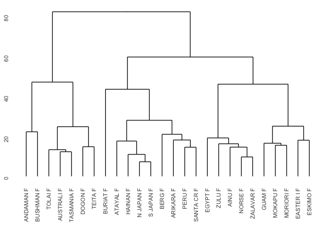

Dimensionality reduction and clustering II
================
Tiena Danner & Steven Moran
(18 May, 2022)

-   [PCA – so what?](#pca--so-what)
-   [Data](#data)
-   [K-means clustering in R](#k-means-clustering-in-r)
    -   [K-means clustering in R-code](#k-means-clustering-in-r-code)
    -   [How many clusters to choose in the
        end?](#how-many-clusters-to-choose-in-the-end)
-   [Hierarchical clustering in R](#hierarchical-clustering-in-r)
-   [Clustering in essence](#clustering-in-essence)
-   [Data practical](#data-practical)
-   [References](#references)

------------------------------------------------------------------------

This report uses the [R programming
language](https://cran.r-project.org/doc/FAQ/R-FAQ.html) (R Core Team
2021) and the following [R libraries](https://r-pkgs.org/intro.html)
(Wickham et al. 2019; Xie 2021; Kassambara and Kassambara 2020; Leisch
and Dimitriadou 2010; Kassambara and Mundt 2020; Auguie and Antonov
2017; Maechler et al. 2022; Vries and Ripley 2022).

``` r
library(tidyverse)
library(knitr)
library(ggpubr)
library(factoextra)
library(mlbench)
library(datasets)
library(gridExtra)
library(cluster)
library(ggdendro)
```

## PCA – so what?

Recall the materials on
[PCA](https://github.com/bambooforest/IntroDataScience/tree/main/10_Dimensionality_reduction_clustering_I).
As you remember, we may use **PCA** to boil down sets of multivariate
data into a few uncorrelated variables that capture the main axes of
variation in a multivariate data set (the so-called principle components
or PCs for short). We can use the resulting PCs to visualize
multivariate data in low-dimensional space and we may even make
inferences about potential patterns of variation within the data.

**But what can we do to find the actual patterns, e.g., clusters in the
data?**

In this chapter we will focus on “**How to find actual patterns in
multivariate data**.” There is a wide range of clustering methods in the
programming world and we will only cover a tony fraction of them here.
For an overview, see the Wikipedia article on
[**clustering**](https://en.wikipedia.org/wiki/Cluster_analysis). The
most widely used clustering technique is called [**K-means
clustering**](https://en.wikipedia.org/wiki/K-means_clustering) and we
will take a closer look at it today.

We will not go into the mathematical details of clustering algorithms,
but instead focus on their practical applications. The main purpose of
clustering can be summarized as follows
([source](https://en.wikipedia.org/wiki/Cluster_analysis)):

**Clustering may be used for grouping objects (or subjects, specimens,
etc.), such that objects in the same group (or cluster) are more similar
to each other than objects in other clusters.**

The basic idea of this chapter is 1) that you can implement a clustering
procedure on your own in R, 2) that you understand which steps are
included in a classical clustering analysis and 3) finally to apply the
procedure on your own on different data sets – and of course your own
data!

Now let’s go through a **cluster analysis** in detail.

## Data

For this chapter we will utilize different data sets. First we will use
the `iris` data from the `datasets` package. For more info on the iris
data, consult this
[webpage](http://archive.ics.uci.edu/ml/datasets/Iris). Later we’ll use
again the [Howells Data](https://web.utk.edu/~auerbach/HOWL.htm)
(Howells 1973, 1989, 1995). However, we will make use of an aggregated
version of the Howells data which consists of only two entries per
population (one female and male “mean” per population).

Let’s load the data (Iris and then the Howells data).

``` r
data(iris)
```

``` r
howells_mean <- read.csv("data/howells_mean.csv", header = TRUE, fill = TRUE, dec = ".")
```

**The first step** is always to take a closer look at the data that you
are working with.

``` r
head(iris) %>% kable()
```

| Sepal.Length | Sepal.Width | Petal.Length | Petal.Width | Species |
|-------------:|------------:|-------------:|------------:|:--------|
|          5.1 |         3.5 |          1.4 |         0.2 | setosa  |
|          4.9 |         3.0 |          1.4 |         0.2 | setosa  |
|          4.7 |         3.2 |          1.3 |         0.2 | setosa  |
|          4.6 |         3.1 |          1.5 |         0.2 | setosa  |
|          5.0 |         3.6 |          1.4 |         0.2 | setosa  |
|          5.4 |         3.9 |          1.7 |         0.4 | setosa  |

``` r
head(howells_mean) %>% kable()
```

|   X | SEX | POPULATION | longitude | longitude2 | latitude |      GOL |      NOL |       BNL |      BBH |      XCB |      XFB |      ZYB |      AUB |      WCB |       ASB |       BPL |      NPH |      NLH |      JUB |      NLB |      MAB |      MDH |      MDB |      OBH |      OBB |      DKB |       NDS |      WNB |      SIS |       ZMB |      SSS |       FMB |      NAS |       EKB |       DKS |      IML |      XML |      MLS |      WMH |      SOS |      BLS |      STB |      FRC |      FRS |      FRF |      PAC |      PAS |      PAF |       OCC |      OCS |      OCF |      FOL | cosine.latitude |
|----:|:----|:-----------|----------:|-----------:|---------:|---------:|---------:|----------:|---------:|---------:|---------:|---------:|---------:|---------:|----------:|----------:|---------:|---------:|---------:|---------:|---------:|---------:|---------:|---------:|---------:|---------:|----------:|---------:|---------:|----------:|---------:|----------:|---------:|----------:|----------:|---------:|---------:|---------:|---------:|---------:|---------:|---------:|---------:|---------:|---------:|---------:|---------:|---------:|----------:|---------:|---------:|---------:|----------------:|
|   1 | F   | AINU       |       140 |        140 |       50 | 178.7368 | 177.0000 |  99.92105 | 132.4737 | 137.1053 | 114.8947 | 128.2368 | 118.4474 | 71.78947 | 106.71053 |  97.42105 | 64.00000 | 48.18421 | 114.6316 | 26.44737 | 62.26316 | 24.76316 | 11.28947 | 34.23684 | 39.94737 | 20.57895 |  9.236842 | 8.078947 | 2.684210 |  93.71053 | 21.76316 |  95.68421 | 15.73684 |  97.65789 |  9.973684 | 32.23684 | 48.50000 | 10.44737 | 22.18421 | 4.473684 | 2.710526 | 111.9211 | 108.7368 | 26.71053 | 48.71053 | 110.7368 | 22.81579 | 56.94737 |  97.26316 | 27.44737 | 45.63158 | 34.73684 |       0.6427876 |
|   2 | M   | AINU       |       140 |        140 |       50 | 189.9792 | 187.0417 | 106.60417 | 138.5625 | 142.9583 | 119.6458 | 138.9375 | 125.7500 | 75.68750 | 112.45833 | 104.56250 | 67.50000 | 50.95833 | 122.7500 | 27.72917 | 66.77083 | 29.93750 | 13.93750 | 34.14583 | 41.75000 | 21.75000 | 10.250000 | 8.729167 | 3.718750 |  99.16667 | 22.64583 | 100.81250 | 16.39583 | 102.50000 |  9.979167 | 35.60417 | 53.79167 | 11.95833 | 23.89583 | 5.416667 | 4.229167 | 115.0833 | 112.4375 | 26.97917 | 50.85417 | 115.6042 | 23.47917 | 60.54167 | 100.41667 | 28.75000 | 47.77083 | 37.62500 |       0.6427876 |
|   3 | F   | ANDAMAN    |        70 |         70 |        0 | 160.1143 | 159.4286 |  89.42857 | 123.5143 | 131.0857 | 106.1143 | 117.6000 | 108.5143 | 65.77143 |  95.74286 |  90.85714 | 56.62857 | 43.71429 | 106.3143 | 24.14286 | 58.11429 | 22.80000 | 10.31429 | 32.20000 | 36.40000 | 20.82857 |  8.885714 | 8.942857 | 2.214286 |  90.00000 | 22.54286 |  89.22857 | 14.88571 |  90.54286 |  9.685714 | 33.71429 | 48.00000 | 10.40000 | 18.57143 | 4.857143 | 1.628571 | 103.5143 | 101.5714 | 23.71429 | 46.00000 | 102.3429 | 22.91429 | 55.42857 |  89.60000 | 22.51429 | 42.22857 | 32.11429 |       1.0000000 |
|   4 | M   | ANDAMAN    |        70 |         70 |        0 | 168.8571 | 167.5429 |  93.85714 | 129.4000 | 135.6571 | 110.5429 | 123.8286 | 113.3429 | 69.17143 | 100.25714 |  92.82857 | 60.68571 | 46.85714 | 111.8286 | 24.71429 | 60.80000 | 25.54286 | 11.31429 | 32.71429 | 37.57143 | 21.28571 |  9.657143 | 8.142857 | 2.334286 |  93.20000 | 24.02857 |  92.40000 | 15.74286 |  93.17143 | 10.314286 | 35.91429 | 51.20000 | 11.42857 | 20.22857 | 5.828571 | 2.457143 | 107.9714 | 106.6571 | 24.82857 | 48.71429 | 107.5429 | 24.82857 | 57.74286 |  91.68571 | 24.28571 | 43.77143 | 33.65714 |       1.0000000 |
|   5 | M   | ANYANG     |       120 |        120 |       40 | 181.0000 | 178.8571 | 101.28571 | 140.2619 | 138.7857 | 114.8095 | 135.9524 | 125.6905 | 74.19048 | 108.23810 |  97.50000 | 69.42857 | 52.47619 | 121.2143 | 28.28571 | 66.69048 | 30.59524 | 13.92857 | 32.78571 | 39.04762 | 22.45238 |  7.857143 | 7.809524 | 2.380952 | 100.83333 | 22.38095 |  97.38095 | 14.28571 |  98.78571 |  8.500000 | 36.07143 | 54.88095 | 12.66667 | 26.45238 | 6.023809 | 3.142857 | 110.2143 | 113.5238 | 26.02381 | 51.45238 | 113.8810 | 24.35714 | 60.26190 |  99.42857 | 27.61905 | 48.61905 | 36.66667 |       0.7660444 |
|   6 | F   | ARIKARA    |      -100 |        260 |       50 | 171.1111 | 170.2222 |  97.51852 | 126.8148 | 136.4815 | 112.8148 | 130.6667 | 123.8889 | 71.25926 | 105.40741 |  95.14815 | 67.62963 | 50.51852 | 115.0000 | 25.81481 | 62.07407 | 24.88889 | 11.11111 | 34.62963 | 39.22222 | 20.14815 |  9.481481 | 8.592593 | 3.481482 |  94.81481 | 23.62963 |  94.77778 | 16.29630 |  95.96296 | 10.259259 | 34.85185 | 50.66667 | 10.70370 | 22.25926 | 4.740741 | 2.259259 | 107.9259 | 105.6296 | 23.37037 | 46.77778 | 104.0741 | 22.59259 | 53.37037 |  91.03704 | 26.55556 | 44.14815 | 35.44444 |       0.6427876 |

## K-means clustering in R

If you want to know in detail how clustering algorithms (specifically
the K-means algorithm) works, you can consult these great resources that
show the complete implementation in R:

-   [Data flair
    training](https://data-flair.training/blogs/clustering-in-r-tutorial/)
-   [Geeks for
    geeks](https://www.geeksforgeeks.org/clustering-in-r-programming/)

To get an overview of how the method theoretically works, watch [this
video](figures/StatQuest_K-means_clustering.mp4) (**attention**: if you
click this link you will forwarded to a GitHub page which will say:
*(Sorry about that, but we can’t show files that are this big right
now.)*, just click *View Raw* and you will be able to watch the video
directly on GitHub). If you want the YouTube URL,
[here](https://www.youtube.com/watch?v=4b5d3muPQmA) you go.

In **summary**, the K-means algorithm works as follows
([source](https://www.geeksforgeeks.org/clustering-in-r-programming/)):

-   First, the **number of clusters** (groups) must be specified. The
    simplest case is two clusters.
-   Second, each data point is **randomly assigned** to one of the two
    clusters.
-   Third, the **centroids** of each data cluster are computed. The
    centroid is the “midpoint” of each of the cluster’s data scatter.
-   Then, the data points are **re-allocated to their closest
    centroid**, e.g., points are added to other clusters if they happen
    to be closer to another centroid (calculated via sum of squared
    distances).
-   Then the new centroids are re-calculated.

Steps 3-4 are **repeated (aka iterated) until a global optimum has been
reached**, i.e., no points can be re-allocated to other clusters.

### K-means clustering in R-code

First, let’s work with the `iris` data.

``` r
## We are only keeping numerical variables, so we get rid of the species name
iris_mod <- iris[, 1:4]

## Now we scale the data, this has to be done, especially when you've got measurements of different scales in your data (e.g., temperatures, wind speeds and UV-index)
iris_mod <- scale(iris_mod)

## Compute the K-means clustering algorithm
km <- kmeans(iris_mod, centers = 3, nstart = 25)

## Visualize the clusters
fviz_cluster(km, data = iris_mod, ggtheme = theme_pubr(border = TRUE, margin = TRUE))
```

<!-- -->

OK – so what happened in the code above?

-   First we used indexing in R to remove the species name of the flower
    from the data with the command: `iris_mod <- iris[,1:4]`.
-   Then we scaled the numerical variables to mean = 0 and standard
    deviation = 1 with the command: `iris_mod <- scale(iris_mod)`.
-   Next we computed the K-means algorithm with the code snippet:
    `km <- kmeans(iris_mod, centers = 3, nstart = 25)`. We used 3
    clusters for a start and the number of random sets = 25 (i.e., a
    random set of points for initializing the algorithm).
-   The plot we produce with the command:
    `fviz_cluster(km, data = iris_mod, ggtheme = theme_pubr(border = TRUE, margin = TRUE))`,
    which shows a PCA plot of the first two PCs and indicates the
    clusters that the algorithm found with different colors.

What if we want to compare different numbers of clusters? No problem.
Here we go.

``` r
## Compute different sets of kmeans clustering with differnt number of clusters
kmeans2 <- kmeans(iris_mod, centers = 2, nstart = 25)
kmeans3 <- kmeans(iris_mod, centers = 3, nstart = 25)
kmeans4 <- kmeans(iris_mod, centers = 4, nstart = 25)
kmeans5 <- kmeans(iris_mod, centers = 5, nstart = 25)

# Comparing the Plots
plot1 <- fviz_cluster(kmeans2, data = iris_mod, ggtheme = theme_pubr(border = TRUE, margin = TRUE)) + ggtitle("k = 2")
plot2 <- fviz_cluster(kmeans3, data = iris_mod, ggtheme = theme_pubr(border = TRUE, margin = TRUE)) + ggtitle("k = 3")
plot3 <- fviz_cluster(kmeans4, data = iris_mod, ggtheme = theme_pubr(border = TRUE, margin = TRUE)) + ggtitle("k = 4")
plot4 <- fviz_cluster(kmeans5, data = iris_mod, ggtheme = theme_pubr(border = TRUE, margin = TRUE)) + ggtitle("k = 5")
grid.arrange(plot1, plot2, plot3, plot4, nrow = 2)
```

<!-- -->

### How many clusters to choose in the end?

This is a good but difficult question to answer. Generally it is hard to
determine the exact number of clusters definitely. In the `iris`
example, it makes sense to look at the original data. If you take a look
at the number of flower species in the data, we find that there are
**three species**. Let’s plot a PCA and look at the variation between
species.

``` r
## compute the PCA -- you know how to do this
iris_pca <- prcomp(iris[, 1:4], scale. = TRUE)
iris_pca_dat <- cbind(iris, iris_pca$x[, 1:4])

## plot the first two PCs
ggplot(iris_pca_dat, aes(x = PC1, y = PC2, color = Species)) +
  geom_point() +
  stat_ellipse() +
  coord_equal() +
  theme_pubr(border = TRUE, margin = TRUE)
```

<!-- -->

It becomes clear that here we would probably use three clusters, since
it would then cluster roughly each species in a cluster (which makes
sense in terms of their biology).

**But what if we do not have any prior knowledge about potential
clusters?** This is normally case when clustering…

For example, this may often be the case when you have a number of study
objects which you cannot group *a priori* into known clusters or groups.
**That is where clustering really becomes interesting and useful!**
There are certain
[methods](https://www.datanovia.com/en/lessons/determining-the-optimal-number-of-clusters-3-must-know-methods/)
to find out how many clusters one can utilize for an analysis. We will
show you three methods here, but without going into the mathematical
details behind it. However, beware because these methods give
**statistical cues** rather than absolute truths!

There are three main methods to find out how many clusters make sense to
plot
([source](https://www.datanovia.com/en/lessons/determining-the-optimal-number-of-clusters-3-must-know-methods/)):

-   The Elbow method
-   The Silhouette method
-   The Gap statistic method

The **Elbow method** looks at the total WSS (within-cluster sums of
squares) as a function of the number of clusters. It chooses the number
of clusters such that adding another cluster does not improve the total
WSS. This can be done by looking at the Elbow plot.

The **Silhoutte method** measures the quality of a clustering. Meaning,
it determines how well each object lies within its cluster. A high
average silhouette width indicates a good clustering.

The **Gap statistic method** compares the total intra-cluster variation
for different values of K (number of clusters) with their expected
values under a null reference distribution of the data. The estimate of
the optimal clusters will be a value that maximizes the gap statistic
(i.e, that yields the largest gap statistic). This means that the
clustering structure is far away from the random uniform distribution of
points.

Here are some R implementations of the three methods:

``` r
# Elbow method
fviz_nbclust(iris_mod, kmeans, method = "wss") +
  labs(subtitle = "Elbow method")
```

<!-- -->

``` r
# Silhouette method
fviz_nbclust(iris_mod, kmeans, method = "silhouette") +
  labs(subtitle = "Silhouette method")
```

<!-- -->

``` r
# Gap statistic
gap_stat <- clusGap(iris_mod,
  FUN = kmeans, nstart = 25,
  K.max = 10, B = 10
)
print(gap_stat, method = "firstmax")
```

    ## Clustering Gap statistic ["clusGap"] from call:
    ## clusGap(x = iris_mod, FUNcluster = kmeans, K.max = 10, B = 10,     nstart = 25)
    ## B=10 simulated reference sets, k = 1..10; spaceH0="scaledPCA"
    ##  --> Number of clusters (method 'firstmax'): 3
    ##           logW   E.logW       gap      SE.sim
    ##  [1,] 4.534565 4.745781 0.2112157 0.024271468
    ##  [2,] 4.021316 4.481045 0.4597287 0.023247363
    ##  [3,] 3.806577 4.287108 0.4805310 0.022005009
    ##  [4,] 3.699263 4.138042 0.4387785 0.022976513
    ##  [5,] 3.589284 4.046911 0.4576270 0.018998839
    ##  [6,] 3.522810 3.971789 0.4489795 0.013118375
    ##  [7,] 3.448288 3.906691 0.4584031 0.011975368
    ##  [8,] 3.379870 3.851128 0.4712584 0.008759733
    ##  [9,] 3.310088 3.801559 0.4914709 0.007393207
    ## [10,] 3.278659 3.757545 0.4788863 0.009164325

We can interpret the results as follows:

-   In the **elbow plot**, cluster number 4 does not really improve the
    total within sum of squares any more.
-   The **Silhouette** method yields an optimal silhouette width for 2
    clusters.
-   The output of the **gap statistic** yields the largest gap statistic
    for 3 clusters `(--> Number of clusters (method 'firstmax'): 3)`

Given these results, we should probably choose **2-3 clusters**, which
makes sense since there are three species in the `iris` data!

## Hierarchical clustering in R

Lastly, we will show **hierarchical clustering**. Hierarchical
clustering is a bit different from K-means clustering. It essence, it
does the following
([source](https://towardsdatascience.com/hierarchical-clustering-and-its-applications-41c1ad4441a6)):

> > > Hierarchical clustering is a powerful technique which allows you
> > > to build tree structures (quite similar to phylogenetic trees)
> > > from data similarities. With hierarchical clustering you will be
> > > able to see how different subclusters relate to each other and how
> > > far data points are spaced form each other.

For showing how hierarchical clustering works, we will use the Howells
data again. **Let’s find out if certain populations relate more to each
other in terms of craniometric measurements!** (See also
[craniometry](https://en.wikipedia.org/wiki/Craniometry).)

``` r
## Give meaningful rownames
rownames(howells_mean) <- c(paste(howells_mean[, 3], howells_mean[, 2]))

## Select only numerical variables and only females
howells_cluster <- howells_mean[which(howells_mean$SEX == "F"), 7:53]

## Clustering
d <- dist(howells_cluster, method = "euclidean") # distance matrix computation e.g., distance between individual points
fit <- hclust(d, method = "ward.D")

## Plot the dendrogram (aka tree)
ggdendrogram(fit)
```

<!-- -->

Note that we only look at **females**, since between-sex variation would
probably obscure similarities / dissimilarities between populations.
Here we used the method **ward.D** in the
`fit <- hclust(d, method = "ward.D")` command, which is a specific
method to calculate the clustering. Feel free to try out different
methods by changing the `method = "ward.D"`. You can find more info on
the different methods
[here](https://stat.ethz.ch/R-manual/R-devel/library/stats/html/hclust.html).

## Clustering in essence

-   Clustering is a statistical procedure that finds grouping patterns
    within a set of data by finding similarities between data points in
    the data.
-   Clustering will help you to find potential distinct groups or
    clusters within a set of data. That is, clustering algorithms will
    create groups where data entries in a similar group will potentially
    have similar characteristics to each other.

**BUT** (there is always a but!): Keep in mind that clustering
algorithms are statistical procedures and that the resulting patterns do
not necessarily correspond to biologically (or other scientifically)
relevant clustering patterns. Therefore, **always be careful how you
interpret your clustering analysis** and be cautious of faulty
conclusions or arbitrary clusters. Clustering is merely an exploratory
tool and should not be used to draw ultimate conclusions about your
analyses!

Here are some points and pitfalls to consider when doing clustering
([source](https://towardsdatascience.com/common-mistakes-in-cluster-analysis-and-how-to-avoid-them-eb960116d773)):

-   Make sure not to skip the step of **exploratory data analysis**
    (look at your data!) and do data cleaning if needed. Then consider:
    -   What effects do cleaning steps have on the outcome of the
        clustering?
    -   What impacts do the outliers have on the clustering?
-   Use **scaled input variables**!
    -   Never forget to scale your data input variables befor the
        clustering procedure.
    -   Especially if your input variables have different measurement
        units!
    -   If you forget this step, it will mess with the outcome of the
        clustering.
-   Be careful of **arbitrary clustering**!
    -   Make sure to choose a reasonable number of clusters that make
        scientific sense.
    -   Use methods to determine the optimal number of clusters (e.g.,
        see [section](#how-many-clusters-to-choose)).
    -   It is a good rule of thumb to have about similar number of data
        points in each cluster (but this depends on your original data
        structure).
-   Make sure to **describe the cluster patterns comprehensibly**!
    -   Which characteristics represent each of the clusters?
    -   Which characteristics distinguish your clusters?

# Data practical

-   As always, write a nicely structured **scientific report** in R
    Markdown, which you will eventually upload on GitHub.
-   Look at the data sets that are available from the `datasets` package
    or from the `mlbench` package. For example the `iris` data from the
    `datasets` package or the BreastCancer data from the `mlbench`
    package. For an overview of the different data sets that are
    available, you can consult this
    [webpage](https://machinelearningmastery.com/machine-learning-datasets-in-r/).
-   Here are a few examples, that are nicely fit to do a clustering
    analysis:

``` r
## Iris data set
data(iris)

## BreastCancer data set
data(BreastCancer)

## US arrest reason data of different regions
data(USArrests)

## Car data of different car brands
data(mtcars)
```

-   When you run the command `data("datasetname")`, the data will load
    in your global environment in R-Studio.
-   Load some data (sets) from the packages above and run a cluster
    analysis (you can of course also use your own data!).
-   Formulate 1-2 questions that you want to answer by doing a
    clustering analysis.
-   Visualize your cluster analysis as shown in the lectures.
-   Make sure to pick a reasonable number of clusters by applying
    appropriate methods (you received the tools in the lecture).
-   Clearly communicate and explain the patterns you can see from your
    cluster analysis.
-   Draw potential conclusions from your data analysis and interpret
    your results.
-   Produce some visually appealing plots and statistics.
-   Have fun!

# References

<div id="refs" class="references csl-bib-body hanging-indent">

<div id="ref-gridExtra" class="csl-entry">

Auguie, Baptiste, and Anton Antonov. 2017. *Gridextra: Miscellaneous
Functions for “Grid” Graphics*.
<https://cran.r-project.org/web/packages/gridExtra/index.html>.

</div>

<div id="ref-Howells1973" class="csl-entry">

Howells, William W. 1973. “Cranial Variation in Man. A Study by
Multivariate Analysis of Patterns of Differences Among Recent Human
Populations.” *Papers of the Peabody Museum of Archeology and Ethnology*
67: 259.

</div>

<div id="ref-Howells1989" class="csl-entry">

———. 1989. “Skull Shapes and the Map. Craniometric Analyses in the
Dispersion of Modern Homo.” *Papers of the Peabody Museum of Archeology
and Ethnology* 79: 189.

</div>

<div id="ref-Howells1995" class="csl-entry">

———. 1995. “Who’s Who in Skulls. Ethnic Identification of Crania from
Measurements.” *Papers of the Peabody Museum of Archeology and
Ethnology* 82: 108.

</div>

<div id="ref-ggpubr" class="csl-entry">

Kassambara, Alboukadel, and Maintainer Alboukadel Kassambara. 2020.
*Package ‘Ggpubr’*. *R Package Version 0.1*. Vol. 6.

</div>

<div id="ref-factoextra" class="csl-entry">

Kassambara, Alboukadel, and Fabian Mundt. 2020. *Factoextra: Extract and
Visualize the Results of Multivariate Data Analyses*.
<https://cran.r-project.org/web/packages/factoextra/>.

</div>

<div id="ref-mlbench" class="csl-entry">

Leisch, Friedrich, and Evgenia Dimitriadou. 2010. “Machine Learning
Benchmark Problems.” *R Package, Mlbench*.

</div>

<div id="ref-cluster" class="csl-entry">

Maechler, Martin, Peter Rousseeuw, Anja Struyf, Mia Hubert, and Kurt
Hornik. 2022. *Cluster: Cluster Analysis Basics and Extensions*.
<https://CRAN.R-project.org/package=cluster>.

</div>

<div id="ref-R" class="csl-entry">

R Core Team. 2021. *R: A Language and Environment for Statistical
Computing*. Vienna, Austria: R Foundation for Statistical Computing.
<https://www.R-project.org/>.

</div>

<div id="ref-ggdendro" class="csl-entry">

Vries, Andrie de, and Brian D. Ripley. 2022. *Ggdendro: Create
Dendrograms and Tree Diagrams Using ’Ggplot2’*.
<https://cran.r-project.org/web/packages/ggdendro/index.html>.

</div>

<div id="ref-tidyverse" class="csl-entry">

Wickham, Hadley, Mara Averick, Jennifer Bryan, Winston Chang, Lucy
D’Agostino McGowan, Romain François, Garrett Grolemund, et al. 2019.
“Welcome to the <span class="nocase">tidyverse</span>.” *Journal of Open
Source Software* 4 (43): 1686. <https://doi.org/10.21105/joss.01686>.

</div>

<div id="ref-knitr" class="csl-entry">

Xie, Yihui. 2021. *Knitr: A General-Purpose Package for Dynamic Report
Generation in r*. <https://yihui.org/knitr/>.

</div>

</div>
