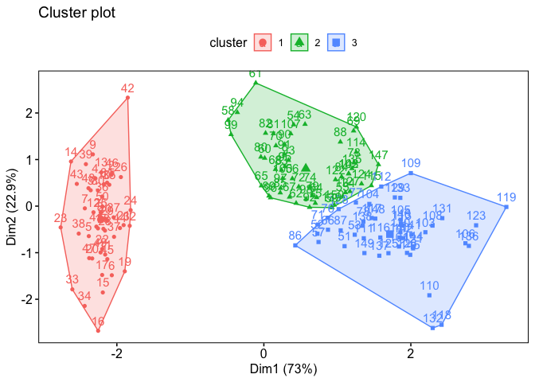

Dimensionality reduction and clustering II
================
Tiena Danner
02 May, 2022

-   [PCA – so what?](#pca--so-what)
-   [Data](#data)
-   [K-means clustering in R](#k-means-clustering-in-r)
    -   [K-means clustering in R-code](#k-means-clustering-in-r-code)
    -   [How many clusters to choose?](#how-many-clusters-to-choose)
-   [Hierarchical clustering in R](#hierarchical-clustering-in-r)
-   [Data practical](#data-practical)
-   [References](#references)

------------------------------------------------------------------------

This report uses the [R programming
language](https://cran.r-project.org/doc/FAQ/R-FAQ.html) (R Core Team
2021) and the following [R libraries](https://r-pkgs.org/intro.html)
(Wickham et al. 2019; Xie 2021; Kassambara and Kassambara 2020; Leisch
and Dimitriadou 2010; Kassambara and Mundt 2020; Auguie and Antonov
2017).

``` r
library(tidyverse)
library(knitr)
library(ggpubr)
library(factoextra)
library(mlbench)
library(datasets)
library(gridExtra)
library(cluster)
```

## PCA – so what?

Recall the materials on
[PCA](https://github.com/bambooforest/IntroDataScience/tree/main/10_Dimensionality_reduction_clustering_I).
As you remember, we may use **PCA** to boil down sets of multivariate
data into a few uncorrelated variables that explain the main axes of
variation in our data (the PCs). We can use the PCs to look at our data
and how it is structured and even find some clusters within the data.

**But: what can we do to find the actual patterns e.g. clusters in the
data?**

In this chapter we will focus on “**how to patterns in multivariate data
–&gt; clustering**.” There is a wide range of clustering methods in the
programming world and we will only cover a fraction of those. For an
overview, see the Wikipedia article on
[**clustering**](https://en.wikipedia.org/wiki/Cluster_analysis). The
most widely used technique for clustering is [**K-means
clustering**](https://en.wikipedia.org/wiki/K-means_clustering), which
we will apply today.

Again, we will not go into the exact mathematical details of clustering
algorithms but focus on the practical application of clustering. The
main goals of clustering can be summarized as
[follows](https://en.wikipedia.org/wiki/Cluster_analysis):

**Grouping objects (or subjects/specimens) such that objects in the same
group (cluster) are more similar to each other than objects in other
clusters**

The basic idea of this chapter is that you can implement a clustering
procedure on your own, that you understand which steps are included in a
classical clustering analysis and finally to apply it on a different
data set (potentially your own data).

Now let’s go through a **cluster analysis** in detail.

## Data

Here we will use different kind of data to visualize the clustering
optimally. First we will use the `iris` data from the `datasets`
package. For more info on the iris data, consider this
[webpage](http://archive.ics.uci.edu/ml/datasets/Iris). Later we’ll use
again the [Howells Data](https://web.utk.edu/~auerbach/HOWL.htm)
(Howells 1973, 1989, 1995). However, we will have two versions of data
for the Howells Data, the full data set and an aggregated data set of
only two entries per population (one female and male “mean”).

Let’s load the data.

``` r
howells <- read_csv("data/howells_data.csv")
howells_mean <- read_csv("data/howells_mean.csv")
```

    ## Warning: Missing column names filled in: 'X1' [1]

``` r
data(iris)
head(iris) %>% kable()
```

| Sepal.Length | Sepal.Width | Petal.Length | Petal.Width | Species |
|-------------:|------------:|-------------:|------------:|:--------|
|          5.1 |         3.5 |          1.4 |         0.2 | setosa  |
|          4.9 |         3.0 |          1.4 |         0.2 | setosa  |
|          4.7 |         3.2 |          1.3 |         0.2 | setosa  |
|          4.6 |         3.1 |          1.5 |         0.2 | setosa  |
|          5.0 |         3.6 |          1.4 |         0.2 | setosa  |
|          5.4 |         3.9 |          1.7 |         0.4 | setosa  |

**First step always**, take a close look at the data. We will skip this
step for now since you already know the data.

## K-means clustering in R

If you want to know in detail how clustering algorithms (specifically
the K-means algorithm) works, you can consider the following resources
that show the complete implementation in R:

-   [data flair
    training](https://data-flair.training/blogs/clustering-in-r-tutorial/)
-   [geeks for
    geeks](https://www.geeksforgeeks.org/clustering-in-r-programming/)

To get an overview of how it works, watch [this
video](figures/StatQuest_K-means_clustering.mp4) (**attention**: if you
click this link you will forwarded to a github page which will say:
*(Sorry about that, but we can’t show files that are this big right
now.)*, just click *View Raw* and you will be able to watch the video
directly on github). If you want the Youtube link,
[here](https://www.youtube.com/watch?v=4b5d3muPQmA) you go.

In summary, the K-means algorithm works as follows
([source](https://www.geeksforgeeks.org/clustering-in-r-programming/)):

-   First, the **number of clusters** (groups) must be specified. The
    simplest case would be 2 clusters.
-   Second, each data point is **randomly assigned** to one of the two
    clusters.
-   Third, the **centroids** of each data cluster are computed. The
    centroid is the “midpoint” of each of the cluster’s data scatter.
-   Then, the data points are **re-allocated to their closest centroid**
    e.g. points are added to other clusters, if they are nearer to
    another centroid.
-   Then the new centroids are re-calculated

Steps 3-4 are **repeated until a global optimum has been reached**
e.g. no points can be re-allocated to other clusters.

### K-means clustering in R-code

First, let’s work on the `iris` data.

``` r
## we are only keeping numerical variables, we get rid of the species name 
iris_mod <- iris[,1:4] 

## now we scale the data, this has to be done especially when you've got measurements of different scales in your data (e.g. temperatures, windspeed and UV-index for example)
iris_mod <- scale(iris_mod)

## compute the K-means clustering algorithm 
km <- kmeans(iris_mod, centers = 3, nstart = 25)
 
## Visualize the clusters
fviz_cluster(km, data = iris_mod, ggtheme = theme_pubr(border = TRUE, margin = TRUE))
```

<!-- -->

OK – what happened?

-   First we used indexing, to remove the species name of the flower
    from the data with the command `iris_mod <- iris[,1:4]`
-   Then we scaled the numerical variables to mean = 0 and sd = 1 with
    the command `iris_mod <- scale(iris_mod)`
-   Afterwards we could compute the K-means algorithm with the code
    `km <- kmeans(iris_mod, centers = 3, nstart = 25)`. We used 3
    clusters for a start and the number of random sets = 25.
-   The plot we produce with
    `fviz_cluster(km, data = iris_mod, ggtheme = theme_pubr(border = TRUE, margin = TRUE))`
    shows a PCA plot of the first two PCs and the clusters with
    different colors.

What if we want to compare different numbers of clusters? No problem.
Here we go.

``` r
kmeans2 <- kmeans(iris_mod, centers = 2, nstart = 25)  
kmeans3 <- kmeans(iris_mod, centers = 3, nstart = 25)  
kmeans4 <- kmeans(iris_mod, centers = 4, nstart = 25)  
kmeans5 <- kmeans(iris_mod, centers = 5, nstart = 25)  
#Comparing the Plots
plot1 <- fviz_cluster(kmeans2, data = iris_mod, ggtheme = theme_pubr(border = TRUE, margin = TRUE)) + ggtitle("k = 2")
plot2 <- fviz_cluster(kmeans3, data = iris_mod, ggtheme = theme_pubr(border = TRUE, margin = TRUE)) + ggtitle("k = 3")
plot3 <- fviz_cluster(kmeans4, data = iris_mod, ggtheme = theme_pubr(border = TRUE, margin = TRUE)) + ggtitle("k = 4")
plot4 <- fviz_cluster(kmeans5, data = iris_mod, ggtheme = theme_pubr(border = TRUE, margin = TRUE)) + ggtitle("k = 5")
grid.arrange(plot1, plot2, plot3, plot4, nrow = 2)
```

<!-- -->

### How many clusters to choose?

This is a hard question and it is difficult to determine the number of
clusters definitely. In the `iris` example it makes sense to look at the
original data. If you take a look at the number of flower species in the
data, we find that there are **three species**. Let’s plot a PCA.

``` r
iris_pca <- prcomp(iris[,1:4], scale. = TRUE)
iris_pca_dat <- cbind(iris, iris_pca$x[, 1:4])

## plot the first two PCs
ggplot(iris_pca_dat, aes(x = PC1, y = PC2, color = Species)) +
  geom_point() +
  stat_ellipse() +
  coord_equal() +
  theme_pubr(border = TRUE, margin = TRUE)
```

<!-- -->

It becomes clear that here, we would probably use three clusters, since
it would then cluster roughly each species in a cluster.

**But what if we do not have any prior knowledge about potential
clusters?**

This will be often the case when you have a number of study objects
which you cannot group per se into different clusters. That is where
clustering really becomes interesting! There are certain
[methods](https://www.datanovia.com/en/lessons/determining-the-optimal-number-of-clusters-3-must-know-methods/)
to find out, how many clusters one could utilize for an analysis. We
will show you three methods here, without going into the mathematical
details behind it. However, not that these methods rather give
**statistical cues** rather than absolute truths!

There are three main methods to find out how many clusters make sense to
plot
[source](https://www.datanovia.com/en/lessons/determining-the-optimal-number-of-clusters-3-must-know-methods/):

-   The Elbow method
-   The Silhouette method
-   The Gap statistic method

The **Elbow method** looks at the total WSS (within-cluster sums of
squares) as a function of the number of clusters: We should choose the
number of clusters so, that adding another cluster does not improve much
better the total WSS. This can be done by looking at the Elbow plot (see
below).

The **Silhoutte method** measures the quality of a clustering. Meaning,
it determines how well each object lies within its cluster. A high
average silhouette width indicates a good clustering.

The **Gap statistic method** compares the total intra-cluster variation
for different values of K (number of clusters) with their expected
values under a null reference distribution of the data. The estimate of
the optimal clusters will be value that maximize the gap statistic (i.e,
that yields the largest gap statistic). This means that the clustering
structure is far away from the random uniform distribution of points.

Here are some R implementations of the three methods:

``` r
# Elbow method
fviz_nbclust(iris_mod, kmeans, method = "wss") +
  labs(subtitle = "Elbow method")
```

<!-- -->

``` r
# Silhouette method
fviz_nbclust(iris_mod, kmeans, method = "silhouette") +
  labs(subtitle = "Silhouette method")
```

<!-- -->

``` r
# Gap statistic
gap_stat <- clusGap(iris_mod, FUN = kmeans, nstart = 25,
 K.max = 10, B = 10)
 print(gap_stat, method = "firstmax")
```

    ## Clustering Gap statistic ["clusGap"] from call:
    ## clusGap(x = iris_mod, FUNcluster = kmeans, K.max = 10, B = 10,     nstart = 25)
    ## B=10 simulated reference sets, k = 1..10; spaceH0="scaledPCA"
    ##  --> Number of clusters (method 'firstmax'): 3
    ##           logW   E.logW       gap      SE.sim
    ##  [1,] 4.534565 4.745781 0.2112157 0.024271468
    ##  [2,] 4.021316 4.481045 0.4597287 0.023247363
    ##  [3,] 3.806577 4.287108 0.4805310 0.022005009
    ##  [4,] 3.699263 4.138042 0.4387785 0.022976513
    ##  [5,] 3.589284 4.046911 0.4576270 0.018998839
    ##  [6,] 3.522810 3.971789 0.4489795 0.013118375
    ##  [7,] 3.448288 3.906691 0.4584031 0.011975368
    ##  [8,] 3.379870 3.851128 0.4712584 0.008759733
    ##  [9,] 3.310088 3.801559 0.4914709 0.007393207
    ## [10,] 3.278659 3.757545 0.4788863 0.009164325

Given the results, we would probably choose **2-3 clusters**, which
makes sense since there are three species in the data.

Clustering in essence:

------------------------------------------------------------------------

-   PCA is a statistical procedure that converts a set of observations
    of possibly correlated variables into a set of values of linearly
    uncorrelated variables called principal components
    ([Wikipedia](https://en.wikipedia.org/wiki/Principal_component_analysis))
-   PCA will help us to find a reduced number of features that will
    represent our original data set in a compressed way, capturing up to
    a certain portion of its variance depending on the number of new
    features we end up selecting
    ([Towardsdatascience](https://towardsdatascience.com/the-most-gentle-introduction-to-principal-component-analysis-9ffae371e93b))

------------------------------------------------------------------------

**BUT** (there is always a but): Keep in mind that PCA (and other
dimensionality reduction techniques) are statistical procedures and that
the resulting PCs do not necessarily correspond to biologically relevant
patterns of variation. Therefore, **always be careful how you interpret
your PCA** and be cautious of faulty conclusions. PCA merely extracts
patterns of variation in a sample and helps you to visualize these
patterns!

## Hierarchical clustering in R

# Data practical

-   As always, write a nicely structured **scientific report** in R
    Markdown, which you will eventually upload on github (you hopefully
    know how to do this until now :grin:)
-   Look at the data sets that are available from the `datasets` package
    or from the `mlbench` package. For example the iris data from the
    `datasets` package or the BreastCancer data from the `mlbench`
    package. For an overview of the different data sets that are
    available, you can consult this
    [webpage](https://machinelearningmastery.com/machine-learning-datasets-in-r/).
-   Here are two examples, that are nicely fit to compute a PCA:

``` r
## iris data set
data(iris)

## BreastCancer data set
data(BreastCancer)
```

-   When you run the command `data("datasetname")`, the data will load
    in your global environment in R-Studio
-   Load some data (sets) from the packages above and run a PCA (you can
    of course also use your own data!)
-   Formulate two questions or hypotheses on the data, that you want to
    answer by using a PCA
-   Visualize the PCA and utilize grouping procedures (coloring, density
    ellipses etc.) to find **patterns** in your data
-   Clearly communicate the explained variances with a screeplot
-   Investigate potential correlations of your PCs (you can also use a
    biplot for that)
-   Produce some final plots and comment what you can see on them and
    how you interpret the results

# References

<div id="refs" class="references csl-bib-body hanging-indent">

<div id="ref-gridExtra" class="csl-entry">

Auguie, Baptiste, and Anton Antonov. 2017. *Gridextra: Miscellaneous
Functions for “Grid” Graphics*.
<https://cran.r-project.org/web/packages/gridExtra/index.html>.

</div>

<div id="ref-Howells1973" class="csl-entry">

Howells, William W. 1973. “Cranial Variation in Man. A Study by
Multivariate Analysis of Patterns of Differences Among Recent Human
Populations.” *Papers of the Peabody Museum of Archeology and Ethnology*
67: 259.

</div>

<div id="ref-Howells1989" class="csl-entry">

———. 1989. “Skull Shapes and the Map. Craniometric Analyses in the
Dispersion of Modern Homo.” *Papers of the Peabody Museum of Archeology
and Ethnology* 79: 189.

</div>

<div id="ref-Howells1995" class="csl-entry">

———. 1995. “Who’s Who in Skulls. Ethnic Identification of Crania from
Measurements.” *Papers of the Peabody Museum of Archeology and
Ethnology* 82: 108.

</div>

<div id="ref-ggpubr" class="csl-entry">

Kassambara, Alboukadel, and Maintainer Alboukadel Kassambara. 2020.
*Package ‘Ggpubr’*. *R Package Version 0.1*. Vol. 6.

</div>

<div id="ref-factoextra" class="csl-entry">

Kassambara, Alboukadel, and Fabian Mundt. 2020. *Factoextra: Extract and
Visualize the Results of Multivariate Data Analyses*.
<https://cran.r-project.org/web/packages/factoextra/>.

</div>

<div id="ref-mlbench" class="csl-entry">

Leisch, Friedrich, and Evgenia Dimitriadou. 2010. “Machine Learning
Benchmark Problems.” *R Package, Mlbench*.

</div>

<div id="ref-R" class="csl-entry">

R Core Team. 2021. *R: A Language and Environment for Statistical
Computing*. Vienna, Austria: R Foundation for Statistical Computing.
<https://www.R-project.org/>.

</div>

<div id="ref-tidyverse" class="csl-entry">

Wickham, Hadley, Mara Averick, Jennifer Bryan, Winston Chang, Lucy
D’Agostino McGowan, Romain François, Garrett Grolemund, et al. 2019.
“Welcome to the <span class="nocase">tidyverse</span>.” *Journal of Open
Source Software* 4 (43): 1686. <https://doi.org/10.21105/joss.01686>.

</div>

<div id="ref-knitr" class="csl-entry">

Xie, Yihui. 2021. *Knitr: A General-Purpose Package for Dynamic Report
Generation in r*. <https://yihui.org/knitr/>.

</div>

</div>
