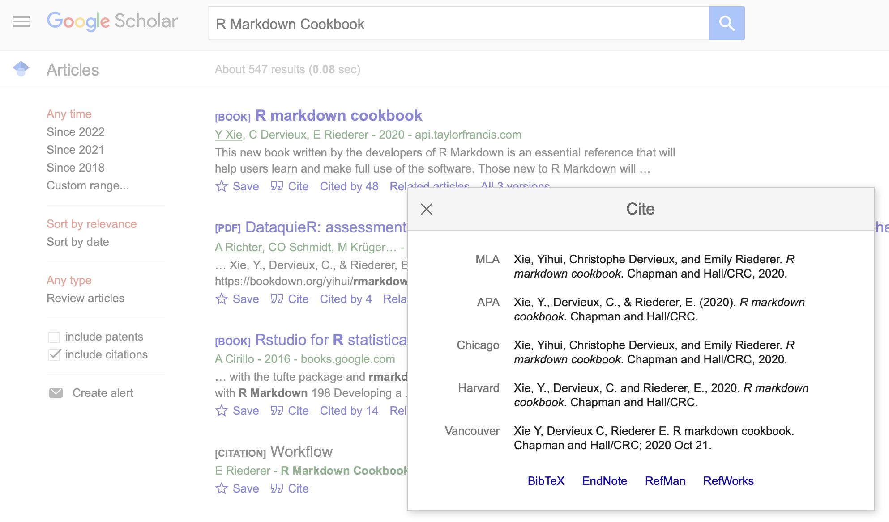

# R Markdown overview

This report uses the [R programming language](https://cran.r-project.org/doc/FAQ/R-FAQ.html) [@R] and the following [R libraries](https://r-pkgs.org/intro.html) [@tidyverse;@knitr].

```{r, message=F, warning=F}
library(tidyverse)
library(knitr)
```

This report will explain how to create scientific reports in R Markdown. This report is [itself](README.Rmd) is generated from an R Markdown file, e.g.:

* https://rmarkdown.rstudio.com
* https://r4ds.had.co.nz/r-markdown.html
* https://www.earthdatascience.org/courses/earth-analytics/document-your-science/intro-to-the-rmarkdown-format-and-knitr/

The file extension is [.Rmd](https://fileinfo.com/extension/rmd). Together with the `knitr` package and RStudio, this report [compiles](https://en.wikipedia.org/wiki/Compilation) this R Markdown file (.Rmd) file into a [Markdown file](https://fileinfo.com/extension/md) (.md) file that [displays nicely in GitHub](README.md).

In the setup chunk above (not shown in this .md file; only in the [.Rmd file](https://github.com/bambooforest/IntroDataScience/blob/main/2_writing_scientific_reports/README.Rmd#L1-L9) that you will work with and edit directly), I have defined in the [file header](https://en.wikipedia.org/wiki/File_format#File_header) the [metadata](https://en.wikipedia.org/wiki/Metadata) that specifies for example the `title`, `author`, `date`, and `output` format for generating this report. R Markdown uses [YAML](https://en.wikipedia.org/wiki/YAML) to [configure](https://en.wikipedia.org/wiki/Configuration_file) how this file should be generated, e.g., I am telling it to produce a [github_document](https://rmarkdown.rstudio.com/github_document_format.html):

```
title: "Writing scientific reports"
author: "Steven Moran"
date: "(`r format(Sys.time(), '%d %B, %Y')`)"
output:
  github_document
```  

This is because then the output (i.e., the .md file) will display nicely in the browser. There are many options for different output formats:

* https://rmarkdown.rstudio.com/lesson-9.html
* https://epirhandbook.com/en/reports-with-r-markdown.html

For example, you can set your report to create an [HTML document](https://bookdown.org/yihui/rmarkdown/html-document.html):

```
title: "Writing scientific reports"
author: "Steven Moran"
date: "(`r format(Sys.time(), '%d %B, %Y')`)"
output:
  html_document 
```  

Or maybe you want to create a [PDF document](https://bookdown.org/yihui/rmarkdown/pdf-document.html) of this report, e.g., so that you can submit it for publication?

```
title: "Writing scientific reports"
author: "Steven Moran"
date: "(`r format(Sys.time(), '%d %B, %Y')`)"
output:
  pdf_document
```  

Or maybe you want it to come out as a [Word document](https://bookdown.org/yihui/rmarkdown/word-document.html) because you want to share it with someone who only works in Word (e.g., one of my old professors):

```
title: "Writing scientific reports"
author: "Steven Moran"
date: "(`r format(Sys.time(), '%d %B, %Y')`)"
output:
  word_document
```  

You can even create for example slides, such as in [PowerPoint](https://bookdown.org/yihui/rmarkdown/powerpoint-presentation.html):

```
title: "Writing scientific reports"
author: "Steven Moran"
date: "(`r format(Sys.time(), '%d %B, %Y')`)"
output:
  powerpoint_presentation
```  

The header gives you a lot of flexibility, in particular because by changing the header you can quickly (and typically easily) change the output format **without having to change everything in the R Markdown file**. This is because the formatting that you are doing, i.e., you are using a [Markup language](https://en.wikipedia.org/wiki/Markup_language) that specifies how document should be displayed.

Here are some basics:

* https://bookdown.org/yihui/rmarkdown/basics.html

For example, if I use the `#` hash symbol like this:

```
# Title
## Subtitle
```

I will get this in my report:

# Title
## Subtitle

For example, this formatted sentence:

You will need to **learn** the *basics* of how to ***format*** your `text` in [R Markdown](https://www.rstudio.com/wp-content/uploads/2015/02/rmarkdown-cheatsheet.pdf).

Is written like this in R Markdown:

```
You will need to **learn** the *basics* of how to ***format*** your `text` in [R Markdown](https://www.rstudio.com/wp-content/uploads/2015/02/rmarkdown-cheatsheet.pdf).
```

There are not that many things to remember. Things like bullet lists are helpful:

* Item 1
* Item 2

Which is formatted like this:

```
* Item 1
* Item 2
```

A good thing to keep near when you are learning R Markdown are [cheat sheets](https://en.wikipedia.org/wiki/Cheat_sheet). [Let me google some for you](https://www.dictionary.com/e/slang/lmgtfy/):

* https://www.rstudio.com/wp-content/uploads/2015/02/rmarkdown-cheatsheet.pdf
* https://ethz.ch/content/dam/ethz/special-interest/math/statistics/sfs/Education/Advanced%20Studies%20in%20Applied%20Statistics/course-material-1719/Datenanalyse/rmarkdown-2.pdf

These cheat sheets very condensely visualize and explain the R Markdown workflow. Please have a look at them.

Regarding the header, it also has many options, including for example that a [table of contents (TOC)](https://en.wikipedia.org/wiki/Table_of_contents) is created and that the document should automatic citation referencing (more on this below). So, for example, this file specifies the header as:

```
---
title: "Writing scientific reports"
author: "Steven Moran"
date: "(`r format(Sys.time(), '%d %B, %Y')`)"
output:
  github_document:
      toc: true
bibliography: 'references.bib'
---
```

That is, title, author, date it was compiled, output should be a GitHub displayable document, with a TOC, and use the references in the references bibliography file.


# Scientific reports

## Why?

How do you organize your research for scientific publications, or your masters thesis, or your term papers? Do you only write down your observations and findings (e.g., philosophical discussion, literary analysis)? Or do you also do some type of scientific analysis? If so, does it involve [computer code](https://en.wikipedia.org/wiki/Computer_programming) or [statistical analysis](https://en.wikipedia.org/wiki/Statistics)? Are you using the [scientific method](https://en.wikipedia.org/wiki/Scientific_method)?

If so, let's take a minute and discuss how we organize ourselves.

Obviously, different people have different workflows, organization methods, different ways of writing text, writing code, etc. They use different strategies, different programming languages, different statistical packages, etc.

Now, given all the different ways of doing things, lack of access to data, changing code, etc., we find ourselves in science in a replication crisis. Here are some resources that discuss this issue:

* https://en.wikipedia.org/wiki/Replication_crisis
* https://www.nature.com/articles/533452a
* https://www.pnas.org/content/115/11/2628
* https://www.vox.com/future-perfect/21504366/science-replication-crisis-peer-review-statistics
* https://www.nature.com/articles/s41562-016-0021

Wikipedia puts it succinctly:

```
The replication crisis (also called the replicability crisis and the reproducibility crisis) is an ongoing methodological crisis in which it has been found that the results of many scientific studies are difficult or impossible to reproduce.
```

Science should be **reproducible**! Otherwise, scientists cannot test (i.e., reproduce or refute) each other's results. Science at its core is meant to be reproducible! That's why we have the scientific method:

* https://en.wikipedia.org/wiki/Scientific_method
* https://www.sciencebuddies.org/science-fair-projects/science-fair/steps-of-the-scientific-method

As such, data in publish experiments and the code that was used to produce the data and/or analysis should be [openly available](https://en.wikipedia.org/wiki/Open_source) for researchers to test.

Let's face it, most scientists are not properly trained in computer programming and many are also not trained in statistical analysis. 

For example, in regard to several studies on linguistic diversity, I wrote this in a commentary about [this paper](https://doi.org/10.1093/jole/lzv004) because the authors made some interesting claims, but did not publish the data and code for analysis, so it couldn't be fact checked or reproduced [@Moran2016]:

```
In linguistic diversity studies, the norm is (big) data and (complex) statistical models that are brought together and analyzed with code. Most software has bugs, even when written by professionals (Hatton 1997). And most linguists are not trained in proper software engineering. Not publishing code ignores these issues. There is clearly a need for greater transparency for replicating results—not only in access to the data used in the analysis—but also access to the code that produced the analysis.

Arguments against publishing code include: it takes extra time and effort to clean it up and document it; my code is my intellectual property. Regarding the first point, why not simply adopt an attitude that if the code is good enough to do the job, then it is good enough to release (cf. Barnes 2010). If it runs, ship it. As long as the code runs on some configuration of software and hardware, put the onus on the user to decipher any illformatted, poorly documented code even with its opaque one-letter variable names.
```

Note in particular the references to @Hatton1997 and @Barnes2010. First, as @Hatton1997 points out, **most software has [bugs](https://en.wikipedia.org/wiki/Software_bug)**. Bugs may result in incorrect analyses, i.e., in correct results. This can be for example unknown to the analyst/coder because there are software bugs that break code at compile time (e.g., errors in your syntax that does not allow the program or statistical analysis to compile of complete) or bugs in which everything runs fine, but the answer is simply wrong (e.g., you used the same variable name and its value gets reassigned incorrectly).

Therefore, @Barnes2010 puts it directly in the title of his paper in *[Nature](https://www.nature.com)*: "[Publish your computer code: it is good enough](https://www.nature.com/articles/467753a)". This is a great and short read that starts out:

```
I am a professional software engineer and I want to share a trade secret with scientists: most professional computer software isn't very good. The code inside your laptop, television, phone or car is often badly documented, inconsistent and poorly tested.
```

And he is right. As a professional academic, I get asked to review for journals a lot. I refuse to review any paper that does not make its data and code available for review. Here is for example [an open review](https://github.com/bambooforest/reviews/blob/master/Macklin-CordesRound2020/review.md) that I did for [a paper](https://www.frontiersin.org/articles/10.3389/fpsyg.2020.570895/full) using their data and analysis, which I put into an R Markdown report, which itself is reproducible:

* https://github.com/bambooforest/reviews/tree/master/Macklin-CordesRound2020

Needless to say, I found a lot of errors in their data, which they then went on to fix for the published version.

Thus, to combat the replication crisis, scientific workflows and ways of organization are helpful tools for creating reproducible science, e.g.:

* https://www.nature.com/articles/s41559-017-0160
* https://doi.org/10.1371/journal.pcbi.1000424
* https://journals.plos.org/plosbiology/article?id=10.1371/journal.pbio.1002303

A popular form of creating reproducible work is to use data science notebooks, e.g.:

* https://rmarkdown.rstudio.com/lesson-10.html
* https://jupyter.org/
* https://magenta.tensorflow.org/demos/colab/

The tools you use may largely depend on the programming language(s) you are using.

There are also so-called "open data handbooks". Two that I know of are these (but there may be ones in your own field):

* https://mitpress.mit.edu/books/open-handbook-linguistic-data-management
* https://opendatahandbook.org

In this course, we will be using R and R Markdown reports. This gives us flexibility to bring together code and text into a single document, which as discussed above, we can compile easily into different output formats. And we can also incorporate scientific writing, e.g., using automatic citation software (discussed below).

Here is an example that even devises analyses as R packages:

* http://rmflight.github.io/posts/2014/07/analyses_as_packages.html

This is a bit advanced, nevertheless an interesting approach that we can discuss in class.

For now, let's look for example at a case study that I wrote with [Matthias Urban](https://scholar.google.co.uk/citations?user=CcAwMF8AAAAJ&hl=en) for a [paper](https://doi.org/10.1371/journal.pone.0245522) on the the distribution of [ejective](https://en.wikipedia.org/wiki/Ejective_consonant) and [uvular](https://en.wikipedia.org/wiki/Uvular_consonant) speech sounds [@UrbanMoran2021]:

* https://github.com/urban-m/elev/blob/master/phylogenetic_study/phylogenetic_study.md
* https://github.com/urban-m/elev/blob/master/phylogenetic_study/phylogenetic_study_plots.md


## Automatic referencing

Scientific reports and scientific publications require that you cite (aka reference) your sources, e.g.:

* https://guides.library.ucsc.edu/writing/cite_sources
* https://en.wikipedia.org/wiki/Wikipedia:Citing_sources

One way of [citing your sources](https://en.wikipedia.org/wiki/Citation) and creating a references cited section at the end of your report or paper is to do it by hand. That is, you go out and get the citation in a specific citation format (or citation style) and then copy and paste it into the text (and problably spend time fixing it follow the citation style you are using).

There are many citation styles:

* https://www.scribbr.com/citing-sources/citation-styles/

including:

* [MLA](https://en.wikipedia.org/wiki/MLA_Handbook)
* [APA](https://en.wikipedia.org/wiki/APA_style)
* [Chicago](https://en.wikipedia.org/wiki/The_Chicago_Manual_of_Style)

which differ in terms of how they are displayed (particular in the position or presentation of the authors or year). For example, MLA:

```
Blasi, Damián E., et al. "Human sound systems are shaped by post-Neolithic changes in bite configuration." *Science* 363.6432 (2019): eaav3218.
```

APA:

```
Blasi, D. E., Moran, S., Moisik, S. R., Widmer, P., Dediu, D., & Bickel, B. (2019). Human sound systems are shaped by post-Neolithic changes in bite configuration. *Science*, 363(6432), eaav3218.
```

Chicago:

```
Blasi, Damián E., Steven Moran, Scott R. Moisik, Paul Widmer, Dan Dediu, and Balthasar Bickel. "Human sound systems are shaped by post-Neolithic changes in bite configuration." *Science* 363, no. 6432 (2019): eaav3218.
```

You can of course create your references cited by hand. A good place to get citations is [Google Scholar](https://scholar.google.com), e.g.:

* https://libguides.tulane.edu/citation_tools/google_scholar

However, if you are going to be doing a lot of scientific research, which requires a lot of citing, I implore you to consider using [software for managing your references](https://en.wikipedia.org/wiki/Reference_management_software). Such software allows you to add a citation once and re-use it over and over again. It typically also handles the formatting -- and like this R Markdown reports, you can usually change the output format of your references without having to change the references themselves! (There are other advantages too, e.g., having all of your references in one database allows you to search for things quickly or to better memorize information about the references pertinent to your research.)

Many people use [Mendeley](https://www.mendeley.com). If you're interested in using Mendeley, you can talk to our TA Marco Maiolini (see the [syllabus](https://github.com/bambooforest/IntroDataScience) for contact information or talk to him in class!).

As usual, there are a lot of different reference management software packages, e.g.:

* https://en.wikipedia.org/wiki/Comparison_of_reference_management_software

I tend to write papers in the [LaTeX](https://en.wikipedia.org/wiki/LaTeX), a typesetting software widely used in academics, together with [BibTeX](https://en.wikipedia.org/wiki/BibTeX) a reference management software. This choice has mainly to due with my [graduate school training](https://linguistics.washington.edu/fields/computational-linguistics) and because in [linguistics](https://en.wikipedia.org/wiki/Linguistics), and particularly in [phonetics](https://en.wikipedia.org/wiki/Phonetics), we tend to use [a lot of strange symbols](http://westonruter.github.io/ipa-chart/keyboard/) for [phonetic transcription](https://en.wikipedia.org/wiki/Phonetic_transcription) and for the [vast writing systems of the world](https://omniglot.com/writing/types.htm). For example, have a look at my [PhD dissertation](https://digital.lib.washington.edu/researchworks/bitstream/handle/1773/22452/Moran2012.pdf?sequence=4&isAllowed=y) [@Moran2012], which contains **a lot** of "strange" or "exotic" symbols in the appendices. Or have a look at my book on [managing writing systems](https://langsci-press.org/catalog/book/176) [@MoranCysouw2018] and how characters and symbols 

I wrote both books in LaTeX and BibTeX. For example, the source code for Unicode Cookbook is available here in GitHub:

* https://github.com/unicode-cookbook/cookbook

For example, here is a chapter of the book written in LaTeX Markdown:

* https://github.com/unicode-cookbook/cookbook/blob/master/book/chapters/pitfalls.tex

And here are the references as they are in the BibTeX Markdown:

* https://github.com/unicode-cookbook/cookbook/blob/master/book/localbibliography.bib

If you are interested in LaTeX, here is an excellent tutorial:

* http://mally.stanford.edu/~sr/computing/latex.html

Unless you are a bit tech savvy or hungry to learn LaTeX (it's actually not that hard), ask me about it! Nowadays, many people use LaTeX through the online and collaborative web interface [Overleaf](https://www.overleaf.com), e.g.:

* https://www.overleaf.com/learn

Now, one reason we are learning how to create R Markdown (scientific) reports is because like LaTeX and other typesetting software, we have a lot of control over the formatting and output of the reports. A big plus for R Markdown, however, is that we can incorporate R code directly into the document itself. For example, what does one plus one equal?

```{r}
1+1
```

And of course anything that we can do in R code, we can do directly in R Markdown reports. Maybe you're interested in the effect of [vitamin C](https://en.wikipedia.org/wiki/Vitamin_C) on tooth growth in guinea pigs? Yes, there's a built-in R data set for that. Let's load it and look at it:

```{r}
data("ToothGrowth")
?ToothGrowth
head(ToothGrowth)
```
The response variables len is the length of odontoblasts (cells responsible for tooth growth) in 60 guinea pigs. Each animal received one of three dose levels of vitamin C (0.5, 1, and 2 mg/day). By one of two delivery methods (sup):

* orange juice (OJ) or
* ascorbic acid/vitamin C (VC)

Now let's ask if the dose of vitamin C affects the growth of their teeth and whether it depends on the delivery method.

```{r, message=FALSE, warning=FALSE}
library(ggplot2)
qplot(dose, len, data=ToothGrowth, geom="point", col = supp)
```

```{r}
qplot(dose, len,data=ToothGrowth, geom="point", facets=.~supp, col = supp)
```
It looks like the subgroup where orange juice was administered has higher teeth growth compared to the subgroup where ascorbic acid was administered.

## Back to automatic referencing

Given what I've said about BibTeX above, I tend to use it for automatic referencing in R Markdown reports. You will see this last line in the header in the .Rmd file:

```
---
title: "Writing scientific reports"
author: "Steven Moran"
date: "(`r format(Sys.time(), '%d %B, %Y')`)"
output:
  github_document
bibliography: 'references.bib'
---
```

This tells the program that there is a bibliography file (in this directory) called `references.bib`. It is in BibTeX. I can use various commands to reference the citations in the BibTeX (.bib) file, e.g.:

@Moran_etal2012 show that there is no correlation between the number of speech sounds in a language and the population of its speakers. The findings are based on data from the PHOIBLE database [@Moran2012].

The R Markdown to do the automatic referencing (the references appear at the end of this document in the `References` section) looks simply like this:

```
@Moran_etal2012 show that there is no correlation between the number of speech sounds in a language and the population of its speakers. The findings are based on data from the PHOIBLE database [@Moran2012].
```

Bibliographies and citations in R Markdown reports are discussed for example here:

* https://bookdown.org/yihui/rmarkdown-cookbook/bibliography.html

in this pretty good online book:

* https://bookdown.org/yihui/rmarkdown-cookbook/

and which of course the proper thing to do is cite it [@Xie_etal2020]. What's an easy way to do that? Of course you can do it by hand or you can use [Google Scholar](https://scholar.google.com/scholar?hl=en&as_sdt=0%2C5&q=R+Markdown+Cookbook&btnG=) and click on the `Cite` link below the correct search result to access the citation (I simply click on `Bibtex` and copy and paste the text into the .bib file and then I usually have to clean it up by making some edits).


I can give a demo in the class.


## Reference management software

Although [BibTeX](https://en.wikipedia.org/wiki/BibTeX) is stored in plain text, as mentioned above, one can interact with it through a [graphical user interface (GUI)](https://en.wikipedia.org/wiki/Graphical_user_interface). For BibTeX I use [BibDesk](https://en.wikipedia.org/wiki/BibDesk), but note it is only available for Mac:

* https://bibdesk.sourceforge.io

A nice Windows BibTeX GUI is [JabRef](https://en.wikipedia.org/wiki/JabRef):

* https://www.jabref.org

Note however, there are lots of good software programs out there. Recall again the comparison of software for reference management software programs:

* https://en.wikipedia.org/wiki/Comparison_of_reference_management_software

But obviously you can also search the web for the newest, or easiest to use, or most popular programs -- if you are not already using one yourself or are interested in switching. 

As mentioned above [Mendeley](https://en.wikipedia.org/wiki/Mendeley) is popular and can be accessed through the web. [Zotero](https://en.wikipedia.org/wiki/Zotero) is also popular and reportedly easy to use. Zotero is free and has good Word integration, I hear.

Also, check with your university's IT and perhaps they provide free access to versions that they pay the software license for and is available to students and faculty.

Lastly, don't hesitate to ask me if you have any questions.


# Data practical

For this week's data practical, please note that you should already have set up your GitHub account (from [week 1](../1_introduction/README.md)), which will have an initial README.md file in your repository's [root directory](https://en.wikipedia.org/wiki/Root_directory). The example in this course's repository is the syllabus file, which is named [README.md](../README.md).

Now create your first "scientific" report. You should create the .Rmd file and edit it in RStudio and then knit the output file into an .md file. You can write a bit about some topic that you are interested in. For example, working on a masters thesis topic? Tell me a bit about it. Use the R Markdown syntax to do the following:

* add an appropriate header (e.g., title, author, date, output format)
* add some headers and sub-headers
* create a bullet list (can you add one with numbers or letters?)
* [insert a picture](https://stackoverflow.com/questions/25166624/insert-picture-table-in-r-markdown)
* use some text formatting, such as *italics* and **bold**
* add a bibliographic entry and reference it (pro-tip: you will need to add a section at the end of the R Markdown file where the references should appear -- see below)
* add some R code blocks
  * load an R library to use 
  * R has [built-in data sets](https://stackoverflow.com/questions/33797666/how-do-i-get-a-list-of-built-in-data-sets-in-r) -- load some data and try displaying in within a code block

Have fun and try to make the report interesting for the reader! It doesn't need to be a "real" scientific report with analyses and results (doesn't hurt though if it is!). The learning objective is that you get familiar and comfortable creating these short data practicals, so that in the follow lectures when we begin learning or reviewing various methods in data science, that you have the basis to implement those methods with real data of your choosing into R Markdown reports. That is, this data practical is about learning the basics with which you can start to do reproducible data science.

Now, given that these repositories are meant to be useful for you in the future, e.g., something you can share with prospective employers on your [resume](https://en.wikipedia.org/wiki/Résumé), or on your [CV](https://en.wikipedia.org/wiki/Curriculum_vitae) for applications to PhD programs, we've decided to give you quite a bit of freedom of how you structure your repository. We might regret this when having to grade your data practicals, so here are some points that are very important for the organization of your course repository so that we can grade them.

Recall, as noted in the [syllabus](../README.md), the majority of your grade (70%) is based on your data practicals, i.e., the creation of R markdown reports for each lecture in which you implement the methods learned in R code and R markdown on dataset(s) of your own interest to produce scientific reports.

There are 12 pertinent lectures (all weeks excluding the first) and as noted you will be graded on the average of 10 of those reports (this means you can skip two or we will take the average of the best of the 12). This section describes how you should do you first data practical (what's written above regarding getting to know how to use R Markdown to show you understand the basics).

But given that we will need to be able to navigate where each report is, we need to be able to easily map which report belongs to which lecture so that we can grade it accordingly.

For example, on week 7 there will be a lecture on the basics of [time series analysis](https://en.wikipedia.org/wiki/Time_series). Thus, your data practical will involve finding an interesting (to you at least) dataset (we will discuss how to find these in class) and to create your data practical in an R Markdown report using the time series analysis methods that we cover in course (or more advanced ones if you are so inclined to do so -- for example, maybe you are using them in your own research and putting in a bit more effort is fruitful for your work in that regard).

It is **imperative that we are able to map which lecture belongs to which data practical** in your repository. Again we might regret giving you this freedom, but on the other hand, it forces you to consider how to organize your repository, which as we discussed above is an important aspect of reproducible science. 

**I cannot stress this enough**: if we cannot easily figure out which data practical belongs to which lecture, we cannot grade your data practicals. Think of us as reviewers or potential employers or graduate school admission committees. You job is to make your repository and its contents easy to navigate and understand. This will give an impression of how well you organize your work.

I will give you some examples of how you might choose to organize your repository.

One way would be to simply mirror the course's [GitHub repository](https://github.com/bambooforest/IntroDataScience):

* name your repository the same, i.e., "IntroDataScience"
* create a folder for each week with the same name, e.g., "1_introduction"
* in each folder create a README.Rmd file for your data practical and compile the output as README.md

This would look something like this:

```
|- 1_introduction
|  |- README.md
|- 2_writing_scientific_reports
|  |- README.Rmd
|  |- README.md
|- .gitignore
|- README.md
```

In this way, we will know that if we go to your repository's root folder, we see all the folders for which you have data practicals and when we click on a folder -- because you have named the file README.md -- it automatically displays in GitHub and we can easily go through it by clicking on each folder.

For example, this trick to simply display the report while clicking on folder is something that I *didn't* do here:

* https://github.com/urban-m/elev/tree/master/phylogenetic_study

Instead, I created a README.md file that navigates the user to the various analyses because there were multiple reports.

This of course hints at a second way that you might decide to organize your repository. That is, for each data practical, you could simply put it in the root folder (each with a different name, e.g., time_series.Rmd, dimensionality_reduction.Rmd) and specify in your repository's README.md how to navigate the reader to each study using [hyperlinks](https://en.wikipedia.org/wiki/Hyperlink).

But let's consider this approach for a second. In this directory of this course:

* https://github.com/bambooforest/IntroDataScience/tree/main/2_writing_scientific_reports

when producing this lecture in R Markdown, a [folder for the images](https://github.com/bambooforest/IntroDataScience/tree/main/2_writing_scientific_reports/README_files/figure-gfm) created by the R code is created.

So if you have multiple reports in the same directory, and they contain analyses that use visualizations (most will), then it may quickly become quite unruly. One way around this would be to create a table in your repository's root directory, i.e., your [README.md](https://github.com/bambooforest/IntroDataScience/blob/main/README.md) with perhaps a table that looks something like this:


| Lecture # | Data practical |
|:------|:-----|
| 2 | [writing scientific reports](https://github.com/bambooforest/IntroDataScience/blob/main/2_writing_scientific_reports/README.md) |
| ... | ... |

We leave it up to you how your name and organize you repository -- but if we can't (easily) navigate it, we can't grade it.


# References
