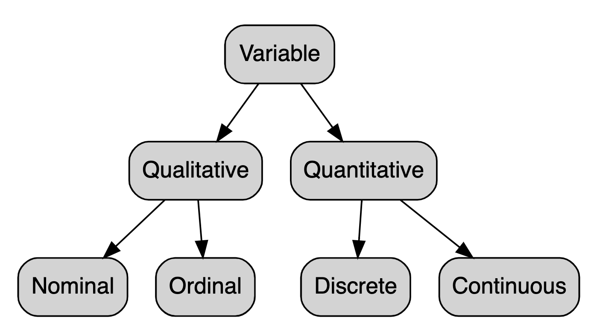

This report uses the [R programming language](https://cran.r-project.org/doc/FAQ/R-FAQ.html) [@R] and the following [R libraries](https://r-pkgs.org/intro.html) [@tidyverse;@knitr].

```{r, message=FALSE, warning=FALSE}
library(dplyr)
library(knitr)
```


# What is data?

<!-- If you are looking at the source code (good on you!), then here is how one does a comment in Rmd. It's the same format as an HTML comment, i.e., between ASCII looking arrows. -->

[Data](https://en.wikipedia.org/wiki/Data) is everywhere. Data are "facts and statistics collected together for reference or analysis". Data is singular and plural -- as per the [Dictionary.app](https://en.wikipedia.org/wiki/Dictionary_(software)):

>>> "In Latin, data is the plural of datum and, historically and in specialized scientific fields, it is also treated as a plural in English, taking a plural verb, as in the data were collected and classified. In modern nonscientific use, however, it is generally not treated as a plural. Instead, it is treated as a mass noun, similar to a word like information, which takes a singular verb. Sentences such as data was collected over a number of years are now widely accepted in standard English."

The noun "data" [comes from the 1640s](https://www.etymonline.com/word/data):

>>> "1640s, "a fact given or granted," classical plural of datum, from Latin datum "(thing) given," neuter past participle of dare "to give" (from PIE root *do- "to give"). In classical use originally "a fact given as the basis for calculation in mathematical problems." From 1897 as "numerical facts collected for future reference.""

It's more recent meaning with regard to computing is from the 1940s:

>>> "Meaning "transmittable and storable information by which computer operations are performed" is first recorded 1946. Data-processing is from 1954; data-base (also database) "structured collection of data in a computer" is by 1962; data-entry is by 1970."

Data versus information:

* https://www.diffen.com/difference/Data_vs_Information

which notes: 

>>> "Data are simply facts or figures —- bits of information, but not information itself. When data are processed, interpreted, organized, structured or presented so as to make them meaningful or useful, they are called information. Information provides context for data."

Furthermore:

>>> "Data is raw, unorganized facts that need to be processed. Data can be something simple and seemingly random and useless until it is organized."

And:

>>> "When data is processed, organized, structured or presented in a given context so as to make it useful, it is called information."

The [noun information](https://www.etymonline.com/word/information) is much older than data.

Let's look at some examples. Is it *data* or *information*?

1. a student's test score
2. average score of the class
3. 2000
4. 2000 Neuchatel
5. $2000 monthly income
6. Satellite image data
7. Meterological data
8. Weather forecasts
9. Average annual temperature in Neuchatel
10. Daily temperature in Neuchatel

Data is raw facts, typically without context, and includes numbers, images, words, text, etc. Information is data within a context, processed data, with value added to the data, e.g., it's organized, summarized, or analyzed. Data is based on observations or records. Information is based on the organization, summarization, or analysis of the data and tells us something about the data.


# Structured vs unstructured data

[Raw data](https://en.wikipedia.org/wiki/Raw_data) (aka primary data) are data collected from some source. Raw data has not yet been processed for use. Human brains are very good at prcessing raw data and making decisions. Consider crossing a street -- your brain processing the data around you, from your eyes and your ears, together with your working memory, to make an informed decision of whether crossing the street is safe or not.

Information is the end product of [data processing](https://en.wikipedia.org/wiki/Data_processing). Data processing may include:

* [Validation](https://en.wikipedia.org/wiki/Data_validation) -- Ensuring that supplied data is correct and relevant.
* [Sorting](https://en.wikipedia.org/wiki/Sorting) -- "arranging items in some sequence and/or in different sets."
* [Summarization](https://en.wikipedia.org/wiki/Summary_statistics) (statistical) or (automatic) -- reducing detailed data to its main points.
* [Aggregation](https://en.wikipedia.org/wiki/Aggregate_data) -- combining multiple pieces of data.
* [Analysis](https://en.wikipedia.org/wiki/Statistical_inference) -- the "collection, organization, analysis, interpretation and presentation of data."
* [Reporting](https://en.wikipedia.org/wiki/Business_reporting) -- list detail or summary data or computed information.
* [Classification](https://en.wikipedia.org/wiki/Data_classification_(business_intelligence)) -- separation of data into various categories.

We process raw data to turn it into useful information.

Raw data can come in structured or unstructured formats:

* https://www.ibm.com/cloud/blog/structured-vs-unstructured-data

Unstructured data does not have a predefined format and may be (very) diverse. It is considered qualitative and may be difficult to search, sort, analyze.

Structured data is data that are organized into a data format and are quantitative in nature, e.g., relational databases. 

Structured or unstructured?

1. text files
2. emails
3. audio files
4. videos
5. dates
6. numbers
7. credit card numbers
8. phone numbers

Structured or unstructured?

| Date |
|------|
|Jan 1, 2021|
|10/10/2010|
|22/11/2011|

Structured or unstructured?

| Date |
|------|
|1/1/2021|
|10/10/2010|
|22/11/2011|

For the uninitiated, the terminology in data science (and about data in general) may seem all over the place. Let's clarify a few standard terms that use the word data in the next few sections. 

**Most pertinent to this class is the discussion on tabular data below.**


# Data formats

The data we work with is mainly [digital data](https://en.wikipedia.org/wiki/Digital_data). If for example, we record audio data, e.g., someone's voice, then a continuous (analog) signal is converted from [analog to digital](https://en.wikipedia.org/wiki/Analog-to-digital_converter). In other words, the audio signal is digitized -- meaning that the disturbances of air waves created by an instrument or speaker is sampled and digitized and stored into an electronic (aka digital) format.

At the "lowest" level, digital data is [binary data](https://en.wikipedia.org/wiki/Binary_data). What is binary? Consider the joke:

[There are 10 types of people in this world, those who understand binary and those who don't.](https://www.urbandictionary.com/define.php?term=there%20are%2010%20types%20of%20people%20in%20this%20world%2C%20those%20who%20understand%20binary%20and%20those%20who%20dont)

Why do we need binary?

Binary encodes at the lowest level all electronic text, audio files, video files, etc. However, there is a difference between different file formats (see section below) and how those files are encoded.

In this course we will be focused on [plain text] encodings and file formants (unless for example you read data directly from a program like Excel). Because all electronic (aka digital) text is encoded at the "lowest" level in binary, there are ways of turning binary into plain text:

* https://en.wikipedia.org/wiki/Binary-to-text_encoding

In other words, an electronic text in binary can be encoded as [printable characters](https://en.wikipedia.org/wiki/Character_(computing)). What you see and read on the screen includes characters.

Which of these files are plain text and which are binary? How do you find out?

* https://drive.google.com/drive/folders/1bRg1MS0iBPvb7Rz3eMaezC_PsaKNoFjF?usp=sharing

Characters are encoded in various [character encodings](https://en.wikipedia.org/wiki/Character_encoding) -- that is, a character encoding encodes text in computers. Most common character encodings are based on [ASCII](https://en.wikipedia.org/wiki/ASCII). An ASCII table:

https://en.wikipedia.org/wiki/ASCII#ASCII_printable_characters

The point is that each character is encoded in binary and the computer knows how to interpret, for example `01100110` and display `f`. Here is a table that shows the mappings between binary and ASCII characters:

* http://sticksandstones.kstrom.com/appen.html

Nowadays, most of the world uses the [Unicode Standard](https://en.wikipedia.org/wiki/Unicode) for character encoding of text. The Unicode Standard builds on ASCII and aims to encode all writing systems of the world. More recently, its developers aim to make sure that "everyone in the world should be able to use their own language on phones and computers":

* https://home.unicode.org

This includes of course encoding characters for [emojis](https://en.wikipedia.org/wiki/Emoji)! (Both emoji and emojis are appropriate plural forms -- like data!) According to [Unicode](https://home.unicode.org/emoji/about-emoji/):

>>> "92% of the world’s online population use emoji in their communications – and Unicode defines the characters that make those human connections possible. These 3,600+ emoji represent faces, weather, vehicles and buildings, food and drink, animals, and more. From a technical perspective, inside the computer or phone, each is a sequence of one or more Unicode characters, but to the billions of users using emoji each day, they can express love, congratulations, ideas, culture, and much more."

The Unicode Consortium solicits proposals from the public (and from corporations) for adding new [scripts](https://en.wikipedia.org/wiki/Writing_system) and new emojis. Maybe you should make a formal request for an emoji that you would like to see?

Now if are like me, you're asking yourself how does one puts an emoji into R markdown? I'm guess I'm not alone:

* https://twitter.com/hadleywickham/status/856938704748896258?lang=en

And there's apparently an R package for that!

* https://github.com/hadley/emo

First you need to install the [devtools](https://devtools.r-lib.org) package (first line below) -- commented out so that it does not run *everytime* I compile this R Markdown file. The devtools package allows you to install [R packages](https://en.wikipedia.org/wiki/R_(programming_language)#Packages) from third parties, e.g., from someones GitHub repository. That's line two below (also commented out because you only need to install it once). The third line uses the command `emo::ji` and the parameter (or argument) within ()'s and the value you're passing as the parameter, i.e., "poop". This function then renders the [pile of poo emoji](https://en.wikipedia.org/wiki/Pile_of_Poo_emoji), aka "poomoji", "poop emoji", which in binary is: 11110000 10011111 10010010 10101001.

```{r}
# install.packages("devtools")  # line 1
# devtools::install_github("hadley/emo")  # line 2
emo::ji("poop")  # line 3
```

Here's a Unicode table website to easily search for characters and emojis:

* https://unicode-table.com/en/

Find the craziest Unicode symbol!


# Data types for computer programming

[Data types](https://en.wikipedia.org/wiki/Data_type) for computer programming typically refer to various *types* of data that can be interpreted by the computer's [compiler](https://en.wikipedia.org/wiki/Compiler). In programming languages, these include types such as:

* [Integers](https://en.wikipedia.org/wiki/Integer_(computer_science))
* [Floats (floating point numbers)](https://en.wikipedia.org/wiki/Floating-point_arithmetic)
* [Characters](https://en.wikipedia.org/wiki/Character_(computing)) -- ask me about these
* [Strings](https://en.wikipedia.org/wiki/String_(computer_science)) -- sequence of characters
* [Boolean](https://en.wikipedia.org/wiki/Boolean_data_type) -- two possible values (True vs False)
* [Enumerated types](https://en.wikipedia.org/wiki/Enumerated_type) -- categorical data, i.e., a set of values (e.g., factors in R)

In a [typed programming language](https://en.wikipedia.org/wiki/Type_system), the data type provides information for the compiler to check the [correctness of the computer program](https://en.wikipedia.org/wiki/Correctness_(computer_science)).

R has several data types underlying its data structures, e.g.:

* https://www.r-bloggers.com/2021/09/r-data-types/
* https://www.w3schools.com/r/r_data_types.asp
* https://statsandr.com/blog/data-types-in-r/

[Data types for computer programming](https://en.wikipedia.org/wiki/Data_type) have comparable types of [data types in statistics](https://en.wikipedia.org/wiki/Statistical_data_type) -- or how else would we use computer programs to do statistics? For example:

| Programming | Statistics |
|-------------|------------|
| [Integer](https://en.wikipedia.org/wiki/Integer_(computer_science)) | [Count data](https://en.wikipedia.org/wiki/Count_data) |
| [Boolean](https://en.wikipedia.org/wiki/Boolean_data_type) | [Binary data](https://en.wikipedia.org/wiki/Binary_data) |
| [Floating-point](https://en.wikipedia.org/wiki/Floating-point_arithmetic) | [Interval scale](https://en.wikipedia.org/wiki/Level_of_measurement#Interval_scale), [Ratio scale](https://en.wikipedia.org/wiki/Positive_real_numbers#Ratio_scale) |
| [Enumerated type](https://en.wikipedia.org/wiki/Enumerated_type) | [Categorical variable](https://en.wikipedia.org/wiki/Categorical_variable) |
| [List](https://en.wikipedia.org/wiki/List_(abstract_data_type)), [Array](https://en.wikipedia.org/wiki/Array_data_type) | [Random vector](https://en.wikipedia.org/wiki/Multivariate_random_variable) |

Why is important to keep this in mind? How you can programatically access, perform functions or statistics on these data types -- whether in programming code or in statistical methods -- depends on what **type** of data you are dealing with. For example:

* You cannot apply arithmetic to qualitative / categorical values
* Ordinal scales are equidistant, so you can rank them, but how much x from y are is unknown

One last distinction to make clear is between the term "variable" in computer programming and in statistical analysis. A [variable in computer programming](https://en.wikipedia.org/wiki/Variable_(computer_science)) is used to store information that can be referenced and manipulated by a computer program. One assigns a value to a variable, e.g. in R:

```{r}
my_name <- 'Steven'
my_name
```

Variables can be manipulated, e.g.:

```{r}
my_full_name <- paste0(my_name, ' Moran')
my_full_name
```

Another example:

```{r}
x <- 1
y <- 1
x + y
```


# Data types in statistics

In contrast to variables in computer programming, variables in statistics are *properties* or *characteristics* used to measure a population of individuals. A varaible is thus a quantity whose value can change across a population.

They include:

* qualitative variables -- measure non-numeric qualities and are not subject to the laws of arithmetic
* quantitative variables -- measure numeric quantities and arithmetic can be applied to them

Qualitative variables are also call categorical or discrete variables. Quantitative variables can be measured, so that their rank or score can tell you about the degree or amount of variable.

A hierarchy of variable types in statistics is given in the image below taken from this [Stats and R](https://statsandr.com/terms/) blog.



As you can see, statistics variables can be classified into four types under qualitative and quantitative variables:

* **Nominal** -- a qualitative variable where no ordering is possible (e.g., eye color) as implied by by its levels -- levels can be for example binary (e.g., do you smoke?) or multilevel (e.g., what is your degree -- where each degree is a level)
* **Ordinal** -- a qualitative variable in which an order is implied in the levels, e.g., if the side effects of a drug taken are measured as "light", "moderate", "severe", then this qualitative ordinal value has a clear order or ranking
* **Discrete** -- variables that can only take specific values (e.g., whole numbers) -- no values can exist between these numbers
* **Continuous** -- variables can take the full range of values (e.g., floating point number) -- there are an infinite number of potential values between values

What kind of of variables are each of these? (Note we set the `na` parameter of readr::read_csv` to `na=character()` so that the blank cells in the CSV file are not interpreted as [NA](https://en.wikipedia.org/wiki/N/A), i.e., "not applicable").

```{r, warning=FALSE, message=FALSE}
df <- readr::read_csv('variables_quiz.csv', na=character())
knitr::kable(df)
```

In statistics, we often talk about [scales of measurement or levels of measurement](https://en.wikipedia.org/wiki/Level_of_measurement). When using statistics, one must first understand what types of variables are in question and what scales should be measured using these variables. The level of measurement of a variable determines what statistical tests can be applied to it. How a variable is measured is its level of measurement.

The best-known classification scheme has four levels [@Stevens1946]. It was developed by a psychologist [Stanley Smith Stevens](https://en.wikipedia.org/wiki/Stanley_Smith_Stevens) and is commonly used in survey questionnaires, such as the [Likert scale](https://en.wikipedia.org/wiki/Likert_scale). Each scale above is an incremental level of measurement, such that each scale incorporates the function of the previous scale.

* **Nominal** -- the so-called naming scale, i.e., variables have categorical values with no specific order (thus it's not really a scale at all because it does not scale along any dimension!); instead the nominal scale is generally used for classification purposes, e.g., the numbers worn by athletes
* **Ordinal** -- the simplest true scale in which variables are encoded in a specific order, but the individual positions are equidistant, e.g., the rank of winners in a marathon
* **Interval** -- a scale of measurement in which the order of the variables and the distance between them is known, e.g., a scale for temperature (e.g., Celsius or Fahrenheit) in which a different of 10 degrees has the same meaning anywhere on the scale
* **Ratio** -- a scale of measurement that includes rank (ordinal), distancce between points on the scale (interval) and additionally information about the value of true zero, where zero means the complete absence of the property under measurement, e.g., how many [cervelat](https://en.wikipedia.org/wiki/Cervelat) can you eat per day?

Depending on what is being measured (i.e., what kind of variables) and how we measure it (i.e., with what methods and scales), the numbers or categories may have different properties. We will talk about this more in future lectures. But not that in general it is rare to find a true and unambiguous example of any particular kind of scale. Consider for example that Stevens' scale unifies qualtiative and quantitative beneath the "nominal" type. Stevens' typology has been widely criticized, e.g. @Michell1986.

Here is a cheat sheet that summarizes the levels of measurement. (Note also how we load a CSV file in R Markdown and display it in a tabular format with `knitr`).

```{r, warning=FALSE, message=FALSE}
df <- readr::read_csv('levels_of_measurement.csv')
knitr::kable(df)
```

And here is a table that compares the levels of measurment.

```{r, warning=FALSE, message=FALSE}
df <- readr::read_csv('comparison_of_levels.csv')
knitr::kable(df)
```

And yet another way of looking at the differences between scales [@Spatz2008]. <!-- page 11 -->

```{r, warning=FALSE, message=FALSE}
df <- readr::read_csv('Spatz2008_11.csv')
knitr::kable(df)
```


<!-- For example, student A has a test score of 90 out of a total possible 100 points. Student B has 91. Which student did better on the test? In contrast, nothing about their names ("A" and "B"), which are qualitative / categorical values, tells us about their test score ranking. Different values of a qualitative variable only tell you that the objects should be considered different entities (student A is different than student B). -->


# Data structures

[Data structures](https://en.wikipedia.org/wiki/Data_structure) are collections of data values that are organized so that operations can be peformed on them. They include the primative data types (some mentioned above) but also abstract data types, linear data structures, trees, hashes, graphs, and so on. 

* https://en.wikipedia.org/wiki/List_of_data_structures

Data structures are also typically programming language dependent, i.e., the developers of the language have made decisions which types of data structures to implement. R has several data structures:

* http://adv-r.had.co.nz/Data-structures.html

[Data transmforation](https://en.wikipedia.org/wiki/Data_transformation) is the process of converting one data format to another (whether unstructured or structured). This is discussed under data wrangling.


# File formants

[File formants](https://en.wikipedia.org/wiki/File_format) are standardized ways of encoding digitial data for storage as computer files. You know these mainly from their appearance, e.g., text document, image, audio or video file. But also from their [filename extensions](https://en.wikipedia.org/wiki/Filename_extension), i.e., the suffix (typically) after "." in the filename. For example, this file is a markdown file that ends in ".md" (or a R Markdown file ".Rmd" if you are looking at the source code).

Typical file names include suffixes such as:

* .txt -- [plain text file](https://en.wikipedia.org/wiki/Plain_text)
* .csv -- [CSV comma-separated values](https://en.wikipedia.org/wiki/Comma-separated_values)
* .doc -- [MS Word doc](https://en.wikipedia.org/wiki/Microsoft_Word)
* .html -- [HTML](https://en.wikipedia.org/wiki/HTML), i.e., the [markup language](https://en.wikipedia.org/wiki/Markup_language) for documents displayed in a web browser
* .exe -- [executable file](https://en.wikipedia.org/wiki/.exe) for [Windows](https://en.wikipedia.org/wiki/Microsoft_Windows)

There are lots more!

A note about textual data -- its native format is unstructured, but it can be structured into other formats, e.g., tabular format, for processing. Consider the following code snippet.

First, we generate some [Lorem Ipsum](https://www.lipsum.com) text and assign it to a variable called `text`.

```{r}
text <- "Lorem ipsum dolor sit amet, consectetur adipiscing elit. Praesent vitae nisi nibh. In dolor neque, ultricies a tincidunt et, rutrum in erat. Morbi venenatis massa at neque imperdiet, eu faucibus augue varius. Ut molestie risus in dolor porttitor pretium sit amet vel enim. Pellentesque posuere blandit velit eget ultrices. Sed tristique dui ipsum, id sodales dui egestas id. Proin a dolor placerat, accumsan quam nec, ullamcorper enim. Nunc commodo a quam sit amet molestie. Quisque nec elit et diam consequat aliquet nec sed leo. Mauris scelerisque sed lorem eu bibendum. Morbi id ex commodo, elementum elit at, varius dui. Maecenas facilisis velit ut malesuada lobortis. Vestibulum dictum dapibus velit ut pellentesque."
```

Now perhaps we want to have a table of [word types](https://en.wikipedia.org/wiki/Type–token_distinction) and counts of their occurrences (i.e., word tokens), so that we can know how many times they occur in the text.

First we can split the `text` character string into an [R `list` data type](http://www.r-tutor.com/r-introduction/list). On the second line we simply display the output from splitting the character string on white space.

```{r}
words <- strsplit(text, " ")
words
```

We can then "[coerce](https://en.wikipedia.org/wiki/Data_conversion)", i.e., convert, the list of words into an [R data frame](https://stat.ethz.ch/R-manual/R-devel/library/base/html/data.frame.html) with the following function (`as.data.frame`), to which we pass it `words` and tell it to name the column (there's only one) "words". We assign the results to a new data frame `words_df`. We can use the `head` function on `words_df` to display the first few rows.

```{r}
words_df <- as.data.frame(words, col.names = "words")
head(words_df)
```
Lastly, we want to summarize the number of times a word occurs.

```{r}
words_df %>% 
  group_by(words) %>% 
  summarize(word_count = n()) %>%
  arrange(desc(word_count))
```
We can save the results to another data frame or we can write them to disk as a table for later use, e.g., as a CSV file (more in next section). 

Are the results data or information? Was the text string that we started with data or information?


# Tabular data

In this course, we are mainly going to be dealing with data in [plain text](https://en.wikipedia.org/wiki/Plain_text) and structured data in rectangular format, also known as tabular data:

* https://en.wikipedia.org/wiki/Table_(information)
* https://papl.cs.brown.edu/2016/intro-tabular-data.html
* https://www.w3.org/TR/tabular-data-model/

Tabular data can be stored in many ways, e.g.:

* [CSV](https://en.wikipedia.org/wiki/Comma-separated_values)
* [Excel sheets](https://en.wikipedia.org/wiki/Microsoft_Excel)
* [Google sheets](https://en.wikipedia.org/wiki/Google_Sheets)
* [Numbers](https://en.wikipedia.org/wiki/Numbers_(spreadsheet))
* [SQLite](https://en.wikipedia.org/wiki/SQLite)
* [JSON](https://en.wikipedia.org/wiki/JSON)

Which of these formats above are stored in plain text?

Tabular (or table) data has several properties. It consists of [rows and columns](https://en.wikipedia.org/wiki/Row_and_column_vectors) in the linear algebra sense, and [rows](https://en.wikipedia.org/wiki/Row_(database)) and [columns](https://en.wikipedia.org/wiki/Column_(database)) in the relational database sense.

Columns in tabular data contain a set of data of a particular type and contain (typically) one value (data type -- see above) for each row in the table. Each row in the table contains an observation, in which each row represents a set of related data, i.e., every row has the same structure and each cell in each row should adhere to the column's specification (i.e., that data type of that column). For example if you run the `data()` command in R / RStudio, you will get a list of all of the pre-loaded datasets available in R.

For example, want to know about [Swiss Fertility and Socioeconomic Indicators (1888) Data](https://stat.ethz.ch/R-manual/R-devel/library/datasets/html/swiss.html), i.e., standardized fertility measure and socio-economic indicators for each of 47 French-speaking provinces of Switzerland at about 1888?

```{r}
data(swiss)
head(swiss)
```

What are the columns? What their data types? What are the rows?

```{r}
str(swiss)
```

When there is more than one table and they are are specified relations between the tables, then you have a [relational database](https://en.wikipedia.org/wiki/Relational_database). We will discuss these later.

Lastly, note that there is lots of non-rectangular (i.e., not tabular) data out there. Some examples include text, images, audio files, video files, [tree data structures](https://en.wikipedia.org/wiki/Tree_(data_structure)), and so on.

**We will focus in this course on tabular data -- that is, creating it, loading it, transforming it, and analyzing it.**

Tabular data typically contains numerical data or [categorical data](https://en.wikipedia.org/wiki/Categorical_variable) (recall data types discussed above). Numerical data is either:

* numerical (aka discrete) -- integer values, e.g., counts, indices
* continuous -- data that can take any value within in interval, e.g., temperature

[Categorical data](https://en.wikipedia.org/wiki/Categorical_variable) represents sets of values that represent possible categories. They are not subject to the laws of arithmetic (but note they can be counted, as are the words in the example above). Categorical data includes:

* binary -- dichotomous data, i.e., True vs False (often encoded 1 vs. 0)
* ordinal -- categorical data with explicit ordering, e.g., grades, ranks, 5-star reviews

The types of data in your table, i.e., the [statistical data types](https://en.wikipedia.org/wiki/Statistical_data_type) constrain or determine the types of statistics you can do with your data.


# Metadata

[Metadata](https://en.wikipedia.org/wiki/Metadata) is data about data, i.e., it provides information about the data. There are different metadata types, but most pertinent to this course are:

* **Descriptive metadata** -— the descriptive information about a resource. It is used for discovery and identification. It includes elements such as title, abstract, author, and keywords.

* **Structural metadata** -— metadata about containers of data and indicates how compound objects are put together, for example, how pages are ordered to form chapters. It describes the types, versions, relationships and other characteristics of digital materials.


# Data archiving

We won't talk much about data archiving, but it is important for research and reproducibility, e.g.:

* https://en.wikipedia.org/wiki/Research_data_archiving


# Open data

[Open data](https://en.wikipedia.org/wiki/Open_data) are data that are freely available and also the idea that data should be freely available. (Recall what we've discussed about data and software licenses.) The idea is similar to [open source code](https://en.wikipedia.org/wiki/Open_source), i.e., the idea that source code is made openly and freely aailable. Both open data and open source code are integral to [open data science](https://en.wikipedia.org/wiki/Open_science_data) and [reproducible science](https://en.wikipedia.org/wiki/Reproducibility).

There is a lot of open data out there, e.g.:

* https://opendata.swiss/en/
* https://zenodo.org


# Data practical

For this week's data practical, load three datasets into an R Markdown notebook and describe some of their variables in terms of the data types used in R and data types in terms of statistical data types. 

First, load one of [R's pre-loaded data](http://www.sthda.com/english/wiki/r-built-in-data-sets) (hint use the `data()` command in RStudio to have a look at what's available). There's a description of the data -- summarize it. What kind of R data types are there?

Second, load a dataset of an external source, e.g., from a CSV file or a spreadsheet. Recall, there's lots of open data out there! ONe very interesting website that I recently came across from my colleague [Alena Witzlack](https://en.linguistics.huji.ac.il/people/alena-witzlack-makarevich) is [The Pudding](https://pudding.cool), which publishes stories on data journalism -- and makes the data for those stories freely available.

Again, for the dataset (whether you download it and put it in your GitHub repository and read it there locally -- be sure to cite your source) even if you [read (load) it from your R Markdown data practical directly](https://stackoverflow.com/questions/6299220/access-a-url-and-read-data-with-r). Describe the data in terms of R data types (hint there's a fuction to do that) and also describe it in terms of statistical variables. What data type is each column? Is it qualitative or quantitative in nature? What type of variables are there? Categorical or numeric? Why kind of categorical or numeric variable?


# References
