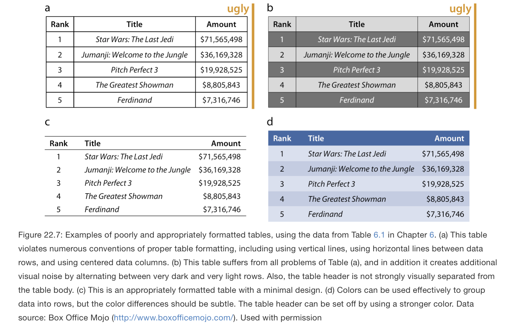

# Databases

# Joining tables

# Style

## In general

According to the [dictionary app](https://en.wikipedia.org/wiki/Dictionary_(software)) on my computer, style can be defined in various ways, including:

* "a manner of doing something"
* "a way of using language"
* "a way of behaving or approaching a situation that is characteristic of or favored by a particular person"
* "elegance and sophistication"

Most people recognize style when they see it. Whether it is someone's manner or behavior, the way they speak or write, how they dress, how they create art, etc.

When writing, scientific papers or other things, a [style guide (or manual of style)](https://en.wikipedia.org/wiki/Style_guide) is often provided so that different writers (say for example submitting to the same journal or magazine or news outlet) follow a set of standards for the writing, formatting, or design of the output being produced. They typically follow a so-called style-sheet. The idea is that an established standard makes it easier to create a consistent flow, which is intended to improve readability, and thus, communication. Consider for example, if within a scientific paper, every table presented had a completely different look. Consider the follow example of ugly papers from [this website]( https://clauswilke.com/dataviz/figure-titles-captions.html):

***



***

What do you like about it? What don't you like about it?

We will talk more about style in data visualizations in future lectures.


## Style in (R) code

Style is also an important factor when writing computer code. All major software companies have [programming style guides](https://en.wikipedia.org/wiki/Programming_style). Why? Because a style guide standard that software engineers follow for writing code creates a consistent code base that makes it easier to maintain in the long run and it also helps people new to programming, or people not so new to programming, in the developer learning curve, e.g.:

* https://medium.com/@arnabdhar430/why-you-should-keep-learning-as-a-software-engineer-ae69aab8c774

Major programming languages have official style guides. For example in [Python](https://en.wikipedia.org/wiki/Python_(programming_language)):

* https://www.python.org/dev/peps/pep-0008/

But corporations will often make their own tweaks to the style guide (or change parts completely) to fit their needs or desires, e.g., Google's Python style guide:

* https://google.github.io/styleguide/pyguide.html

Want to know more about Python versus R and what to learn and why? Read this:

* https://www.ibm.com/cloud/blog/python-vs-r

R doesn't seem to have its own official style guide, e.g.:

* https://www.google.com/search?client=safari&rls=en&q=r+style+guide&ie=UTF-8&oe=UTF-8

But there are numerous "R style guides". For example, when writing packages for [The Comprehensive R Archive Network (CRAN)](https://cran.r-project.org):

* https://cran.r-project.org/web/packages/AirSensor/vignettes/Developer_Style_Guide.html

Google also has an R style guide:

* https://google.github.io/styleguide/Rguide.html

If you are using [tidyverse](https://www.tidyverse.org), they have a style guide:

* https://style.tidyverse.org/

[Advanced R](http://adv-r.had.co.nz) also has a style guide:

* http://adv-r.had.co.nz/Style.html

[R-bloggers]() has a blog about style guides in R, which covers some of the basic different **between style guide standards**:

* https://www.r-bloggers.com/2019/01/🖊-r-coding-style-guide/

To summarize, every programming language, and most groups of programmers, will have different recommendations for how to do things like:

* declare you variables (e.g., should_it_be_with_underscores or shouldItBeCamelCase?)
* are your file names in upper or lower case? (e.g. analysis.R vs. Analysis.R?)
* depending on the language and its naming constratins are your variables, methods, etc., using punctiation? (e.g., my.fuction vs my_function vs myFunction vs MyFunction... and so on)
* where should you introduce (or should you introduce) [new lines](https://en.wikipedia.org/wiki/Newline) into your code, editor, etc.? 

The [TL;DR](https://en.wikipedia.org/wiki/Wikipedia:Too_long;_didn%27t_read)? Follow a style guide! It makes your code easier to read. Or as [Hadley Wickham](https://en.wikipedia.org/wiki/Hadley_Wickham) apparently said:

```
Good coding style is like using correct punctuation. You can manage without it, but it sure makes things easier to read. 
```

Which makes sense. If you want your data practicals to be easily understood and reproducible, and you want to be come a better and more consistent programmer (regardless of the programming language), follow a style guide!

So how do you do that in the easiest way possible? There's tools for that! For example, there's an R library called `styler`:

* https://www.tidyverse.org/blog/2017/12/styler-1.0.0/
* https://cran.r-project.org/web/packages/styler/vignettes/introducing_styler.html

That you can use directly in RStudio (or on the command line)! It is going to tell you why your code is ugly and does not follow the `tidyverse` style guide. In other words, it's a program that looks at your code and tells you where you aren't following the ("punctuation") rules!

Use it or some tool like it.

A final note. There are also tools for [debugging your code](https://en.wikipedia.org/wiki/Debugging). This comes in all kinds of sophistication. 

A linter, or to lint, is a code analysis tool that helps you find bugs in your code:

https://en.wikipedia.org/wiki/Lint_(software)

In short, make your coding life easier; use a linter! Here's one for R:

* https://cran.r-project.org/web/packages/lintr/readme/README.html


# Software tests


