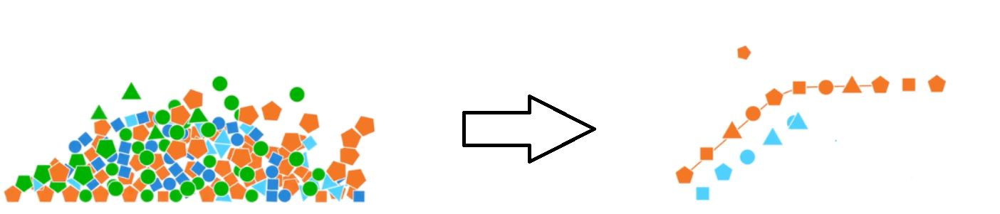
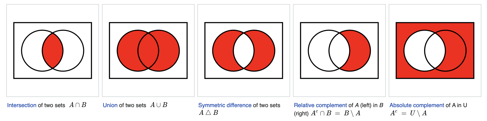
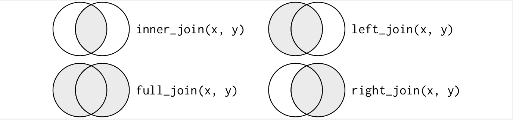
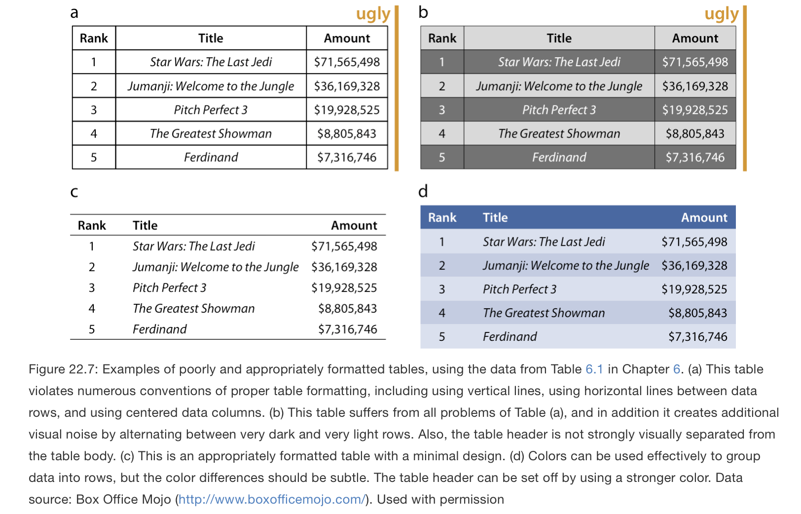

***

This report uses the [R programming language](https://cran.r-project.org/doc/FAQ/R-FAQ.html) [@R] and the following [R libraries](https://r-pkgs.org/intro.html) [@tidyverse;@knitr].

```{r, message=FALSE, warning=FALSE}
library(tidyverse)
library(knitr)
```


# Overview

[Data wrangling](https://en.wikipedia.org/wiki/Data_wrangling) is the process (or processes) of cleaning, structuring (aka transforming), and enriching data into a format that allows one to do things like visualization and analysis. Typically, [raw data](https://en.wikipedia.org/wiki/Raw_data) is converted into structured data. During this process, raw data often need to be cleaned, organized, and transformed into formats that are allow for analysis, i.e., converted into data formats or data structures that can be fed directly into functions for coding or statistical analysis.

Here's a [visualization of the process](https://en.wikipedia.org/wiki/Data_wrangling#/media/File:Data_Wrangling_From_Messy_To_Clean_Data_Management.jpg) of converting raw data to formatted (or structured) data:



The steps in data wrangling, broadly, include:

* **Discovery your data** -- look at and think about your data and maybe come up with some questions to ask
* **Structure your data** -- organize the data (necessarily if its in a raw format) and structure it for the functions or methods that will take it as input
* **Clean your data** -- in the process of dealing with data (especially raw data), you may need to clean it, e.g., get all the dates into the same format (Feb 1 vs 2/1 vs 1/2 etc.)
* **Enrich your data** -- do you need more data for your analysis? E.g., you have a list of languages but you need to know where they are spoken to plot them on a world map
* **Validate your data** -- basically making sure that your structured and cleaned data is actually structured and clean -- also commonly refereed to as [software testing](https://en.wikipedia.org/wiki/Software_testing)
* **Publish your data** -- and publish your analysis, findings, etc., for consumption, reproducibility, etc.


# Data wrangling in R

Here is a visualization of how the data science workflow works in the book [R for Data Science](https://r4ds.had.co.nz/index.html):

* https://r4ds.had.co.nz/introduction.html

That is you:

1. **Load**, aka "import", your data into R -- this entails that the data is already in a loadable format (e.g., text, CSV file, Excel spreadsheet, relational database)
2. **Tidy** the data -- in terms of the R [tidyverse](https://www.tidyverse.org), i.e., a set of R packages aimed to make data science easy (more on this below)
3. **Transform** your data -- select the data of interest, extend your data by adding other data source(s), summarize results
4. **Visualize** your data -- create plots to explore and interact with your data and to develop questions to answer
5. **Model** your data -- to answer questions and hypotheses
6. **Communicate** your results -- through scientific reports like we the ones we are developing in class

All of these step fall under the rubric of [computer programming](https://en.wikipedia.org/wiki/Computer_programming). You may not become expert computer programmers, or software engineers, but in this course will need to be able to do some basic coding in R. Keep in mind: you do not need to be an expert coder, or programmer, to do data science!

<!-- and to some extent -- if we are trying to follow [coding best practices](https://en.wikipedia.org/wiki/Coding_best_practices); see also [here](https://www.cs.utexas.edu/~mitra/csSummer2014/cs312/lectures/bestPractices.html) -- [software engineering](https://en.wikipedia.org/wiki/Software_engineering). -->


<!-- 
## Loading data

When working with data you first have to have some data. What about this data for example?

* https://digital.library.unt.edu/ark:/67531/metadc855661/
* https://digital.library.unt.edu/ark:/67531/metadc855661/m1/2/

How would you load it into R?

What kind of data type is it?

What kind of data structure?

The "tidying" and "transforming" of your data is commonly referred to as "data wrangling".

* https://r4ds.had.co.nz/introduction.html

when your data is tidy, each column is a variable, and each row is an observation. Tidy data is important because the consistent structure lets you focus your struggle on questions about the data, not fighting to get the data into the right form for different functions.
-->

## tidyverse

The [tidyverse](https://www.tidyverse.org/) is an opinionated collection of R packages designed for data science. All packages share an underlying design philosophy, grammar, and data structures. [Tidyverse](https://www.tidyverse.org) includes several R [packages](https://www.tidyverse.org/packages/) for data science. We may not use all of them in this class, but they currently include:

* [ggplot2](https://ggplot2.tidyverse.org): for creating graphics
* [dplyr](https://dplyr.tidyverse.org): for data manipulation
* [tidyr](https://tidyr.tidyverse.org): to make your data tidy
* [readr](https://readr.tidyverse.org): for reading / loading data
* [purr](https://purrr.tidyverse.org): enhancements for functional programming
* [tibble](https://tibble.tidyverse.org): update of the R [data frame](https://stat.ethz.ch/R-manual/R-devel/library/base/html/data.frame.html)
* [stringr](https://stringr.tidyverse.org): functions for working with strings
* [forcats](https://forcats.tidyverse.org): functions for dealing with [factors](https://stat.ethz.ch/R-manual/R-devel/library/base/html/factor.html) in R

To load the `tidyverse` package, which then includes all the libraries above, first install it and then load:

```{r message = FALSE, warning=FALSE}
# install.packages("tidyverse") # run this first if you need to install tidyverse
library(tidyverse)
```


## Loading data

There are numerous ways to load data into R. The `readr` is the `tidyverse` library that lets us read in plain text data in various formats:

| Function | Format | Filename typically ends with |
|----------|--------|---| 
| read_table | white space separated values | txt |
| read_csv | comma separated values|  csv |
| read_csv2 | semicolon separated values | csv |
| read_tsv | tab delimited separated values | tsv |
| read_delim | general text file format, must define delimiter | txt |

Below we will load some csv data and have a look at it.

As well as `readr`, the `tidyverse` package will install several packages for reading in other types of formats, such as Excel with `[readxl](https://readxl.tidyverse.org)`, e.g.:


| Function | Format | Filename typically ends with |
|----------|--------|---| 
| read_excel | auto detect the format | xls, xlsx|
| read_xls | original format |  xls |
| read_xlsx | new format | xlsx |

There are also load functions in "base" R. It contains similar functions to `tidyverse` functions, e.g., `read.csv`, `read.table`. They load data slightly differently and into different data types.

```{r}
df <- read_csv('datasets/athletes.csv')
class(df)
str(df)
```


```{r}
df <- read.csv('datasets/athletes.csv')
class(df)
str(df)
```

One reason that people choose a library like `readr::read_csv` over base R's `read.csv` is because the latter automatically converts strings to factors. If you use base R's `read.csv` and want to keep strings as factors, you have to additionally set the parameter `stringsAsFactors` to FALSE, i.e.:

```{r}
df <- read.csv('datasets/athletes.csv', stringsAsFactors = FALSE)
class(df)
str(df)
```


## dplyr

Once you've loaded a data set into a data frame (or [tibble](https://tibble.tidyverse.org)), you can begin to work with it.

`dplyr` was developed by [Hadley Wickham](https://en.wikipedia.org/wiki/Hadley_Wickham) (the author of `plyr`, `ggplot2, etc.`). He also co-wrote a great introduction on the topic, look at [R for Data Science](https://r4ds.had.co.nz/) [@WickhamGrolemund2016], specifically the section [dplyr basics](https://r4ds.had.co.nz/transform.html?q=dplyr#dplyr-basics). 

`dplyr` is super-fast on data frames. Essentially, one works with five basic "verbs" or functions:

* `select()`: for subsetting variables/columns
* `arrange()`: for re-ordering rows
* `mutate()`: for adding new columns
* `filter()`: for subsetting rows
* `summarize()` (or `summarise()` if you prefer [British spelling](https://en.wikipedia.org/wiki/American_and_British_English_spelling_differences)): for reducing each group to a smaller number of summary statistics

Let's try them out!

***

Let's use the data set `athletes.csv` for an example of working with some of `tidyverse` tools. 

The data set `athletes.csv` contains various details about the athletes who participated in the [2014 Winter Olympics in Sochi](https://en.wikipedia.org/wiki/2014_Winter_Olympics). Here we use the version of this data set converted by [Dana Silver](https://www.danasilver.org/sochi/). The data was originally retrieved in [JSON format](https://en.wikipedia.org/wiki/JSON) from Kimono Lab's Sochi API on February 18, 2014.

When we load tabular (or table) data, we will usually be using the R data frame. A data frame is a table in which columns contain values of one data type and each row contains a set of values of that data type. The data frame is the most common way of storing data in R. ([Under the hood](https://en.wiktionary.org/wiki/under_the_hood), data frames are a list of equal length vectors -- each element of the list can be thought of as a column and the length of each element of the list is its number of rows.) Data frames have the following characteristics:

* Column names should not be empty
* Row names should be unique
* Data stored in the data frame can be of type numeric, factor, of character
* Each column should contain the same number of items

If you are working within this repository on your local computer, you can load the data in this directory with this command:

```{r message = FALSE, warning=FALSE}
athletes <- read_csv("datasets/athletes.csv")
```

You can also give it the full path, depending on where the data is on your local computer.

Perhaps easiest, however, is to load it from the repository on the web directly. The `readr` package makes this easy by allowing you to wrap the `url` function into the `read_csv` function:

```{r message = FALSE, warning=FALSE}
athletes <- read_csv(url("https://raw.githubusercontent.com/bambooforest/IntroDataScience/main/4_data_wrangling/datasets/athletes.csv"))
```

Note that GitHub displays well-formatted CSV files as tabular data:

* https://github.com/bambooforest/IntroDataScience/blob/main/4_data_wrangling/data sets/athletes.csv

But if you want to load it from the web, you need to use the raw data (note the button on the GitHub page with the label "raw", which results in this URL:

* https://raw.githubusercontent.com/bambooforest/IntroDataScience/main/4_data_wrangling/data sets/athletes.csv

Now that you've loaded the `atheletes.csv` data, let's have a look at its structure with the `str()` function:

```{r}
str(athletes)
```

Recall our discussion about [data types for computer programming](https://github.com/bambooforest/IntroDataScience/tree/main/3_data#data-types-for-computer-programming) and [data types for statistics](https://github.com/bambooforest/IntroDataScience/tree/main/3_data#data-types-in-statistics).

**What kind of variables do we have in our data set?**

Some variables should be converted from [character](https://stat.ethz.ch/R-manual/R-devel/library/base/html/character.html) to [factor](https://stat.ethz.ch/R-manual/R-devel/library/base/html/factor.html). You probably will want to use `gender`, and `sport`. Convert these two variables one by one:

```{r}
athletes$gender <- as.factor(athletes$gender)
athletes$sport <- as.factor(athletes$sport)
```

Now note the change in data type:

```{r}
str(athletes)
```

Also, recall our discussion about [tabular data](https://github.com/bambooforest/IntroDataScience/tree/main/3_data#tabular-data).

What are the variables in `athletes`?

What are the objects of observation?

If any row is lacking information for a particular column, a missing value called `NA` will be inserted in that cell.

One useful function is `summary()`, which will summarize the contents of the data frame.

```{r}
summary(athletes)
```

Now some functions that we can select, filter, transform, extract, and summarize aspects of the data.


### `select()`

The data set contains the details on age, birth date, gender, height, name, weight, medal counts, sport, and country and a few more variables. Not all of these variables are of interest for a specific research question and often one wants to have a "narrower" version of a data set which contains only the variables of immediate interest. 

To prepare such a version of your data set, use the function `select()` to select the variables (columns) you need.

- First, you can select the variables of interest just by naming them. Note that this way you can also modify the order of the variables:

```{r}
select(athletes, name, height, weight)
```
- You can use `:` to select all columns in a range between two specified columns (inclusively):
 
```{r}
select(athletes, age:weight)
```

- You can exclude a variable with the help of `-`.

```{r}
select(athletes, -birthdate, -age)
```

Note that `dplyr` functions never modify their input data frames. If you want to save the result e.g., of the `select()`function, you need to use the assignment operator ` <-` and either overwrite the original data frame or create a new one. 

For instance, here the original data frame remains unchanged: 

```{r}
select(athletes, birthdate, age)
athletes
```

And here we create a new data frame with the selected columns only:

```{r}
athletes_age <- select(athletes, birthdate, age)
athletes_age
```

There are a number of **helper functions** you can use within `select()`. Try to guess what they do before executing the commands:

1. **`ends_with()`**

```{r}
select(athletes, ends_with("medals"))
```

2. **`contains()`**

```{r}
select(athletes, contains("eigh"))
```

3. For details on other helper functions, see `?select`.

```{r}
?select
```


### `arrange()`

`arrange()` changes the order of the rows. It takes a data frame and a set of column names to order by. If you list more than one column name, each additional column is used to break ties in the values of preceding columns.

1. Guess what the following code will do before executing it!

```{r, eval=FALSE}
arrange(athletes, height, age)
```

<!-- The data set is first order in an ascending order by `height`. In case two or more athletes have the same height, `age` is used to break ties (also in ascending order), e.g. several athletes have the height of 1.50 cm, they are then order from youngest to oldest. -->

2. Guess what the following code will do before executing it!

```{r, eval=FALSE}
arrange(athletes, desc(height), age)
```

<!-- The data set is first order in a descending order by `height`. In case two or more athletes have the same height, `age` is used to break ties (but now in ascending order), e.g. among the tallest athletes are the four athletes with the height of 2.00 cm, they are then order from youngest to oldest. -->

3. Use only the `arrange()` to display the oldest female athlete at the top of the sorted data set. How old is she?

```{r, eval=FALSE}
arrange(athletes, gender, desc(age))
```

<!-- Angelica Morrone is 48 years old. -->


### `mutate()`

Besides working with existing columns, it is sometimes necessary to add new columns that are functions of existing columns. That's what the `mutate()` function is for. 

`mutate()` always adds new columns at the end of your data set so we'll start by creating a narrower data set so we can see the new variables. (Remember that when you use in RStudio, an easy way to see all the columns is `View()`.)

First, create with `select()` a narrow data set `athletes_narrow` which only contains the variables `name`, `gender`, `age`, `sport`, `height`, and `weight`. (Here, we add a few more columns than we need now, because we plan to use `athletes_narrow` later).

```{r}
athletes_narrow <- select(athletes, name, gender, age, sport, height, weight)
athletes_narrow
```

Next, add the column BMI (body mass index). The BMI is calculated as the body mass (`weight`) divided by the square of the body `height`. It is universally expressed in units of kg/m^2^. 

```{r}
mutate(athletes_narrow, BMI = weight/height^2)
```

Notice that `mutate` does not overwrite the existing data frame.

```{r}
mutate(athletes_narrow, BMI = weight/height^2)
athletes_narrow
```

To add the new column to it permanently, you have to overwrite the original data frame:

```{r}
athletes_narrow <- mutate(athletes_narrow, BMI = weight/height^2)
athletes_narrow
```

There are many functions for creating new variables that you can use with `mutate()`. Think of a function and look up  [here](https://r4ds.had.co.nz/transform.html?q=dplyr#mutate-funs) [@WickhamGrolemund2016] for possible solutions. 


### `filter()`

Probably the most useful `dplyr` function is `filter()`. It allows you to subset observations based on their values. Or in other words, you can extract some rows from your data set on the basis of certain conditions. The first argument of this function is the name of the data frame. The second and subsequent arguments are the expressions that filter the data frame. 

For example, we can select all athletes who are taller than 2.00 m. Here we continue to work with `athletes_narrow`:

```{r}
filter(athletes_narrow, height > 2)
```

To use `filter()` effectively, you have to know how to select the observations that you want using the comparison operators in R. The standard comparison operators are  `>`, `>=`, `<`, `<=`, `!=` (not equal), and `==` (equal).

The operator `==` can be used with numeric variables to filter a specific values, e.g., all athletes who are 15 years old: 

```{r}
filter(athletes_narrow, age == 15)
```

When you’re starting out with R, the easiest mistake to make is to use = instead of == when testing for equality. When this happens you’ll get an informative error. Try it out:

```{r, eval=FALSE}
filter(athletes_narrow, age = 15)
```

Another important function when filtering is to identify and potentially filter out `NA` cells. These are missing or unknown values in the data set. R [provides a function](https://stat.ethz.ch/R-manual/R-devel/library/base/html/NA.html) called `is.na()` that tests whether a value is missing or not. `NA` is a special value in R.

```{r}
x <- NA # special value NA
y <- 1 # integer
z <- 'NA' # character (string)
is.na(x)
is.na(y)
is.na(z)
```

Let's filter the rows in `athletes` that do not have a height value, i.e., they are `NA` in the table.

```{r}
athletes %>% filter(is.na(height))
```

You can also filter to **remove** `NA`s, which is often useful for when you want to visualize the data. Use the logical operation `!` mentioned above, i.e., "not".

```{r}
athletes %>% filter(!is.na(height))
```

You can also combined the filters. For example, if you want all rows in `atheletes` that do not have `NA` values for `height` and `weight`. Notice how the number of rows decreases.

```{r}
athletes %>% filter(!is.na(height)) %>% filter(!is.na(weight))
```

If you want to check if there are any `NA`s in a column, you can also use the `any()` function.

```{r}
any(is.na(athletes$height))
any(is.na(athletes$age))
```


Another useful function is called `table()`. What does it do?

```{r}
table(athletes$sport)
```

Note you need to use the `exclude = FALSE` parameter, if you want the `table()` function to count `NA`s. How many athlete

```{r}
table(athletes$height)
table(athletes$height, exclude = FALSE)
```

***

**Try these out!**

Use the data frame `athletes_narrow`.

1. Filter all the athletes who are heavier than 110 kg.

2. Filter the athletes who weigh exactly 110 or more kg. How many athletes are these? To get the answer, use the function `nrow()` for **n**umber of **row**s' in addition to `filter()` (i.e. `nrows(filter(...))`). We recommend though looking first at the filter output to be sure that it worked the way you intended before applying `nrow()`.

3. Filter all the athletes who weigh between 105 and 110 kg. How many are they?


### `summarize()`

The dplyr function `summarize()` (or `summarise()`) summarizes multiple values in a single value.

Let's create a data frame as an [reproducible example](http://adv-r.had.co.nz/Reproducibility.html). What is a reproducible example:

* https://stackoverflow.com/questions/5963269/how-to-make-a-great-r-reproducible-example
* https://stackoverflow.com/help/minimal-reproducible-example
* http://adv-r.had.co.nz/Reproducibility.html
* https://xiangxing98.github.io/R_Learning/R_Reproducible.nb.html

```{r}
df <- data.frame(
    color = c('blue', 'black', 'blue', 'blue', 'black'),
    value = c(1, 2, 3, 4, 5)
)

df
```

So, let's sum up the value column with `summarize()`.

```{r}
summarize(df, total = sum(value))
```

We can do the same thing with the `athletes` data frame, for example, for gold medals.

```{r, eval = FALSE}
athletes %>% summarize(totals = sum(gold_medals))
```

An important function of `summarize()` is in coordination with the `group_by()` function. The dplyr `group_by` function take an existing data frame and performs an operation by group. For example, let's group our data frame `df` by the color column.

```{r}
df %>% group_by(color) %>% summarize(total = sum(value))
```

You can also save the results to a new data frame.

```{r}
by_color <- df %>% group_by(color) %>% summarize(total = sum(value))
by_color
```

We can also use `group_by` on the athletes data. For example, how many gold medals per country?

```{r}
athletes %>% group_by(country) %>% summarize(gold_medals = sum(gold_medals))
```

Maybe for viewing purposes it's better to arrange them by number of gold medals instead of alphabetically by country name.

```{r}
athletes %>% group_by(country) %>% summarize(gold_medals = sum(gold_medals)) %>% arrange(desc(gold_medals))
```
As we continue to [pipe](https://r4ds.had.co.nz/pipes.html) commands together, i.e., putting multiple operations (aka dplyr verbs) together -- we can use [white space](https://en.wikipedia.org/wiki/Whitespace_character) to style the code. More on style below.

```{r}
athletes %>% 
  group_by(country) %>% 
  summarize(gold_medals = sum(gold_medals)) %>% 
  arrange(desc(gold_medals))
```


# Databases

## Overview

The table (or flat file) model is simple to read and easy to manipulate. It consists of a two-dimensional array of data elements. The placement of data in rows and columns provides the data with structure, and thus, meaning.

<!-- 
* https://glottolog.org
* https://glottolog.org/glottolog/language
* https://cdstar.eva.mpg.de/bitstreams/EAEA0-F8BB-0AB6-96FA-0/languages_and_dialects_geo.csv
-->

A table's columns and rows specify relationships among the cells in the table, some of which are implicit. Spreadsheets are a way to interactively work with the data. Consider this data set:

```{r}
head(athletes)
```
What kind of data is in this cell?

```{r}
athletes[1,2]
```
Or these ones?

```{r}
athletes[,2]
```

Table data can be cut and spliced in various ways. But most data is specific to some purposes. The real power comes when data sets are combined in various new ways to ask new questions. Traditionally, such data models of multiple, yet associated tables, comes from business (cf. [history of IBM](https://en.wikipedia.org/wiki/IBM)).

***

[Relational databases](https://en.wikipedia.org/wiki/Relational_database) are structures for storing data whose purpose is to make entering, searching, analyzing, and updating data as easy and efficient as possible.

Fundamentally, a relational database is a set of tables, which themselves are made up of sets of rows and sets of columns. Relational databases provide two basic operations:

* Retrieving a set of columns and 
* Retrieving a set of rows

These two basic operations to retrieve columns and rows can also be combined. [Set operations](https://en.wikipedia.org/wiki/Set_operations_(SQL)) on tables can be performed on two or more tables, allowing users to perform operations like [intersection](https://en.wikipedia.org/wiki/Intersection), [cartesian product](https://en.wikipedia.org/wiki/Cartesian_product), adding or subtracting tables from each other, etc.

The real power of relational databases is when operations are made on sets of tables that are not the same, but that share at least one column.

[Here](https://www3.ntu.edu.sg/home/ehchua/programming/sql/Relational_Database_Design.html) is a tutorial on relational database design. Note the `Teachers` to `Classes` figure, where the two tables are "linked" or "related" to each other by the `teacherID` columns.

It is rare that data analysis involves only on table. Often you want to combine different tables on a shared value, so that you can answer questions you are interested in.


## Joining tables

When joining two or more tables, you always join two tables first. Then if you have a third, fourth, etc., table, you join them to the already joined table.

Let's install the [gapminder](https://cran.r-project.org/web/packages/gapminder/index.html) R library that contains an excerpt of data from [Gapminder.org](Gapminder.org). Read more about their mission [here](https://www.gapminder.org/about/).

And as usual, make sure to properly cite your sources! Here's an easy way to get the citation for the `gapminder` library [@Bryan2017] or more generally any R library with `citation()`.

```{r}
citation('gapminder')
```

First install the library, and if you already have, load it.

```{r}
# install.packages('gapminder') # install the gapminder R library
library(gapminder)
```

Let's have a look at the description of the data. This will appear in RStudio.

```{r}
?gapminder
```

How does the data look?

```{r}
head(gapminder)
```

How is it structured? How many rows does the table have? How many columns?

```{r}
str(gapminder)
```

Here's some more gapminder data, but this data set is about the [sex ratios](https://en.wikipedia.org/wiki/List_of_countries_by_sex_ratio) by country, i.e., the comparative number of males with respect to each female in a population.

We've accessed the data from this overview on how to [add and combine data sets](https://csiro-data-school.github.io/r/10-Data-Verbs---join/index.html). It has some great visualizations about [relational database joins](https://en.wikipedia.org/wiki/Join_(SQL)):

* https://tavareshugo.github.io/r-intro-tidyverse-gapminder/08-joins/index.html
* https://csiro-data-school.github.io/r/10-Data-Verbs---join/index.html

Let's load the [sex ratio data](https://csiro-data-school.github.io/r/data/gapminder_sex_ratios.csv) from Gapminder. There's a copy in this course's repository [in the datasets](https://github.com/bambooforest/IntroDataScience/blob/main/4_data_wrangling/datasets/gapminder_sex_ratios.csv) directory. Recall from above, you can load it locally or directly with the `url()` within the `read_csv()` function.

This time when we load the data in R Markdown, we do not add the `message = FALSE` parameter to the code chunk, i.e., `{r = message = FALSE}` (see the Rmd file for examples). This means that the Column specification is output to this markdown file below. What does it tell us about the columns?

```{r}
sex_ratios <- read_csv('datasets/gapminder_sex_ratios.csv')
```

So now we have two data sets from Gapminder.

```{r}
str(gapminder)
str(sex_ratios)
```

Which columns are shared between the two data sets? Notice again the [data types](https://github.com/bambooforest/IntroDataScience/tree/main/3_data#data-types-for-computer-programming).

So how do we combine the tables / data frames? Dplyr has several functions for **joining** tables. Often [Venn diagrams](https://en.wikipedia.org/wiki/Venn_diagram) are used to show the logical relationships described by different join functions. The following image is taken from [here](https://en.wikipedia.org/wiki/Venn_diagram).



They describe the operations from [set theory](https://en.wikipedia.org/wiki/Set_theory) including:

* [Intersection](https://en.wikipedia.org/wiki/Intersection_(set_theory))
* [Union](https://en.wikipedia.org/wiki/Union_(set_theory))
* [Symmetric difference](https://en.wikipedia.org/wiki/Symmetric_difference)
* [Relative complement](https://en.wikipedia.org/wiki/Complement_(set_theory)#Relative_complement)
* [Absolute complement](https://en.wikipedia.org/wiki/Complement_(set_theory)#Absolute_complement)

Important for us, will be the following types of joins as they are implemented in dplyr (for more information see the chapter on [Relational data](https://r4ds.had.co.nz/relational-data.html) in [R for Data Science](https://r4ds.had.co.nz/index.html), from which the following image was copied):



Before we return to the gapminder data, let's illustrate joins with some example data. First, let's create two small tables (data frames) -- one for a record of orders and one for customers that made orders.

```{r}
orders <- data.frame(
    OrderID = c(101, 102, 103),
    CustomerID = c(2, 37, 77),
    OrderData = c('01.01.2021', '01.02.2021', '02.02.2021')
)
orders
```

```{r}
customers <- data.frame(
    CustomerID = c(1, 2, 3),
    CustomerName = c('Lee Stan', 'Mary Grand', 'Ana Lake'),
    Country = c('USA', 'Australia', 'UK')
)
customers
```

Now we can use the joins to join the table in various ways. What does each do?

- Inner join

```{r}
inner_join(orders, customers)
```

- Full join

```{r}
full_join(orders, customers)
```

- Left join

```{r}
left_join(orders, customers)
```

- Right join

```{r}
right_join(orders, customers)
```

Note that `NA` (not applicable, missing data, etc.) is inserted when the data does not come from one table or the other.

Note also that the join functions will identify which shared columns exist and the join on those columns. Often it will be the case that you would like to join two tables that have different column names. You have two options:

* Change the column names to match
* Tell the join on which columns to match

Let's make another example. Different programming languages have different style for naming variables, column names, etc. These styles go by various names, such as: [camelCase](https://en.wikipedia.org/wiki/Camel_case) (e.g., iPhone), PascalCase, and [snake_case](https://en.wikipedia.org/wiki/Snake_case).

We will discuss below more about [code style](http://adv-r.had.co.nz/Style.html), but for example R style guides like [the one from Google](https://google.github.io/styleguide/Rguide.html) suggests using `BigCamelCase` (i.e., PascalCase) for naming functions. The [tidyverse style guide](http://adv-r.had.co.nz/Style.html) suggests using snake_case for function names and variables. So, as you can see, different developers different opinions. What is important for your work is that you choose a style and try to stick with it.

Let's update our customers example to snake_case and then show how to combine it to the orders table.

```{r}
customers <- data.frame(
    customer_id = c(1, 2, 3),
    customer_name = c('Lee Stan', 'Mary Grand', 'Ana Lake'),
    country = c('USA', 'Australia', 'UK')
)
customers
```

If you run this code, you will get an error. Try it. What does it tell you?

```{r, eval=FALSE}
inner_join(orders, customers)
```

Now let's specify a parameter in the join so we can map two columns together.

```{r}
inner_join(orders, customers, by=c('CustomerID'='customer_id'))
```

It works the same for all the joins.

```{r}
left_join(orders, customers, by=c('CustomerID'='customer_id'))
```

Now, back to the gapminder and sex ratio data. What's going on here?

```{r}
left_join(gapminder, sex_ratios)
```


# Code style `r emo::ji("poop")`

Let's talk about (code) style. According to the [dictionary app](https://en.wikipedia.org/wiki/Dictionary_(software)) on my computer, style can be defined in various ways, including:

* "a manner of doing something"
* "a way of using language"
* "a way of behaving or approaching a situation that is characteristic of or favored by a particular person"
* "elegance and sophistication"

Most people recognize style when they see it. Whether it is someone's manner or behavior, the way they speak or write, how they dress, how they create art, etc.

When writing, scientific papers or other things, a [style guide (or manual of style)](https://en.wikipedia.org/wiki/Style_guide) is often provided so that different writers (say for example submitting to the same journal or magazine or news outlet) follow a set of standards for the writing, formatting, or design of the output being produced. They typically follow a so-called style-sheet. The idea is that an established standard makes it easier to create a consistent flow, which is intended to improve readability, and thus, communication. Consider for example, if within a scientific paper, every table presented had a completely different look. Consider the follow example of ugly papers from [this website]( https://clauswilke.com/dataviz/figure-titles-captions.html):

***



***

What do you like about it? What don't you like about it?

We will talk more about style in data visualizations in future lectures.


## Code style in R

Style is also an important factor when writing computer code. All major software companies have [programming style guides](https://en.wikipedia.org/wiki/Programming_style). Why? Because a style guide standard that software engineers follow for writing code creates a consistent code base that makes it easier to maintain in the long run and it also helps people new to programming, or people not so new to programming, in the developer learning curve, e.g.:

* https://medium.com/@arnabdhar430/why-you-should-keep-learning-as-a-software-engineer-ae69aab8c774

Major programming languages have official style guides. For example in [Python](https://en.wikipedia.org/wiki/Python_(programming_language)):

* https://www.python.org/dev/peps/pep-0008/

But corporations will often make their own tweaks to the style guide (or change parts completely) to fit their needs or desires, e.g., Google's Python style guide:

* https://google.github.io/styleguide/pyguide.html

Want to know more about Python versus R and what to learn and why? Read this:

* https://www.ibm.com/cloud/blog/python-vs-r

R doesn't seem to have its own official style guide, e.g.:

* https://www.google.com/search?client=safari&rls=en&q=r+style+guide&ie=UTF-8&oe=UTF-8

But there are numerous "R style guides". For example, when writing packages for [The Comprehensive R Archive Network (CRAN)](https://cran.r-project.org):

* https://cran.r-project.org/web/packages/AirSensor/vignettes/Developer_Style_Guide.html

Google also has an R style guide:

* https://google.github.io/styleguide/Rguide.html

If you are using [tidyverse](https://www.tidyverse.org), they have a style guide:

* https://style.tidyverse.org/

[Advanced R](http://adv-r.had.co.nz) also has a style guide:

* http://adv-r.had.co.nz/Style.html

[R-bloggers]() has a blog about style guides in R, which covers some of the basic different **between style guide standards**:

* https://www.r-bloggers.com/2019/01/🖊-r-coding-style-guide/

To summarize, every programming language, and most groups of programmers, will have different recommendations for how to do things like:

* declare you variables (e.g., should_it_be_with_underscores or shouldItBeCamelCase?)
* are your file names in upper or lower case? (e.g. analysis.R vs. Analysis.R?)
* depending on the language and its naming constraints are your variables, methods, etc., using punctuation? (e.g., my.fiction vs my_function vs myFunction vs MyFunction... and so on)
* where should you introduce (or should you introduce) [new lines](https://en.wikipedia.org/wiki/Newline) into your code, editor, etc.? 

The [TL;DR](https://en.wikipedia.org/wiki/Wikipedia:Too_long;_didn%27t_read)? Follow a style guide! It makes your code easier to read. Or as [Hadley Wickham](https://en.wikipedia.org/wiki/Hadley_Wickham) apparently said:

>>> Good coding style is like using correct punctuation. You can manage without it, but it sure makes things easier to read. 

Which makes sense. If you want your data practicals to be easily understood and reproducible, and you want to be come a better and more consistent programmer (regardless of the programming language), follow a style guide!

## stylr and lintr

So how do you do that in the easiest way possible? There's tools for that! For example, there's an R library called `styler`:

* https://style.tidyverse.org
* https://www.tidyverse.org/blog/2017/12/styler-1.0.0/
* https://cran.r-project.org/web/packages/styler/vignettes/introducing_styler.html

That you can use directly in RStudio (or on the command line)! It is going to tell you why your code is ugly and does not follow the `tidyverse` style guide. In other words, it's a program that looks at your code and tells you where you aren't following the ("punctuation") rules!

Use it or some tool like it.

A final note. There are also tools for [debugging your code](https://en.wikipedia.org/wiki/Debugging). This comes in all kinds of sophistication. 

A linter, or to lint, is a code analysis tool that helps you find bugs in your code:

https://en.wikipedia.org/wiki/Lint_(software)

In short, make your coding life easier; use a linter! Here's one for R:

* https://style.tidyverse.org
* https://cran.r-project.org/web/packages/lintr/readme/README.html


## Tests

[Software testing](https://en.wikipedia.org/wiki/Software_testing) involves evaluating and verifying whether aspects of software validate and perform as expected. The idea is to verify that the code (or system) is working as expected, i.e., that the behavior of the software is performing as expected.

[Test driven development](https://en.wikipedia.org/wiki/Test-driven_development) is a framework for creating [test cases](https://en.wikipedia.org/wiki/Test_case) that verify compliance of specific code requirements.

In R, information about testing can be found here, e.g.:

* https://r-pkgs.org/tests.html
* https://testthat.r-lib.org
* https://towardsdatascience.com/unit-testing-in-r-68ab9cc8d211


# Data practical

For this week's data practical, we will load some data and wrangle it a bit. I encourage you to do the following tasks on a data set of your choice -- ideally something you can use for your own research or something that interests you! There are lots of data sets out there, e.g.:

* https://www.rdocumentation.org/packages/dslabs/versions/0.7.4
* https://pudding.cool

The learning objectives are to implement the following tasks on data sets, e.g., show that you can select, filter, and arrange data in various ways to turn it into more useful information for analysis.

If you prefer, you can use the suggested data sets below. Please complete the tasks within an R Markdown report and push the report to your GitHub repository:

* Load a data set of your choosing -- or use the `gapminder` data set from the dslabs R library as discussed in this report
* Filter the data by two variables -- e.g., countries of your choice -- and save the results to a new data frame
* Now select a subset of the columns (e.g., country, year, fertility) and save them to the data frame
* Display the first few rows of the data frame
* Display the law few rows of the data frame
* Display the structure of the data frame
* Display the data ordered (arranged) by columns, e.g., the country, highest-to-lowest fertility, then year
* Describe any patterns or lack of patterns that you see in the data (note: you can also rearrange the data in other ways if that helps, but look at it and write up in a sentence or two your findings)
* Summarize you results -- e.g., select the country and fertility rate and group by country and summarize the fertility rate -- and save the results to a new data frame
* Display the results arranged by a column of interest, e.g., lowest-to-highest fertility rates -- write something about what you observe
* Filter out the `NA`s in your data set and report how many rows are affected (i.e., removed)
* Load two data sets and join them, e.g., the dslabs library has two data sets:
    * [results_us_election_2016](https://www.rdocumentation.org/packages/dslabs/versions/0.7.4/topics/polls_us_election_2016)
    * [murders](https://www.rdocumentation.org/packages/dslabs/versions/0.7.4/topics/murders)
* Describe in words how you could explore the relationship between two variables in your combined data sets and what it can potentially tell us


# References
