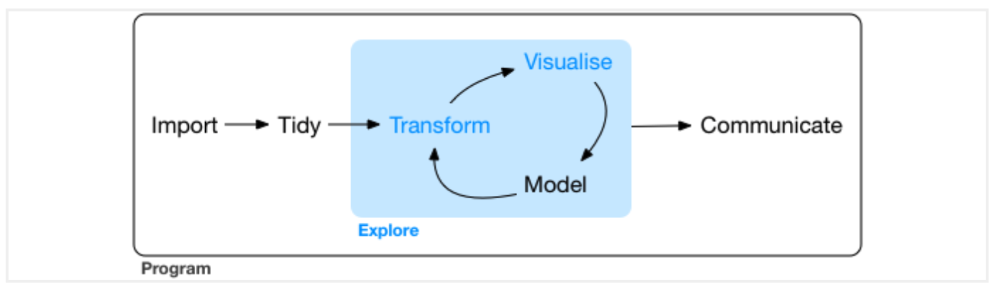
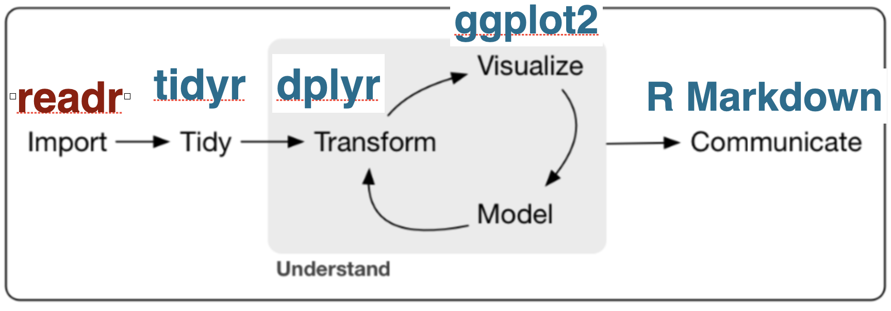
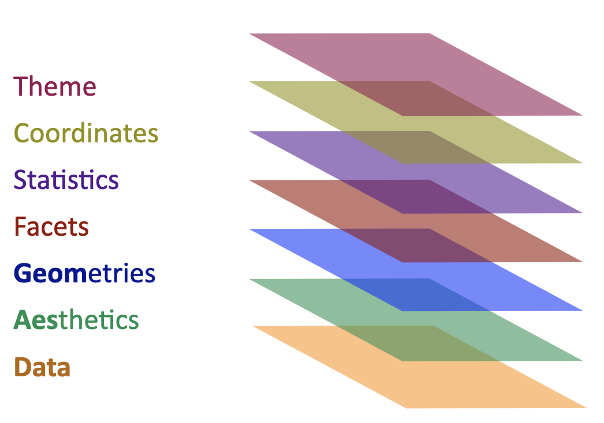
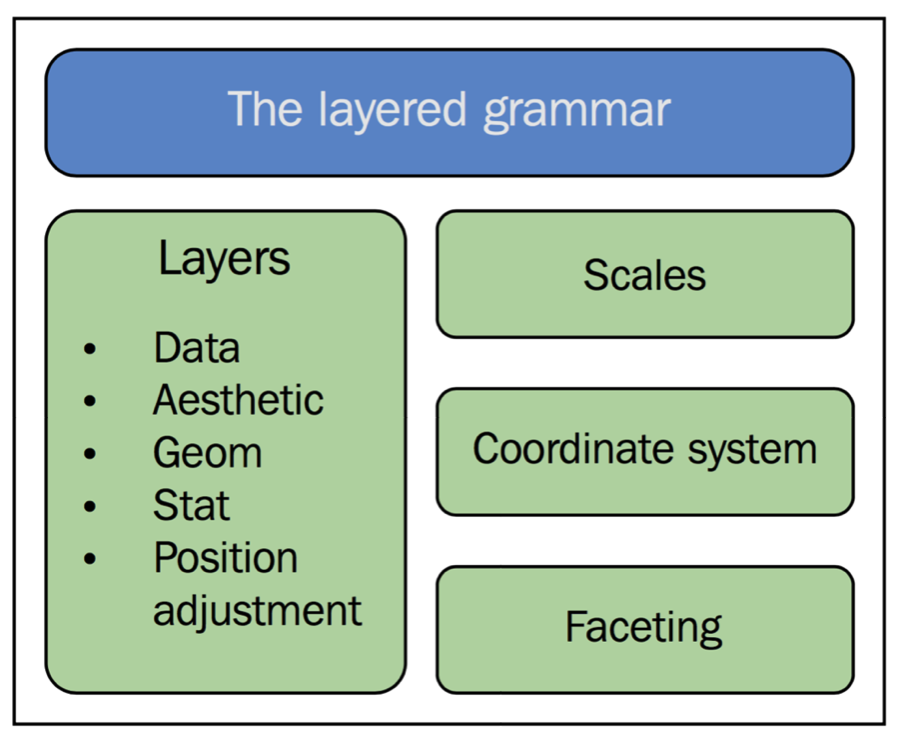
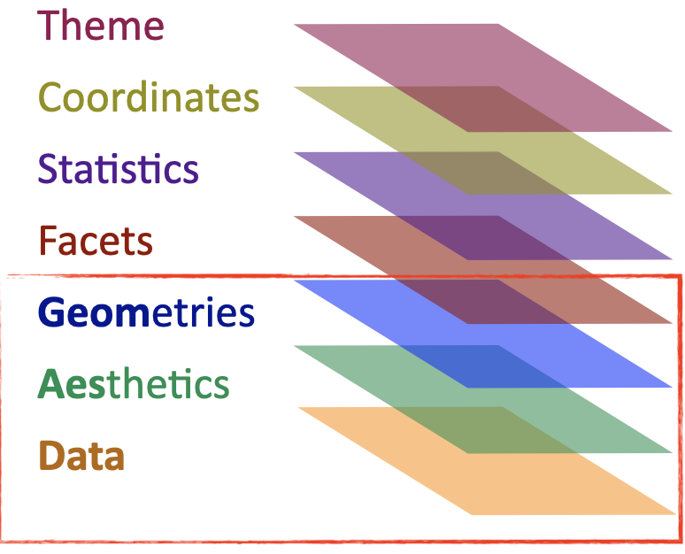

***

This report uses the [R programming language](https://cran.r-project.org/doc/FAQ/R-FAQ.html) [@R] and the following [R libraries](https://r-pkgs.org/intro.html) [@tidyverse;@knitr;@IrizarryGill2021].

```{r, message=FALSE, warning=FALSE}
library(tidyverse)
library(knitr)
library(dslabs)
```


# Recap and data wrangling continued

## Tabular data

Recall our discussion about [tabular data](https://github.com/bambooforest/IntroDataScience/tree/main/3_data#tabular-data) formats. In a table data format, every column represents a particular variable (e.g., a person's height, number of of vowels) and each row/record corresponds to a given member of the data set in question (e.g. a person, in a language). Tabular data are inherently rectangular and cannot have "ragged rows". If any row is lacking information for a particular column, a missing value (`NA`) is stored in that cell.

Tabular data come in various formats and go by various names, e.g.:

* Table
* Data set (if rectangular)
* Data frame (e.g., a data type in R)
* Data matrix
* CSV plain text file
* Spreadsheet

For most people working with small amounts of data, the data table is the fundamental unit of organization because it is both a way of organizing data that can be processed by humans and machines. In practice, to enter, organize, modify, analyze, and store data in tabular form -- it is common for people to use spreadsheet applications. You are probably familiar for example with Excel spreadsheets. 
Many statistical software packages use similar spreadsheets and many are able to import Excel spreadsheets. R is no different.

Importantly, the input to statistical graphics or plots is typically some type of data matrix (tabular data) as input. The key is to get the data into the correct format as input to the method that will visualize the data. [Data wrangling](../4_data_wrangling/README.md) include the steps to get the data that is needed for visualization purposes. You may, however, also have to reshape the tabular data into various formats, so that you can easily feed into the method.


## Wide vs long table formats

There are two basic presentations of tabular data:

* Wide
* Long (aka narrow)


### Wide

[Wide](https://en.wikipedia.org/wiki/Wide_and_narrow_data) tabular data is unstacked and it is presented so that each different data variable is in a separate column.

```{r}
df_wide <- data.frame(Person = c('Bob', 'Alice', 'Steve'),
                 Age = c(32, 24, 64),
                 Weight = c(168, 150, 144),
                 Height = c(180, 175, 165))
df_wide %>% kable()
```

<!-- if you want to do it by hand in .md insert this:

| Person | Age | Weight | Height |
|----------|--------|---| 
| Bob | 32 | 168 | 180 |
| Alice	| 24 | 150 | 175 |
| Steve | 64 | 144 | 165 |

-->


### Long

[Long](https://en.wikipedia.org/wiki/Wide_and_narrow_data) tabular data is stacked, so that one column contains all of the values and an additional column denotes the context of those values, e.g.:

```{r}
df_long <- data.frame(Person = c('Bob', 'Bob', 'Bob', 'Alice', 'Alice', 'Alice', 'Steve', 'Steve', 'Steve'),
                      Variable = c('Age', 'Weight', 'Height', 'Age', 'Weight', 'Height', 'Age', 'Weight', 'Height'),
                      Value = c(32, 168, 180, 24, 150, 175, 64, 144, 165))
df_long %>% kable()
```

Why do people use long format? For example, it looks more difficult to work with manually. One important reason is that it is a data model that encodes data in a space-efficient manner. For example, if you have a [sparse matrix](https://en.wikipedia.org/wiki/Sparse_matrix) in wide format, you may have lots of `NA` or `0` cells. In long format, you can simply leave those out (because you can infer them when translating from long to wide format). This long data format basically encodes what is called an [entity-attribute-value data model](https://en.wikipedia.org/wiki/Entity–attribute–value_model). Similar data models are used in all kinds of applications, such as [knowledge graphs](https://en.wikipedia.org/wiki/Knowledge_graph), in search engines, [graph databases](https://en.wikipedia.org/wiki/Graph_database), and so on.


## Tidy data

The `tidyverse` works on [tidy data](https://r4ds.had.co.nz/tidy-data.html), i.e., a consistent way to organize data in R. One of the goals of the `tidyverse` suite of tools is to make an interface between data input and data output -- that is, once you have data in the tidy data format, working with the tools in the tidyverse become much simpler. In other words, to play and have fun with the tools in tidyverse, you should first get your data into the tidy format.

As shown above, the same tabular data can be formatted in different ways. (The picture is actually more complex because data can be represented in many different ways in tables, e.g., [see here](https://r4ds.had.co.nz/tidy-data.html).)

To create tidy data, there are three rules you must follow [@WickhamGrolemund2016]:

1. Each variable must have its own column.
2. Each observation must have its own row.
3. Each value must have its own cell.

So, variables in columns, observations in rows, values in cells -- in one table! 

This boils down to: put your data in a table (or data frame or tibble in R) and put each variable in a column.

What are the advantages of this approach to organizing your data? Well, other than easy access to methods in the tidyverse, your data [@WickhamGrolemund2016]:

1. Is in a consistent format -- and it's easier to learn to work with one format before learning to deal with multiple formats

2. When variables are in columns, it is straightforward to vectorize the data -- most R functions work on vectorized data

Here's an example using the probability of death by age and sex table from the [dslabs](https://www.rdocumentation.org/packages/dslabs/versions/0.7.4/topics/death_prob) R library [@IrizarryGill2021].

```{r}
# install.packages('dslabs') # install the package if you haven't
library(dslabs)
head(death_prob) %>% kable()
str(death_prob)
```

Let's plot it to compare the probability of death on the y axis and age on the x axis. We plot by the factor `sex` (recall that [factors](https://r4ds.had.co.nz/factors.html) are R data objects for working with [categorical variables](https://en.wikipedia.org/wiki/Categorical_variable)).

```{r}
library(ggplot2) # you need this library (it's also in the tidyverse package) to use `ggplot()`
ggplot(death_prob, aes(age, prob)) + 
  geom_line(aes(group = sex), colour = "grey50") + 
  geom_point(aes(colour = sex))
```

***

What is being plotted?

What does the plot tell us about the data?

***

What about the wide and long tables mentioned above? Do you see how one or the other is easier as input to the `ggplot()` function?

```{r}
ggplot(df_wide, aes(Height, Weight)) + 
  geom_point(aes(colour = Person))
```

Which variables would you give with the long data format? Does this plot tell us anything interesting?

```{r}
ggplot(df_long, aes(Variable, Value)) + 
  geom_point(aes(colour = Person))
```

You may need to then filter your data.

```{r}
temp <- df_long %>% filter(Variable %in% c('Age', 'Weight')) 

ggplot(temp, aes(Person, Value)) + 
  geom_point(aes(colour = Variable)) +
  geom_line(aes(colour = Variable))
```

But again does this tell us anything interesting?

```{r}
ggplot(df_wide, aes(Age, Weight)) + 
  geom_point(aes(colour = Person)) +
  geom_line(aes(colour = Person))

```

Often it is easier to **reshape the data** than it is to figure out how to cram the variables into the visualization code.


## Reshaping data

Recall the [data wrangling process](https://github.com/bambooforest/IntroDataScience/tree/main/4_data_wrangling#data-wrangling-in-r). The first step is to [load the data](https://github.com/bambooforest/IntroDataScience/tree/main/4_data_wrangling#loading-data). A common next step is to reshape the data into a format that facilities analysis. This is because often the data that you have loaded is organized in ways that are practical to the data gatherers, e.g., it's in a format that makes data entry easy, or it's in a format that facilitates some type of analysis, but not perhaps the one that you want to do.

As a first step then, it is pertinent to figure out what the variables and observations are for your analysis. Often data will [@WickhamGrolemund2016]:

1. Contain a variable that is spread across multiple columns
2. Contain an observation spread across multiple rows

And sometimes you will encounter both issues in the same data set!

To resolve such issues, there are four very useful functions for tidying data:

* `gather()` -- makes wide data longer
* `spread()` -- males long data wider
* `separate()`-- splits a column into multiple columns
* `unite()` -- combines multiple columns into one column

The first two are probably the most important for reshaping your data. Like many developments in programming languages and programming libraries, the first two functions (and although they still work) have been recently renamed:

* `pivot_longer()` -- pivots data into a longer format
* `pivot_wider()` -- pivots data into a wider format

Let's look at each in turn.


### `gather()` / `pivot_longer()`

The `gather` function in the `tidyverse` library lets you convert wide data into tidy data. Let's consider an example from [this great course](https://datasciencelabs.github.io).

The annual fertility rates data from `dslabs` and `gapminder` for Germany and South Korea in wide format:

```{r, message=FALSE}
fertility_wide <- read_csv(url('https://raw.githubusercontent.com/rafalab/dslabs/master/inst/extdata/life-expectancy-and-fertility-two-countries-example.csv'))
fertility_wide %>% kable() # cool trick to make the table show up nicely!
```

What are the variables? What are the observations? How do we get the data into tidy format?

```{r}
fertility_tidy <- fertility_wide %>% 
  gather(year, fertility, -country, convert = TRUE)
```
Like above, we can transform the data from `wide` to `long` format by telling the function which columns we do *not* want.

```{r}
fertility_tidy <- fertility_wide %>% 
  pivot_longer(!country)
fertility_tidy %>% head() %>% kable() # going to use that cool trick again -- check out the kable package!
```

Note the default `name` and `value` column names. These can be changed in the parameter specification.

```{r}
fertility_tidy <- fertility_wide %>% 
  pivot_longer(!country, names_to = "year_variable", values_to = "fertility")
fertility_tidy %>% head() %>% kable()
```

**The data are still a bit not so user friendly. Why?**


### `separate()`

```{r}
fertility_tidy %>% separate(year_variable, into=c("year", "variable"), sep="_")
```

What happened? What did we lose?

```{r}
fertility_tidy <- fertility_tidy %>% 
  separate(year_variable, into=c("year", "variable"), sep="_", extra = "merge")
fertility_tidy %>% head() %>% kable() # one way to display nicely tables 
```


### `spread()` / `pivot_wider()`

To turn long data into wide data we can use the `spread` or `pivot_wider` functions. They are basically the inverse of `gather` and `pivot_longer`. 

```{r}
fertility_wide <- fertility_tidy %>% 
  spread(year, fertility)

fertility_wide %>% kable() # one way to display nicely tables 
```

And now with `pivot_wider`. You might use such a transformation to produce data that is easier to work with, e.g., you want to load it in a spreadsheet and make some corrections by hand, or perhaps you want to share the data with someone. Wide data is also sometimes useful as an intermediate format between your input and target output formats when trying to tidy up your data.

```{r}
fertility_tidy %>% 
  pivot_wider(names_from = year, values_from = fertility) %>%
  kable()
```

### `unite()`

The function `unite()` is the opposite of `separate()`. Its job is to  combine multiple columns into a single column. It's less often used than `separate()`, but nevertheless handy to know.

Want to go back to our original data frame?

```{r}
fertility_tidy %>% unite(name, year, variable)
fertility_tidy %>% head() %>% kable() # one way to display nicely tables 
```


# Visualizing data

## Workflow 

Visualizing data can be **very** time consuming for lots of reasons. First and foremost, it often requires that you first wrangle your data into a format that the visualization function(s) can work with as input.

The point of [tidy data](https://r4ds.had.co.nz/tidy-data.html) is to create a consistent way to organize your data so that it plays well with the various libraries in the tidyverse -- including but not limited to the visualization and analytics tools. 

For example, some tidy data as input to the `ggplot()` function, which is used to create various [plots](https://en.wikipedia.org/wiki/Plot_(graphics)). Tidy data:

```{r}
head(fertility_tidy)
```

And that data passed to a visualization function:
  
```{r}
fertility_tidy %>% 
  ggplot(aes(x=year, y=fertility, color = country)) +
  geom_point()
```

Recall that the code above "pipes", i.e., `%>%`, the `fertility_tidy` data frame (tabular data in R) into the `ggplot()` function. In the `ggplot()` function, we describe some "[aesthetics](https://ggplot2.tidyverse.org/articles/ggplot2-specs.html)" -- the function called `aes` in which we specify what we want plotted on the `x` and `y` axes. 

Then we tell the `ggplot` function that we want to create a [scatter plot](https://en.wikipedia.org/wiki/Scatter_plot) by piping the data and the `ggplot()` function call (which creates a [coordinate system](https://en.wikipedia.org/wiki/Coordinate_system) that you can add various layers to) the [`geom_point()`](https://ggplot2.tidyverse.org/reference/geom_point.html) function. Scatter plots are used to display the relationship between two variables. More on plot types below.

A nice illustration of the data exploration process (or pipeline) is given [here](https://r4ds.had.co.nz/explore-intro.html) and in the screen shot:



In the blue highlighted portion "Explore", you can seen a circle from "Transform" -> "Visualize" -> "Model" (then repeat).

This is the typical approach to exploring data, i.e., thinking about questions and formulating hypotheses, then developing models and testing your hypotheses. Then of course you might want to "Communicate" your results.

When communicating your results, there is another (often) time consuming aspect of creating data visualizations -- lots of tweaking to get your visualizations to look just right. 

**What is ugly about the plot above?**

This can be for various reasons. [Data visualization](https://en.wikipedia.org/wiki/Data_visualization) is an interdisciplinary field in itself and it is aimed at efficient (and beautiful) graphic representations of data. It has its roots in (descriptive) statistics, but is also increasingly a science and an art -- as noted by the increase in areas like [data journalism](https://en.wikipedia.org/wiki/Data_journalism).

Consider for example you have some data:

* What you are trying to visualize with your data? 
* What kind of (statistical) data types do you have?
* How are the data types usually visualized (including if more than one -- in relation to each other)?
* On which axes should they be plotted?

Or are you trying to visualize -- or model -- a [statistical distribution](https://en.wikipedia.org/wiki/Probability_distribution)? How many variables are there? What are your independent and dependent variables? Do you have any? Do you have a hypothesis?

A picture of the workflow with `tidyverse` libraries (`readr`, `tidyr`, etc.) is given below. For "model" it will depend on what type of statistical *model(s)* you are using -- there are numerous libraries for statistical modeling in R!



## Layered graphics

The R tidyverse visualization library `ggplot2` is based on the principles outlined in *The Grammar of Graphics*, a classic text on data visualizations, by Leland Wilkinson [@Leland1999][^1]. The layered *Grammar of Graphics* is where @Wickham2009 implements Wilkinson's principles, and typology, of graphic design into R.

Each layer/component of the *Grammar of Graphics* has a special name in `ggplot2`, visualized as:



A statistical graphic according to this layered grammar of graphics is a mapping from **data** to **aesthetic attributes** (e.g., color, shape, size) to geometric objects (e.g., points, lines, bars).

The basic idea is that you can build data visualizations from the same components:

* The data
* A [coordinate system](https://en.wikipedia.org/wiki/Coordinate_system)
* Geoms (functions that represent data points in the coordinate system)

Here is a cheat sheet:

* https://github.com/rstudio/cheatsheets/blob/main/data-visualization-2.1.pdf

***

Multiple layers from can be applied, such that a plot may contain, for example, statistical transformations of the data. These layers can be drawn on one or more coordinate systems. 

When on has multiple plots, it is [faceting](https://ggplot2.tidyverse.org/reference/facet_grid.html) (not to be confused with [faceting](https://en.wikipedia.org/wiki/Faceting) or [facet](https://en.wikipedia.org/wiki/Facet_(disambiguation))) that can be used to generate the same plot for different subsets of the data set and then combined into one graphic. More below.

In sum, it is the combination of these independent components that make up a graphic, including layers, scales, the coordinate system, and faceting, that one needs to familiarize themself with.



With ggplot2, you begin a plot with the function `ggplot()`. Then `ggplot()` creates a coordinate system that you can add layers to. 

The first argument of `ggplot()` is the dataset to use in the graph. So `ggplot(data = diamonds)` creates an empty graph.

However, a simple plot with `ggplot2()` needs:
  
* Data (a data frame or tibble!)
* Aesthetics (mapping to variables)
* Geometry (e.g., dots, lines, boxes)

These essential ingredients are illustrated below.



Let's look at some examples!


### Example: fertility data

[Tidy data](https://r4ds.had.co.nz/tidy-data.html) is a consistent way to organize your data so that it plays well with the visualization and analytical tools in the tidyverse. For example, as input to the `ggplot()` function.

Some tidy data:
  
```{r}
head(fertility_tidy)
```

And that data passed to a visualization function:
  
```{r}
fertility_tidy %>% 
  ggplot(aes(year, fertility, color = country)) +
  geom_point()
```

The command above "pipes" the `fertility_tidy` data frame into the `ggplot()` function. In the `ggplot()` function, we describe some "aesthetics" -- here in the function `aes` and then we tell the `ggplot` function that we want to create a [scatter plot](https://en.wikipedia.org/wiki/Scatter_plot) by using the [`geom_point()`](https://ggplot2.tidyverse.org/reference/geom_point.html) function. Scatter plots are used to display the relationship between two variables. More on this below.

Like most code, the code above can be written in various ways, but the output will be the same. For example, by passing the `fertility_tidy` data frame as the first argument of the function:
  
  ```{r}
ggplot(fertility_tidy, aes(year, fertility, color = country)) +
  geom_point()
```

Or by passing it explicitly with `data=x`:
  
  ```{r}
ggplot(aes(year, fertility, color = country), data=fertility_tidy) +
  geom_point()
```

Or by assigning the output to a new variable `p` (or whatever else you want to call it within the constraints of [variable names in R](https://stackoverflow.com/questions/9195718/variable-name-restrictions-in-r)).

```{r}
p <- ggplot(fertility_tidy, aes(year, fertility, color = country))
p + geom_point() + theme(axis.text.x = element_text(angle = 90)) # you can rotate text, but it's still not great visually
```

Given so many ways to do the same thing, it's best to find a way that you are comfortable with and **be consistent**.

This code will not work. Try it! Why?

```{r, eval=FALSE}
fertility_wide %>% 
  ggplot(aes(year, fertility, color = country)) +
    geom_point()

```


### Example: diamonds data

Let's look at the integrated in R dataset called `diamonds`. Recall how you can explore the `diamonds` data and find out its data types. (Because it's integrated you don't even need to load it with the `library()` function!)

```{r}
head(diamonds)
str(diamonds)
```

What variables are familiar to you? Which ones are not? 

How do you find out what they are? In R(Studio):

```{r}
?diamonds
```

What is a quick way to figure out the dimensions of the data frame?
  
```{r}
dim(diamonds)
```

Now, which kinds of [plots](https://en.wikipedia.org/wiki/Plot_(graphics)) can we produce given this data? The more important question, however, is what are you interesting in **seeing** in the data.

A plot is the outcome of a [statistical graphical technique](https://en.wikipedia.org/wiki/Statistical_graphics) for visualizing a data set. As such, we might ask what kind of research questions can be answered, e.g., on the basis of the `diamonds` data set?

The basic `ggplot2()` function has the following form that declares the data set, the aesthetics (here what variables and their values should be plotted the the x and y axes), and the the geometric elements, e.g., `geom_point()` produces a [scatter plot](https://en.wikipedia.org/wiki/Scatter_plot):
  
```{r}
ggplot(data=diamonds, aes(x = carat, y = price)) +
  geom_point()
```

The ordering of arguments within the function have default values, so you may often see shortened code (cf. [syntactic sugar](https://en.wikipedia.org/wiki/Syntactic_sugar))). Here for example is the minimal code to produce the same plot:

```{r}
ggplot(diamonds, aes(carat, price)) +
  geom_point()
```

Remember that order is (sometimes) important, e.g.:

```{r}
ggplot(diamonds, aes(price, carat)) +
  geom_point()
```

Fail! Why?

```{r, eval=FALSE}
ggplot(aes(carat, price), diamonds) +
  geom_point()
```

```{r, eval=FALSE}
geom_point() +
  ggplot(aes(carat, price), diamonds)
```


# Data practical

For this week's data practical, follow these steps (in which ever order works best for you and your data):

* Find a data set of interest -- if it is not tabular, make it tabular
* Load the data set and provide a description of its contents (what are the variables?) and data types
* Transform the data set into long format if it is in wide format
* Transform the data set into wide format if it is in long format
* Make sure your data is in [tidy format](https://r4ds.had.co.nz/tidy-data.html)
* Take a column in your data set and split the columns values into new columns with `separate()`
* Take data from two or more columns and `unite()`
* Create a plot using `ggplot()`


# References and footnotes

[^1]: Thus, the "gg".