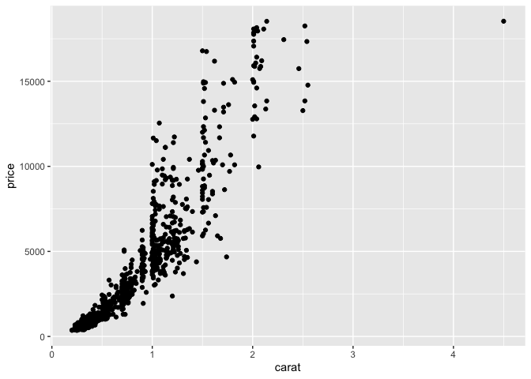
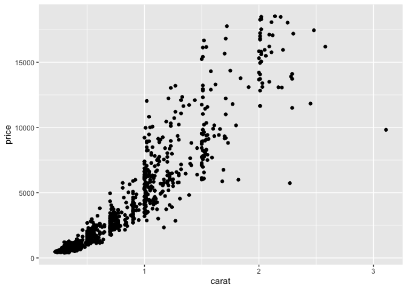
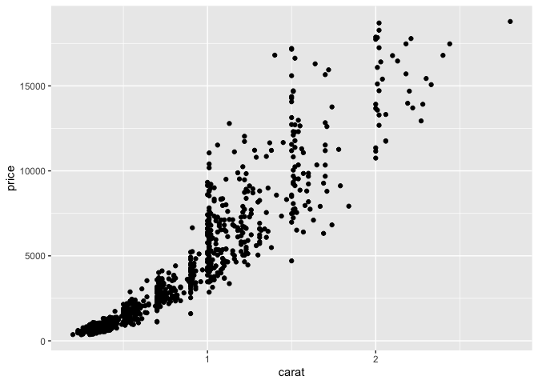

Data visualization
================
Steven Moran & Alena Witzlack-Makarevich

21 March, 2022

-   [Recap](#recap)
    -   [Tabular data](#tabular-data)
    -   [Wide vs long formats](#wide-vs-long-formats)
    -   [Tidy data](#tidy-data)
-   [Reshaping data](#reshaping-data)
    -   [`gather()` / `pivot_longer()`](#gather--pivot_longer)
    -   [`separate()`](#separate)
    -   [`spread()` / `pivot_wider()`](#spread--pivot_wider)
    -   [`unite()`](#unite)
-   [Visualizing data](#visualizing-data)
    -   [Overview](#overview)
        -   [A first example: diamonds](#a-first-example-diamonds)
        -   [Aesthetics](#aesthetics)
        -   [Combining geoms](#combining-geoms)
    -   [The basics of the grammar of
        graphics](#the-basics-of-the-grammar-of-graphics)
        -   [Overplotting: position
            adjustment](#overplotting-position-adjustment)
        -   [The basics of the grammar of
            graphics](#the-basics-of-the-grammar-of-graphics-1)
        -   [More plots](#more-plots)
        -   [Aesthetics](#aesthetics-1)
    -   [Geoms](#geoms)
        -   [Geometries](#geometries)
        -   [geom_boxplot](#geom_boxplot)
        -   [Geoms: geom_tile (heat maps)](#geoms-geom_tile-heat-maps)
        -   [Facetten / facets](#facetten--facets)
    -   [qplot](#qplot)
        -   [Faceting with qplot()](#faceting-with-qplot)
        -   [Faceting with qplot(): an
            example](#faceting-with-qplot-an-example)
        -   [Faceting with qplot(): exercise
            3](#faceting-with-qplot-exercise-3)
        -   [Histograms with qplot()](#histograms-with-qplot)
        -   [Density plots with qplot(): exercise
            4](#density-plots-with-qplot-exercise-4)
    -   [Plots with ggplot()](#plots-with-ggplot)
        -   [ggplot2 and The Grammar of
            Graphics](#ggplot2-and-the-grammar-of-graphics)
        -   [Components of the grammar of graphics in ggplot2 (Wickham
            (2009))](#components-of-the-grammar-of-graphics-in-ggplot2-wickham-2009)
        -   [Revision: qplot() and Tooth Growth (Teutonico
            (2015))](#revision-qplot-and-tooth-growth-teutonico-2015)
        -   [What precisely is a scatterplot? Mapping aesthetics to data
            (Teutonico
            (2015))](#what-precisely-is-a-scatterplot-mapping-aesthetics-to-data-teutonico-2015)
        -   [Creating a plot layer by layer with
            ggplot()](#creating-a-plot-layer-by-layer-with-ggplot)
        -   [How to separate code in multiple
            lines](#how-to-separate-code-in-multiple-lines)
        -   [Geometry (Teutonico (2015))](#geometry-teutonico-2015)
        -   [The aesthetic attributes and geom function (Teutonico
            (2015))](#the-aesthetic-attributes-and-geom-function-teutonico-2015)
        -   [Mandatory and optional arguments of geom
            functions](#mandatory-and-optional-arguments-of-geom-functions)
        -   [The aesthetic attributes and geom function: exercise
            1](#the-aesthetic-attributes-and-geom-function-exercise-1)
        -   [Aesthetic mappings vs. setting (Wickham
            (2009))](#aesthetic-mappings-vs-setting-wickham-2009)
        -   [The aesthetic attributes and geom function: exercise
            2](#the-aesthetic-attributes-and-geom-function-exercise-2)
-   [Data practical](#data-practical)
-   [References](#references)

------------------------------------------------------------------------

This report uses the [R programming
language](https://cran.r-project.org/doc/FAQ/R-FAQ.html) (R Core Team
2021) and the following [R libraries](https://r-pkgs.org/intro.html)
(Wickham et al. 2019; Xie 2021; Irizarry and Gill 2021).

``` r
library(tidyverse)
library(knitr)
library(dslabs)
```

# Recap

## Tabular data

Recall our discussion about [tabular
data](https://github.com/bambooforest/IntroDataScience/tree/main/3_data#tabular-data)
formats. In a table data format, every column represents a particular
variable (e.g., a person’s height, number of of vowels) and each
row/record corresponds to a given member of the data set in question
(e.g. a person, in a language). Tabular data are inherently rectangular
and cannot have “ragged rows.” If any row is lacking information for a
particular column, a missing value (`NA`) is stored in that cell.

Tabular data come in various formats and go by various names, e.g.:

-   Table
-   Data set (if rectangular)
-   Data frame (e.g., a data type in R)
-   Data matrix
-   CSV plain text file
-   Spreadsheet

For most people working with small amounts of data, the data table is
the fundamental unit of organization because it is both a way of
organizing data that can be processed by humans and machines. In
practice, to enter, organize, modify, analyze, and store data in tabular
form – it is common for people to use spreadsheet applications. You are
probably familiar for example with Excel spreadsheets. Many statistical
software packages use similar spreadsheets and many are able to import
Excel spreadsheets. R is no different.

Importantly, the input to statistical graphics or plots is typically
some type of data matrix (tabular data) as input. The key is to get the
data into the correct format as input to the method that will visualize
the data. [Data wrangling](../4_data_wrangling/README.md) include the
steps to get the data that is needed for visualization purposes. You
may, however, also have to reshape the tabular data into various
formats, so that you can easily feed into the method.

## Wide vs long formats

There are two basic presentations of tabular data:

-   Wide
-   Long (aka narrow)

[Wide](https://en.wikipedia.org/wiki/Wide_and_narrow_data) tabular data
is unstacked and it is presented so that each different data variable is
in a separate column.

| Person | Age | Weight |
|--------|-----|--------|
| Bob    | 32  | 168    |
| Alice  | 24  | 150    |
| Steve  | 64  | 144    |

[Long](https://en.wikipedia.org/wiki/Wide_and_narrow_data) tabular data
is stacked, so that one column contains all of the values and an
additional column denotes the context of those values, e.g.,:

| Person | Variable | Value |
|--------|----------|-------|
| Bob    | Age      | 32    |
| Bob    | Weight   | 168   |
| Bob    | Height   | 180   |
| Alice  | Age      | 24    |
| Alice  | Weight   | 150   |
| Alice  | Height   | 175   |
| Steve  | Age      | 64    |
| Steve  | Weight   | 144   |
| Steve  | Height   | 165   |

## Tidy data

The `tidyverse` works on [tidy
data](https://r4ds.had.co.nz/tidy-data.html), i.e., a consistent way to
organize data in R. One of the goals of the `tidyverse` suite of tools
is to make an interface between data input and data output – that is,
once you have data in the tidy data format, working with the tools in
the tidyverse become much simpler. In other words, to play and have fun
with the tools in tidyverse, you should first get your data into the
tidy format.

As shown above, the same tabular data can be formatted in different
ways. (The picture is actuall more complex because data can be
represented in many different ways in tables, e.g.,
[here](https://r4ds.had.co.nz/tidy-data.html).)

To create tidy data, there are three rules you must follow (Wickham and
Grolemund 2016):

1.  Each variable must have its own column.
2.  Each observation must have its own row.
3.  Each value must have its own cell.

So, variables in columns, observations in rows, values in cells – in one
table. This boils down to: put your data in a table (or data frame or
tibble in R) and put each variable in a column.

**Which table format above is tidy?**

What are the advantages of this approach to organizing your data? Well,
other than easy access to methods in the tidyverse, your data (Wickham
and Grolemund 2016):

1.  Is in a consistent format – and it’s easier to learn to work with
    one format before learning to deal with multiple

2.  When variables are in columns, it is straightforward to vectorize
    the data – most R functions work on vectorized data

Here’s an example using the probability of death by age and sex table
from the
[dslabs](https://www.rdocumentation.org/packages/dslabs/versions/0.7.4/topics/death_prob)
R library (Irizarry and Gill 2021).

``` r
# install.packages('dslabs') # install the package if you haven't
library(dslabs)
head(death_prob)
```

    ##   age  sex     prob
    ## 1   0 Male 0.006383
    ## 2   1 Male 0.000453
    ## 3   2 Male 0.000282
    ## 4   3 Male 0.000230
    ## 5   4 Male 0.000169
    ## 6   5 Male 0.000155

``` r
str(death_prob)
```

    ## 'data.frame':    240 obs. of  3 variables:
    ##  $ age : int  0 1 2 3 4 5 6 7 8 9 ...
    ##  $ sex : Factor w/ 2 levels "Female","Male": 2 2 2 2 2 2 2 2 2 2 ...
    ##  $ prob: num  0.006383 0.000453 0.000282 0.00023 0.000169 ...

Let’s plot it to compare the probability of death on the y axis and age
on the x axis. We plot by the factor `sex` (recall that
[factors](https://r4ds.had.co.nz/factors.html) are R data objects for
working with [categorical
variables](https://en.wikipedia.org/wiki/Categorical_variable)).

``` r
library(ggplot2)
ggplot(death_prob, aes(age, prob)) + 
  geom_line(aes(group = sex), colour = "grey50") + 
  geom_point(aes(colour = sex))
```

<!-- --> What is being
plotted?

What does the plot tell us about the data?

# Reshaping data

Recall the [data wrangling
process](https://github.com/bambooforest/IntroDataScience/tree/main/4_data_wrangling#data-wrangling-in-r).
The first step is to [load the
data](https://github.com/bambooforest/IntroDataScience/tree/main/4_data_wrangling#loading-data).
A common next step is to reshape the data into a format that facilities
analysis. This is because often the data that you have loaded is
organized in ways that are practical to the data gatherers, e.g., it’s
in a format that makes data entry easy, or it’s in a format that
facilitates some type of analysis, but not perhaps the one that you want
to do.

As a first step then, it is pertinent to figure out what the variables
and observations are for your analysis. Often data will (Wickham and
Grolemund 2016):

1.  Contain a variable that is spread across multiple columns
2.  Contain an observation spread across multiple rows

And sometimes you will encounter both issues in the same data set!

To resolve such issues, there are four very useful functions for tidying
data:

-   `gather()` – makes wide data longer
-   `spread()` – males long data wider
-   `separate()`– splits a column into multiple columns
-   `unite()` – combines multiple columns into one column

The first two are probably the most important for reshaping your data.
Like many developments in programming languages and programming
libraries, the first two functions (and although they still work) have
been recently renamed:

-   `pivot_longer()` – pivots data into a longer format
-   `pivot_wider()` – pivots data into a wider format

Let’s look at each in turn.

### `gather()` / `pivot_longer()`

The `gather` function in the `tidyverse` library lets you convert wide
data into tidy data. Let’s consider an example from [this great
course](https://datasciencelabs.github.io).

The annual fertility rates data from `dslabs` and `gapminder` for
Germany and South Korea in wide format:

``` r
fertility_wide <- read_csv(url('https://raw.githubusercontent.com/rafalab/dslabs/master/inst/extdata/life-expectancy-and-fertility-two-countries-example.csv'))
```

    ## 
    ## ── Column specification ────────────────────────────────────────────────────────
    ## cols(
    ##   .default = col_double(),
    ##   country = col_character()
    ## )
    ## ℹ Use `spec()` for the full column specifications.

``` r
fertility_wide %>% kable() # cool trick to make the table show up nicely!
```

| country     | 1960_fertility | 1960_life_expectancy | 1961_fertility | 1961_life_expectancy | 1962_fertility | 1962_life_expectancy | 1963_fertility | 1963_life_expectancy | 1964_fertility | 1964_life_expectancy | 1965_fertility | 1965_life_expectancy | 1966_fertility | 1966_life_expectancy | 1967_fertility | 1967_life_expectancy | 1968_fertility | 1968_life_expectancy | 1969_fertility | 1969_life_expectancy | 1970_fertility | 1970_life_expectancy | 1971_fertility | 1971_life_expectancy | 1972_fertility | 1972_life_expectancy | 1973_fertility | 1973_life_expectancy | 1974_fertility | 1974_life_expectancy | 1975_fertility | 1975_life_expectancy | 1976_fertility | 1976_life_expectancy | 1977_fertility | 1977_life_expectancy | 1978_fertility | 1978_life_expectancy | 1979_fertility | 1979_life_expectancy | 1980_fertility | 1980_life_expectancy | 1981_fertility | 1981_life_expectancy | 1982_fertility | 1982_life_expectancy | 1983_fertility | 1983_life_expectancy | 1984_fertility | 1984_life_expectancy | 1985_fertility | 1985_life_expectancy | 1986_fertility | 1986_life_expectancy | 1987_fertility | 1987_life_expectancy | 1988_fertility | 1988_life_expectancy | 1989_fertility | 1989_life_expectancy | 1990_fertility | 1990_life_expectancy | 1991_fertility | 1991_life_expectancy | 1992_fertility | 1992_life_expectancy | 1993_fertility | 1993_life_expectancy | 1994_fertility | 1994_life_expectancy | 1995_fertility | 1995_life_expectancy | 1996_fertility | 1996_life_expectancy | 1997_fertility | 1997_life_expectancy | 1998_fertility | 1998_life_expectancy | 1999_fertility | 1999_life_expectancy | 2000_fertility | 2000_life_expectancy | 2001_fertility | 2001_life_expectancy | 2002_fertility | 2002_life_expectancy | 2003_fertility | 2003_life_expectancy | 2004_fertility | 2004_life_expectancy | 2005_fertility | 2005_life_expectancy | 2006_fertility | 2006_life_expectancy | 2007_fertility | 2007_life_expectancy | 2008_fertility | 2008_life_expectancy | 2009_fertility | 2009_life_expectancy | 2010_fertility | 2010_life_expectancy | 2011_fertility | 2011_life_expectancy | 2012_fertility | 2012_life_expectancy | 2013_fertility | 2013_life_expectancy | 2014_fertility | 2014_life_expectancy | 2015_fertility | 2015_life_expectancy |
|:------------|---------------:|---------------------:|---------------:|---------------------:|---------------:|---------------------:|---------------:|---------------------:|---------------:|---------------------:|---------------:|---------------------:|---------------:|---------------------:|---------------:|---------------------:|---------------:|---------------------:|---------------:|---------------------:|---------------:|---------------------:|---------------:|---------------------:|---------------:|---------------------:|---------------:|---------------------:|---------------:|---------------------:|---------------:|---------------------:|---------------:|---------------------:|---------------:|---------------------:|---------------:|---------------------:|---------------:|---------------------:|---------------:|---------------------:|---------------:|---------------------:|---------------:|---------------------:|---------------:|---------------------:|---------------:|---------------------:|---------------:|---------------------:|---------------:|---------------------:|---------------:|---------------------:|---------------:|---------------------:|---------------:|---------------------:|---------------:|---------------------:|---------------:|---------------------:|---------------:|---------------------:|---------------:|---------------------:|---------------:|---------------------:|---------------:|---------------------:|---------------:|---------------------:|---------------:|---------------------:|---------------:|---------------------:|---------------:|---------------------:|---------------:|---------------------:|---------------:|---------------------:|---------------:|---------------------:|---------------:|---------------------:|---------------:|---------------------:|---------------:|---------------------:|---------------:|---------------------:|---------------:|---------------------:|---------------:|---------------------:|---------------:|---------------------:|---------------:|---------------------:|---------------:|---------------------:|---------------:|---------------------:|---------------:|---------------------:|---------------:|---------------------:|---------------:|---------------------:|
| Germany     |           2.41 |                69.26 |           2.44 |                69.85 |           2.47 |                70.01 |           2.49 |                70.10 |           2.49 |                70.66 |           2.48 |                70.65 |           2.44 |                70.77 |           2.37 |                70.99 |           2.28 |                70.64 |           2.17 |                70.48 |           2.04 |                70.72 |           1.92 |                70.94 |           1.80 |                71.16 |           1.70 |                71.41 |           1.62 |                71.71 |           1.56 |                71.56 |           1.53 |                72.02 |           1.50 |                72.63 |           1.49 |                72.60 |           1.48 |                72.96 |           1.47 |                73.14 |           1.47 |                73.37 |           1.46 |                73.69 |           1.46 |                73.97 |           1.46 |                74.44 |           1.45 |                74.55 |           1.44 |                74.75 |           1.43 |                75.15 |           1.41 |                75.33 |           1.38 |                75.51 |           1.36 |                 75.4 |           1.34 |                 75.6 |           1.32 |                 76.0 |           1.31 |                 76.1 |           1.31 |                 76.4 |           1.31 |                 76.6 |           1.32 |                 76.9 |           1.33 |                 77.3 |           1.34 |                 77.6 |           1.35 |                 77.8 |           1.35 |                 78.1 |           1.35 |                 78.4 |           1.35 |                 78.6 |           1.35 |                 78.8 |           1.35 |                 79.2 |           1.35 |                 79.4 |           1.36 |                 79.7 |           1.36 |                 79.9 |           1.37 |                 80.0 |           1.38 |                 80.1 |           1.39 |                 80.3 |           1.40 |                 80.5 |           1.41 |                 80.6 |           1.42 |                 80.7 |           1.43 |                 80.7 |           1.44 |                 80.8 |
| South Korea |           6.16 |                53.02 |           5.99 |                53.75 |           5.79 |                54.51 |           5.57 |                55.27 |           5.36 |                56.04 |           5.16 |                56.84 |           4.99 |                57.67 |           4.85 |                58.54 |           4.73 |                59.44 |           4.62 |                60.35 |           4.53 |                61.22 |           4.41 |                62.02 |           4.27 |                62.73 |           4.09 |                63.34 |           3.87 |                63.84 |           3.62 |                64.26 |           3.36 |                64.62 |           3.11 |                64.95 |           2.88 |                65.31 |           2.69 |                65.70 |           2.52 |                66.15 |           2.38 |                66.66 |           2.24 |                67.21 |           2.11 |                67.78 |           1.98 |                68.37 |           1.86 |                68.98 |           1.75 |                69.58 |           1.67 |                70.18 |           1.63 |                70.75 |           1.61 |                71.29 |           1.61 |                 71.8 |           1.63 |                 72.2 |           1.65 |                 72.7 |           1.66 |                 73.1 |           1.65 |                 73.6 |           1.63 |                 74.0 |           1.59 |                 74.5 |           1.54 |                 74.9 |           1.48 |                 75.4 |           1.41 |                 75.8 |           1.35 |                 76.3 |           1.30 |                 76.7 |           1.25 |                 77.1 |           1.22 |                 77.7 |           1.20 |                 78.2 |           1.20 |                 78.7 |           1.20 |                 79.1 |           1.21 |                 79.4 |           1.23 |                 79.8 |           1.25 |                 80.1 |           1.27 |                 80.4 |           1.29 |                 80.6 |           1.30 |                 80.7 |           1.32 |                 80.9 |           1.34 |                 80.9 |           1.36 |                 81.0 |

What are the variables? What are the observations? How do we get the
data into tidy format?

``` r
fertility_tidy <- fertility_wide %>% 
  gather(year, fertility, -country, convert = TRUE)
```

Like above, we can transform the data from `wide` to `long` format by
telling the function which columns we do *not* want.

``` r
fertility_tidy <- fertility_wide %>% 
  pivot_longer(!country)
fertility_tidy %>% head() %>% kable() # going to use that cool trick again -- check out the kable package!
```

| country | name                 | value |
|:--------|:---------------------|------:|
| Germany | 1960_fertility       |  2.41 |
| Germany | 1960_life_expectancy | 69.26 |
| Germany | 1961_fertility       |  2.44 |
| Germany | 1961_life_expectancy | 69.85 |
| Germany | 1962_fertility       |  2.47 |
| Germany | 1962_life_expectancy | 70.01 |

Note the default `name` and `value` column names. These can be changed
in the parameter specification.

``` r
fertility_tidy <- fertility_wide %>% 
  pivot_longer(!country, names_to = "year_variable", values_to = "fertility")
fertility_tidy %>% head() %>% kable()
```

| country | year_variable        | fertility |
|:--------|:---------------------|----------:|
| Germany | 1960_fertility       |      2.41 |
| Germany | 1960_life_expectancy |     69.26 |
| Germany | 1961_fertility       |      2.44 |
| Germany | 1961_life_expectancy |     69.85 |
| Germany | 1962_fertility       |      2.47 |
| Germany | 1962_life_expectancy |     70.01 |

**The data are still a bit not so user friendly. Why?**

### `separate()`

``` r
fertility_tidy %>% separate(year_variable, into=c("year", "variable"), sep="_")
```

    ## Warning: Expected 2 pieces. Additional pieces discarded in 112 rows [2, 4, 6, 8,
    ## 10, 12, 14, 16, 18, 20, 22, 24, 26, 28, 30, 32, 34, 36, 38, 40, ...].

    ## # A tibble: 224 x 4
    ##    country year  variable  fertility
    ##    <chr>   <chr> <chr>         <dbl>
    ##  1 Germany 1960  fertility      2.41
    ##  2 Germany 1960  life          69.3 
    ##  3 Germany 1961  fertility      2.44
    ##  4 Germany 1961  life          69.8 
    ##  5 Germany 1962  fertility      2.47
    ##  6 Germany 1962  life          70.0 
    ##  7 Germany 1963  fertility      2.49
    ##  8 Germany 1963  life          70.1 
    ##  9 Germany 1964  fertility      2.49
    ## 10 Germany 1964  life          70.7 
    ## # … with 214 more rows

What happened? What did we lose?

``` r
fertility_tidy <- fertility_tidy %>% 
  separate(year_variable, into=c("year", "variable"), sep="_", extra = "merge")
fertility_tidy
```

    ## # A tibble: 224 x 4
    ##    country year  variable        fertility
    ##    <chr>   <chr> <chr>               <dbl>
    ##  1 Germany 1960  fertility            2.41
    ##  2 Germany 1960  life_expectancy     69.3 
    ##  3 Germany 1961  fertility            2.44
    ##  4 Germany 1961  life_expectancy     69.8 
    ##  5 Germany 1962  fertility            2.47
    ##  6 Germany 1962  life_expectancy     70.0 
    ##  7 Germany 1963  fertility            2.49
    ##  8 Germany 1963  life_expectancy     70.1 
    ##  9 Germany 1964  fertility            2.49
    ## 10 Germany 1964  life_expectancy     70.7 
    ## # … with 214 more rows

### `spread()` / `pivot_wider()`

To turn long data into wide data we can use the `spread` or
`pivot_wider` functions. They are basically the inverse of `gather` and
`pivot_longer`.

``` r
fertility_wide <- fertility_tidy %>% spread(year, fertility)
fertility_wide %>% kable() # one way to display nicely tables 
```

| country     | variable        |  1960 |  1961 |  1962 |  1963 |  1964 |  1965 |  1966 |  1967 |  1968 |  1969 |  1970 |  1971 |  1972 |  1973 |  1974 |  1975 |  1976 |  1977 |  1978 |  1979 |  1980 |  1981 |  1982 |  1983 |  1984 |  1985 |  1986 |  1987 |  1988 |  1989 |  1990 |  1991 |  1992 |  1993 |  1994 |  1995 |  1996 |  1997 |  1998 |  1999 |  2000 |  2001 |  2002 |  2003 |  2004 |  2005 |  2006 |  2007 |  2008 |  2009 |  2010 |  2011 |  2012 |  2013 |  2014 |  2015 |
|:------------|:----------------|------:|------:|------:|------:|------:|------:|------:|------:|------:|------:|------:|------:|------:|------:|------:|------:|------:|------:|------:|------:|------:|------:|------:|------:|------:|------:|------:|------:|------:|------:|------:|------:|------:|------:|------:|------:|------:|------:|------:|------:|------:|------:|------:|------:|------:|------:|------:|------:|------:|------:|------:|------:|------:|------:|------:|------:|
| Germany     | fertility       |  2.41 |  2.44 |  2.47 |  2.49 |  2.49 |  2.48 |  2.44 |  2.37 |  2.28 |  2.17 |  2.04 |  1.92 |  1.80 |  1.70 |  1.62 |  1.56 |  1.53 |  1.50 |  1.49 |  1.48 |  1.47 |  1.47 |  1.46 |  1.46 |  1.46 |  1.45 |  1.44 |  1.43 |  1.41 |  1.38 |  1.36 |  1.34 |  1.32 |  1.31 |  1.31 |  1.31 |  1.32 |  1.33 |  1.34 |  1.35 |  1.35 |  1.35 |  1.35 |  1.35 |  1.35 |  1.35 |  1.36 |  1.36 |  1.37 |  1.38 |  1.39 |  1.40 |  1.41 |  1.42 |  1.43 |  1.44 |
| Germany     | life_expectancy | 69.26 | 69.85 | 70.01 | 70.10 | 70.66 | 70.65 | 70.77 | 70.99 | 70.64 | 70.48 | 70.72 | 70.94 | 71.16 | 71.41 | 71.71 | 71.56 | 72.02 | 72.63 | 72.60 | 72.96 | 73.14 | 73.37 | 73.69 | 73.97 | 74.44 | 74.55 | 74.75 | 75.15 | 75.33 | 75.51 | 75.40 | 75.60 | 76.00 | 76.10 | 76.40 | 76.60 | 76.90 | 77.30 | 77.60 | 77.80 | 78.10 | 78.40 | 78.60 | 78.80 | 79.20 | 79.40 | 79.70 | 79.90 | 80.00 | 80.10 | 80.30 | 80.50 | 80.60 | 80.70 | 80.70 | 80.80 |
| South Korea | fertility       |  6.16 |  5.99 |  5.79 |  5.57 |  5.36 |  5.16 |  4.99 |  4.85 |  4.73 |  4.62 |  4.53 |  4.41 |  4.27 |  4.09 |  3.87 |  3.62 |  3.36 |  3.11 |  2.88 |  2.69 |  2.52 |  2.38 |  2.24 |  2.11 |  1.98 |  1.86 |  1.75 |  1.67 |  1.63 |  1.61 |  1.61 |  1.63 |  1.65 |  1.66 |  1.65 |  1.63 |  1.59 |  1.54 |  1.48 |  1.41 |  1.35 |  1.30 |  1.25 |  1.22 |  1.20 |  1.20 |  1.20 |  1.21 |  1.23 |  1.25 |  1.27 |  1.29 |  1.30 |  1.32 |  1.34 |  1.36 |
| South Korea | life_expectancy | 53.02 | 53.75 | 54.51 | 55.27 | 56.04 | 56.84 | 57.67 | 58.54 | 59.44 | 60.35 | 61.22 | 62.02 | 62.73 | 63.34 | 63.84 | 64.26 | 64.62 | 64.95 | 65.31 | 65.70 | 66.15 | 66.66 | 67.21 | 67.78 | 68.37 | 68.98 | 69.58 | 70.18 | 70.75 | 71.29 | 71.80 | 72.20 | 72.70 | 73.10 | 73.60 | 74.00 | 74.50 | 74.90 | 75.40 | 75.80 | 76.30 | 76.70 | 77.10 | 77.70 | 78.20 | 78.70 | 79.10 | 79.40 | 79.80 | 80.10 | 80.40 | 80.60 | 80.70 | 80.90 | 80.90 | 81.00 |

And now with `pivot_wider`. You might use such a transformation to
produce data that is easier to work with, e.g., you want to load it in a
spreadsheet and make some corrections by hand, or perhaps you want to
share the data with someone. Wide data is also sometimes useful as an
intermediate format between your input and target output formats when
trying to tidy up your data.

``` r
fertility_tidy %>% pivot_wider(names_from = year, values_from = fertility)
```

    ## # A tibble: 4 x 58
    ##   country    variable    `1960` `1961` `1962` `1963` `1964` `1965` `1966` `1967`
    ##   <chr>      <chr>        <dbl>  <dbl>  <dbl>  <dbl>  <dbl>  <dbl>  <dbl>  <dbl>
    ## 1 Germany    fertility     2.41   2.44   2.47   2.49   2.49   2.48   2.44   2.37
    ## 2 Germany    life_expec…  69.3   69.8   70.0   70.1   70.7   70.6   70.8   71.0 
    ## 3 South Kor… fertility     6.16   5.99   5.79   5.57   5.36   5.16   4.99   4.85
    ## 4 South Kor… life_expec…  53.0   53.8   54.5   55.3   56.0   56.8   57.7   58.5 
    ## # … with 48 more variables: 1968 <dbl>, 1969 <dbl>, 1970 <dbl>, 1971 <dbl>,
    ## #   1972 <dbl>, 1973 <dbl>, 1974 <dbl>, 1975 <dbl>, 1976 <dbl>, 1977 <dbl>,
    ## #   1978 <dbl>, 1979 <dbl>, 1980 <dbl>, 1981 <dbl>, 1982 <dbl>, 1983 <dbl>,
    ## #   1984 <dbl>, 1985 <dbl>, 1986 <dbl>, 1987 <dbl>, 1988 <dbl>, 1989 <dbl>,
    ## #   1990 <dbl>, 1991 <dbl>, 1992 <dbl>, 1993 <dbl>, 1994 <dbl>, 1995 <dbl>,
    ## #   1996 <dbl>, 1997 <dbl>, 1998 <dbl>, 1999 <dbl>, 2000 <dbl>, 2001 <dbl>,
    ## #   2002 <dbl>, 2003 <dbl>, 2004 <dbl>, 2005 <dbl>, 2006 <dbl>, 2007 <dbl>,
    ## #   2008 <dbl>, 2009 <dbl>, 2010 <dbl>, 2011 <dbl>, 2012 <dbl>, 2013 <dbl>,
    ## #   2014 <dbl>, 2015 <dbl>

### `unite()`

The function `unite()` is the opposite of `separate()`. Its job is to
combine multiple columns into a single column. It’s less oftenly used
than `separate()`, but nevertheless handy to know.

Want to go back to our original data frame?

``` r
fertility_tidy %>% unite(name, year, variable)
```

    ## # A tibble: 224 x 3
    ##    country name                 fertility
    ##    <chr>   <chr>                    <dbl>
    ##  1 Germany 1960_fertility            2.41
    ##  2 Germany 1960_life_expectancy     69.3 
    ##  3 Germany 1961_fertility            2.44
    ##  4 Germany 1961_life_expectancy     69.8 
    ##  5 Germany 1962_fertility            2.47
    ##  6 Germany 1962_life_expectancy     70.0 
    ##  7 Germany 1963_fertility            2.49
    ##  8 Germany 1963_life_expectancy     70.1 
    ##  9 Germany 1964_fertility            2.49
    ## 10 Germany 1964_life_expectancy     70.7 
    ## # … with 214 more rows

# Visualizing data

## Overview

Tidy and long data is often used as an input format to visualization
functions. For example:

``` r
head(fertility_tidy)
```

    ## # A tibble: 6 x 4
    ##   country year  variable        fertility
    ##   <chr>   <chr> <chr>               <dbl>
    ## 1 Germany 1960  fertility            2.41
    ## 2 Germany 1960  life_expectancy     69.3 
    ## 3 Germany 1961  fertility            2.44
    ## 4 Germany 1961  life_expectancy     69.8 
    ## 5 Germany 1962  fertility            2.47
    ## 6 Germany 1962  life_expectancy     70.0

``` r
fertility_tidy %>% 
  ggplot(aes(year, fertility, color = country)) +
    geom_point()
```

<!-- -->

This on the other hand will not work. Try it! Why does it not work?

``` r
fertility_wide %>% ggplot(aes(year, fertility, color = country)) +
  geom_point()
```

Visualizing data can be (very) time consuming for various reasons. But
first and foremost it that it often requires that you first wrangle your
data into a format that the visualization functions can work with as
input.

A nice illustration of the data exploration process (or pipeline) is
given here:

-   <https://r4ds.had.co.nz/explore-intro.html>

In the blue highlighted portion “Explore,” you can seen a circle from
“Transform” -> “Visualize” -> “Model” (then repeat).

This is a typical approach to exploring data, thinking about hypotheses,
then developing models and testing your hypotheses. Then of course you
want to “Communicate” your results.

When communicating your results, there is another often time consuming
aspect of creating data visualzations – lots of tweaking to get your
visualizations to look nice. This can be for various reasons and there’s
lots of literature on data visualizations, best practices in data
visualization, etc. Think about, for example, what you are trying to
visualize with your data. What kind of (statistical) data types do you
have? On which axes should they be plotted? Do you have axes?

Or are you trying to visualize – or model – a [statistical
distribution](https://en.wikipedia.org/wiki/Probability_distribution)?
How many variables are there? What are your independent and dependent
variables? Do you have any? Do you have a hypothesis?

A perhaps clearer picture of the workflow with `tidyverse` libraries is
given below (for model it will depend on what type of *model(s)* you are
using – there are numerous libraries for statistical modeling in R!).


## Background `ggplot2`

The R visualization library `ggplot2` is based on the principles
outlined in *The Grammar of Graphics* by Leland Wilkinson (1999). (Thus
the “gg.”) The layered Grammar of Graphics by Wickham (2009) adjusts
Wilkinson’s principles to R

Each layer/component of the Grammar of Graphics has a special name in
`ggplot2`, visualized as:


<!-- ### First examples (1): diamonds -->

### A first example: diamonds

Let’s look at the integrated dataset `diamonds`. Recall how you can
explore the `diamonds` data structure.

``` r
head(diamonds)
```

    ## # A tibble: 6 x 10
    ##   carat cut       color clarity depth table price     x     y     z
    ##   <dbl> <ord>     <ord> <ord>   <dbl> <dbl> <int> <dbl> <dbl> <dbl>
    ## 1  0.23 Ideal     E     SI2      61.5    55   326  3.95  3.98  2.43
    ## 2  0.21 Premium   E     SI1      59.8    61   326  3.89  3.84  2.31
    ## 3  0.23 Good      E     VS1      56.9    65   327  4.05  4.07  2.31
    ## 4  0.29 Premium   I     VS2      62.4    58   334  4.2   4.23  2.63
    ## 5  0.31 Good      J     SI2      63.3    58   335  4.34  4.35  2.75
    ## 6  0.24 Very Good J     VVS2     62.8    57   336  3.94  3.96  2.48

``` r
str(diamonds)
```

    ## tibble [53,940 × 10] (S3: tbl_df/tbl/data.frame)
    ##  $ carat  : num [1:53940] 0.23 0.21 0.23 0.29 0.31 0.24 0.24 0.26 0.22 0.23 ...
    ##  $ cut    : Ord.factor w/ 5 levels "Fair"<"Good"<..: 5 4 2 4 2 3 3 3 1 3 ...
    ##  $ color  : Ord.factor w/ 7 levels "D"<"E"<"F"<"G"<..: 2 2 2 6 7 7 6 5 2 5 ...
    ##  $ clarity: Ord.factor w/ 8 levels "I1"<"SI2"<"SI1"<..: 2 3 5 4 2 6 7 3 4 5 ...
    ##  $ depth  : num [1:53940] 61.5 59.8 56.9 62.4 63.3 62.8 62.3 61.9 65.1 59.4 ...
    ##  $ table  : num [1:53940] 55 61 65 58 58 57 57 55 61 61 ...
    ##  $ price  : int [1:53940] 326 326 327 334 335 336 336 337 337 338 ...
    ##  $ x      : num [1:53940] 3.95 3.89 4.05 4.2 4.34 3.94 3.95 4.07 3.87 4 ...
    ##  $ y      : num [1:53940] 3.98 3.84 4.07 4.23 4.35 3.96 3.98 4.11 3.78 4.05 ...
    ##  $ z      : num [1:53940] 2.43 2.31 2.31 2.63 2.75 2.48 2.47 2.53 2.49 2.39 ...

What variables are unfamiliar to you?

``` r
?diamonds
```

Now, which kinds of
[plots](https://en.wikipedia.org/wiki/Plot_(graphics)) can we produce? A
plot is the outcome of a statistical graphical
technique\](<https://en.wikipedia.org/wiki/Statistical_graphics>) for
visualizing a data set.

Which kind of research questions can be answered on the basis of the
`diamonds` dataset?

First, let’s as how big is the dataset?

``` r
dim(diamonds)
```

    ## [1] 53940    10

The original dataset is large. Let make the processing easier for our
computer and work with a random sample of 1000 diamonds for quicker and
easier processing:

``` r
diamonds <- diamonds[sample(nrow(diamonds), 1000), ] # a random sample of 1000 objects
```

The basic `ggplot2` function has the following form:

``` r
ggplot(diamonds, aes(x = carat, y = price)) +
  geom_point()
```

<!-- -->

Can you guess what the function `ggplot()` does?

What about `geom_point()`?

``` r
ggplot(diamonds, aes(x = carat, y = price)) +
  geom_point()
```

<!-- -->

Note that the symbol `+` should always be at the end of each line if
there is something to follow it!

With ggplot2, you begin a plot with the function `ggplot()`. Then
`ggplot()` creates a coordinate system that you can add layers to.

The first argument of `ggplot()` is the dataset to use in the graph. So
`ggplot(data = diamonds)` creates an empty graph.

However, a simple plot with `ggplot2` needs:

-   Data (a data frame or tibble!)
-   Aesthetics (mapping to variables)
-   Geometry (e.g., dots, lines, boxes)

These essential ingredients are illustrated below.


Let’s look at them.

### Aesthetics

The word *aesthetic* comes from Greek *aisthētikos* \< *aisthēta*
‘perceptible things’ \< *aisthesthai* ‘perceive.’

In the `ggplot` sense this old usage is meant that *aesthetics* stand
for principles for **relating sensory attributes (color, shape, sound,
etc.) to abstractions**.

Which aesthetic attributes are used in the following plot? What
perceivable part of the plot do they correspond to?

``` r
ggplot(diamonds, aes(x = carat, y = price)) +
  geom_point()
```

<!-- -->

Note that `geom_()` is short for **geometric** object. It describes the
type of object that is used to display the data.

So what do you think a `geom_point()` object produces?

### Combining geoms

Add to your ggplot() function another geom()

``` r
ggplot(diamonds, aes(x = carat, y = price)) +
  geom_point() +
  geom_smooth(method = 'lm')
```

    ## `geom_smooth()` using formula 'y ~ x'

<!-- -->

-   It can be hard to view trends with just points alone.

-   Many times we wish to add a **smoothing** line (**smoother**) in
    order to see what the trends look like

-   This can be especially helpful when trying to understand regressions

-   aka local regression or moving regression

-   Most common methods, initially developed for scatterplot smoothing,
    are

    -   LOESS (locally estimated scatterplot smoothing) and
    -   LOWESS (locally weighted scatterplot smoothing), both pronounced
        /ˈloʊɛs/

Note that the `geom_smooth()` function adds confidence bands on the
smoother.

We can remove these by adding `se=FALSE` inside the `geom_smooth()`
function

-   standard error (se)

Combining geoms example

1.  Add to your ggplot() function another geom

``` r
ggplot(diamonds, aes(x = carat, y = price)) + geom_point() +
geom_smooth()
```

    ## `geom_smooth()` using method = 'gam' and formula 'y ~ s(x, bs = "cs")'

<!-- -->

It can be hard to view trends with just points alone. Many times we wish
to add a smoothing line (smoother) in order to see what the trends look
like. This can be especially helpful when trying to understand
regressions.

2.  Step 2: copy the first command and modify it: remove the dots and
    produce a plot with only the smoother of the dots

3.  Step 3: copy the first command and modify the representation of the
    dots:

``` r
ggplot(diamonds, aes(x = carat, y = price)) + geom_point(col = "red", alpha = 0.3)
```

<!-- -->

Can you guess what alpha = 0.3 does? Try out other alpha values.

alpha controls the transparency of the points: 1 = opaque, less than 1
semi-transparent

Some more examples

``` r
ggplot(diamonds, aes(x = carat, y = price)) + geom_point() +
geom_smooth()
```

    ## `geom_smooth()` using method = 'gam' and formula 'y ~ s(x, bs = "cs")'

<!-- -->

``` r
ggplot(diamonds, aes(x = carat, y = price)) + geom_point() +
geom_smooth(se = FALSE)
```

    ## `geom_smooth()` using method = 'gam' and formula 'y ~ s(x, bs = "cs")'

<!-- -->

``` r
# only the smoother
ggplot(diamonds, aes(x = carat, y = price)) +
  geom_smooth()
```

    ## `geom_smooth()` using method = 'gam' and formula 'y ~ s(x, bs = "cs")'

<!-- -->

``` r
# alpha-adjustment
ggplot(diamonds, aes(x = carat, y = price)) +
  geom_point(alpha = 0.3)
```

<!-- -->

## The basics of the grammar of graphics

-   If you plan to create multiple plots on the basis of the same
    variables, it’s convenient to first save the basic plot (with
    `aes()`)
-   Different geoms can be then added to this basic plot in further
    commands
-   And if desired you can even add further aesthetics later
-   E.g. in the function `geom_point()`

``` r
diamonds_plot <- ggplot(data = diamonds, aes(x = carat, y = price))
diamonds_plot + geom_point()
```

<!-- -->

``` r
diamonds_plot + geom_point(aes(col = clarity))
```

<!-- -->

``` r
diamonds_small <- diamonds %>% head(n=1000)
diamonds_plot <- ggplot(data = diamonds_small, aes(x = carat, y = price))
summary(diamonds_plot)
```

    ## data: carat, cut, color, clarity, depth, table, price, x, y, z
    ##   [1000x10]
    ## mapping:  x = ~carat, y = ~price
    ## faceting: <ggproto object: Class FacetNull, Facet, gg>
    ##     compute_layout: function
    ##     draw_back: function
    ##     draw_front: function
    ##     draw_labels: function
    ##     draw_panels: function
    ##     finish_data: function
    ##     init_scales: function
    ##     map_data: function
    ##     params: list
    ##     setup_data: function
    ##     setup_params: function
    ##     shrink: TRUE
    ##     train_scales: function
    ##     vars: function
    ##     super:  <ggproto object: Class FacetNull, Facet, gg>

``` r
diamonds_plot + geom_point(aes(col = clarity))
```

<!-- -->

It’s convenient to work with the previously save basic plot.

A complete dataset of over 50 000 diamonds:

``` r
dplot <- ggplot(diamonds, aes(x = carat, y = price))
dplot + geom_point()
```

<!-- -->

``` r
dplot + geom_point(size = 0.5)
```

<!-- -->

``` r
dplot + geom_point(size = 0.3, alpha = 1/10)
```

<!-- -->

``` r
dplot + geom_point(size = 0.5, alpha = 1/50)
```

<!-- -->

``` r
dplot + geom_point(size = 0.5, alpha = 1/50, shape = 1)
```

<!-- -->

### Overplotting: position adjustment

Another solution for the overplotting issue: position adjustment
slightly modifies the position of the plotted elements, specifically in
the case of discrete variables.

``` r
#  no need to specify the default!
ggplot(diamonds, aes(x = depth, y = carat, col = cut)) + geom_point(position = "identity")
```

<!-- -->

``` r
Adjustment <- c('identity', 'dodge', 'stack', 'fill', 'jitter', 'jitterdodge')
Description <- c('default, don’t adjust position', 'dodge overlaps to the side', 'stack overlapping objects on top of one another', 'stack overlapping objects and standardise to equal height', 'jitter points to avoid overplotting', 'or `geom_jitter()`')
df <- data.frame(Adjustment, Description)
```

``` r
knitr::kable(df)
```

| Adjustment  | Description                                               |
|:------------|:----------------------------------------------------------|
| identity    | default, don’t adjust position                            |
| dodge       | dodge overlaps to the side                                |
| stack       | stack overlapping objects on top of one another           |
| fill        | stack overlapping objects and standardise to equal height |
| jitter      | jitter points to avoid overplotting                       |
| jitterdodge | or `geom_jitter()`                                        |

### The basics of the grammar of graphics

``` r
diamonds_plot <- ggplot(data = diamonds_small,
                     aes(x = carat, y = price))
```

Before plotting the second command, can you guess what it will produce?

``` r
diamonds_plot + geom_point(alpha = 0.2) + geom_smooth(se = FALSE)
```

    ## `geom_smooth()` using method = 'gam' and formula 'y ~ s(x, bs = "cs")'

<!-- -->

``` r
diamonds_plot + geom_point(alpha = 0.2) + geom_smooth(aes(col = clarity), se = FALSE)
```

    ## `geom_smooth()` using method = 'loess' and formula 'y ~ x'

<!-- -->

``` r
diamonds_plot + geom_point(aes(col = clarity), alpha = 0.2) + geom_smooth(se = FALSE)
```

    ## `geom_smooth()` using method = 'gam' and formula 'y ~ s(x, bs = "cs")'

<!-- -->

Note: the new `aes` introduced in `geom_smooth()` applies only to the
smoother and produces multiple local regression lines (one for each type
of clarity).

### More plots

-   Produce a similar plot by combining the familiar geoms and
    aesthetics
-   Can the overplotting problem be improved further?

``` r
ggplot(diamonds, aes(x = depth, y = table)) +
        geom_point(alpha = 0.2, size = 0.5, col = "red") +
        geom_smooth(col = "red")
```

    ## `geom_smooth()` using method = 'gam' and formula 'y ~ s(x, bs = "cs")'

<!-- -->

``` r
ggplot(diamonds, aes(x = depth, y = table)) + geom_jitter(alpha = 0.2, size = 0.5, col = "red") + geom_smooth(col = "blue")
```

    ## `geom_smooth()` using method = 'gam' and formula 'y ~ s(x, bs = "cs")'

<!-- -->

### Aesthetics

What aesthetic attributes of a plot can we perceive?

TODO: insert image on page 48

``` r
ggplot(diamonds, aes(x = depth, y = table)) + geom_point(alpha = 0.2, col = "dodgerblue") +
geom_smooth(col = "red2")
```

-   depth is mapped to the horizontal position (x axis),
    -   table is mapped to the vertical position (y axis)
-   The size, color and transparency of the dots are not mapped to any
    variable
-   The have constant values set by the user

Setting

-   Mapping is done within the function `aes()`
-   Setting of constant values: within the respective geom() functions

``` r
ggplot(diamonds, aes(x = depth, y = table, col = cut, alpha = price)) + geom_points() +
geom_smooth(col = "red2")
```

Common aesthetic attributes:

-   x, y

-   size

-   fill

-   label

-   line type

-   shape

-   color (color of a dot or a border)

-   alpha

-   Different aesthetics are available for different types of data

    -   color and form: good for nominal/categorical variables
    -   size: good for continuous variables

## Geoms

todo: add image from page 52

### Geometries

Based on Teutonico (2015) (todo)

-   Geoms determine the type of the plot
-   Similar function `geom_x`
-   E.g. One can combine various geoms in one plot

``` r
ggplot(diamonds_small, aes(x = carat, y = price)) +
  geom_point() +
  geom_smooth()
```

    ## `geom_smooth()` using method = 'gam' and formula 'y ~ s(x, bs = "cs")'

<!-- -->

``` r
geom_functions <- c(
  'geom_bar',
  'geom_boxplot',
  'geom_density',
  'geom_histogram',
  'geom_line',
  'geom_point',
  'geom_jitter',
  'geom_smooth',
  'geom_text',
  'geom_tile')
Description <- c(
  'bars with bases on the x axis',
  'a box-and-whiskers plot',
  'a smooth density estimate calculated by `stat_density`',
  'a histogram',
  'connects observations ordered by the x value',
  'represents observations as points, as in a scatterplot',
  'points jittered (usually to reduce overplovng)',
  'adds a smoothed conditional mean',
  'adds textual annotations',
  'a tile plane with rectangles')
df <- data.frame(geom_functions, Description)
```

``` r
knitr::kable(df)
```

| geom_functions | Description                                            |
|:---------------|:-------------------------------------------------------|
| geom_bar       | bars with bases on the x axis                          |
| geom_boxplot   | a box-and-whiskers plot                                |
| geom_density   | a smooth density estimate calculated by `stat_density` |
| geom_histogram | a histogram                                            |
| geom_line      | connects observations ordered by the x value           |
| geom_point     | represents observations as points, as in a scatterplot |
| geom_jitter    | points jittered (usually to reduce overplovng)         |
| geom_smooth    | adds a smoothed conditional mean                       |
| geom_text      | adds textual annotations                               |
| geom_tile      | a tile plane with rectangles                           |

### geom_boxplot

-   Which pare of variables are suitable for `geom_boxplot()`?
-   `geom_boxplot()` needs a y = and a grouping variable `x =`
-   In addition to `x =`, one can also the aesthetic attributes `col =`
    or `fill =` to specify further mapping to a categorical variable
-   Pick a pair of suitable variables and produce a nice boxplot

``` r
ggplot(diamonds, aes(y = price, x = color)) +
        geom_boxplot()
```

<!-- -->

``` r
ggplot(diamonds, aes(y = price, fill = color)) + geom_boxplot()
```

<!-- -->

``` r
ggplot(diamonds, aes(x = clarity, y= price, fill = clarity)) +
  geom_boxplot() +
  geom_jitter(alpha = .18, size = 1)
```

<!-- -->

todo: insert image / table from page 59 and 60

### Geoms: geom_tile (heat maps)

``` r
# todo: load athletes
athletes <- read_csv('../4_data_wrangling/datasets/athletes.csv')
```

    ## 
    ## ── Column specification ────────────────────────────────────────────────────────
    ## cols(
    ##   age = col_double(),
    ##   birthdate = col_date(format = ""),
    ##   gender = col_character(),
    ##   height = col_double(),
    ##   name = col_character(),
    ##   weight = col_double(),
    ##   gold_medals = col_double(),
    ##   silver_medals = col_double(),
    ##   bronze_medals = col_double(),
    ##   total_medals = col_double(),
    ##   sport = col_character(),
    ##   country = col_character()
    ## )

``` r
ggplot(athletes, aes(x = gender, y = sport)) + geom_tile(aes(fill = age))
```

<!-- -->

### Facetten / facets

-   You can produce multiple plots in one go split by a variable ➜
    faceting
-   “This is a powerful tool when investing whether patterns hold across
    all conditions.” (Wickham 2009: 38)
-   Two options: `facet_grid` and `facet_wrap`
    -   `facet_grid` a 2D projection with row and columns
    -   `facet_wrap` a 1D Projection: a band of plots which are wrapped
        as desired

todo: insert image from page 64

#### facet_grid

-   Basic code: x \~ y (x and y two categorical variables) ➜ a set of
    plots for various combinations of x and y
-   When you have only one categorical variable: x \~. or . \~ x

``` r
ggplot(diamonds, aes(x = carat, y = price)) + geom_point(alpha = 0.3, size = 0.5) + facet_grid(.~cut)
```

<!-- -->

``` r
ggplot(diamonds, aes(x = carat, y = price)) + geom_point(alpha = 0.3, size = 0.5) + facet_grid(cut~.)
```

<!-- -->

todo: insert table from page 66

todo: generate image from page 67

todo: generate image from page 68

todo: note we are skipping german slides and the Gavin case study

## qplot

### Faceting with qplot()

-   You can use faceting to create multiple plots by creating a subplot
    for each level of a categorical variable
-   The general code for faceting: `facets=a~b`
-   a and b represent two categorical variables for which data is split
    -   a grid with subplots for each combination of the a and b
        variables.
-   However, often you are interested in faceting only relative to one
    variable: `facets = a~.` (`.` means there is no second faceting
    variable)

``` r
qplot(x, y, data, color, shape, size, facets, geom, stat)
```

### Faceting with qplot(): an example

-   The general code for faceting: `facets = a ~ b`

``` r
qplot(height, weight, data = athletes, facets = gender~sport)
```

    ## Warning: Removed 380 rows containing missing values (geom_point).

<!-- --> Dataset
without Figure Skating:

``` r
data = athletes[athletes$sport != "Figure Skating", ]
```

-   How to change the faceting orientation
    -   If you need to change the panel orientation, change the order of
        the variables:
        -   `facets = a ~ b`: create one row for each value of a and one
            column for each value of b
        -   `facets = b ~ a`: will do it the other way around
        -   Also: `facets = a ~ .` vs. `facets = . ~ a`

### Faceting with qplot(): exercise 3

Produce a plot of weight and height for the two genders separately
similar to this one:

todo: insert image from page 80 (write code that recreates it)

Produce a plot of weight and height for the two genders separately
similar to this one:

todo: insert image from page 81 (write code that recreates it)

``` r
qplot(height, weight, data = athletes,
facets = .~gender, color = gender, size = I(0.7))
```

<details>
<summary>
Click for Answer
</summary>

{r, echo=FALSE, eval=TRUE} hist(1:10)

</details>

### Histograms with qplot()

``` r
qplot(x, y, data, color, shape, size, facets, geom, stat)
```

-   The geometric attribute used to produce histograms is defined simply
    by specifying ,`geom="histogram"`, e.g.

``` r
qplot(age, data = athletes, geom = "histogram")
```

    ## `stat_bin()` using `bins = 30`. Pick better value with `binwidth`.

<!-- -->

-   Modify this basic histogram to produce two subplots for both genders
    and adjust the colors respectively
-   Use the fill argument which defines the filling of the graphical
    elements

``` r
qplot(age, data = athletes, facets = .~gender, color = gender, geom = "histogram")
```

    ## `stat_bin()` using `bins = 30`. Pick better value with `binwidth`.

<!-- -->

``` r
qplot(age, data = athletes, facets = .~gender, color = gender, fill = gender, geom = "histogram")
```

    ## `stat_bin()` using `bins = 30`. Pick better value with `binwidth`.

<!-- -->

-   We can also color the two genders differently within the same
    histogram, e.g.

``` r
qplot(age, data = athletes, geom = "histogram", color = gender)
```

    ## `stat_bin()` using `bins = 30`. Pick better value with `binwidth`.

<!-- -->

-   Modify this basic histogram to produce two subplots for both genders
    and adjust the colors respectively
-   Use the `fill` argument which defines the filling of the graphical
    elements

### Density plots with qplot(): exercise 4

-   Another useful way of representing distributions: the kernel density
    function (an approximation of the distribution of the data as a
    continuous function instead of different bins): `geom="density"`

-   The default plot has quite strong colors

    -   add some transparency with the alpha argument: degree of
        transparency between 0 (transparent) and 1 (opaque)

-   This is a purely aesthetic parameter:

    -   we are not mapping some data, but simply assigning a value of
        transparency: use the `I()` function

-   Produce this density plot:

todo: insert code producing image on page 85

## Plots with ggplot()

### ggplot2 and The Grammar of Graphics

-   The `ggplot2` package is an implementation of the ideas presented in
    the book [The Grammar of
    Graphics](https://books.google.ch/books?id=ZiwLCAAAQBAJ&lpg=PR3&dq=the%20grammar%20of%20graphics&pg=PR5#v=onepage&q=the%20grammar%20of%20graphics&f=false)
    by [Leland
    Wilkinson](https://en.wikipedia.org/wiki/Leland_Wilkinson).

-   The goal of the book: define a set of general unifying principles
    for the visualization of data

-   Basic idea:

    -   instead of many different functions targeting the realization of
        one specific type of graph (`boxplot()`, `hist()`, etc.)
    -   `ggplot2` provides a smaller set of functions defining different
        components of a graph, which can be combined to generate a large
        variety of plots

-   Designed to help in separating and identifying each step of the
    charting process, helping you to better decide upon the best way to
    visualize data

### Components of the grammar of graphics in ggplot2 (Wickham (2009))

-   The layered grammar of graphics (Wickham, 2009) builds on
    Wilkinson’s grammar

-   It focuses on the primacy of layers and adapts it for embedding
    within R.

-   A statistical graphic according to the layered grammar of graphics
    is a mapping from data to

    -   aesthetic attributes (colour, shape, size) of
    -   geometric objects (points, lines, bars)

-   The plot may also contain **statistical transformations** of the
    data and is drawn on a specific **coordinate** system. **Faceting**
    can be used to generate the same plot for different subsets of the
    dataset.

-   It is the combination of these independent components that make up a
    graphic.

-   Each component of the grammar of graphics in ggplot2 has a specific
    name

todo: insert graphic from page 89

### Revision: qplot() and Tooth Growth (Teutonico (2015))

-   A new small built-in dataset: ToothGrowth

-   On the effect of vitamin C on tooth growth in guinea pigs

    -   The response variables len is the length of odontoblasts (cells
        responsible for tooth growth) in 60 guinea pigs.

    -   Each animal received one of three dose levels of vitamin C (0.5,
        1, and 2 mg/day)

    -   By one of two delivery methods (sup):

        -   orange juice (OJ) or
        -   ascorbic acid/vitamin C (VC)

-   For revision: create a plot with `qplot()` showing how the dose of
    vitamin C affects the growth of teeth and whether it depend on the
    delivery method

``` r
data("ToothGrowth")
?ToothGrowth
head(ToothGrowth)
```

    ##    len supp dose
    ## 1  4.2   VC  0.5
    ## 2 11.5   VC  0.5
    ## 3  7.3   VC  0.5
    ## 4  5.8   VC  0.5
    ## 5  6.4   VC  0.5
    ## 6 10.0   VC  0.5

``` r
qplot(dose, len, data=ToothGrowth, geom="point", col = supp)
```

<!-- -->

``` r
qplot(dose, len,data=ToothGrowth, geom="point", facets=.~supp, col = supp)
```

<!-- -->

It looks like the subgroup where orange juice was administered has
higher teeth growth compared to the subgroup where ascorbic acid was
administered

### What precisely is a scatterplot? Mapping aesthetics to data (Teutonico (2015))

-   A scatterplot represents each observation as a point (•),

    -   positioned according to the value of two variables,
    -   additionally each point has a size, a colour and a shape

-   These attributes (aesthetics) are the properties that can be
    perceived on the graphic

-   Each aesthetic can be mapped to a variable, or set to a constant
    value

-   Here dose is mapped to horizontal position / x-axis, len to vertical
    position / y-axis and supp to colour

-   Size and shape are not mapped to variables, but remain at their
    (constant) default values

todo: insert image from page 92

### Creating a plot layer by layer with ggplot()

-   Let’s create the same plot with `ggplot()` by adding one layer after
    another

-   First, create the basic plot object containing the data
    (ToothGrowth) and aesthetic mapping

``` r
myPlot <-ggplot(data=ToothGrowth, aes(x=dose, y=len, col=supp))
```

-   Aesthetic mapping is provided using the `aes()` function within the
    body of the `ggplot()` function

\*\* Aesthetic mapping to x and y\*\*

Keep in mind that the mapping to the x and y variables in the plot is a
part of aesthetic mapping and must be included in the `aes()` functions.

``` r
myPlot <-ggplot(data=ToothGrowth, aes(x=dose, y=len, col=supp))
```

Try to call the object myPlot in an empty window!

``` r
myPlot
```

<!-- -->

-   `myPlot` contains the basic information of the plot, BUT it doesn’t
    produce any output because it does not yet contain any `geom`
    assignment ⇾ no actual visualization attribute assigned to the plot

-   The `myPlot` object consists of a component named data and other
    components containing information about the plot.

Check the plot details using `summary()`

``` r
summary(myPlot)
```

    ## data: len, supp, dose [60x3]
    ## mapping:  x = ~dose, y = ~len, colour = ~supp
    ## faceting: <ggproto object: Class FacetNull, Facet, gg>
    ##     compute_layout: function
    ##     draw_back: function
    ##     draw_front: function
    ##     draw_labels: function
    ##     draw_panels: function
    ##     finish_data: function
    ##     init_scales: function
    ##     map_data: function
    ##     params: list
    ##     setup_data: function
    ##     setup_params: function
    ##     shrink: TRUE
    ##     train_scales: function
    ##     vars: function
    ##     super:  <ggproto object: Class FacetNull, Facet, gg>

-   In this way we can keep track of exactly which data was used in the
    plot and how the mapping was realized

Now we’ll add a layer to our basic plot object and create a basic plot.

A basic plot can be realized using

-   data (a dataframe!),
-   aesthetic mapping, and
-   geometry (missing)

``` r
myPlot <-ggplot(data=ToothGrowth, aes(x=dose, y=len, col=supp))
```

In the `ggplot()` function, additional layers are added using the +
operator followed by the function defining the layer to be added

For a scatterplot with points:

``` r
myPlot <-ggplot(data=ToothGrowth, aes(x=dose, y=len, col=supp)) 
myPlot + geom_point()
```

<!-- -->

### How to separate code in multiple lines

``` r
# myPlot <-ggplot(data=ToothGrowth, aes(x=dose, y=len, col=supp)) myPlot + geom_point()
```

You can also put all code together into one command:

``` r
ggplot(data=ToothGrowth, aes(x=dose, y=len, col=supp)) + geom_point()
```

<!-- -->

-   With both options, you will obtain the same results

-   Using assignment to objects (here `myPlot`) can be useful if you
    have a long series of plots using the same data.

-   In this case, you would have shorter and cleaner code that uses a
    previously created plot object

-   When you use the `+` operator to add plot elements, you may end up
    with quite long lines of code which would benefit some
    organizations.

-   A common way to structure code: divide it into multiple lines

-   Remember: the `+` operator should be always on the right-hand side
    of the previous line:

``` r
myPlot + geom_point()
```

<!-- -->

A correct division:

``` r
myPlot + 
  geom_point()
```

<!-- -->

An incorrect division:

``` r
myPlot + geom_point()
```

<!-- -->

todo: link to section on lintr and best programming practices

Also, in this case, we can create a new object containing the final plot

``` r
finalPlot <- myPlot + geom_point()
finalPlot
```

<!-- -->

Use the summary() function to see the object’s content:

``` r
summary(finalPlot)
```

    ## data: len, supp, dose [60x3]
    ## mapping:  x = ~dose, y = ~len, colour = ~supp
    ## faceting: <ggproto object: Class FacetNull, Facet, gg>
    ##     compute_layout: function
    ##     draw_back: function
    ##     draw_front: function
    ##     draw_labels: function
    ##     draw_panels: function
    ##     finish_data: function
    ##     init_scales: function
    ##     map_data: function
    ##     params: list
    ##     setup_data: function
    ##     setup_params: function
    ##     shrink: TRUE
    ##     train_scales: function
    ##     vars: function
    ##     super:  <ggproto object: Class FacetNull, Facet, gg>
    ## -----------------------------------
    ## geom_point: na.rm = FALSE
    ## stat_identity: na.rm = FALSE
    ## position_identity

### Geometry (Teutonico (2015))

-   The geometry attributes define the actual type of plot to be applied
    to the data provided in the `ggplot()` function

-   These attributes are provided using functions with the general form
    `geom_x`

-   Here x can be replaced by the specified geometry, e.g. histogram or
    point

-   It is also possible to combine different geometries by combining
    different functions with the + operator, e.g. 

    -   geom_point() + geom_smooth()

todo: insert table geometry from page 101

### The aesthetic attributes and geom function (Teutonico (2015))

-   The aesthetic attributes that you can map to variables depend on the
    geom function used
-   the x and/or y arguments are mandatory
-   you can use the optional arguments to personalize your plot and to
    shape it in the best way to describe the data you have.
    -   e.g. the fill argument we used to color the internal part of the
    -   histograms or the alpha argument we used for transparency
-   Use the table Mandatory and optional arguments of common geom
    functions as a reference to quickly search for such arguments and to
    check the possible alternatives

### Mandatory and optional arguments of geom functions

todo insert table from 103

### The aesthetic attributes and geom function: exercise 1

-   Take the dataset athletes

-   Produce the following plots with the function `ggplot()` using this
    template:

``` r
ggplot(data=..., aes(x=..., y=...)) + geom_...()
```

-   1.  a barplot of the frequency of the two genders

-   2.  a histogram for the variable height

-   3.  a scatterplot for the variables height and weight

-   4.  a boxplot for the variables gender and weight

todo: make into an exercise with images

### Aesthetic mappings vs. setting (Wickham (2009))

-   Other aesthetic attributes are alpha, color, fill, linetype, shape,
    size, weight

``` r
ggplot(data=..., aes(x=..., y=..., color = ..., size = ...)) + geom_...()
```

Each aesthetic can be **mapped** to a variable, or **set** to a constant
value

``` r
ggplot(data=ToothGrowth, aes(x=dose, y=len, col=supp))
```

<!-- -->

``` r
ggplot(data=ToothGrowth, aes(x=dose, y=len, col="red"))
```

<!-- -->

-   With `qplot()`, you could do the same thing by putting the value
    inside of `I()`, e.g., `colour = I("darkblue")`

### The aesthetic attributes and geom function: exercise 2

Other aesthetic attributes are alpha, color, fill, linetype, shape,
size, weight

``` r
ggplot(data=..., aes(x=..., y=..., color = ..., size = ...)) + geom_...()
```

Take the dataset athletes

Reproduce with ggplot() the plot of the athletes doing luge we created
earlier with qplot():

``` r
qplot(height, weight,
data = athletes[athletes$sport == "Luge", ], size = age,
color = gender)
```

    ## Warning: Removed 3 rows containing missing values (geom_point).

<!-- -->

Other aesthetic attributes are alpha, color, fill, linetype, shape,
size, weight

``` r
ggplot(data=..., aes(x=..., y=..., color = ..., size = ...)) + geom_...()
```

Take the dataset athletes

Reproduce with `ggplot()` the plot of the athletes doing luge we created
earlier with qplot():

``` r
ggplot(data = athletes[athletes$sport == "Luge", ],
aes(x = height, y = weight, size = age, color = gender)) +
geom_point()
```

    ## Warning: Removed 3 rows containing missing values (geom_point).

<!-- -->

# Data practical

For this week’s data practical:

-   Load a data set
-   If the data set is not tabular, make it tabular
-   Transform the data set into long format
-   Transform the data set into wide format
-   Take a column in your data set and split the columns values with
    `separate()`

# References

<div id="refs" class="references csl-bib-body hanging-indent">

<div id="ref-IrizarryGill2021" class="csl-entry">

Irizarry, Rafael A., and Amy Gill. 2021. *Dslabs: Data Science Labs*.
<https://CRAN.R-project.org/package=dslabs>.

</div>

<div id="ref-R" class="csl-entry">

R Core Team. 2021. *R: A Language and Environment for Statistical
Computing*. Vienna, Austria: R Foundation for Statistical Computing.
<https://www.R-project.org/>.

</div>

<div id="ref-tidyverse" class="csl-entry">

Wickham, Hadley, Mara Averick, Jennifer Bryan, Winston Chang, Lucy
D’Agostino McGowan, Romain François, Garrett Grolemund, et al. 2019.
“Welcome to the <span class="nocase">tidyverse</span>.” *Journal of Open
Source Software* 4 (43): 1686. <https://doi.org/10.21105/joss.01686>.

</div>

<div id="ref-WickhamGrolemund2016" class="csl-entry">

Wickham, Hadley, and Garrett Grolemund. 2016. *R for Data Science:
Import, Tidy, Transform, Visualize, and Model Data*. O’Reilly Media,
Inc. <https://r4ds.had.co.nz>.

</div>

<div id="ref-knitr" class="csl-entry">

Xie, Yihui. 2021. *Knitr: A General-Purpose Package for Dynamic Report
Generation in r*. <https://yihui.org/knitr/>.

</div>

</div>
