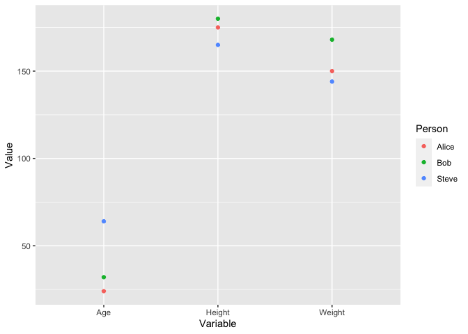
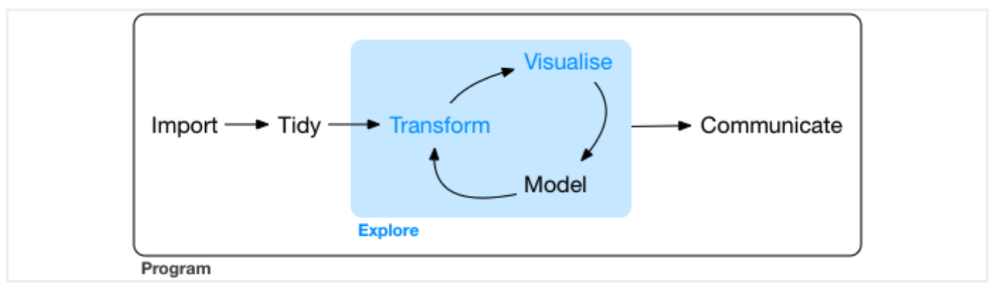
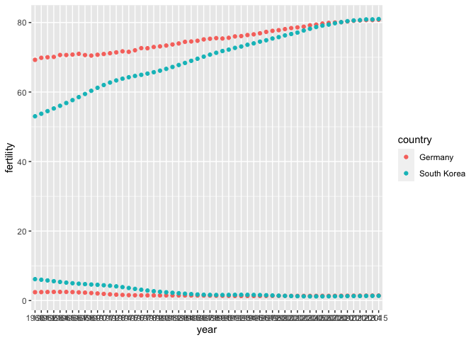
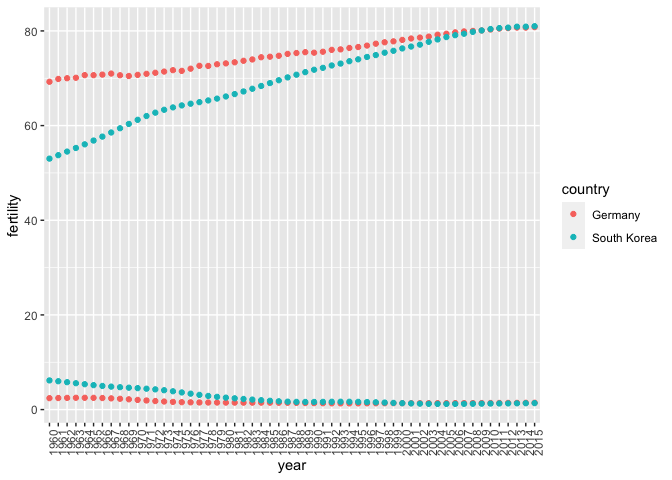

Data visualization I
================
Steven Moran & Alena Witzlack-Makarevich

23 March, 2022

-   [Recap and data wrangling
    continued](#recap-and-data-wrangling-continued)
    -   [Tabular data](#tabular-data)
    -   [Wide vs long table formats](#wide-vs-long-table-formats)
        -   [Wide](#wide)
        -   [Long](#long)
    -   [Tidy data](#tidy-data)
    -   [Reshaping data](#reshaping-data)
        -   [`gather()` / `pivot_longer()`](#gather--pivot_longer)
        -   [`separate()`](#separate)
        -   [`spread()` / `pivot_wider()`](#spread--pivot_wider)
        -   [`unite()`](#unite)
-   [Visualizing data](#visualizing-data)
    -   [Workflow](#workflow)
    -   [Layered graphics](#layered-graphics)
        -   [Example: fertility data](#example-fertility-data)
        -   [Example: diamonds data](#example-diamonds-data)
-   [Data practical](#data-practical)
-   [References and footnotes](#references-and-footnotes)

------------------------------------------------------------------------

This report uses the [R programming
language](https://cran.r-project.org/doc/FAQ/R-FAQ.html) (R Core Team
2021) and the following [R libraries](https://r-pkgs.org/intro.html)
(Wickham et al. 2019; Xie 2021; Irizarry and Gill 2021).

``` r
library(tidyverse)
library(knitr)
library(dslabs)
```

# Recap and data wrangling continued

## Tabular data

Recall our discussion about [tabular
data](https://github.com/bambooforest/IntroDataScience/tree/main/3_data#tabular-data)
formats. In a table data format, every column represents a particular
variable (e.g., a person’s height, number of of vowels) and each
row/record corresponds to a given member of the data set in question
(e.g. a person, in a language). Tabular data are inherently rectangular
and cannot have “ragged rows.” If any row is lacking information for a
particular column, a missing value (`NA`) is stored in that cell.

Tabular data come in various formats and go by various names, e.g.:

-   Table
-   Data set (if rectangular)
-   Data frame (e.g., a data type in R)
-   Data matrix
-   CSV plain text file
-   Spreadsheet

For most people working with small amounts of data, the data table is
the fundamental unit of organization because it is both a way of
organizing data that can be processed by humans and machines. In
practice, to enter, organize, modify, analyze, and store data in tabular
form – it is common for people to use spreadsheet applications. You are
probably familiar for example with Excel spreadsheets. Many statistical
software packages use similar spreadsheets and many are able to import
Excel spreadsheets. R is no different.

Importantly, the input to statistical graphics or plots is typically
some type of data matrix (tabular data) as input. The key is to get the
data into the correct format as input to the method that will visualize
the data. [Data wrangling](../4_data_wrangling/README.md) include the
steps to get the data that is needed for visualization purposes. You
may, however, also have to reshape the tabular data into various
formats, so that you can easily feed into the method.

## Wide vs long table formats

There are two basic presentations of tabular data:

-   Wide
-   Long (aka narrow)

### Wide

[Wide](https://en.wikipedia.org/wiki/Wide_and_narrow_data) tabular data
is unstacked and it is presented so that each different data variable is
in a separate column.

``` r
df_wide <- data.frame(Person = c('Bob', 'Alice', 'Steve'),
                 Age = c(32, 24, 64),
                 Weight = c(168, 150, 144),
                 Height = c(180, 175, 165))
df_wide %>% kable()
```

| Person | Age | Weight | Height |
|:-------|----:|-------:|-------:|
| Bob    |  32 |    168 |    180 |
| Alice  |  24 |    150 |    175 |
| Steve  |  64 |    144 |    165 |

<!-- if you want to do it by hand in .md insert this:

| Person | Age | Weight | Height |
|----------|--------|---| 
| Bob | 32 | 168 | 180 |
| Alice | 24 | 150 | 175 |
| Steve | 64 | 144 | 165 |

-->

### Long

[Long](https://en.wikipedia.org/wiki/Wide_and_narrow_data) tabular data
is stacked, so that one column contains all of the values and an
additional column denotes the context of those values, e.g.:

``` r
df_long <- data.frame(Person = c('Bob', 'Bob', 'Bob', 'Alice', 'Alice', 'Alice', 'Steve', 'Steve', 'Steve'),
                      Variable = c('Age', 'Weight', 'Height', 'Age', 'Weight', 'Height', 'Age', 'Weight', 'Height'),
                      Value = c(32, 168, 180, 24, 150, 175, 64, 144, 165))
df_long %>% kable()
```

| Person | Variable | Value |
|:-------|:---------|------:|
| Bob    | Age      |    32 |
| Bob    | Weight   |   168 |
| Bob    | Height   |   180 |
| Alice  | Age      |    24 |
| Alice  | Weight   |   150 |
| Alice  | Height   |   175 |
| Steve  | Age      |    64 |
| Steve  | Weight   |   144 |
| Steve  | Height   |   165 |

Why do people use long format? For example, it looks more difficult to
work with manually. One important reason is that it is a data model that
encodes data in a space-efficient manner. For example, if you have a
[sparse matrix](https://en.wikipedia.org/wiki/Sparse_matrix) in wide
format, you may have lots of `NA` or `0` cells. In long format, you can
simply leave those out (because you can infer them when translating from
long to wide format). This long data format basically encodes what is
called an [entity-attribute-value data
model](https://en.wikipedia.org/wiki/Entity–attribute–value_model).
Similar data models are used in all kinds of applications, such as
[knowledge graphs](https://en.wikipedia.org/wiki/Knowledge_graph), in
search engines, [graph
databases](https://en.wikipedia.org/wiki/Graph_database), and so on.

## Tidy data

The `tidyverse` works on [tidy
data](https://r4ds.had.co.nz/tidy-data.html), i.e., a consistent way to
organize data in R. One of the goals of the `tidyverse` suite of tools
is to make an interface between data input and data output – that is,
once you have data in the tidy data format, working with the tools in
the tidyverse become much simpler. In other words, to play and have fun
with the tools in tidyverse, you should first get your data into the
tidy format.

As shown above, the same tabular data can be formatted in different
ways. (The picture is actually more complex because data can be
represented in many different ways in tables, e.g., [see
here](https://r4ds.had.co.nz/tidy-data.html).)

To create tidy data, there are three rules you must follow (Wickham and
Grolemund 2016):

1.  Each variable must have its own column.
2.  Each observation must have its own row.
3.  Each value must have its own cell.

So, variables in columns, observations in rows, values in cells – in one
table!

This boils down to: put your data in a table (or data frame or tibble in
R) and put each variable in a column.

What are the advantages of this approach to organizing your data? Well,
other than easy access to methods in the tidyverse, your data (Wickham
and Grolemund 2016):

1.  Is in a consistent format – and it’s easier to learn to work with
    one format before learning to deal with multiple formats

2.  When variables are in columns, it is straightforward to vectorize
    the data – most R functions work on vectorized data

Here’s an example using the probability of death by age and sex table
from the
[dslabs](https://www.rdocumentation.org/packages/dslabs/versions/0.7.4/topics/death_prob)
R library (Irizarry and Gill 2021).

``` r
# install.packages('dslabs') # install the package if you haven't
library(dslabs)
head(death_prob) %>% kable()
```

| age | sex  |     prob |
|----:|:-----|---------:|
|   0 | Male | 0.006383 |
|   1 | Male | 0.000453 |
|   2 | Male | 0.000282 |
|   3 | Male | 0.000230 |
|   4 | Male | 0.000169 |
|   5 | Male | 0.000155 |

``` r
str(death_prob)
```

    ## 'data.frame':    240 obs. of  3 variables:
    ##  $ age : int  0 1 2 3 4 5 6 7 8 9 ...
    ##  $ sex : Factor w/ 2 levels "Female","Male": 2 2 2 2 2 2 2 2 2 2 ...
    ##  $ prob: num  0.006383 0.000453 0.000282 0.00023 0.000169 ...

Let’s plot it to compare the probability of death on the y axis and age
on the x axis. We plot by the factor `sex` (recall that
[factors](https://r4ds.had.co.nz/factors.html) are R data objects for
working with [categorical
variables](https://en.wikipedia.org/wiki/Categorical_variable)).

``` r
library(ggplot2) # you need this library (it's also in the tidyverse package) to use `ggplot()`
ggplot(death_prob, aes(age, prob)) + 
  geom_line(aes(group = sex), colour = "grey50") + 
  geom_point(aes(colour = sex))
```

<!-- -->

------------------------------------------------------------------------

What is being plotted?

What does the plot tell us about the data?

------------------------------------------------------------------------

What about the wide and long tables mentioned above? Do you see how one
or the other is easier as input to the `ggplot()` function?

``` r
ggplot(df_wide, aes(Height, Weight)) + 
  geom_point(aes(colour = Person))
```

<!-- -->

Which variables would you give with the long data format? Does this plot
tell us anything interesting?

``` r
ggplot(df_long, aes(Variable, Value)) + 
  geom_point(aes(colour = Person))
```

<!-- -->

You may need to then filter your data.

``` r
temp <- df_long %>% filter(Variable %in% c('Age', 'Weight')) 

ggplot(temp, aes(Person, Value)) + 
  geom_point(aes(colour = Variable)) +
  geom_line(aes(colour = Variable))
```

    ## geom_path: Each group consists of only one observation. Do you need to adjust
    ## the group aesthetic?

<!-- -->

But again does this tell us anything interesting?

``` r
ggplot(df_wide, aes(Age, Weight)) + 
  geom_point(aes(colour = Person)) +
  geom_line(aes(colour = Person))
```

    ## geom_path: Each group consists of only one observation. Do you need to adjust
    ## the group aesthetic?

<!-- -->

Often it is easier to **reshape the data** than it is to figure out how
to cram the variables into the visualization code.

## Reshaping data

Recall the [data wrangling
process](https://github.com/bambooforest/IntroDataScience/tree/main/4_data_wrangling#data-wrangling-in-r).
The first step is to [load the
data](https://github.com/bambooforest/IntroDataScience/tree/main/4_data_wrangling#loading-data).
A common next step is to reshape the data into a format that facilities
analysis. This is because often the data that you have loaded is
organized in ways that are practical to the data gatherers, e.g., it’s
in a format that makes data entry easy, or it’s in a format that
facilitates some type of analysis, but not perhaps the one that you want
to do.

As a first step then, it is pertinent to figure out what the variables
and observations are for your analysis. Often data will (Wickham and
Grolemund 2016):

1.  Contain a variable that is spread across multiple columns
2.  Contain an observation spread across multiple rows

And sometimes you will encounter both issues in the same data set!

To resolve such issues, there are four very useful functions for tidying
data:

-   `gather()` – makes wide data longer
-   `spread()` – males long data wider
-   `separate()`– splits a column into multiple columns
-   `unite()` – combines multiple columns into one column

The first two are probably the most important for reshaping your data.
Like many developments in programming languages and programming
libraries, the first two functions (and although they still work) have
been recently renamed:

-   `pivot_longer()` – pivots data into a longer format
-   `pivot_wider()` – pivots data into a wider format

Let’s look at each in turn.

### `gather()` / `pivot_longer()`

The `gather` function in the `tidyverse` library lets you convert wide
data into tidy data. Let’s consider an example from [this great
course](https://datasciencelabs.github.io).

The annual fertility rates data from `dslabs` and `gapminder` for
Germany and South Korea in wide format:

``` r
fertility_wide <- read_csv(url('https://raw.githubusercontent.com/rafalab/dslabs/master/inst/extdata/life-expectancy-and-fertility-two-countries-example.csv'))
fertility_wide %>% kable() # cool trick to make the table show up nicely!
```

| country     | 1960_fertility | 1960_life_expectancy | 1961_fertility | 1961_life_expectancy | 1962_fertility | 1962_life_expectancy | 1963_fertility | 1963_life_expectancy | 1964_fertility | 1964_life_expectancy | 1965_fertility | 1965_life_expectancy | 1966_fertility | 1966_life_expectancy | 1967_fertility | 1967_life_expectancy | 1968_fertility | 1968_life_expectancy | 1969_fertility | 1969_life_expectancy | 1970_fertility | 1970_life_expectancy | 1971_fertility | 1971_life_expectancy | 1972_fertility | 1972_life_expectancy | 1973_fertility | 1973_life_expectancy | 1974_fertility | 1974_life_expectancy | 1975_fertility | 1975_life_expectancy | 1976_fertility | 1976_life_expectancy | 1977_fertility | 1977_life_expectancy | 1978_fertility | 1978_life_expectancy | 1979_fertility | 1979_life_expectancy | 1980_fertility | 1980_life_expectancy | 1981_fertility | 1981_life_expectancy | 1982_fertility | 1982_life_expectancy | 1983_fertility | 1983_life_expectancy | 1984_fertility | 1984_life_expectancy | 1985_fertility | 1985_life_expectancy | 1986_fertility | 1986_life_expectancy | 1987_fertility | 1987_life_expectancy | 1988_fertility | 1988_life_expectancy | 1989_fertility | 1989_life_expectancy | 1990_fertility | 1990_life_expectancy | 1991_fertility | 1991_life_expectancy | 1992_fertility | 1992_life_expectancy | 1993_fertility | 1993_life_expectancy | 1994_fertility | 1994_life_expectancy | 1995_fertility | 1995_life_expectancy | 1996_fertility | 1996_life_expectancy | 1997_fertility | 1997_life_expectancy | 1998_fertility | 1998_life_expectancy | 1999_fertility | 1999_life_expectancy | 2000_fertility | 2000_life_expectancy | 2001_fertility | 2001_life_expectancy | 2002_fertility | 2002_life_expectancy | 2003_fertility | 2003_life_expectancy | 2004_fertility | 2004_life_expectancy | 2005_fertility | 2005_life_expectancy | 2006_fertility | 2006_life_expectancy | 2007_fertility | 2007_life_expectancy | 2008_fertility | 2008_life_expectancy | 2009_fertility | 2009_life_expectancy | 2010_fertility | 2010_life_expectancy | 2011_fertility | 2011_life_expectancy | 2012_fertility | 2012_life_expectancy | 2013_fertility | 2013_life_expectancy | 2014_fertility | 2014_life_expectancy | 2015_fertility | 2015_life_expectancy |
|:------------|---------------:|---------------------:|---------------:|---------------------:|---------------:|---------------------:|---------------:|---------------------:|---------------:|---------------------:|---------------:|---------------------:|---------------:|---------------------:|---------------:|---------------------:|---------------:|---------------------:|---------------:|---------------------:|---------------:|---------------------:|---------------:|---------------------:|---------------:|---------------------:|---------------:|---------------------:|---------------:|---------------------:|---------------:|---------------------:|---------------:|---------------------:|---------------:|---------------------:|---------------:|---------------------:|---------------:|---------------------:|---------------:|---------------------:|---------------:|---------------------:|---------------:|---------------------:|---------------:|---------------------:|---------------:|---------------------:|---------------:|---------------------:|---------------:|---------------------:|---------------:|---------------------:|---------------:|---------------------:|---------------:|---------------------:|---------------:|---------------------:|---------------:|---------------------:|---------------:|---------------------:|---------------:|---------------------:|---------------:|---------------------:|---------------:|---------------------:|---------------:|---------------------:|---------------:|---------------------:|---------------:|---------------------:|---------------:|---------------------:|---------------:|---------------------:|---------------:|---------------------:|---------------:|---------------------:|---------------:|---------------------:|---------------:|---------------------:|---------------:|---------------------:|---------------:|---------------------:|---------------:|---------------------:|---------------:|---------------------:|---------------:|---------------------:|---------------:|---------------------:|---------------:|---------------------:|---------------:|---------------------:|---------------:|---------------------:|---------------:|---------------------:|---------------:|---------------------:|
| Germany     |           2.41 |                69.26 |           2.44 |                69.85 |           2.47 |                70.01 |           2.49 |                70.10 |           2.49 |                70.66 |           2.48 |                70.65 |           2.44 |                70.77 |           2.37 |                70.99 |           2.28 |                70.64 |           2.17 |                70.48 |           2.04 |                70.72 |           1.92 |                70.94 |           1.80 |                71.16 |           1.70 |                71.41 |           1.62 |                71.71 |           1.56 |                71.56 |           1.53 |                72.02 |           1.50 |                72.63 |           1.49 |                72.60 |           1.48 |                72.96 |           1.47 |                73.14 |           1.47 |                73.37 |           1.46 |                73.69 |           1.46 |                73.97 |           1.46 |                74.44 |           1.45 |                74.55 |           1.44 |                74.75 |           1.43 |                75.15 |           1.41 |                75.33 |           1.38 |                75.51 |           1.36 |                 75.4 |           1.34 |                 75.6 |           1.32 |                 76.0 |           1.31 |                 76.1 |           1.31 |                 76.4 |           1.31 |                 76.6 |           1.32 |                 76.9 |           1.33 |                 77.3 |           1.34 |                 77.6 |           1.35 |                 77.8 |           1.35 |                 78.1 |           1.35 |                 78.4 |           1.35 |                 78.6 |           1.35 |                 78.8 |           1.35 |                 79.2 |           1.35 |                 79.4 |           1.36 |                 79.7 |           1.36 |                 79.9 |           1.37 |                 80.0 |           1.38 |                 80.1 |           1.39 |                 80.3 |           1.40 |                 80.5 |           1.41 |                 80.6 |           1.42 |                 80.7 |           1.43 |                 80.7 |           1.44 |                 80.8 |
| South Korea |           6.16 |                53.02 |           5.99 |                53.75 |           5.79 |                54.51 |           5.57 |                55.27 |           5.36 |                56.04 |           5.16 |                56.84 |           4.99 |                57.67 |           4.85 |                58.54 |           4.73 |                59.44 |           4.62 |                60.35 |           4.53 |                61.22 |           4.41 |                62.02 |           4.27 |                62.73 |           4.09 |                63.34 |           3.87 |                63.84 |           3.62 |                64.26 |           3.36 |                64.62 |           3.11 |                64.95 |           2.88 |                65.31 |           2.69 |                65.70 |           2.52 |                66.15 |           2.38 |                66.66 |           2.24 |                67.21 |           2.11 |                67.78 |           1.98 |                68.37 |           1.86 |                68.98 |           1.75 |                69.58 |           1.67 |                70.18 |           1.63 |                70.75 |           1.61 |                71.29 |           1.61 |                 71.8 |           1.63 |                 72.2 |           1.65 |                 72.7 |           1.66 |                 73.1 |           1.65 |                 73.6 |           1.63 |                 74.0 |           1.59 |                 74.5 |           1.54 |                 74.9 |           1.48 |                 75.4 |           1.41 |                 75.8 |           1.35 |                 76.3 |           1.30 |                 76.7 |           1.25 |                 77.1 |           1.22 |                 77.7 |           1.20 |                 78.2 |           1.20 |                 78.7 |           1.20 |                 79.1 |           1.21 |                 79.4 |           1.23 |                 79.8 |           1.25 |                 80.1 |           1.27 |                 80.4 |           1.29 |                 80.6 |           1.30 |                 80.7 |           1.32 |                 80.9 |           1.34 |                 80.9 |           1.36 |                 81.0 |

What are the variables? What are the observations? How do we get the
data into tidy format?

``` r
fertility_tidy <- fertility_wide %>% 
  gather(year, fertility, -country, convert = TRUE)
```

Like above, we can transform the data from `wide` to `long` format by
telling the function which columns we do *not* want.

``` r
fertility_tidy <- fertility_wide %>% 
  pivot_longer(!country)
fertility_tidy %>% head() %>% kable() # going to use that cool trick again -- check out the kable package!
```

| country | name                 | value |
|:--------|:---------------------|------:|
| Germany | 1960_fertility       |  2.41 |
| Germany | 1960_life_expectancy | 69.26 |
| Germany | 1961_fertility       |  2.44 |
| Germany | 1961_life_expectancy | 69.85 |
| Germany | 1962_fertility       |  2.47 |
| Germany | 1962_life_expectancy | 70.01 |

Note the default `name` and `value` column names. These can be changed
in the parameter specification.

``` r
fertility_tidy <- fertility_wide %>% 
  pivot_longer(!country, names_to = "year_variable", values_to = "fertility")
fertility_tidy %>% head() %>% kable()
```

| country | year_variable        | fertility |
|:--------|:---------------------|----------:|
| Germany | 1960_fertility       |      2.41 |
| Germany | 1960_life_expectancy |     69.26 |
| Germany | 1961_fertility       |      2.44 |
| Germany | 1961_life_expectancy |     69.85 |
| Germany | 1962_fertility       |      2.47 |
| Germany | 1962_life_expectancy |     70.01 |

**The data are still a bit not so user friendly. Why?**

### `separate()`

``` r
fertility_tidy %>% separate(year_variable, into=c("year", "variable"), sep="_")
```

    ## Warning: Expected 2 pieces. Additional pieces discarded in 112 rows [2, 4, 6, 8,
    ## 10, 12, 14, 16, 18, 20, 22, 24, 26, 28, 30, 32, 34, 36, 38, 40, ...].

    ## # A tibble: 224 x 4
    ##    country year  variable  fertility
    ##    <chr>   <chr> <chr>         <dbl>
    ##  1 Germany 1960  fertility      2.41
    ##  2 Germany 1960  life          69.3 
    ##  3 Germany 1961  fertility      2.44
    ##  4 Germany 1961  life          69.8 
    ##  5 Germany 1962  fertility      2.47
    ##  6 Germany 1962  life          70.0 
    ##  7 Germany 1963  fertility      2.49
    ##  8 Germany 1963  life          70.1 
    ##  9 Germany 1964  fertility      2.49
    ## 10 Germany 1964  life          70.7 
    ## # … with 214 more rows

What happened? What did we lose?

``` r
fertility_tidy <- fertility_tidy %>% 
  separate(year_variable, into=c("year", "variable"), sep="_", extra = "merge")
fertility_tidy %>% head() %>% kable() # one way to display nicely tables 
```

| country | year | variable        | fertility |
|:--------|:-----|:----------------|----------:|
| Germany | 1960 | fertility       |      2.41 |
| Germany | 1960 | life_expectancy |     69.26 |
| Germany | 1961 | fertility       |      2.44 |
| Germany | 1961 | life_expectancy |     69.85 |
| Germany | 1962 | fertility       |      2.47 |
| Germany | 1962 | life_expectancy |     70.01 |

### `spread()` / `pivot_wider()`

To turn long data into wide data we can use the `spread` or
`pivot_wider` functions. They are basically the inverse of `gather` and
`pivot_longer`.

``` r
fertility_wide <- fertility_tidy %>% 
  spread(year, fertility)

fertility_wide %>% kable() # one way to display nicely tables 
```

| country     | variable        |  1960 |  1961 |  1962 |  1963 |  1964 |  1965 |  1966 |  1967 |  1968 |  1969 |  1970 |  1971 |  1972 |  1973 |  1974 |  1975 |  1976 |  1977 |  1978 |  1979 |  1980 |  1981 |  1982 |  1983 |  1984 |  1985 |  1986 |  1987 |  1988 |  1989 |  1990 |  1991 |  1992 |  1993 |  1994 |  1995 |  1996 |  1997 |  1998 |  1999 |  2000 |  2001 |  2002 |  2003 |  2004 |  2005 |  2006 |  2007 |  2008 |  2009 |  2010 |  2011 |  2012 |  2013 |  2014 |  2015 |
|:------------|:----------------|------:|------:|------:|------:|------:|------:|------:|------:|------:|------:|------:|------:|------:|------:|------:|------:|------:|------:|------:|------:|------:|------:|------:|------:|------:|------:|------:|------:|------:|------:|------:|------:|------:|------:|------:|------:|------:|------:|------:|------:|------:|------:|------:|------:|------:|------:|------:|------:|------:|------:|------:|------:|------:|------:|------:|------:|
| Germany     | fertility       |  2.41 |  2.44 |  2.47 |  2.49 |  2.49 |  2.48 |  2.44 |  2.37 |  2.28 |  2.17 |  2.04 |  1.92 |  1.80 |  1.70 |  1.62 |  1.56 |  1.53 |  1.50 |  1.49 |  1.48 |  1.47 |  1.47 |  1.46 |  1.46 |  1.46 |  1.45 |  1.44 |  1.43 |  1.41 |  1.38 |  1.36 |  1.34 |  1.32 |  1.31 |  1.31 |  1.31 |  1.32 |  1.33 |  1.34 |  1.35 |  1.35 |  1.35 |  1.35 |  1.35 |  1.35 |  1.35 |  1.36 |  1.36 |  1.37 |  1.38 |  1.39 |  1.40 |  1.41 |  1.42 |  1.43 |  1.44 |
| Germany     | life_expectancy | 69.26 | 69.85 | 70.01 | 70.10 | 70.66 | 70.65 | 70.77 | 70.99 | 70.64 | 70.48 | 70.72 | 70.94 | 71.16 | 71.41 | 71.71 | 71.56 | 72.02 | 72.63 | 72.60 | 72.96 | 73.14 | 73.37 | 73.69 | 73.97 | 74.44 | 74.55 | 74.75 | 75.15 | 75.33 | 75.51 | 75.40 | 75.60 | 76.00 | 76.10 | 76.40 | 76.60 | 76.90 | 77.30 | 77.60 | 77.80 | 78.10 | 78.40 | 78.60 | 78.80 | 79.20 | 79.40 | 79.70 | 79.90 | 80.00 | 80.10 | 80.30 | 80.50 | 80.60 | 80.70 | 80.70 | 80.80 |
| South Korea | fertility       |  6.16 |  5.99 |  5.79 |  5.57 |  5.36 |  5.16 |  4.99 |  4.85 |  4.73 |  4.62 |  4.53 |  4.41 |  4.27 |  4.09 |  3.87 |  3.62 |  3.36 |  3.11 |  2.88 |  2.69 |  2.52 |  2.38 |  2.24 |  2.11 |  1.98 |  1.86 |  1.75 |  1.67 |  1.63 |  1.61 |  1.61 |  1.63 |  1.65 |  1.66 |  1.65 |  1.63 |  1.59 |  1.54 |  1.48 |  1.41 |  1.35 |  1.30 |  1.25 |  1.22 |  1.20 |  1.20 |  1.20 |  1.21 |  1.23 |  1.25 |  1.27 |  1.29 |  1.30 |  1.32 |  1.34 |  1.36 |
| South Korea | life_expectancy | 53.02 | 53.75 | 54.51 | 55.27 | 56.04 | 56.84 | 57.67 | 58.54 | 59.44 | 60.35 | 61.22 | 62.02 | 62.73 | 63.34 | 63.84 | 64.26 | 64.62 | 64.95 | 65.31 | 65.70 | 66.15 | 66.66 | 67.21 | 67.78 | 68.37 | 68.98 | 69.58 | 70.18 | 70.75 | 71.29 | 71.80 | 72.20 | 72.70 | 73.10 | 73.60 | 74.00 | 74.50 | 74.90 | 75.40 | 75.80 | 76.30 | 76.70 | 77.10 | 77.70 | 78.20 | 78.70 | 79.10 | 79.40 | 79.80 | 80.10 | 80.40 | 80.60 | 80.70 | 80.90 | 80.90 | 81.00 |

And now with `pivot_wider`. You might use such a transformation to
produce data that is easier to work with, e.g., you want to load it in a
spreadsheet and make some corrections by hand, or perhaps you want to
share the data with someone. Wide data is also sometimes useful as an
intermediate format between your input and target output formats when
trying to tidy up your data.

``` r
fertility_tidy %>% 
  pivot_wider(names_from = year, values_from = fertility) %>%
  kable()
```

| country     | variable        |  1960 |  1961 |  1962 |  1963 |  1964 |  1965 |  1966 |  1967 |  1968 |  1969 |  1970 |  1971 |  1972 |  1973 |  1974 |  1975 |  1976 |  1977 |  1978 |  1979 |  1980 |  1981 |  1982 |  1983 |  1984 |  1985 |  1986 |  1987 |  1988 |  1989 |  1990 |  1991 |  1992 |  1993 |  1994 |  1995 |  1996 |  1997 |  1998 |  1999 |  2000 |  2001 |  2002 |  2003 |  2004 |  2005 |  2006 |  2007 |  2008 |  2009 |  2010 |  2011 |  2012 |  2013 |  2014 |  2015 |
|:------------|:----------------|------:|------:|------:|------:|------:|------:|------:|------:|------:|------:|------:|------:|------:|------:|------:|------:|------:|------:|------:|------:|------:|------:|------:|------:|------:|------:|------:|------:|------:|------:|------:|------:|------:|------:|------:|------:|------:|------:|------:|------:|------:|------:|------:|------:|------:|------:|------:|------:|------:|------:|------:|------:|------:|------:|------:|------:|
| Germany     | fertility       |  2.41 |  2.44 |  2.47 |  2.49 |  2.49 |  2.48 |  2.44 |  2.37 |  2.28 |  2.17 |  2.04 |  1.92 |  1.80 |  1.70 |  1.62 |  1.56 |  1.53 |  1.50 |  1.49 |  1.48 |  1.47 |  1.47 |  1.46 |  1.46 |  1.46 |  1.45 |  1.44 |  1.43 |  1.41 |  1.38 |  1.36 |  1.34 |  1.32 |  1.31 |  1.31 |  1.31 |  1.32 |  1.33 |  1.34 |  1.35 |  1.35 |  1.35 |  1.35 |  1.35 |  1.35 |  1.35 |  1.36 |  1.36 |  1.37 |  1.38 |  1.39 |  1.40 |  1.41 |  1.42 |  1.43 |  1.44 |
| Germany     | life_expectancy | 69.26 | 69.85 | 70.01 | 70.10 | 70.66 | 70.65 | 70.77 | 70.99 | 70.64 | 70.48 | 70.72 | 70.94 | 71.16 | 71.41 | 71.71 | 71.56 | 72.02 | 72.63 | 72.60 | 72.96 | 73.14 | 73.37 | 73.69 | 73.97 | 74.44 | 74.55 | 74.75 | 75.15 | 75.33 | 75.51 | 75.40 | 75.60 | 76.00 | 76.10 | 76.40 | 76.60 | 76.90 | 77.30 | 77.60 | 77.80 | 78.10 | 78.40 | 78.60 | 78.80 | 79.20 | 79.40 | 79.70 | 79.90 | 80.00 | 80.10 | 80.30 | 80.50 | 80.60 | 80.70 | 80.70 | 80.80 |
| South Korea | fertility       |  6.16 |  5.99 |  5.79 |  5.57 |  5.36 |  5.16 |  4.99 |  4.85 |  4.73 |  4.62 |  4.53 |  4.41 |  4.27 |  4.09 |  3.87 |  3.62 |  3.36 |  3.11 |  2.88 |  2.69 |  2.52 |  2.38 |  2.24 |  2.11 |  1.98 |  1.86 |  1.75 |  1.67 |  1.63 |  1.61 |  1.61 |  1.63 |  1.65 |  1.66 |  1.65 |  1.63 |  1.59 |  1.54 |  1.48 |  1.41 |  1.35 |  1.30 |  1.25 |  1.22 |  1.20 |  1.20 |  1.20 |  1.21 |  1.23 |  1.25 |  1.27 |  1.29 |  1.30 |  1.32 |  1.34 |  1.36 |
| South Korea | life_expectancy | 53.02 | 53.75 | 54.51 | 55.27 | 56.04 | 56.84 | 57.67 | 58.54 | 59.44 | 60.35 | 61.22 | 62.02 | 62.73 | 63.34 | 63.84 | 64.26 | 64.62 | 64.95 | 65.31 | 65.70 | 66.15 | 66.66 | 67.21 | 67.78 | 68.37 | 68.98 | 69.58 | 70.18 | 70.75 | 71.29 | 71.80 | 72.20 | 72.70 | 73.10 | 73.60 | 74.00 | 74.50 | 74.90 | 75.40 | 75.80 | 76.30 | 76.70 | 77.10 | 77.70 | 78.20 | 78.70 | 79.10 | 79.40 | 79.80 | 80.10 | 80.40 | 80.60 | 80.70 | 80.90 | 80.90 | 81.00 |

### `unite()`

The function `unite()` is the opposite of `separate()`. Its job is to
combine multiple columns into a single column. It’s less often used than
`separate()`, but nevertheless handy to know.

Want to go back to our original data frame?

``` r
fertility_tidy %>% unite(name, year, variable)
```

    ## # A tibble: 224 x 3
    ##    country name                 fertility
    ##    <chr>   <chr>                    <dbl>
    ##  1 Germany 1960_fertility            2.41
    ##  2 Germany 1960_life_expectancy     69.3 
    ##  3 Germany 1961_fertility            2.44
    ##  4 Germany 1961_life_expectancy     69.8 
    ##  5 Germany 1962_fertility            2.47
    ##  6 Germany 1962_life_expectancy     70.0 
    ##  7 Germany 1963_fertility            2.49
    ##  8 Germany 1963_life_expectancy     70.1 
    ##  9 Germany 1964_fertility            2.49
    ## 10 Germany 1964_life_expectancy     70.7 
    ## # … with 214 more rows

``` r
fertility_tidy %>% head() %>% kable() # one way to display nicely tables 
```

| country | year | variable        | fertility |
|:--------|:-----|:----------------|----------:|
| Germany | 1960 | fertility       |      2.41 |
| Germany | 1960 | life_expectancy |     69.26 |
| Germany | 1961 | fertility       |      2.44 |
| Germany | 1961 | life_expectancy |     69.85 |
| Germany | 1962 | fertility       |      2.47 |
| Germany | 1962 | life_expectancy |     70.01 |

# Visualizing data

## Workflow

Visualizing data can be **very** time consuming for lots of reasons.
First and foremost, it often requires that you first wrangle your data
into a format that the visualization function(s) can work with as input.

The point of [tidy data](https://r4ds.had.co.nz/tidy-data.html) is to
create a consistent way to organize your data so that it plays well with
the various libraries in the tidyverse – including but not limited to
the visualization and analytics tools.

For example, some tidy data as input to the `ggplot()` function, which
is used to create various
[plots](https://en.wikipedia.org/wiki/Plot_(graphics)). Tidy data:

``` r
head(fertility_tidy)
```

    ## # A tibble: 6 x 4
    ##   country year  variable        fertility
    ##   <chr>   <chr> <chr>               <dbl>
    ## 1 Germany 1960  fertility            2.41
    ## 2 Germany 1960  life_expectancy     69.3 
    ## 3 Germany 1961  fertility            2.44
    ## 4 Germany 1961  life_expectancy     69.8 
    ## 5 Germany 1962  fertility            2.47
    ## 6 Germany 1962  life_expectancy     70.0

And that data passed to a visualization function:

``` r
fertility_tidy %>% 
  ggplot(aes(x=year, y=fertility, color = country)) +
  geom_point()
```

<!-- -->

Recall that the code above “pipes,” i.e., `%>%`, the `fertility_tidy`
data frame (tabular data in R) into the `ggplot()` function. In the
`ggplot()` function, we describe some
“[aesthetics](https://ggplot2.tidyverse.org/articles/ggplot2-specs.html)”
– the function called `aes` in which we specify what we want plotted on
the `x` and `y` axes.

Then we tell the `ggplot` function that we want to create a [scatter
plot](https://en.wikipedia.org/wiki/Scatter_plot) by piping the data and
the `ggplot()` function call (which creates a coordinate system that you
can add various layers to) the
[`geom_point()`](https://ggplot2.tidyverse.org/reference/geom_point.html)
function. Scatter plots are used to display the relationship between two
variables. More on plot types below.

A nice illustration of the data exploration process (or pipeline) is
given [here](https://r4ds.had.co.nz/explore-intro.html) and in the
screen shot:



In the blue highlighted portion “Explore,” you can seen a circle from
“Transform” -> “Visualize” -> “Model” (then repeat).

This is the typical approach to exploring data, i.e., thinking about
questions and formulating hypotheses, then developing models and testing
your hypotheses. Then of course you might want to “Communicate” your
results.

When communicating your results, there is another (often) time consuming
aspect of creating data visualizations – lots of tweaking to get your
visualizations to look just right.

**What is ugly about the plot above?**

This can be for various reasons. [Data
visualization](https://en.wikipedia.org/wiki/Data_visualization) is an
interdisciplinary field in itself and it is aimed at efficient (and
beautiful) graphic representations of data. It has its roots in
(descriptive) statistics, but is also increasingly a science and an art
– as noted by the increase in areas like [data
journalism](https://en.wikipedia.org/wiki/Data_journalism).

Consider for example you have some data:

-   What you are trying to visualize with your data?
-   What kind of (statistical) data types do you have?
-   How are the data types usually visualized (including if more than
    one – in relation to each other)?
-   On which axes should they be plotted?

Or are you trying to visualize – or model – a [statistical
distribution](https://en.wikipedia.org/wiki/Probability_distribution)?
How many variables are there? What are your independent and dependent
variables? Do you have any? Do you have a hypothesis?

A picture of the workflow with `tidyverse` libraries (`readr`, `tidyr`,
etc.) is given below. For “model” it will depend on what type of
statistical *model(s)* you are using – there are numerous libraries for
statistical modeling in R!


## Layered graphics

The R tidyverse visualization library `ggplot2` is based on the
principles outlined in *The Grammar of Graphics*, a classic text on data
visualizations, by Leland Wilkinson (Leland 1999)[1]. The layered
*Grammar of Graphics* is where (**Wickham2009?**) implements Wilkinson’s
principles, and typology, of graphic design into R.

Each layer/component of the *Grammar of Graphics* has a special name in
`ggplot2`, visualized as:


A statistical graphic according to this layered grammar of graphics is a
mapping from **data** to **aesthetic attributes** (e.g., color, shape,
size) to geometric objects (e.g., points, lines, bars).

The basic idea is that you can build data visualizations from the same
components:

-   The data
-   A coordinate system
-   Geoms (functions that represent data points in the coordinate
    system)

Here is a cheat sheet:

-   <https://github.com/rstudio/cheatsheets/blob/main/data-visualization-2.1.pdf>

------------------------------------------------------------------------

Multiple layers from can be applied, such that a plot may contain, for
example, statistical transformations of the data. These layers can be
drawn on one or more coordinate systems.

When on has multiple plots, it is
[faceting](https://ggplot2.tidyverse.org/reference/facet_grid.html) (not
to be confused with [faceting](https://en.wikipedia.org/wiki/Faceting)
or [facet](https://en.wikipedia.org/wiki/Facet_(disambiguation))) that
can be used to generate the same plot for different subsets of the data
set and then combined into one graphic. More below.

In sum, it is the combination of these independent components that make
up a graphic, including layers, scales, the coordinate system, and
faceting, that one needs to familiarize themself with.


With ggplot2, you begin a plot with the function `ggplot()`. Then
`ggplot()` creates a coordinate system that you can add layers to.

The first argument of `ggplot()` is the dataset to use in the graph. So
`ggplot(data = diamonds)` creates an empty graph.

However, a simple plot with `ggplot2()` needs:

-   Data (a data frame or tibble!)
-   Aesthetics (mapping to variables)
-   Geometry (e.g., dots, lines, boxes)

These essential ingredients are illustrated below.


Let’s look at some examples!

### Example: fertility data

[Tidy data](https://r4ds.had.co.nz/tidy-data.html) is a consistent way
to organize your data so that it plays well with the visualization and
analytical tools in the tidyverse. For example, as input to the
`ggplot()` function.

Some tidy data:

``` r
head(fertility_tidy)
```

    ## # A tibble: 6 x 4
    ##   country year  variable        fertility
    ##   <chr>   <chr> <chr>               <dbl>
    ## 1 Germany 1960  fertility            2.41
    ## 2 Germany 1960  life_expectancy     69.3 
    ## 3 Germany 1961  fertility            2.44
    ## 4 Germany 1961  life_expectancy     69.8 
    ## 5 Germany 1962  fertility            2.47
    ## 6 Germany 1962  life_expectancy     70.0

And that data passed to a visualization function:

``` r
fertility_tidy %>% 
  ggplot(aes(year, fertility, color = country)) +
  geom_point()
```

<!-- -->

The command above “pipes” the `fertility_tidy` data frame into the
`ggplot()` function. In the `ggplot()` function, we describe some
“aesthetics” – here in the function `aes` and then we tell the `ggplot`
function that we want to create a [scatter
plot](https://en.wikipedia.org/wiki/Scatter_plot) by using the
[`geom_point()`](https://ggplot2.tidyverse.org/reference/geom_point.html)
function. Scatter plots are used to display the relationship between two
variables. More on this below.

Like most code, the code above can be written in various ways, but the
output will be the same. For example, by passing the `fertility_tidy`
data frame as the first argument of the function:

``` r
ggplot(fertility_tidy, aes(year, fertility, color = country)) +
geom_point()
```

<!-- -->

Or by passing it explicitly with `data=x`:

``` r
ggplot(aes(year, fertility, color = country), data=fertility_tidy) +
geom_point()
```

<!-- -->

Or by assigning the output to a new variable `p` (or whatever else you
want to call it within the constraints of [variable names in
R](https://stackoverflow.com/questions/9195718/variable-name-restrictions-in-r)).

``` r
p <- ggplot(fertility_tidy, aes(year, fertility, color = country))
p + geom_point() + theme(axis.text.x = element_text(angle = 90)) # you can rotate text, but it's still not great visually
```

<!-- -->

Given so many ways to do the same thing, it’s best to find a way that
you are comfortable with and **be consistent**.

This code will not work. Try it! Why?

``` r
fertility_wide %>% 
  ggplot(aes(year, fertility, color = country)) +
    geom_point()
```

### Example: diamonds data

Let’s look at the integrated in R dataset called `diamonds`. Recall how
you can explore the `diamonds` data and find out its data types.
(Because it’s integrated you don’t even need to load it with the
`library()` function!)

``` r
head(diamonds)
```

    ## # A tibble: 6 x 10
    ##   carat cut       color clarity depth table price     x     y     z
    ##   <dbl> <ord>     <ord> <ord>   <dbl> <dbl> <int> <dbl> <dbl> <dbl>
    ## 1  0.23 Ideal     E     SI2      61.5    55   326  3.95  3.98  2.43
    ## 2  0.21 Premium   E     SI1      59.8    61   326  3.89  3.84  2.31
    ## 3  0.23 Good      E     VS1      56.9    65   327  4.05  4.07  2.31
    ## 4  0.29 Premium   I     VS2      62.4    58   334  4.2   4.23  2.63
    ## 5  0.31 Good      J     SI2      63.3    58   335  4.34  4.35  2.75
    ## 6  0.24 Very Good J     VVS2     62.8    57   336  3.94  3.96  2.48

``` r
str(diamonds)
```

    ## tibble [53,940 × 10] (S3: tbl_df/tbl/data.frame)
    ##  $ carat  : num [1:53940] 0.23 0.21 0.23 0.29 0.31 0.24 0.24 0.26 0.22 0.23 ...
    ##  $ cut    : Ord.factor w/ 5 levels "Fair"<"Good"<..: 5 4 2 4 2 3 3 3 1 3 ...
    ##  $ color  : Ord.factor w/ 7 levels "D"<"E"<"F"<"G"<..: 2 2 2 6 7 7 6 5 2 5 ...
    ##  $ clarity: Ord.factor w/ 8 levels "I1"<"SI2"<"SI1"<..: 2 3 5 4 2 6 7 3 4 5 ...
    ##  $ depth  : num [1:53940] 61.5 59.8 56.9 62.4 63.3 62.8 62.3 61.9 65.1 59.4 ...
    ##  $ table  : num [1:53940] 55 61 65 58 58 57 57 55 61 61 ...
    ##  $ price  : int [1:53940] 326 326 327 334 335 336 336 337 337 338 ...
    ##  $ x      : num [1:53940] 3.95 3.89 4.05 4.2 4.34 3.94 3.95 4.07 3.87 4 ...
    ##  $ y      : num [1:53940] 3.98 3.84 4.07 4.23 4.35 3.96 3.98 4.11 3.78 4.05 ...
    ##  $ z      : num [1:53940] 2.43 2.31 2.31 2.63 2.75 2.48 2.47 2.53 2.49 2.39 ...

What variables are familiar to you? Which ones are not?

How do you find out what they are? In R(Studio):

``` r
?diamonds
```

What is a quick way to figure out the dimensions of the data frame?

``` r
dim(diamonds)
```

    ## [1] 53940    10

Now, which kinds of
[plots](https://en.wikipedia.org/wiki/Plot_(graphics)) can we produce
given this data? The more important question, however, is what are you
interesting in **seeing** in the data.

A plot is the outcome of a [statistical graphical
technique](https://en.wikipedia.org/wiki/Statistical_graphics) for
visualizing a data set. As such, we might ask what kind of research
questions can be answered, e.g., on the basis of the `diamonds` data
set?

The basic `ggplot2()` function has the following form:

``` r
ggplot(data=diamonds, aes(x = carat, y = price)) +
  geom_point()
```

<!-- -->

# Data practical

For this week’s data practical, follow these steps (in which ever order
works best for you and your data):

-   Find a data set of interest – if it is not tabular, make it tabular
-   Load the data set and provide a description of its contents (what
    are the variables?) and data types
-   Transform the data set into long format if it is in wide format
-   Transform the data set into wide format if it is in long format
-   Make sure your data is in [tidy
    format](https://r4ds.had.co.nz/tidy-data.html)
-   Take a column in your data set and split the columns values into new
    columns with `separate()`
-   Take data from two or more columns and `unite()`
-   Create a plot using `ggplot()`

# References and footnotes

<div id="refs" class="references csl-bib-body hanging-indent">

<div id="ref-IrizarryGill2021" class="csl-entry">

Irizarry, Rafael A., and Amy Gill. 2021. *Dslabs: Data Science Labs*.
<https://CRAN.R-project.org/package=dslabs>.

</div>

<div id="ref-Leland1999" class="csl-entry">

Leland, Wilkinson. 1999. *The Grammar of Graphics*. Springer.

</div>

<div id="ref-R" class="csl-entry">

R Core Team. 2021. *R: A Language and Environment for Statistical
Computing*. Vienna, Austria: R Foundation for Statistical Computing.
<https://www.R-project.org/>.

</div>

<div id="ref-tidyverse" class="csl-entry">

Wickham, Hadley, Mara Averick, Jennifer Bryan, Winston Chang, Lucy
D’Agostino McGowan, Romain François, Garrett Grolemund, et al. 2019.
“Welcome to the <span class="nocase">tidyverse</span>.” *Journal of Open
Source Software* 4 (43): 1686. <https://doi.org/10.21105/joss.01686>.

</div>

<div id="ref-WickhamGrolemund2016" class="csl-entry">

Wickham, Hadley, and Garrett Grolemund. 2016. *R for Data Science:
Import, Tidy, Transform, Visualize, and Model Data*. O’Reilly Media,
Inc. <https://r4ds.had.co.nz>.

</div>

<div id="ref-knitr" class="csl-entry">

Xie, Yihui. 2021. *Knitr: A General-Purpose Package for Dynamic Report
Generation in r*. <https://yihui.org/knitr/>.

</div>

</div>

[1] Thus, the “gg.”
