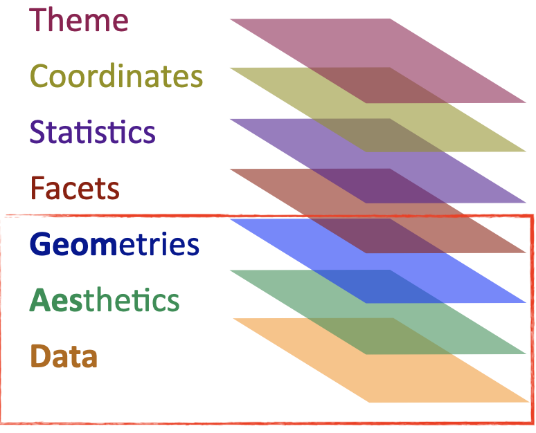

***

This report uses the [R programming language](https://cran.r-project.org/doc/FAQ/R-FAQ.html) [@R] and the following [R libraries](https://r-pkgs.org/intro.html) [@tidyverse;@knitr;@Wickham2016].

```{r, message=FALSE, warning=FALSE}
library(tidyverse)
library(knitr)
library(ggplot2) # we do not actually need to load this because it comes with the tidyverse library
```

***

# Visualizing data

## Recap

Recall the discussions on [visualizing data](https://github.com/bambooforest/IntroDataScience/tree/main/5_data_visualization#visualizing-data) and the [layered graphics principles](https://github.com/bambooforest/IntroDataScience/tree/main/5_data_visualization#layered-graphics) of [data visualization](https://en.wikipedia.org/wiki/Data_visualization).

The basic idea is that you can build data visualizations from data and mappings between the data's variables and aesthetic attributes by plotting them on a [coordinate system](https://en.wikipedia.org/wiki/Coordinate_system).

Here is a cheat sheet describing the process:

* https://github.com/rstudio/cheatsheets/blob/main/data-visualization-2.1.pdf

***

In this course we are using the tidyverse visualization library `ggplot2` [@Wickham2016]. 

The book on using the `ggplot2` library is [*ggplot2: Elegant Graphics for Data Analysis*](https://ggplot2-book.org/index.html).

A simple plot with `ggplot()` needs minimally:

* Data to visualize -- a data frame or tibble!
* Aesthetics -- mappings from aesthetic attributes (e.g., color, shape, size) to geometric objects (e.g., points, lines, bars)
* Geometries -- e.g., dots, lines, boxes

These essential ingredients (bordered in red) for creating a plot with `ggplot()` are illustrated below in a visualization within the layered grammar of graphics [@Wickham2009].



But let's go through each in detail -- but from bottom up.

### Data

A plot is the information you wish to visualized from some source of data. Recall our discussion about the difference between [data and information](https://github.com/bambooforest/IntroDataScience/tree/main/3_data#what-is-data).

Let's use the integrated `diamonds` data set in R. What does a data scientist do? First have a look at the data!

```{r}
?diamonds
str(diamonds)
head(diamonds) %>% kable()
```

Now one way forward is to ask:

* Which kinds of visualizations can we produce?
* Which kind of research questions can be answered on the basis of this data set?


### Geometries

Geometries -- or "geoms" for short -- are fundamental to building visualizations with `ggplot2`. Geoms determine the type of the plot and are labeled like There are [several basic plot types](https://ggplot2-book.org/individual-geoms.html), e.g., but definitely not limited to:

* geom_point() -- produces a scatterplot
* geom_line() -- makes a line plot
* geom_bar(stat = "identity") -- makes a bar chart

<!--
Here is a more comprehensive list:
geom functions	Description
geom_bar	bars with bases on the x axis
geom_boxplot	a box-and-whiskers plot
geom_density	a smooth density estimate calculated by stat_density
geom_histogram	a histogram
geom_line	connects observations ordered by the x value
geom_point	represents observations as points, as in a scatterplot
geom_jitter	points jittered (usually to reduce overplotting)
geom_smooth	adds a smoothed conditional mean
geom_text	adds textual annotations
geom_tile	a tile plane with rectangles
-->

Let's have a look. What are we plotting?

```{r}
ggplot(diamonds, aes(x = carat, y = price)) +
  geom_point()
```

Now, each geom function has mandatory and optional aesthetics. This reference table is taken from @Teutonico2015:


It is important to note that function names may change in programming languages -- so always reference the latest version of the programming language or library that you are using!

The `geom_point()` function requires the `x` and `y` aesthetic, but can additionally take the optional aethestics: `alpha`, `color`, `fill`, `shape`, and `size`. You can use these aesthetics to visualize your data in other ways.

Color? What does it do?

```{r}
ggplot(diamonds, aes(x=carat, y=price, color=clarity)) + 
  geom_point()
```

Each point is colored according to values in the variable `clarity`. Change the variable, change the color's attribute.

```{r}
ggplot(diamonds, aes(x=carat, y=price, color=color)) + 
  geom_point()
```

```{r}
ggplot(diamonds, aes(x=carat, y=price, color=cut)) + 
  geom_point()
```

Some aesthetics can be combined. What's happening here?

```{r}
ggplot(diamonds, aes(x=carat, y=price, color=clarity, size=cut)) + 
  geom_point()
```
What's happening here?

```{r}
ggplot(diamonds, aes(x=carat, y=price, color=clarity, shape=cut)) + 
  geom_point()
```

Geoms can be stacked on top of each other -- one reason they are so powerful. What if you want to visualize a general trend in the data? How about the default [smoothed conditional means](https://ggplot2.tidyverse.org/reference/geom_smooth.html) of the response values of the explanatory variables (aka predictors) (see also [linear regression](https://en.wikipedia.org/wiki/Linear_regression)?

What trend do we see?

```{r}
ggplot(diamonds, aes(x=carat, y=price)) + 
  geom_point() + 
  geom_smooth()
```
Geoms in `ggplot2` have sensible defaults. Above the gray area encompassing the curve is the [confidence interval](https://en.wikipedia.org/wiki/Confidence_interval), which visualized how much uncertainty is in smoothed curve.

Again, we can begin to explore the data from various angles by using combinations of geoms and their aesthetics. For example, so that we can compare multiple trends within the same data set.

```{r}
ggplot(diamonds, aes(x=carat, y=price, color=clarity)) + 
  geom_point() + 
  geom_smooth(se=FALSE)
```
Sometimes the combinations of geoms and their aesthetics can make the picture more or less clear. Data visualization is about achieving clarity (and style) in how you communicate information gleaned from data. Sometimes less is more.

```{r}
ggplot(diamonds, aes(x=carat, y=price, color=clarity)) + 
  geom_smooth(se=FALSE)
```

An important way of making your visualizations clear to your audience is to annotate (aka label) them!

```{r}
ggplot(diamonds, aes(x = carat, y = price)) +
  geom_point() + 
  ggtitle("Number of carets vsrsus their price") +
  xlab("Weight of the dimaon (carats)") +
  ylab("Price in US dollars")
```

And as we've noted before, there are often many different ways to write code that it creates the same output. Keep this in mind when reading other people's code!


### Facets

A powerful tool for exploratory data analysis is [faceting](https://ggplot2-book.org/facet.html) with `ggplot`. 

What happens here?

```{r}
ggplot(diamonds, aes(x=carat, y=price, color=cut)) + 
  geom_point() + 
  facet_wrap(~ clarity)
```

And here? Note the tilde `~` basically means "explained by".

```{r}
ggplot(diamonds, aes(x=carat, y=price, color=cut)) + 
  geom_point() + 
  facet_grid(color ~ clarity)
```


### Statistics

A visualization may also contain **statistical information**, e.g., a regression line, from the data, which is drawn on a specific coordinate system.

We saw an example above.

```{r}
ggplot(diamonds, aes(x=carat, y=price)) + 
  geom_point() + 
  geom_smooth()
```

### Coordinates


### Theme

[Themes](https://ggplot2-book.org/polishing.html) are a way to finely tune your plots. They give you control of things like the background, fonts, text orientation.


## Which plot to use?

It depends on your data.

```{r}

```


Additionally, **faceting** can be used to generate different subplots of a plot by some number of one or more discrete variables.


Let's look at some examples.

*** 


```{r, message=FALSE, warning=FALSE}
library(tidyverse)
library(dslabs)
data(murders)
head(murders)
```

```{r first-example, ggplot-example-plot-0, echo=FALSE}
library(ggthemes)
library(ggrepel)
r <- murders %>% 
  summarize(pop = sum(population), tot = sum(total)) %>% 
  mutate(murder_rate = tot/pop*10^6) %>% .$murder_rate

murders %>% ggplot(aes(x = population/10^6, y = total, label = abb)) +  
  geom_abline(intercept = log10(r), lty=2, col="darkgrey") +
  geom_point(aes(color=region), size = 3) +
  geom_text_repel() + 
  scale_x_log10() +
  scale_y_log10() +
  xlab("Populations in millions (log scale)") + 
  ylab("Total number of murders (log scale)") +
  ggtitle("US Gun Murders in 2010") +
  scale_color_discrete(name = "Region") +
  theme_economist()
```

