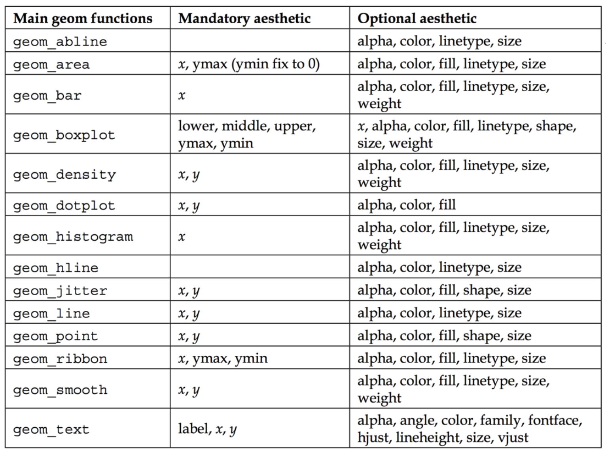
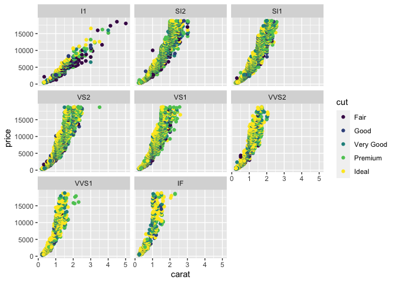

Data visualization II
================
Steven Moran & Alena Witzlack-Makarevich

27 March, 2022

-   [Visualizing data](#visualizing-data)
    -   [Recap](#recap)
    -   [Data](#data)
    -   [Geometries](#geometries)
    -   [Facets](#facets)
    -   [Statistics](#statistics)
    -   [Coordinates](#coordinates)
    -   [Theme](#theme)
-   [Visualizations](#visualizations)
    -   [Which plot(s) to use?](#which-plots-to-use)
    -   [Putting it all together: an
        example](#putting-it-all-together-an-example)
-   [Data practical](#data-practical)
-   [References](#references)

------------------------------------------------------------------------

This report uses the [R programming
language](https://cran.r-project.org/doc/FAQ/R-FAQ.html) (R Core Team
2021) and the following [R libraries](https://r-pkgs.org/intro.html)
(Wickham et al. 2019; Xie 2021; Irizarry and Gill 2021; Arnold 2021;
Slowikowski 2021).

``` r
library(tidyverse)
library(knitr)
library(dslabs)
library(ggthemes)
library(ggrepel)
```

------------------------------------------------------------------------

# Visualizing data

## Recap

Recall the discussions on [visualizing
data](https://github.com/bambooforest/IntroDataScience/tree/main/5_data_visualization#visualizing-data)
and the [layered graphics
principles](https://github.com/bambooforest/IntroDataScience/tree/main/5_data_visualization#layered-graphics)
of [data
visualization](https://en.wikipedia.org/wiki/Data_visualization).

The basic idea is that you can build data visualizations from data and
mappings between the data’s variables and aesthetic attributes by
plotting them on a [coordinate
system](https://en.wikipedia.org/wiki/Coordinate_system).

Here is a cheat sheet describing the process:

-   <https://github.com/rstudio/cheatsheets/blob/main/data-visualization-2.1.pdf>

------------------------------------------------------------------------

In this course we are using the tidyverse visualization library
`ggplot2` (Wickham 2016).

The book on using the `ggplot2` library is [*ggplot2: Elegant Graphics
for Data Analysis*](https://ggplot2-book.org/index.html).

A simple plot with `ggplot()` needs minimally:

-   Data to visualize – a data frame or tibble!
-   Aesthetics – mappings from aesthetic attributes (e.g., color, shape,
    size) to geometric objects (e.g., points, lines, bars)
-   Geometries – e.g., dots, lines, boxes

These essential ingredients (bordered in red) for creating a plot with
`ggplot()` are illustrated below in a visualization within the layered
grammar of graphics (Wickham 2009).


But let’s go through each in detail – but from bottom up.

## Data

A plot is the information you wish to visualized from some source of
data. Recall our discussion about the difference between [data and
information](https://github.com/bambooforest/IntroDataScience/tree/main/3_data#what-is-data).

Let’s use the integrated `diamonds` data set in R. What does a data
scientist do? First have a look at the data!

``` r
?diamonds
str(diamonds)
```

    ## tibble [53,940 × 10] (S3: tbl_df/tbl/data.frame)
    ##  $ carat  : num [1:53940] 0.23 0.21 0.23 0.29 0.31 0.24 0.24 0.26 0.22 0.23 ...
    ##  $ cut    : Ord.factor w/ 5 levels "Fair"<"Good"<..: 5 4 2 4 2 3 3 3 1 3 ...
    ##  $ color  : Ord.factor w/ 7 levels "D"<"E"<"F"<"G"<..: 2 2 2 6 7 7 6 5 2 5 ...
    ##  $ clarity: Ord.factor w/ 8 levels "I1"<"SI2"<"SI1"<..: 2 3 5 4 2 6 7 3 4 5 ...
    ##  $ depth  : num [1:53940] 61.5 59.8 56.9 62.4 63.3 62.8 62.3 61.9 65.1 59.4 ...
    ##  $ table  : num [1:53940] 55 61 65 58 58 57 57 55 61 61 ...
    ##  $ price  : int [1:53940] 326 326 327 334 335 336 336 337 337 338 ...
    ##  $ x      : num [1:53940] 3.95 3.89 4.05 4.2 4.34 3.94 3.95 4.07 3.87 4 ...
    ##  $ y      : num [1:53940] 3.98 3.84 4.07 4.23 4.35 3.96 3.98 4.11 3.78 4.05 ...
    ##  $ z      : num [1:53940] 2.43 2.31 2.31 2.63 2.75 2.48 2.47 2.53 2.49 2.39 ...

``` r
head(diamonds) %>% kable()
```

| carat | cut       | color | clarity | depth | table | price |    x |    y |    z |
|------:|:----------|:------|:--------|------:|------:|------:|-----:|-----:|-----:|
|  0.23 | Ideal     | E     | SI2     |  61.5 |    55 |   326 | 3.95 | 3.98 | 2.43 |
|  0.21 | Premium   | E     | SI1     |  59.8 |    61 |   326 | 3.89 | 3.84 | 2.31 |
|  0.23 | Good      | E     | VS1     |  56.9 |    65 |   327 | 4.05 | 4.07 | 2.31 |
|  0.29 | Premium   | I     | VS2     |  62.4 |    58 |   334 | 4.20 | 4.23 | 2.63 |
|  0.31 | Good      | J     | SI2     |  63.3 |    58 |   335 | 4.34 | 4.35 | 2.75 |
|  0.24 | Very Good | J     | VVS2    |  62.8 |    57 |   336 | 3.94 | 3.96 | 2.48 |

Now one way forward is to ask:

-   Which kinds of visualizations can we produce?
-   Which kind of research questions can be answered on the basis of
    this data set?

## Geometries

Geometries – or “geoms” for short – are fundamental to building
visualizations with `ggplot2`. Geoms determine the type of the plot and
are labeled like There are [several basic plot
types](https://ggplot2-book.org/individual-geoms.html), e.g., but
definitely not limited to:

-   geom_point() – produces a scatterplot
-   geom_line() – makes a line plot
-   geom_bar(stat = “identity”) – makes a bar chart

<!--
Here is a more comprehensive list:
geom functions  Description
geom_bar    bars with bases on the x axis
geom_boxplot    a box-and-whiskers plot
geom_density    a smooth density estimate calculated by stat_density
geom_histogram  a histogram
geom_line   connects observations ordered by the x value
geom_point  represents observations as points, as in a scatterplot
geom_jitter points jittered (usually to reduce overplotting)
geom_smooth adds a smoothed conditional mean
geom_text   adds textual annotations
geom_tile   a tile plane with rectangles
-->

Let’s have a look. What are we plotting?

``` r
ggplot(diamonds, aes(x = carat, y = price)) +
  geom_point()
```

<!-- -->

Now, each geom function has mandatory and optional aesthetics. This
reference table is taken from Teutonico (2015):



It is important to note that function names may change in programming
languages – so always reference the latest version of the programming
language or library that you are using!

The `geom_point()` function requires the `x` and `y` aesthetic, but can
additionally take the optional aethestics: `alpha`, `color`, `fill`,
`shape`, and `size`. You can use these aesthetics to visualize your data
in other ways.

Color? What does it do?

``` r
ggplot(diamonds, aes(x=carat, y=price, color=clarity)) + 
  geom_point()
```

<!-- -->

Each point is colored according to values in the variable `clarity`.
Change the variable, change the color’s attribute.

``` r
ggplot(diamonds, aes(x=carat, y=price, color=color)) + 
  geom_point()
```

<!-- -->

``` r
ggplot(diamonds, aes(x=carat, y=price, color=cut)) + 
  geom_point()
```

<!-- -->

Some aesthetics can be combined. What’s happening here?

``` r
ggplot(diamonds, aes(x=carat, y=price, color=clarity, size=cut)) + 
  geom_point()
```

<!-- --> What’s
happening here?

``` r
ggplot(diamonds, aes(x=carat, y=price, color=clarity, shape=cut)) + 
  geom_point()
```

    ## Warning: Using shapes for an ordinal variable is not advised

<!-- -->

Geoms can be stacked on top of each other – one reason they are so
powerful. What if you want to visualize a general trend in the data? How
about the default [smoothed conditional
means](https://ggplot2.tidyverse.org/reference/geom_smooth.html) of the
response values of the explanatory variables (aka predictors) (see also
[linear regression](https://en.wikipedia.org/wiki/Linear_regression)?

What trend do we see?

``` r
ggplot(diamonds, aes(x=carat, y=price)) + 
  geom_point() + 
  geom_smooth()
```

    ## `geom_smooth()` using method = 'gam' and formula 'y ~ s(x, bs = "cs")'

<!-- --> Geoms in
`ggplot2` have sensible defaults. Above the gray area encompassing the
curve is the [confidence
interval](https://en.wikipedia.org/wiki/Confidence_interval), which
visualized how much uncertainty is in smoothed curve.

Again, we can begin to explore the data from various angles by using
combinations of geoms and their aesthetics. For example, so that we can
compare multiple trends within the same data set.

``` r
ggplot(diamonds, aes(x=carat, y=price, color=clarity)) + 
  geom_point() + 
  geom_smooth(se=FALSE)
```

    ## `geom_smooth()` using method = 'gam' and formula 'y ~ s(x, bs = "cs")'

<!-- --> Sometimes
the combinations of geoms and their aesthetics can make the picture more
or less clear. Data visualization is about achieving clarity (and style)
in how you communicate information gleaned from data. Sometimes less is
more.

``` r
ggplot(diamonds, aes(x=carat, y=price, color=clarity)) + 
  geom_smooth(se=FALSE)
```

    ## `geom_smooth()` using method = 'gam' and formula 'y ~ s(x, bs = "cs")'

<!-- -->

An important way of making your visualizations clear to your audience is
to annotate (aka label) them!

``` r
ggplot(diamonds, aes(x = carat, y = price)) +
  geom_point() + 
  ggtitle("Number of carets vsrsus their price") +
  xlab("Weight of the dimaon (carats)") +
  ylab("Price in US dollars")
```

<!-- -->

And as we’ve noted before, there are often many different ways to write
code that it creates the same output. Keep this in mind when reading
other people’s code!

## Facets

A powerful tool for exploratory data analysis is
[faceting](https://ggplot2-book.org/facet.html) with `ggplot`.
Additionally, **faceting** can be used to generate different subplots of
a plot by some number of one or more discrete variables.

What happens here?

``` r
ggplot(diamonds, aes(x=carat, y=price, color=cut)) + 
  geom_point() + 
  facet_wrap(~ clarity)
```

<!-- -->

And here? Note the tilde `~` basically means “explained by.”

``` r
ggplot(diamonds, aes(x=carat, y=price, color=cut)) + 
  geom_point() + 
  facet_grid(color ~ clarity)
```

<!-- -->

## Statistics

A visualization may also contain **statistical information**, e.g., a
regression line, from the data, which is drawn on a specific coordinate
system.

We saw an example above that illustrates how to layer multiple geoms
together.

``` r
ggplot(diamonds, aes(x=carat, y=price)) + 
  geom_point() + 
  geom_smooth()
```

    ## `geom_smooth()` using method = 'gam' and formula 'y ~ s(x, bs = "cs")'

<!-- -->

## Coordinates

[Coordinate systems](https://en.wikipedia.org/wiki/Coordinate_system) in
`ggplot2` [have two purposes](https://ggplot2-book.org/coord.html)
(Wickham 2016):

-   “Combine the two position aesthetics to produce a 2d position on the
    plot.”
-   “In coordination with the faceter, coordinate systems draw axes and
    panel backgrounds.”

Coordinate systems in `ggplot2` come in two types:

-   Linear – they preserve the shape of geoms
-   Non-linear – they can change their shapes

These are advanced techniques and when you think you need them, you
should probably study them in detail. There’s a free online book for
that (Wickham 2016):

-   <https://ggplot2-book.org/>
-   <https://ggplot2-book.org/coord.html>

But note they also include functions for things like [map
projection](https://en.wikipedia.org/wiki/Map_projection). Note also
that in R, like most (or all) programming languages, there’s lots of
libraries to do the same things.

Remember to search for it and you’ll find lots of results (as of writing
79 million plus hits):

-   <https://www.google.com/search?client=safari&rls=en&q=how+to+make+geographic+maps+in+R&ie=UTF-8&oe=UTF-8>

Here’s a simple example that plots the languages of the world on a
simple map.

Let’s get the data from the \[Glottolog\]

``` r
df <- read_csv(url('https://cdstar.eva.mpg.de/bitstreams/EAEA0-F8BB-0AB6-96FA-0/languages_and_dialects_geo.csv'))
```

Let’s have a look. What are the variables?

``` r
head(df)
```

    ## # A tibble: 6 × 7
    ##   glottocode name       isocodes level    macroarea latitude longitude
    ##   <chr>      <chr>      <chr>    <chr>    <chr>        <dbl>     <dbl>
    ## 1 3adt1234   3Ad-Tekles <NA>     dialect  Africa       NA         NA  
    ## 2 aala1237   Aalawa     <NA>     dialect  Papunesia    NA         NA  
    ## 3 aant1238   Aantantara <NA>     dialect  Papunesia    NA         NA  
    ## 4 aari1239   Aari       aiw      language Africa        5.95      36.6
    ## 5 aari1240   Aariya     aay      language Eurasia      NA         NA  
    ## 6 aasa1238   Aasax      aas      language Africa       -4.01      36.9

What kind of levels are there?

``` r
table(df$level)
```

    ## 
    ##  dialect language 
    ##    12959     8549

Let’s filter out just
[languages](https://en.wikipedia.org/wiki/Language) and drop
[dialects](https://en.wikipedia.org/wiki/Dialect).

``` r
df <- df %>% filter(level == "language")
```

And here is some simple code to plot languages as dots on a world map in
mercator projection.

``` r
ggplot(data=df, aes(x=longitude,y=latitude)) + 
  borders("world", colour="gray50", fill="gray50") + 
  geom_point()
```

    ## Warning: Removed 323 rows containing missing values (geom_point).

<!-- --> Want to add
some color? You need a variable for that.

``` r
ggplot(data=df, aes(x=longitude,y=latitude, color=macroarea)) + 
  borders("world", colour="gray50", fill="gray50") + 
  geom_point()
```

    ## Warning: Removed 323 rows containing missing values (geom_point).

<!-- -->

## Theme

[Themes](https://ggplot2-book.org/polishing.html) are a way to finely
tune your plots. They give you control of things like the background,
fonts, text orientation.

Default theme in `ggplot2` looks like this. Learn how to read a [box
plot](https://towardsdatascience.com/understanding-boxplots-5e2df7bcbd51)?

``` r
atheletes <- read_csv('../4_data_wrangling/datasets/athletes.csv')
```

    ## Rows: 2859 Columns: 12
    ## ── Column specification ────────────────────────────────────────────────────────
    ## Delimiter: ","
    ## chr  (4): gender, name, sport, country
    ## dbl  (7): age, height, weight, gold_medals, silver_medals, bronze_medals, to...
    ## date (1): birthdate
    ## 
    ## ℹ Use `spec()` to retrieve the full column specification for this data.
    ## ℹ Specify the column types or set `show_col_types = FALSE` to quiet this message.

``` r
ggplot(data=atheletes, aes(x = gender, y = weight)) +
  geom_boxplot()
```

    ## Warning: Removed 378 rows containing non-finite values (stat_boxplot).

<!-- -->

But you can change the theme with `theme_x`

``` r
ggplot(data=atheletes, aes(x = gender, y = weight)) +
  geom_boxplot() +
  theme_minimal()
```

    ## Warning: Removed 378 rows containing non-finite values (stat_boxplot).

<!-- -->

``` r
ggplot(data=atheletes, aes(x = gender, y = weight)) +
  geom_boxplot() +
  theme_dark()
```

    ## Warning: Removed 378 rows containing non-finite values (stat_boxplot).

<!-- -->

``` r
ggplot(data=atheletes, aes(x = gender, y = weight)) +
  geom_boxplot() +
  theme_classic()
```

    ## Warning: Removed 378 rows containing non-finite values (stat_boxplot).

<!-- -->

``` r
library(ggthemes)
ggplot(data=atheletes, aes(x = gender, y = weight)) +
  geom_boxplot() +
  theme_tufte(ticks = FALSE)
```

    ## Warning: Removed 378 rows containing non-finite values (stat_boxplot).

<!-- -->

But as we’ve said now multiple times, there’s always different ways of
producing the same things when coding. And there’s usually libraries to
help with that! For example, check out the
[ggthemes](https://yutannihilation.github.io/allYourFigureAreBelongToUs/ggthemes/)
library.

------------------------------------------------------------------------

How about changing colors? Here is a
[histogram](https://en.wikipedia.org/wiki/Histogram) with default colors
in `ggplot2`.

``` r
ggplot(atheletes, aes(x=weight, fill=gender)) + 
  geom_histogram()
```

    ## `stat_bin()` using `bins = 30`. Pick better value with `binwidth`.

    ## Warning: Removed 378 rows containing non-finite values (stat_bin).

<!-- -->

``` r
ggplot(atheletes, aes(x=weight)) + 
  geom_histogram(aes(fill=gender), position = "identity") +
  scale_fill_manual(values = c("#00AFBB", "#E7B800"))
```

    ## `stat_bin()` using `bins = 30`. Pick better value with `binwidth`.

    ## Warning: Removed 378 rows containing non-finite values (stat_bin).

<!-- -->

And maybe instead of a histogram you want a [density
plot](https://www.data-to-viz.com/graph/density.html) to check the
distribution of some variable(s)?

``` r
ggplot(diamonds, aes(x=price, fill=cut)) + geom_histogram()
```

    ## `stat_bin()` using `bins = 30`. Pick better value with `binwidth`.

<!-- -->

``` r
ggplot(diamonds, aes(x=price)) + geom_density()
```

<!-- -->

``` r
ggplot(diamonds, aes(x=price, color=cut)) + geom_density()
```

<!-- -->

# Visualizations

## Which plot(s) to use?

It depends on your data and the data types in your data. Here is a great
visualization and great site that gives you a [decision
tree](https://en.wikipedia.org/wiki/Decision_tree) so that you can
decide what kind of visualization best fits your data and which caveats
you should avoid when creating those visualizations:

-   <https://www.data-to-viz.com>

First you need to know your data type, e.g., are you working with
numeric or categorical data? Then ask how many variables you are working
with, e.g., one or two or more categorical variables. If you have one
categorical variable, for example, your data set is very simple and you
can use a bar plot. If you have two or more categorical values, are they
independent, nested, etc.? If you have a numerical and categorical
variable, in what relation do they stand to each other? Is there order?

Note also the caveats!

-   <https://www.data-to-viz.com/caveats.html>

Remember, you want your visualizations to tell a story. And there are a
lot of visualization graphics out there!

-   <https://www.data-to-viz.com/#story>

## Putting it all together: an example

This data visualization below incorporates various libraries to produce
a professional looking image. The plot comes from code from this
[Introduction to Data Science
Repository](https://github.com/datasciencelabs) in this awesome
[class](https://datasciencelabs.github.io/pages/syllabus.html) from this
[lecture](https://github.com/datasciencelabs/2021/blob/master/04_data_visualization/02_gapminder.Rmd).
Lots of good materials in that course – check it out!

The R libraries that we will use (R Core Team 2021).

``` r
library(tidyverse)
library(dslabs)
library(ggthemes)
library(ggrepel)
```

Load the `murders` data from from the `dslabs` library (Irizarry and
Gill 2021). The data set includes reports the number of US gun murders
by state for 2010 as reported by the
[FBI](https://en.wikipedia.org/wiki/Federal_Bureau_of_Investigation). It
also contains population counts for each state (2010).

``` r
data(murders)
head(murders)
```

    ##        state abb region population total
    ## 1    Alabama  AL  South    4779736   135
    ## 2     Alaska  AK   West     710231    19
    ## 3    Arizona  AZ   West    6392017   232
    ## 4   Arkansas  AR  South    2915918    93
    ## 5 California  CA   West   37253956  1257
    ## 6   Colorado  CO   West    5029196    65

``` r
str(murders)
```

    ## 'data.frame':    51 obs. of  5 variables:
    ##  $ state     : chr  "Alabama" "Alaska" "Arizona" "Arkansas" ...
    ##  $ abb       : chr  "AL" "AK" "AZ" "AR" ...
    ##  $ region    : Factor w/ 4 levels "Northeast","South",..: 2 4 4 2 4 4 1 2 2 2 ...
    ##  $ population: num  4779736 710231 6392017 2915918 37253956 ...
    ##  $ total     : num  135 19 232 93 1257 ...

The data set contains variables for:

-   Character vector for US states
-   Character vector for abbreviations of each US state
-   The region in which the state (four categorical values including:
    Northeast, South, North Central, and West)
-   Numerical values for the US state’s population
-   Numerical values for the total number of gun murders in each state

The data manipulation. Here we calculate the [r correlation
coefficient](https://en.wikipedia.org/wiki/Correlation_coefficient).

``` r
r <- murders %>% 
  summarize(pop = sum(population), tot = sum(total)) %>% 
  mutate(murder_rate = tot/pop*10^6) %>% .$murder_rate
```

And now the visualization.

``` r
murders %>% ggplot(aes(x = population/10^6, y = total, label = abb)) +  
  geom_abline(intercept = log10(r), lty=2, col="darkgrey") +
  geom_point(aes(color=region), size = 3) +
  geom_text_repel() + 
  scale_x_log10() +
  scale_y_log10() +
  xlab("Populations in millions (log scale)") + 
  ylab("Total number of murders (log scale)") +
  ggtitle("US Gun Murders in 2010") +
  scale_color_discrete(name = "Region") +
  theme_economist()
```

<!-- -->

We plot the relationship between total number of murders (in
[logorathmic scale](https://en.wikipedia.org/wiki/Logarithmic_scale))
versus the population in [US
states](https://en.wikipedia.org/wiki/U.S._state) (log scale) and color
code each state for region. There is a trend that more populous states
tend to have more murders.

# Data practical

-   Load some data (sets) and describe your data and its variables
-   Formulate two questions about the data that you want to visualize
-   [Decide how to visualize your
    variables](https://www.data-to-viz.com)
-   Convert your data types if needed, e.g., [to
    factors](https://swcarpentry.github.io/r-novice-inflammation/12-supp-factors/index.html)
-   Create your plots and explain in prose what the data visualizes (see
    example above)

# References

<div id="refs" class="references csl-bib-body hanging-indent">

<div id="ref-ggthemes" class="csl-entry">

Arnold, Jeffrey B. 2021. *Ggthemes: Extra Themes, Scales and Geoms for
’Ggplot2’*. <https://CRAN.R-project.org/package=ggthemes>.

</div>

<div id="ref-IrizarryGill2021" class="csl-entry">

Irizarry, Rafael A., and Amy Gill. 2021. *Dslabs: Data Science Labs*.
<https://CRAN.R-project.org/package=dslabs>.

</div>

<div id="ref-R" class="csl-entry">

R Core Team. 2021. *R: A Language and Environment for Statistical
Computing*. Vienna, Austria: R Foundation for Statistical Computing.
<https://www.R-project.org/>.

</div>

<div id="ref-ggrepel" class="csl-entry">

Slowikowski, Kamil. 2021. *Ggrepel: Automatically Position
Non-Overlapping Text Labels with ’Ggplot2’*.
<https://CRAN.R-project.org/package=ggrepel>.

</div>

<div id="ref-Teutonico2015" class="csl-entry">

Teutonico, Donato. 2015. *Ggplot2 Essentials*. Packt Publishing Ltd.

</div>

<div id="ref-Wickham2009" class="csl-entry">

Wickham, Hadley. 2009. *Ggplot: Using the Grammar of Graphics with r*.

</div>

<div id="ref-Wickham2016" class="csl-entry">

———. 2016. *Ggplot2: Elegant Graphics for Data Analysis*.
Springer-Verlag New York. <https://ggplot2.tidyverse.org>.

</div>

<div id="ref-tidyverse" class="csl-entry">

Wickham, Hadley, Mara Averick, Jennifer Bryan, Winston Chang, Lucy
D’Agostino McGowan, Romain François, Garrett Grolemund, et al. 2019.
“Welcome to the <span class="nocase">tidyverse</span>.” *Journal of Open
Source Software* 4 (43): 1686. <https://doi.org/10.21105/joss.01686>.

</div>

<div id="ref-knitr" class="csl-entry">

Xie, Yihui. 2021. *Knitr: A General-Purpose Package for Dynamic Report
Generation in r*. <https://yihui.org/knitr/>.

</div>

</div>
