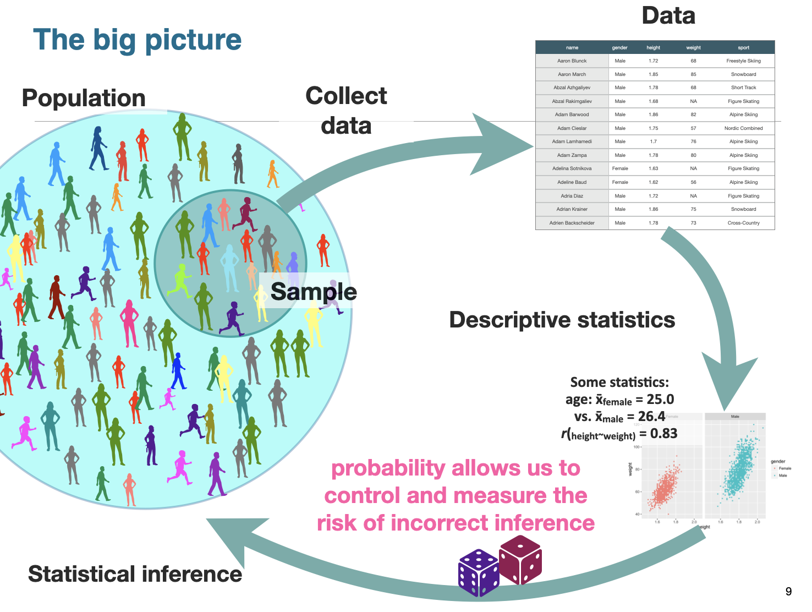
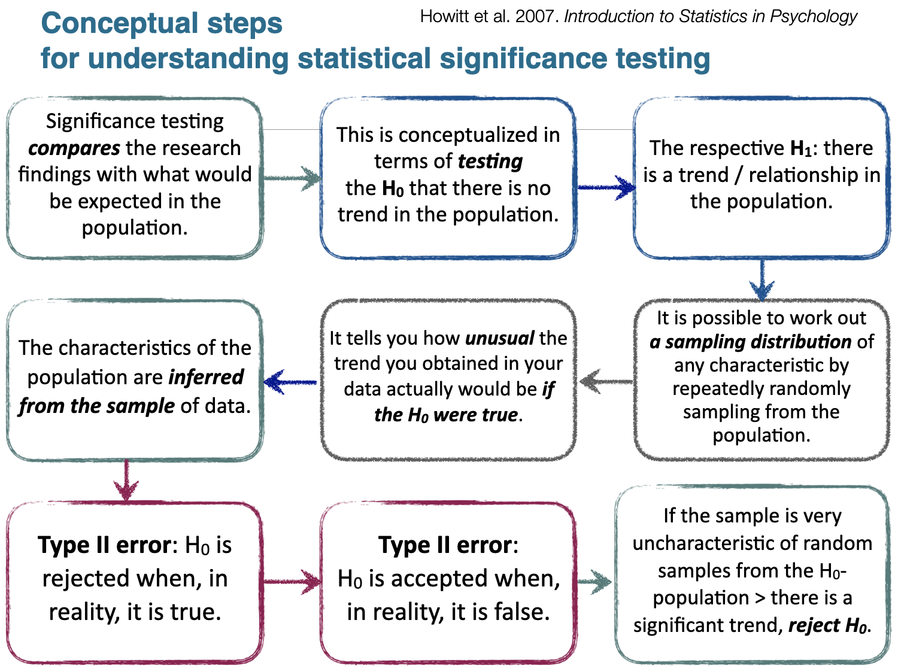
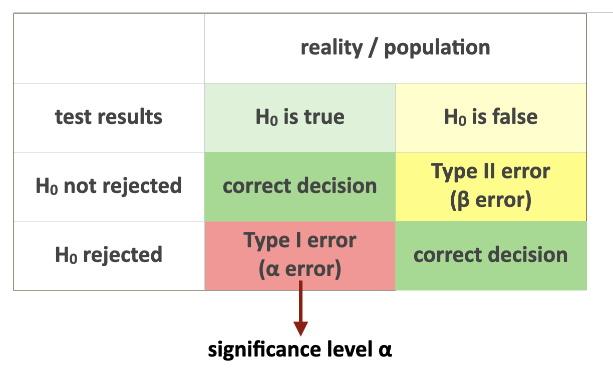
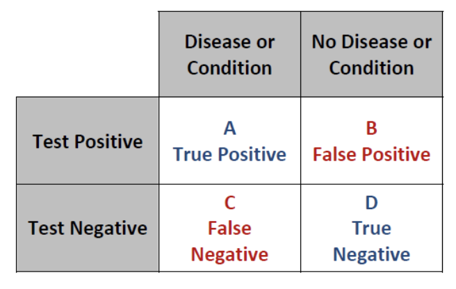
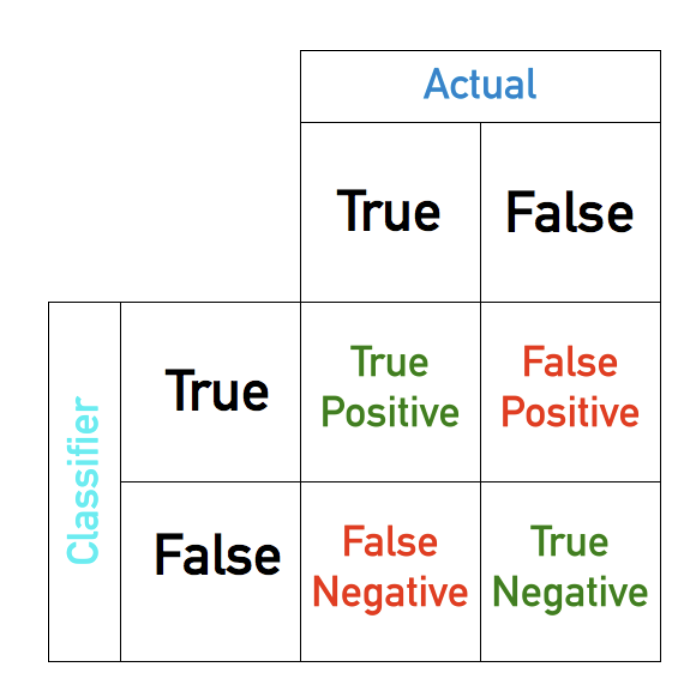
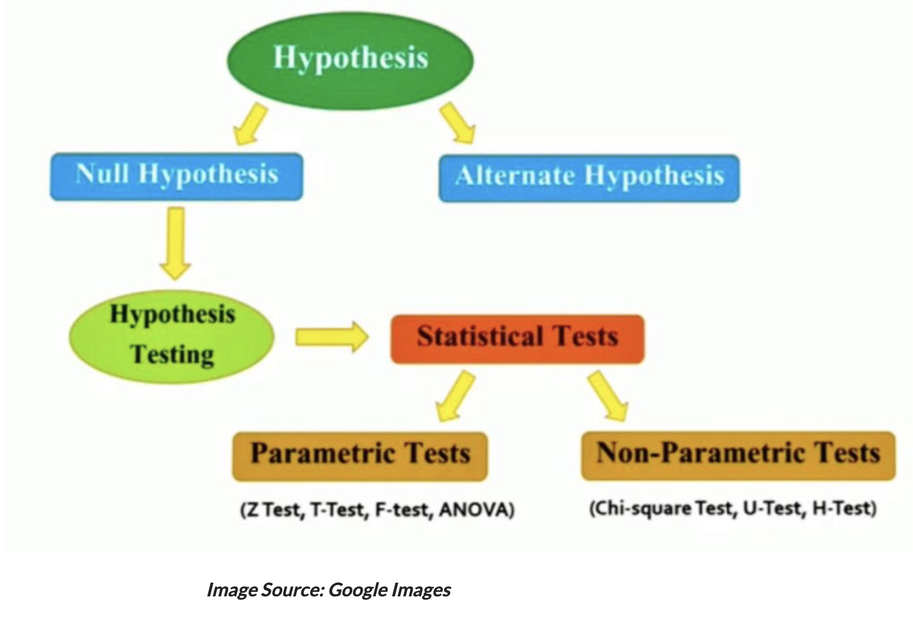

***

This report uses the [R programming language](https://cran.r-project.org/doc/FAQ/R-FAQ.html) [@R] and the following [R libraries](https://r-pkgs.org/intro.html) [@tidyverse;@knitr].

```{r, message=FALSE, warning=FALSE}
library(tidyverse)
library(knitr)
```

***

# Recap

So far we've talked about:

* Markdown for communication
* Data vs information
* Data types (from the programming and statistics sides)
* Data wrangling, i.e., data transformation
* Data visualization

These topics give us the skills to do various things with data, including:

* Importing
* Tidying
* Transforming
* Visualizing

These skills helps us undertake exploratory and descriptive analyses.


# Modeling

The next step is to **model** data. Scientists are interested in discovering/understanding something about real world phenomena. Three types of goals:

* Describe
* Explain
* Predict

One goal of data modeling is to provide a summary of a data set, i.e., describe it. Another is to come up with hypotheses for descriptive and inference purposes.

One purpose of descriptive statistics is to efficiently summarize information for visual purposes. Descriptive statistics use [summary statistics](https://en.wikipedia.org/wiki/Summary_statistics) to summarize a set of observations, including for example:

* [Central tendency](https://en.wikipedia.org/wiki/Central_tendency)
* [Dispersion](https://en.wikipedia.org/wiki/Statistical_dispersion)
* [Shape of the distribution](https://en.wikipedia.org/wiki/List_of_probability_distributions)
* [Statistical dependence](https://en.wikipedia.org/wiki/Correlation)

Statistical inference methods allow you to draw a conclusion, i.e., you infer something, about your data. This allows us to do things like fit statistical models and understand how they work and what they tell us about our data, so that we can test our hypotheses.

Here is the big picture.



***

**As data scientists, we may or may not be seasoned statisticians!**

One confusing aspect for scientists without a statistics background is: **which statistical test to use?** This question involves asking what are the relevant assumptions of the common statistical tests and when should I use which?

To answer which kind of statistical test you should use, first you need to answer what kind of distribution your data follows. Different tests assume different distributions. In other words, how is your data shaped?

And like our [discussion on which plots to use](https://github.com/bambooforest/IntroDataScience/tree/main/6_data_visualization#which-plots-to-use) to visualize you data, you also need to know what your data types are, how many variable you have, and how you are testing them, e.g., are you comparing two distributions?

***

@Janert2010 asks, "what you really need to know about classical statistics, in the [excellent book](https://www.oreilly.com/library/view/data-analysis-with/9781449389802/), *Data analysis with open source tools*. Janert writes:

>>> BASIC CLASSICAL STATISTICS HAS ALWAYS BEEN SOMEWHAT OF A MYSTERY TO ME: A TOPIC FULL OF OBSCURE notions, such as t-tests and p-values, and confusing statements like "we fail to reject the null hypothesis"-—which I can read several times and still not know if it is saying yes, no, or maybe.* To top it all off, all this formidable machinery is then used to draw conclusions that don’t seem to be all that interesting—it’s usually something about whether the means of two data sets are the same or different. Why would I care?

>>> Eventually I figured it out, and I also figured out why the field seemed so obscure initially. In this chapter, I want to explain what classical statistics does, why it is the way it is, and what it is good for. This chapter does not attempt to teach you how to perform any of the typical statistical methods: this would require a separate book. (I will make some recommendations for further reading on this topic at the end of this chapter.) Instead, in this chapter I will tell you what all these other books omit.

>>> Let me take you on a trip. I hope you know where your towel is.

>>> *I am not alone—even professional statisticians have the same experience. See, for example, the preface of Bayesian Statistics. Peter M. Lee. Hodder & Arnold. 2004.

This chapter is totally worth reading! (So is the whole book.)

It describes, for example, how classical statistics came about -- in the late 19th and early 20th centuries by a small group of people, mostly in Great Britain, working for example at Guinness and in agriculture. They had:

* No computational capabilities
* No graphing capabilities
* Very small and very expensive data sets

Their situation, as Janert notes, was basically the opposite of what we have today. Given their limitations, it took a great deal of ingenuity to solve problems that we -- for the most part -- no longer have, e.g.:

* We have lots of computing power
* We have lots of graphing capabilities
* There's lots of data out there

Instead, today's modern statistics is largely focused on areas like Bayesian reasoning, non-parametric tests, resampling, and simulations.

Nevertheless, statistics typically deals with drawing conclusions about a population by using a representative sample of that population.

* A **population** consists of all the scores of some specified group of interest (in texts one uses N to refer to it)
* A **sample** is a subset of a population (n)

Samples are used most often because we are rarely able to study every object in a population (e.g. every person in the world or in a country, every language, every sentence ever produced).

When properties of the population are inferred from a sample, we are undertaking statistical inference.

***

**Population or sample?**

1. A principal of a large high school asked five teachers about the conditions in the teachers’ lounge.

* What is the sample?
* What is the population?

2. A poll taken in October 2004, which was funded by the European Union, found that 50.8% of the 8,075 married women surveyed in Turkey were married without their consent.

* What is the sample?
* What is the population?

3. Determine whether the data set is a population or a sample. Explain your reasoning.

* 1. The height of each player on a school’s basketball team
* 2. The amount of energy collected from every wind turbine on a wind farm 
* 3. A survey of 500 spectators from a stadium with 42,000 spectators
* 4. The annual salary of each pharmacist at a pharmacy
* 5. The cholesterol levels of 20 patients in a hospital with 100 patients
* 6. The number of televisions in each U.S. household
* 7. The final score of each golfer in a tournament
* 8. The age of every third person entering a clothing store
* 9. The political party of every U.S. president
* 10. The soil contamination levels at 10 locations near a landfill

***

@Nolan2011 define two main branches of modern statistics (not ot be confused with the defintions by @Janert2010 above):

* **Descriptive statistics** organize, summarize, and communicate a group of numerical observations. 
  * Descriptive statistics describe large amounts of data in a single number or in just a few numbers.
  * A single number reporting e.g. the average is often far more useful and easier to grasp than a long list of the numbers.

* **Inferential statistics** use sample data to make general estimates about the larger population. 
  * Inferential statistics infer, or make an intelligent guess about, the whole population, i.e. also about the objects not included into the study.

<!-- Descriptive statistics involve quantitatively describing or summarizing features of a data set. They often include [non-parametric statistics](https://en.wikipedia.org/wiki/Nonparametric_statistics). Inferential statistics ... -->

***

Statistical modeling is an attempt to describe some part of the real world in mathematical terms.

Recall our discussion on [data types in statistics](https://github.com/bambooforest/IntroDataScience/tree/main/3_data#data-types-in-statistics).

The independent variable (predictor variable) is the variable that is being manipulated, so that we can observe if there is an effect on the dependent variable (outcome variable).

* Independent variable(s) -- Predictor variable(s)
* Dependent variable(s) -- Outcome/Output variable(s)

The relevant mathematical concept is the one of **function**. Consider for example the input of `height` and output of `weight` with our `atheletes` data.

```{r}
athletes <- read_csv('../4_data_wrangling/datasets/athletes.csv')
head(athletes) %>% kable()
```

One way to look at that relationship is to plot the input on the x-axis and the output on the y-axis in a scatter plot.

```{r}
ggplot(athletes, aes(height, weight)) +
  geom_point()
```

One way to test whether there is a relationship is to use linear regression.

```{r}
ggplot(athletes, aes(height, weight)) +
  geom_point() +
  geom_smooth(method='lm')
```

Like other statistical tests, you will have to know the (four) main assumptions for linear regression, i.e.:

* Independence of observations (aka no autocorrelation)
* Normality
* Linearity
* Homoscedasticity (aka homogeneity of variance)

We will talk more about linear models in the follow weeks, but here is a good and simple overview:

* https://www.scribbr.com/statistics/linear-regression-in-r/

For height and weight, we only have one independent variable and one dependent variable for each athlete, so we don’t need to test for any hidden relationships the among variables. In other words, we have independence of observations.

We need to check if the dependent variable is normally distributed. We can quickly visualize it. Is it normal?

```{r}
hist(athletes$height)
```

As we saw avove, the data are linearly distributed. Here's another way to quickly visualize the x and y variables.

```{r}
plot(weight ~ height, data = athletes)
```
Homoscedasticity means that the prediction error does not change significantly over the range of prediction of the model. We will discuss this more in the coming weeks -- as well as what the output means.

```{r}
lm <- lm(weight ~ height, data = athletes)
summary(lm)
```

We can say there is a significant positive relationship between height and weight of these athletes (p-value < 0.001).

***

Statistical tests are about interpreting data. If we want to interpret our data with formal procedures and to make claims about the distribution of our data or whether two data sets differ fundamentally from each other, then we rely on hypothesis testing.


# Hypothesis testing

Hypothesis testing is a way to interpret and draw conclusions about the [population](https://en.wikipedia.org/wiki/Statistical_population) of a [sample](https://en.wikipedia.org/wiki/Sample_(statistics)) of data.

* https://www.scribbr.com/statistics/hypothesis-testing/
* https://towardsdatascience.com/hypothesis-testing-in-real-life-47f42420b1f7
* http://www.biostathandbook.com/hypothesistesting.html

The logic of hypothesis testing is as follows. After we have identified the H0 and H1, we can do only one of two things:

* (a) reject the H0 in favor of the H1 
* (b) fail to reject H0 and thus keep it

Null hypothesis testing corresponds to a *reductio ad absurdum* argument in logic, i.e., a claim is assumed valid if its counterclaim is improbable.

The procedure for deciding is roughly as follows:

* Take a random sample from the population
* Assume that H0 holds
* If the sample data are consistent with the H0, keep H0
* If the sample data are inconsistent with the H0, reject the H0 in favor of the H1.

The procedure was originally developed by the English statistician Ronald Fisher in *The Design of Experiments* (1935). The book is considered a foundational work in experimental design, i.e., it introduced the concept of the null hypothesis.

Contemporary science is based on the logic of falsification: it is impossible to prove that something is right, but it is possible to reject the opposite. 

In other words -- although H0 cannot be proven true, H0 can be proven false.

A simple example: if someone claims that all swans are white, confirmatory evidence (in the form of lots of white swans) cannot prove the assertion to be true. However, contradictory evidence (in the form of a single black swan) makes it clear that the claim is invalid.



***

**Type I and type II errors**

In general:



In medical statistics, false positives and false negatives are concepts analogous to type I and type II errors in statistical hypothesis testing:



And in machine learning e.g., for a classifier spam vs. not spam:




<!-- 
Type I and type II errors:

* Type I error is that we incorrectly reject the null hypothesis

* Type II error occurs when we incorrectly accept the null hypothesis

Decision (y) / reality (x)	H0 is true	H0 is false
accept H0	correct	Type II error
reject H0	Type I error	correct

False positives and false negatives

Airport Security: a "false positive" is when ordinary items such as keys or coins get mistaken for weapons (machine goes "beep")
Quality Control: a "false positive" is when a good quality item gets rejected, and a "false negative" is when a poor quality item gets accepted
Antivirus software: a "false positive" is when a normal file is thought to be a virus
Medical screening: low-cost tests given to a large group can give many false positives (saying you have a disease when you don't), and then ask you to get more accurate tests.

	They say you did	They say you didn't
You really did	They are right!	"False Negative"
You really didn't	"False Positive"	They are right!

	"actual class
(observation)"	"actual class
(observation)"
predicted class (expectation)	"tp (true positive) 
Correct result"	fp (false positive) Unexpected result
predicted class (expectation)	fn (false negative) Missing result	tn (true negative) Correct absence of result

By accepting the null hypothesis we have made a type II error. Just as we can choose a criterion μ level for the acceptable type I error rate, we can also require that our statistics avoid type II errors
The probability of making a type II error is called β, and the value we are usually interested in is 1-β, the power of our statistical test.
To avoid type II errors you need to have statistical tests that are sensitive enough to catch small differences between the sample mean and the population mean - to detect that 95 really is different from 100
With only 26 observations (n=26) and a standard deviation of 36.1, if we set the power of our test to 0.8 (that is, accept type II errors 20% of the time with p=0.2) the difference between the hypothesized mean and the true population mean would have to be 18 ms before we could detect the difference
-->


# Statistical assumptions

Statistical tests make assumptions about the data being tested. If the assumptions for a given statistical test are violated, then the test is not valid and the results may also not be valid.

* https://towardsdatascience.com/statistical-testing-understanding-how-to-select-the-best-test-for-your-data-52141c305168

1. Independence of observations: the observations/variables you include in your test should not be related(e.g. several tests from a same test subject are not independent, while several tests from multiple different test subjects are independent)

2. Homogeneity of variance: the “variance” within each group is being compared should be similar to the rest of the group variance. If a group has a bigger variance than the other(s) this will limit the test’s effectiveness.

3. Normality of data: the data follows a normal distribution, normality means that the distribution of the test is normally distributed (or bell-shaped) with mean 0, with 1 standard deviation and a symmetric bell-shaped curve.


# Descriptive statistics

The measure of central tendency is one way to make many data points comprehensible to humans by compressing them into one value.

Central tendency is a descriptive statistic that best represents the center of a data set i.e. a particular value that all the data seem to be gathering around it’s the “typical” score.

The most commonly reported measure of central tendency is the mean, the arithmetic average of a group of scores.

The median is the middle score of all the scores in a sample when the scores are arranged in ascending order.

Simply creating a visual representation of the distribution often reveals its central tendency. 

In a histogram or a polygon of a normal distribution the central tendency is usually near the highest point

The specific way that data cluster around a distribution'’'s central tendency can be measured three different ways: mean, median,

Summary statistics only apply to unimodal distributions, i.e., distributions that have a single central peak. If this basic assumption is not met, the your conclusions may be wrong.

```{r}
hist(athletes$height)
```

```{r}
hist(athletes$weight)
```

```{r}
hist(athletes$age)
```

And recall the `summary` function!

```{r}
summary(athletes)
```


# Choosing the right statistic

As with the determining which [plot to use](https://github.com/bambooforest/IntroDataScience/tree/main/6_data_visualization#which-plots-to-use), note there are many resources out there to help you identify which statistical test to use!

* https://towardsdatascience.com/statistical-testing-understanding-how-to-select-the-best-test-for-your-data-52141c305168

* https://www.scribbr.com/statistics/statistical-tests/


**Parametric versus nonparametric statistics**

Parametric analyses are tests for which we have prior knowledge of the population distribution, e.g., we know the distribution is normal. They also include tests in which we can approximate a normal distribution with the [central limit therom](https://en.wikipedia.org/wiki/Central_limit_theorem).

Non-parametric analyses are tests that do not make any assumptions about the parameters of the population under study, i.e., there is no known distribution. This is why they are also called distribution-free tests.



Ask: what are the assumptions of the statistical test?


# Data practical

* Find some data
* Describe the data and its variables
* Visualize the data
* Formulate a hypothesis about the data
* Perform a statistical test on the data (explain briefly why you are using the test you are using)
* Report the results (do you accept or reject the null hypothesis?)


# References
