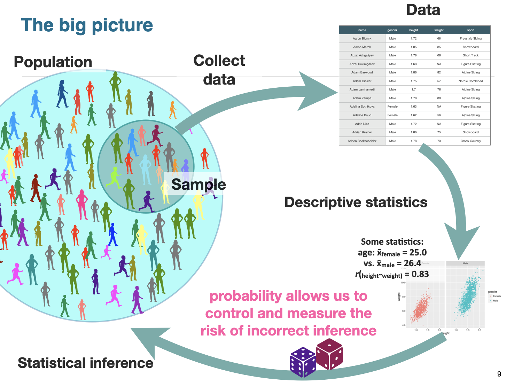
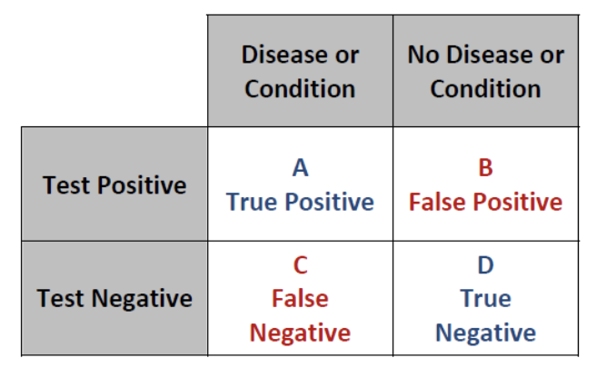

Data modeling
================
Steven Moran

06 April, 2022

-   [Recap](#recap)
-   [Modeling](#modeling)
-   [Hypothesis testing](#hypothesis-testing)
-   [Statistical assumptions](#statistical-assumptions)
-   [Descriptive statistics](#descriptive-statistics)
-   [Choosing the right statistic](#choosing-the-right-statistic)
-   [Some examples](#some-examples)
    -   [Comparing two groups](#comparing-two-groups)
-   [Data practical](#data-practical)
-   [References](#references)

------------------------------------------------------------------------

This report uses the [R programming
language](https://cran.r-project.org/doc/FAQ/R-FAQ.html) (R Core Team
2021) and the following [R libraries](https://r-pkgs.org/intro.html)
(Wickham et al. 2019; Xie 2021).

``` r
library(tidyverse)
library(knitr)
```

------------------------------------------------------------------------

# Recap

So far we’ve talked about:

-   Markdown for communication
-   Data vs information
-   Data types (from the programming and statistics sides)
-   Data wrangling, i.e., data transformation
-   Data visualization

These topics give us the skills to do various things with data,
including:

-   Importing
-   Tidying
-   Transforming
-   Visualizing

These skills helps us undertake exploratory and descriptive analyses.

# Modeling

The next step is to **model** data. Scientists are interested in
discovering/understanding something about real world phenomena. Three
types of goals:

-   Describe
-   Explain
-   Predict

One goal of data modeling is to provide a summary of a data set, i.e.,
describe it. Another is to come up with hypotheses for descriptive and
inference purposes.

One purpose of descriptive statistics is to efficiently summarize
information for visual purposes. Descriptive statistics use [summary
statistics](https://en.wikipedia.org/wiki/Summary_statistics) to
summarize a set of observations, including for example:

-   [Central tendency](https://en.wikipedia.org/wiki/Central_tendency)
-   [Dispersion](https://en.wikipedia.org/wiki/Statistical_dispersion)
-   [Shape of the
    distribution](https://en.wikipedia.org/wiki/List_of_probability_distributions)
-   [Statistical dependence](https://en.wikipedia.org/wiki/Correlation)

Statistical inference methods allow you to draw a conclusion, i.e., you
infer something, about your data. This allows us to do things like fit
statistical models and understand how they work and what they tell us
about our data, so that we can test our hypotheses.

Nolan and Heinzen (2011) define two main branches of modern statistics
(not ot be confused with the defintions by Janert (2010) above):

-   **Descriptive statistics** organize, summarize, and communicate a
    group of numerical observations.
    -   Descriptive statistics describe large amounts of data in a
        single number or in just a few numbers.
    -   A single number reporting e.g. the average is often far more
        useful and easier to grasp than a long list of the numbers.
-   **Inferential statistics** use sample data to make general estimates
    about the larger population.
    -   Inferential statistics infer, or make an intelligent guess
        about, the whole population, i.e. also about the objects not
        included into the study.

<!-- Descriptive statistics involve quantitatively describing or summarizing features of a data set. They often include [non-parametric statistics](https://en.wikipedia.org/wiki/Nonparametric_statistics). Inferential statistics ... -->

------------------------------------------------------------------------

Here is the big picture.



------------------------------------------------------------------------

**As data scientists, we may or may not be seasoned statisticians!**

One confusing aspect for scientists without a statistics background is:
**which statistical test to use?** This question involves asking what
are the relevant assumptions of the common statistical tests and when
should I use which?

To answer which kind of statistical test you should use, first you need
to answer what kind of distribution your data follows. Different tests
assume different distributions. In other words, how is your data shaped?

And like our [discussion on which plots to
use](https://github.com/bambooforest/IntroDataScience/tree/main/6_data_visualization#which-plots-to-use)
to visualize you data, you also need to know what your data types are,
how many variable you have, and how you are testing them, e.g., are you
comparing two distributions?

------------------------------------------------------------------------

Janert (2010) asks, “what you really need to know about classical
statistics, in the [excellent
book](https://www.oreilly.com/library/view/data-analysis-with/9781449389802/),
*Data analysis with open source tools*. Janert writes:

> > > BASIC CLASSICAL STATISTICS HAS ALWAYS BEEN SOMEWHAT OF A MYSTERY
> > > TO ME: A TOPIC FULL OF OBSCURE notions, such as t-tests and
> > > p-values, and confusing statements like “we fail to reject the
> > > null hypothesis”-—which I can read several times and still not
> > > know if it is saying yes, no, or maybe.\* To top it all off, all
> > > this formidable machinery is then used to draw conclusions that
> > > don’t seem to be all that interesting—it’s usually something about
> > > whether the means of two data sets are the same or different. Why
> > > would I care?

> > > Eventually I figured it out, and I also figured out why the field
> > > seemed so obscure initially. In this chapter, I want to explain
> > > what classical statistics does, why it is the way it is, and what
> > > it is good for. This chapter does not attempt to teach you how to
> > > perform any of the typical statistical methods: this would require
> > > a separate book. (I will make some recommendations for further
> > > reading on this topic at the end of this chapter.) Instead, in
> > > this chapter I will tell you what all these other books omit.

> > > Let me take you on a trip. I hope you know where your towel is.

> > > \*I am not alone—even professional statisticians have the same
> > > experience. See, for example, the preface of Bayesian Statistics.
> > > Peter M. Lee. Hodder & Arnold. 2004.

This chapter is totally worth reading! (So is the whole book.)

It describes, for example, how classical statistics came about – in the
late 19th and early 20th centuries by a small group of people, mostly in
Great Britain, working for example at Guinness and in agriculture. They
had:

-   No computational capabilities
-   No graphing capabilities
-   Very small and very expensive data sets

Their situation, as Janert notes, was basically the opposite of what we
have today. Given their limitations, it took a great deal of ingenuity
to solve problems that we – for the most part – no longer have, e.g.:

-   We have lots of computing power
-   We have lots of graphing capabilities
-   There’s lots of data out there

Instead, today’s modern statistics is largely focused on areas like
Bayesian reasoning, non-parametric tests, resampling, and simulations.

Nevertheless, statistics typically deals with drawing conclusions about
a population by using a representative sample of that population.

-   A **population** consists of all the scores of some specified group
    of interest (in texts one uses N to refer to it)
-   A **sample** is a subset of a population (n)

Samples are used most often because we are rarely able to study every
object in a population (e.g. every person in the world or in a country,
every language, every sentence ever produced).

When properties of the population are inferred from a sample, we are
undertaking statistical inference.

------------------------------------------------------------------------

**Population or sample?**

1.  A principal of a large high school asked five teachers about the
    conditions in the teachers’ lounge.

-   What is the sample?
-   What is the population?

2.  A poll taken in October 2004, which was funded by the European
    Union, found that 50.8% of the 8,075 married women surveyed in
    Turkey were married without their consent.

-   What is the sample?
-   What is the population?

3.  Determine whether the data set is a population or a sample. Explain
    your reasoning.

-   1.  The height of each player on a school’s basketball team

-   2.  The amount of energy collected from every wind turbine on a wind
        farm

-   3.  A survey of 500 spectators from a stadium with 42,000 spectators

-   4.  The annual salary of each pharmacist at a pharmacy

-   5.  The cholesterol levels of 20 patients in a hospital with 100
        patients

-   6.  The number of televisions in each U.S. household

-   7.  The final score of each golfer in a tournament

-   8.  The age of every third person entering a clothing store

-   9.  The political party of every U.S. president

-   10. The soil contamination levels at 10 locations near a landfill

------------------------------------------------------------------------

Statistical modeling is an attempt to describe some part of the real
world in mathematical terms.

Recall our discussion on [data types in
statistics](https://github.com/bambooforest/IntroDataScience/tree/main/3_data#data-types-in-statistics).

The independent variable (predictor variable) is the variable that is
being manipulated, so that we can observe if there is an effect on the
dependent variable (outcome variable).

-   Independent variable(s) – Predictor variable(s)
-   Dependent variable(s) – Outcome/Output variable(s)

The relevant mathematical concept is the one of **function**. Consider
for example the input of `height` and output of `weight` with our
`atheletes` data.

``` r
athletes <- read_csv('../4_data_wrangling/datasets/athletes.csv')
```

    ## Rows: 2859 Columns: 12
    ## ── Column specification ────────────────────────────────────────────────────────
    ## Delimiter: ","
    ## chr  (4): gender, name, sport, country
    ## dbl  (7): age, height, weight, gold_medals, silver_medals, bronze_medals, to...
    ## date (1): birthdate
    ## 
    ## ℹ Use `spec()` to retrieve the full column specification for this data.
    ## ℹ Specify the column types or set `show_col_types = FALSE` to quiet this message.

``` r
head(athletes) %>% kable()
```

| age | birthdate  | gender | height | name              | weight | gold_medals | silver_medals | bronze_medals | total_medals | sport            | country       |
|----:|:-----------|:-------|-------:|:------------------|-------:|------------:|--------------:|--------------:|-------------:|:-----------------|:--------------|
|  17 | 1996-04-12 | Male   |   1.72 | Aaron Blunck      |     68 |           0 |             0 |             0 |            0 | Freestyle Skiing | United States |
|  27 | 1986-05-14 | Male   |   1.85 | Aaron March       |     85 |           0 |             0 |             0 |            0 | Snowboard        | Italy         |
|  21 | 1992-06-30 | Male   |   1.78 | Abzal Azhgaliyev  |     68 |           0 |             0 |             0 |            0 | Short Track      | Kazakhstan    |
|  21 | 1992-05-25 | Male   |   1.68 | Abzal Rakimgaliev |     NA |           0 |             0 |             0 |            0 | Figure Skating   | Kazakhstan    |
|  21 | 1992-07-30 | Male   |   1.86 | Adam Barwood      |     82 |           0 |             0 |             0 |            0 | Alpine Skiing    | New Zealand   |
|  21 | 1992-12-18 | Male   |   1.75 | Adam Cieslar      |     57 |           0 |             0 |             0 |            0 | Nordic Combined  | Poland        |

One way to look at that relationship is to plot the input on the x-axis
and the output on the y-axis in a scatter plot.

``` r
ggplot(athletes, aes(height, weight)) +
  geom_point()
```

    ## Warning: Removed 380 rows containing missing values (geom_point).

<!-- -->

One way to test whether there is a relationship is to use linear
regression.

``` r
ggplot(athletes, aes(height, weight)) +
  geom_point() +
  geom_smooth(method='lm')
```

    ## `geom_smooth()` using formula 'y ~ x'

    ## Warning: Removed 380 rows containing non-finite values (stat_smooth).

    ## Warning: Removed 380 rows containing missing values (geom_point).

<!-- -->

Like other statistical tests, you will have to know the (four) main
assumptions for linear regression, i.e.:

-   Independence of observations (aka no autocorrelation)
-   Normality
-   Linearity
-   Homoscedasticity (aka homogeneity of variance)

We will talk more about linear models in the follow weeks, but here is a
good and simple overview:

-   <https://www.scribbr.com/statistics/linear-regression-in-r/>

For height and weight, we only have one independent variable and one
dependent variable for each athlete, so we don’t need to test for any
hidden relationships the among variables. In other words, we have
independence of observations.

We need to check if the dependent variable is normally distributed. We
can quickly visualize it. Is it normal?

``` r
hist(athletes$height)
```

<!-- -->

As we saw avove, the data are linearly distributed. Here’s another way
to quickly visualize the x and y variables.

``` r
plot(weight ~ height, data = athletes)
```

<!-- -->
Homoscedasticity means that the prediction error does not change
significantly over the range of prediction of the model. We will discuss
this more in the coming weeks – as well as what the output means.

``` r
lm <- lm(weight ~ height, data = athletes)
summary(lm)
```

    ## 
    ## Call:
    ## lm(formula = weight ~ height, data = athletes)
    ## 
    ## Residuals:
    ##      Min       1Q   Median       3Q      Max 
    ## -28.4176  -5.3995  -0.3995   5.0461  27.8007 
    ## 
    ## Coefficients:
    ##             Estimate Std. Error t value Pr(>|t|)    
    ## (Intercept) -147.362      2.974  -49.55   <2e-16 ***
    ## height       125.454      1.690   74.23   <2e-16 ***
    ## ---
    ## Signif. codes:  0 '***' 0.001 '**' 0.01 '*' 0.05 '.' 0.1 ' ' 1
    ## 
    ## Residual standard error: 7.613 on 2477 degrees of freedom
    ##   (380 observations deleted due to missingness)
    ## Multiple R-squared:  0.6899, Adjusted R-squared:  0.6898 
    ## F-statistic:  5510 on 1 and 2477 DF,  p-value: < 2.2e-16

We can say there is a significant positive relationship between height
and weight of these athletes (p-value \< 0.001).

------------------------------------------------------------------------

Statistical tests are about interpreting data. If we want to interpret
our data with formal procedures and to make claims about the
distribution of our data or whether two data sets differ fundamentally
from each other, then we rely on hypothesis testing.

# Hypothesis testing

Hypothesis testing is a way to interpret and draw conclusions about the
[population](https://en.wikipedia.org/wiki/Statistical_population) of a
[sample](https://en.wikipedia.org/wiki/Sample_(statistics)) of data.

-   <https://www.scribbr.com/statistics/hypothesis-testing/>
-   <https://towardsdatascience.com/hypothesis-testing-in-real-life-47f42420b1f7>
-   <http://www.biostathandbook.com/hypothesistesting.html>

The logic of hypothesis testing is as follows. After we have identified
the H0 and H1, we can do only one of two things:

-   1.  Reject the H0 in favor of the H1

-   2.  Fail to reject H0 and thus keep it

Null hypothesis testing corresponds to a *reductio ad absurdum* argument
in logic, i.e., a claim is assumed valid if its counterclaim is
improbable.

The procedure for deciding is roughly as follows:

-   Take a random sample from the population
-   Assume that H0 holds
-   If the sample data are consistent with the H0, keep H0
-   If the sample data are inconsistent with the H0, reject the H0 in
    favor of the H1.

The procedure was originally developed by the English statistician
Ronald Fisher in *The Design of Experiments* (1935). The book is
considered a foundational work in experimental design, i.e., it
introduced the concept of the null hypothesis.

Contemporary science is based on the logic of falsification: it is
impossible to prove that something is right, but it is possible to
reject the opposite.

In other words – although H0 cannot be proven true, H0 can be proven
false.

A simple example: if someone claims that all swans are white,
confirmatory evidence (in the form of lots of white swans) cannot prove
the assertion to be true. However, contradictory evidence (in the form
of a single black swan) makes it clear that the claim is invalid.


------------------------------------------------------------------------

**Type I and type II errors**

In general:


In medical statistics, false positives and false negatives are concepts
analogous to type I and type II errors in statistical hypothesis
testing:



And in machine learning e.g., for a classifier spam vs. not spam:


# Statistical assumptions

Statistical tests make assumptions about the data being tested. If the
assumptions for a given statistical test are violated, then the test is
not valid and the results may also not be valid.

-   <https://towardsdatascience.com/statistical-testing-understanding-how-to-select-the-best-test-for-your-data-52141c305168>

1.  **Independence of observations**: the observations/variables you
    include in your test should not be related(e.g. several tests from a
    same test subject are not independent, while several tests from
    multiple different test subjects are independent)

2.  **Homogeneity of variance**: the “variance” within each group is
    being compared should be similar to the rest of the group variance.
    If a group has a bigger variance than the other(s) this will limit
    the test’s effectiveness.

3.  **Normality of data**: the data follows a normal distribution,
    normality means that the distribution of the test is normally
    distributed (or bell-shaped) with mean 0, with 1 standard deviation
    and a symmetric bell-shaped curve.

# Descriptive statistics

The measure of [central
tendency](https://en.wikipedia.org/wiki/Central_tendency) is one way to
make many data points comprehensible to humans by compressing them into
one value. Central tendency is a descriptive statistic that best
represents the center of a data set i.e. a particular value that all the
data seem to be gathering around it’s the “typical” score.

The most commonly reported measure of central tendency is the mean, the
arithmetic average of a group of scores.

The median is the middle score of all the scores in a sample when the
scores are arranged in ascending order.

Simply creating a visual representation of the distribution often
reveals its central tendency.

In a histogram or a polygon of a normal distribution the central
tendency is usually near the highest point

The specific way that data cluster around a distribution’s central
tendency can be measured three different ways: mean, median, mode.

Summary statistics only apply to unimodal distributions, i.e.,
distributions that have a single central peak. If this basic assumption
is not met, the your conclusions may be wrong.

``` r
hist(athletes$height)
```

<!-- -->

``` r
hist(athletes$weight)
```

<!-- -->

``` r
hist(athletes$age)
```

<!-- -->

And recall the `summary` function!

``` r
summary(athletes)
```

    ##       age          birthdate             gender              height     
    ##  Min.   :15.00   Min.   :1959-02-02   Length:2859        Min.   :1.460  
    ##  1st Qu.:22.00   1st Qu.:1984-10-01   Class :character   1st Qu.:1.680  
    ##  Median :25.00   Median :1988-03-13   Mode  :character   Median :1.760  
    ##  Mean   :25.84   Mean   :1987-10-02                      Mean   :1.752  
    ##  3rd Qu.:29.00   3rd Qu.:1991-05-14                      3rd Qu.:1.820  
    ##  Max.   :55.00   Max.   :1998-12-31                      Max.   :2.060  
    ##                                                          NA's   :139    
    ##      name               weight        gold_medals      silver_medals    
    ##  Length:2859        Min.   : 40.00   Min.   :0.00000   Min.   :0.00000  
    ##  Class :character   1st Qu.: 62.00   1st Qu.:0.00000   1st Qu.:0.00000  
    ##  Mode  :character   Median : 72.00   Median :0.00000   Median :0.00000  
    ##                     Mean   : 73.11   Mean   :0.03358   Mean   :0.03218  
    ##                     3rd Qu.: 83.00   3rd Qu.:0.00000   3rd Qu.:0.00000  
    ##                     Max.   :120.00   Max.   :3.00000   Max.   :2.00000  
    ##                     NA's   :378                                         
    ##  bronze_medals      total_medals        sport             country         
    ##  Min.   :0.00000   Min.   :0.00000   Length:2859        Length:2859       
    ##  1st Qu.:0.00000   1st Qu.:0.00000   Class :character   Class :character  
    ##  Median :0.00000   Median :0.00000   Mode  :character   Mode  :character  
    ##  Mean   :0.03253   Mean   :0.09829                                        
    ##  3rd Qu.:0.00000   3rd Qu.:0.00000                                        
    ##  Max.   :2.00000   Max.   :3.00000                                        
    ## 

# Choosing the right statistic

As with the determining which [plot to
use](https://github.com/bambooforest/IntroDataScience/tree/main/6_data_visualization#which-plots-to-use),
note there are many resources out there to help you identify which
statistical test to use!

-   <https://towardsdatascience.com/statistical-testing-understanding-how-to-select-the-best-test-for-your-data-52141c305168>

-   <https://www.scribbr.com/statistics/statistical-tests/>

-   <https://dacg.in/2018/11/17/statistical-test-cheat-sheet/>

**Parametric versus nonparametric statistics**

Parametric analyses are tests for which we have prior knowledge of the
population distribution, e.g., we know the distribution is normal. They
also include tests in which we can approximate a normal distribution
with the [central limit
therom](https://en.wikipedia.org/wiki/Central_limit_theorem).

Non-parametric analyses are tests that do not make any assumptions about
the parameters of the population under study, i.e., there is no known
distribution. This is why they are also called distribution-free tests.


Ask: what are the assumptions of the statistical test?

An excellent book on doing statistics with R on linguistic data is *How
to do Linguistics with R* (Levshina 2015).

# Some examples

Comparison tests test for meaningful differences between group means.
They are used to test whether there is a statistically significant
difference between a categorical variable on the mean value of another
variable.

## Comparing two groups

T-tests are for comparing the means of two groups (e.g., the average
heights of men and women). It is a parametric test based on the
[Student’s T
distribution](https://en.wikipedia.org/wiki/Student%27s_t-distribution).
Essentially, you test the significance of the difference of the mean
values when the sample size is small (i.e, less than 30) and when the
population standard deviation is not available.

Assumptions of this test:

-   Population distribution is normal
-   Samples are random and independent
-   The sample size is small
-   Population standard deviation is not known

And recall any hypothesis testing follows these steps:

0.  Choose a significance level (α)
1.  Formulate a null hypothesis, H0
2.  Formulate an alternative hypothesis, H1
3.  Gather data, calculate a test statistic, e.g. T or F
4.  Determine the probability (p-value) of obtaining T or F “or a more
    extreme value” under H0
5.  If p ≤ α, reject H0

And the basic process:

-   Set up a hypothesis, and assume that it is true.
-   Gather data from some real-world experiment that is relevant to the
    hypothesis.
-   Make a determination about the hypothesis, based on the idea of “how
    likely is our data given the hypothesis?”

Let’s go through an example.

------------------------------------------------------------------------

We have some data from Johnson (2008) called `F1_data.txt`. Let’s have a
look:

``` r
f1 <- read_csv('data/F1_data.txt')
str(f1)
```

    ## spec_tbl_df [19 × 4] (S3: spec_tbl_df/tbl_df/tbl/data.frame)
    ##  $ female  : num [1:19] 391 561 826 453 358 454 991 561 398 334 ...
    ##  $ male    : num [1:19] 339 512 670 427 291 406 706 439 324 307 ...
    ##  $ vowel   : chr [1:19] "i" "e" "a" "o" ...
    ##  $ language: chr [1:19] "W.Apache" "W.Apache" "W.Apache" "W.Apache" ...
    ##  - attr(*, "spec")=
    ##   .. cols(
    ##   ..   female = col_double(),
    ##   ..   male = col_double(),
    ##   ..   vowel = col_character(),
    ##   ..   language = col_character()
    ##   .. )
    ##  - attr(*, "problems")=<externalptr>

``` r
head(f1) %>% kable()
```

| female | male | vowel | language   |
|-------:|-----:|:------|:-----------|
|    391 |  339 | i     | W.Apache   |
|    561 |  512 | e     | W.Apache   |
|    826 |  670 | a     | W.Apache   |
|    453 |  427 | o     | W.Apache   |
|    358 |  291 | i     | CA English |
|    454 |  406 | e     | CA English |

The data include 19 observations from male and female speakers from four
different languages producing different cardinal vowels. For each
observation (row) the variables for the columns (male and female) record
the F1 [formant measures](https://en.wikipedia.org/wiki/Formant) values
in frequency in Hz. Formants are the distinctive properties of vowels in
the acoustic signal in speech. Formants F1-F3 allow us to identify
different [vowels](https://en.wikipedia.org/wiki/Vowel).

Now we want to ask if there is a statistically significant difference
between the F1 values of females versus males. One way we can do this is
by comparing the mean of the two groups.

First we state our hypothesis:

-   H0 (null hypothesis): there is no difference between the mean value
    of F1 for females and males
-   H1 (alternative hypothesis): there is a difference

Next we identify which statistical test we can use. T-tests compare two
groups. In this case, we have paired data, i.e., each row has an
associated group (male and female), in which the speakers produced the
same vowel. The [paired
t-test](https://en.wikipedia.org/wiki/Student%27s_t-test#Paired_samples)
allows us to test for significance between two paired groups.

Now we [search for examples of how we can do a paired t-test in
R](https://www.google.com/search?q=how+to+do+paired+t+test+in+r) and
figure out what the function is called and which parameters it needs.

``` r
t.test(f1$female, f1$male, paired=T, alternative="greater")
```

    ## 
    ##  Paired t-test
    ## 
    ## data:  f1$female and f1$male
    ## t = 6.1061, df = 18, p-value = 4.538e-06
    ## alternative hypothesis: true difference in means is greater than 0
    ## 95 percent confidence interval:
    ##  67.11652      Inf
    ## sample estimates:
    ## mean of the differences 
    ##                93.73684

And now we interpret the results and either accept or reject the null
hypothesis.

You may also want to visualize the data!

But is this helpful if we are trying to compare males and females?

``` r
ggplot(data = f1, aes(female)) +
  geom_boxplot()
```

<!-- -->

``` r
ggplot(data = f1, aes(male)) +
  geom_boxplot()
```

<!-- -->

Perhaps a bit more useful?

``` r
ggplot(data = f1, aes(x = vowel, y = female)) +
  geom_boxplot()
```

<!-- -->

``` r
ggplot(data = f1, aes(x = vowel, y = male)) +
  geom_boxplot()
```

<!-- --> The problem
is the input data is not in a format that is particularly easy to plot
as a box plot. So, what do we do? Transform it into a format that is
easy to plot. (Remember, something like 80% of your time is getting the
data in formats that are useful for particular purposes.)

There are many ways to transform the data. Often it helps to first think
about what format you need to get to – I often do this on scrap paper
and then think about the code needed. (Remember with code there’s going
to typically myriad ways of doing the same thing.)

What do we want? We want to be able to group on the male and female
variable – but right now they are in columns.

Here’s a not particularly elegant, but arguably readable way, to
transform the data.

``` r
males <- f1 %>% select(male, vowel, language)
females <- f1 %>% select(female, vowel, language)

males <- males %>% rename(F1 = male)
males$sex <- 'male'
males
```

    ## # A tibble: 19 × 4
    ##       F1 vowel language   sex  
    ##    <dbl> <chr> <chr>      <chr>
    ##  1   339 i     W.Apache   male 
    ##  2   512 e     W.Apache   male 
    ##  3   670 a     W.Apache   male 
    ##  4   427 o     W.Apache   male 
    ##  5   291 i     CA English male 
    ##  6   406 e     CA English male 
    ##  7   706 a     CA English male 
    ##  8   439 o     CA English male 
    ##  9   324 u     CA English male 
    ## 10   307 i     Ndumbea    male 
    ## 11   361 e     Ndumbea    male 
    ## 12   678 a     Ndumbea    male 
    ## 13   474 o     Ndumbea    male 
    ## 14   311 u     Ndumbea    male 
    ## 15   293 i     Sele       male 
    ## 16   363 e     Sele       male 
    ## 17   809 a     Sele       male 
    ## 18   367 o     Sele       male 
    ## 19   300 u     Sele       male

``` r
females <- females %>% rename(F1 = female)
females$sex <- 'female'
females
```

    ## # A tibble: 19 × 4
    ##       F1 vowel language   sex   
    ##    <dbl> <chr> <chr>      <chr> 
    ##  1   391 i     W.Apache   female
    ##  2   561 e     W.Apache   female
    ##  3   826 a     W.Apache   female
    ##  4   453 o     W.Apache   female
    ##  5   358 i     CA English female
    ##  6   454 e     CA English female
    ##  7   991 a     CA English female
    ##  8   561 o     CA English female
    ##  9   398 u     CA English female
    ## 10   334 i     Ndumbea    female
    ## 11   444 e     Ndumbea    female
    ## 12   796 a     Ndumbea    female
    ## 13   542 o     Ndumbea    female
    ## 14   333 u     Ndumbea    female
    ## 15   343 i     Sele       female
    ## 16   520 e     Sele       female
    ## 17   989 a     Sele       female
    ## 18   507 o     Sele       female
    ## 19   357 u     Sele       female

``` r
df <- rbind(females, males)
```

Now we have something a bit easier to work with.

``` r
ggplot(data = df, aes(sex, F1)) +
  geom_boxplot()
```

<!-- -->

And we can be begin to explore the data in various ways.

``` r
ggplot(data = df, aes(vowel, F1, fill=sex)) +
  geom_boxplot()
```

<!-- -->

# Data practical

-   Find some data
-   Describe the data and its variables
-   Visualize the data
-   Formulate a hypothesis about the data
-   Perform a statistical test on the data (explain briefly why you are
    using the test you are using)
-   Report the results (do you accept or reject the null hypothesis?)

# References

<div id="refs" class="references csl-bib-body hanging-indent">

<div id="ref-Janert2010" class="csl-entry">

Janert, Philipp K. 2010. *Data Analysis with Open Source Tools*.
O’Reilly.

</div>

<div id="ref-Johnson2008" class="csl-entry">

Johnson, Keith. 2008. *Quantitative Methods in Linguistics*. Blackwell
Publishing.

</div>

<div id="ref-Levshina2015" class="csl-entry">

Levshina, Natalia. 2015. *How to Do Linguistics with r*. John Benjamins.

</div>

<div id="ref-Nolan2011" class="csl-entry">

Nolan, Susan A, and Thomas Heinzen. 2011. *Statistics for the Behavioral
Sciences*. Macmillan.

</div>

<div id="ref-R" class="csl-entry">

R Core Team. 2021. *R: A Language and Environment for Statistical
Computing*. Vienna, Austria: R Foundation for Statistical Computing.
<https://www.R-project.org/>.

</div>

<div id="ref-tidyverse" class="csl-entry">

Wickham, Hadley, Mara Averick, Jennifer Bryan, Winston Chang, Lucy
D’Agostino McGowan, Romain François, Garrett Grolemund, et al. 2019.
“Welcome to the <span class="nocase">tidyverse</span>.” *Journal of Open
Source Software* 4 (43): 1686. <https://doi.org/10.21105/joss.01686>.

</div>

<div id="ref-knitr" class="csl-entry">

Xie, Yihui. 2021. *Knitr: A General-Purpose Package for Dynamic Report
Generation in r*. <https://yihui.org/knitr/>.

</div>

</div>
